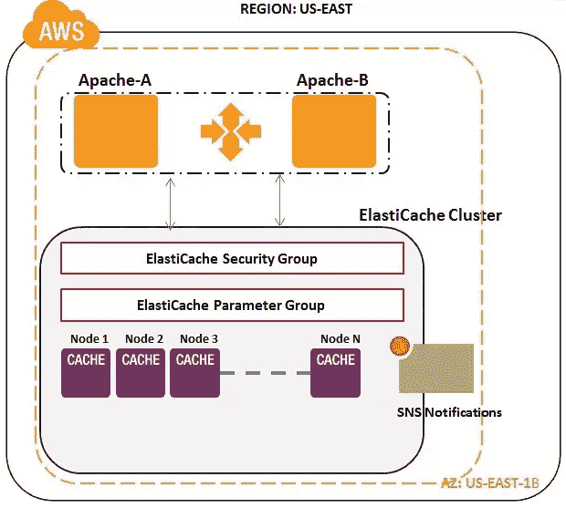

# 类固醇上的分布式缓存:Amazon ElastiCache

> 原文：<https://www.sitepoint.com/amazon-elasticache-cache-on-steroids/>

通过在内存中缓存关键数据，Web 应用程序通常可以表现得更好、运行得更快。频繁访问的数据、耗时/昂贵的数据库查询结果、搜索结果、会话数据和复杂计算的结果通常都非常适合缓存存储。我们将了解缓存的基础知识，我们将在 Amazon ElastiCache 中深入探讨

## **缓存架构的类型**

### **本地内存缓存**

缓存对象存储在应用服务器的本地内存(例如 Java 堆)中。像 EHCache、OSCache 这样的开源框架可以在 Java 应用服务器内部使用，用于提供堆中的缓存项。由于缓存项是从应用程序的同一个进程堆中访问的，因此该模型为缓存项提供了非常快速的“设置/获取”操作。另一方面，由于 RAM 的有限性质，在本地内存缓存模型中只能缓存很少的 GB。

### **网络附加缓存**

缓存对象存储在可通过 TCP 网络访问的单独的缓存服务器中。缓存客户端或缓存驱动程序需要嵌入到支持获取/上传/同步操作的应用服务器中。高速缓存的行为类似于网络连接的 RAM。Terracotta 缓存是网络连接 RAM 缓存的一个例子。由于缓存操作需要通过网络传输，因此在“设置/获取”操作中可以感受到几毫秒的延迟。由于缓存是集中和整合的，因此易于管理、扩展和维护该层。

### **分布式缓存**

分布式缓存可以在多个缓存服务器上运行，因此它可以在规模和事务处理能力上增长。它主要用于存储驻留在数据库中的应用程序数据和 web 会话数据。web 应用程序可以使用客户端库访问本地或远程部署的分布式缓存。最流行的分布式缓存软件是 Memcached。部署大型 Memcached 农场已经成为可能，因为现在内存价格低廉，网络速度也非常快。分布式缓存在低成本的商用机器和云提供商上运行良好。我们将在本文中讨论的 AWS 上的一个流行的分布式缓存是 Amazon ElastiCache。

## **介绍亚马逊 elastic cache:**

Amazon ElastiCache 是由 Amazon Web services 提供的托管分布式缓存服务。Amazon elastic cache 目前使用 memcached 作为缓存引擎，因此 memcached 兼容的程序通常无需更改代码就可以轻松移植到 Amazon elastic cache。由于 Amazon ElastiCache 作为一个单独的层运行，AWS 团队从客户的应用程序和基础架构团队中卸载了典型的缓存层管理任务，如下所示:

*   管理设置分布式内存缓存层所涉及的工作
*   提供安装缓存软件所需的服务器资源
*   常见的管理任务，如故障检测、恢复和软件修补
*   在集群中添加/删除缓存节点

现在让我们来详细探讨一下 Amazon ElastiCache 的主要组件。

## **亚马逊 ElastiCache 的组件**

 [](https://www.sitepoint.com/amazon-elasticache-cache-on-steroids/)

### **亚马逊 ElastiCache 节点:**

Amazon ElastiCache 节点是一个 memcached 实例，具有唯一的端点 URL 和端口。您可以使用提供的这个端点 URL 来配置受欢迎的 memcached 客户端所使用的 memcached 配置文件。Memcached 客户端适用于所有流行的编程语言，最新的列表可以在[这里](http://code.google.com/p/memcached/wiki/Clients)找到。Amazon elastic cache 节点符合 memcached 服务器的协议，通常上面提到的同一个 memcached 客户机可以切换到 Amazon elastic cache 节点，而不需要修改代码。您可以像在现有的 Memcached 部署中一样使用标准的 Memcached 操作，如 get、set、incr 和 decr，还可以通过 TCP 协议使用二进制和文本消息执行请求。

使用 Java Spymemcached 库和 Amazon ElastiCache 层演示文本 TCP 协议中 SET 操作的示例伪代码:

```
import java.io.IOException;
import java.util.concurrent.ExecutionException;
import net.spy.memcached.AddrUtil;
import net.spy.memcached.DefaultConnectionFactory;
import net.spy.memcached.MemcachedClient;
import net.spy.memcached.*;
import java.util.*;
public class ElastiCacheTextTCPSet {
 public void setTextValue() throws IOException {
 MemcachedClient memcachedClient = new MemcachedClient( new DefaultConnectionFactory(),AddrUtil.getAddresses("ecache1a.sqjbuo.0001.use1.cache.amazonaws.com:11211"));
 String key = "1000002";
 String value = "1000002-Test value in Text";
 Integer expires = Integer.parseInt("1000");
 try {
 Future<Boolean> result = memcachedClient.set(key, expires, value);
…………
…………
 } catch (InterruptedException e) {
 e.printStackTrace();
 } catch (ExecutionException e) {
 e.printStackTrace();
 }
 memcachedClient.shutdown();
 }

}
```

使用 Java Spymemcached 库和 Amazon ElastiCache 层演示文本 TCP 协议中 GET 操作的示例程序:

```
import java.io.IOException;
import net.spy.memcached.AddrUtil;
import net.spy.memcached.ConnectionFactory;
import net.spy.memcached.DefaultConnectionFactory;
import net.spy.memcached.HashAlgorithm;
import net.spy.memcached.MemcachedClient;
import java.util.*;

public class ElastiCacheTextTCPGet {
 public void getTextValue() throws Exception {
 MemcachedClient memcachedClient = new MemcachedClient( new DefaultConnectionFactory(),AddrUtil.getAddresses("ecache1a.sqjbuo.0001.use1.cache.amazonaws.com:11211"));
 String key = "1000002";
 Object obj=null;
 try {
 obj = memcachedClient.get(key);
 System.out.println("Value = :"+obj.toString());
 } catch (Exception e) {
 e.printStackTrace();
 }
 memcachedClient.shutdown();
 }

}
```

还可以使用 Memcached 的二进制协议与 Amazon ElastiCache 进行通信。一个示例程序，演示了使用 Java spyme cached-TCP 二进制协议和 Amazon ElastiCache 层的 SET 操作:

```
import java.io.IOException;
import java.util.concurrent.ExecutionException;
import net.spy.memcached.AddrUtil;
import net.spy.memcached.DefaultConnectionFactory;
import net.spy.memcached.BinaryConnectionFactory;
import net.spy.memcached.MemcachedClient;
import net.spy.memcached.*;
import java.util.*;
public class ElastiCacheBinaryTCPSet {
 public void setBinaryValue() throws Exception {
 MemcachedClient memcachedClient = new MemcachedClient( new BinaryConnectionFactory(),AddrUtil.getAddresses("ecache1a.sqjbuo.0001.use1.cache.amazonaws.com:11211"));
 String key = "1000004";
 String value = "1000004-Test value in Binary-TCP protocol";
 Integer expires = Integer.parseInt("1000");
 try {
 Future<Boolean> result = memcachedClient.set(key, expires, value);
 } catch (InterruptedException e) {
 e.printStackTrace();
 } catch (ExecutionException e) {
 e.printStackTrace();
 }
 memcachedClient.shutdown();
 }
}
```

Memcached 软件版本 1.4.5 用作 Amazon ElastiCache 节点中的缓存引擎。缓存节点接受端口 11211 上的连接，并且仅适用于 Amazon EC2 网络。为了允许从 web/application EC2 实例到您的缓存节点的网络请求，您需要在 AWS 安全组中授权访问。Amazon ElastiCache 提供了多种缓存节点类型(容量)和定价模式来满足客户需求。最新的缓存节点类型信息可以在[这里](http://aws.amazon.com/elasticache/)找到

### **亚马逊 ElastiCache 集群:**

Amazon elastic cache 集群是一个或多个 Amazon elastic cache 节点的集合。缓存群集中的所有缓存节点都将属于相同的节点类型(容量)。节点类型是要在缓存群集中部署的缓存节点的关联内存大小。目前，AWS 中的缓存节点有 11 种不同的容量，以满足您的各种需求，AWS 将来会添加新的容量类型。如果您的应用程序系统需要不同容量的缓存节点，您需要在您的帐户中创建多个缓存集群。在创建过程中，客户应该为缓存群集提供一个标识符名称。例如:如果给缓存集群起一个名字“ecache1a”，那么某个特定缓存节点的端点 URL 可能是这样的**ecache 1a**. sqjbuo . 0001 . use 1 . cache . Amazon AWS . com:11211。当与 Amazon ElastiCache API 和命令交互时，这个名称标识一个特定的缓存集群。对于 AWS 区域中的客户，缓存集群标识符必须是唯一的。

在配置集群时，您需要提及您希望在其中部署缓存集群的可用性区域。目前，单个 Amazon ElastiCache 集群不能跨越 Amazon EC2 区域内的多个可用性区域。建议将缓存集群和相关的 web/应用程序 ec2 实例放在同一个可用性区域中，以获得更好的延迟。[参考这里的](http://harish11g.blogspot.in/2012/11/amazon-elasticache-memcached-ec2.html)了解 AWS 基础设施中常见的 Amazon ElastiCache 部署架构。Amazon elastic cache 集群内部所有节点的参数和安全组设置都可以在集群级别进行分组和控制。这种缓存节点的群集/分组有助于轻松管理和维护庞大的缓存节点群。Amazon elastic cache 集群可以使用 AWS 管理控制台、Amazon ElastiCache APIs 或命令行工具来创建。除此之外，您还可以使用[亚马逊简单通知服务(SNS)](http://aws.amazon.com/sns/) 系统指定您是否愿意接收与您的缓存节点/集群相关的 SNS 通知。您可以选择一个现有的 SNS 主题，也可以对整个 Amazon ElastiCache 集群完全禁用通知。

### **亚马逊 ElastiCache 参数组:**

Amazon ElastiCache 参数组允许您控制节点的运行时参数和缓存引擎配置值。配置的值将在启动时传递给 memcached 节点，并应用于 Amazon ElastiCache 集群中所有相关的节点。如果没有为高速缓存集群指定高速缓存参数组，将使用默认的高速缓存参数组(default.memcached1.4)。通常，默认参数组包含引擎默认值和 Amazon ElastiCache 系统默认值，它们针对您正在运行的缓存集群节点进行了优化。由于 Amazon ElastiCache 默认情况下会考虑节点类型的内存/计算资源容量，为您的缓存集群选择最佳配置参数，因此在大多数用例中不需要更改。但是，如果希望高速缓存集群使用自定义配置值运行，只需创建一个新的高速缓存参数组，修改所需的参数，并将其用于新的或现有的集群。如果将自定义参数组应用于正在运行的缓存集群，则在缓存集群重新启动之前，这些更改不会应用于缓存节点。

### **亚马逊 ElastiCache 安全组:**

Amazon ElastiCache 安全组就像一个防火墙，控制对您的缓存集群的网络访问。由于 Amazon ElastiCache 集群目前不支持基于 IP 范围的访问控制，因此缓存集群的所有客户端都必须在 EC2 网络内，并通过安全组授权。如果您希望您的 Web 应用程序 EC2 实例访问您的缓存集群，您必须显式地启用来自特定 EC2 安全组中的主机的访问。例如:要允许对您的缓存集群进行网络访问，您首先需要创建一个缓存安全组，并将所需的 EC2 安全组(进而指定允许的 EC2 实例)链接到它。

## **与 EC2 上的 MemCached 相比，Amazon ElastiCache 提供了哪些功能**

### **操作 1:修改缓存集群**

Amazon ElastiCache 集群可以随时修改。可以在群集级别修改适用于所有节点的属性，如缓存安全组、缓存参数组、维护窗口期、SNS 通知和自动次要版本升级。安全组更改可能需要几分钟才能应用到群集。只有在重新启动缓存节点后，参数组更改才会生效。无法在运行时修改缓存节点的实例容量类型。

### **操作 2:重启**

使用此选项，您可以重新启动单个缓存节点或整个缓存集群。在群集重新启动操作期间，缓存节点将不可用。如果单个缓存节点单独重启，其他缓存节点可用于处理请求。可以使用 AWS 控制台或 API 完成重启操作。通常会执行重新启动:

*   当高速缓存节点没有响应时
*   应用的参数组更改需要在缓存集群的所有节点上生效

在我们的测试中，我们发现 5 X m1 的重新启动。Amazon EC2 美国东部地区的大型缓存节点类型大约需要 140 秒。这可能会因缓存节点类型和 Amazon EC2 地区的不同而不同。由于缓存的短暂性，缓存节点在重新启动操作后开始清空(也称为“冷”)，根据您的工作负载模式，可能需要一些时间来重新填充数据(也称为“预热”阶段)。

### **操作 3:删除和移除**

您可以从缓存集群中移除一个或多个节点，或者删除整个集群。如果缓存集群中只有一个节点，您需要删除缓存集群本身。删除一个或多个节点大约需要 200 秒。这可能会因缓存节点类型和 Amazon EC2 地区的不同而不同。如果集群被删除，您可以稍后在同一个 Amazon EC2 区域中以相同的名称重新创建一个缓存集群。

### **操作 4:添加缓存节点**

Amazon ElastiCache 顾名思义，您可以自动/手动将缓存节点添加到现有的 elastic cache 集群中，使整个层具有弹性。一次可以将一个或多个缓存节点添加到现有缓存群集中。在我们的测试中，我们发现在 Amazon EC2 美国东部地区添加 5 个 m1.large 缓存节点类型大约需要 320 秒。这可能会因缓存节点类型和 Amazon EC2 地区的不同而不同。在现有群集中添加新的缓存节点时，缓存节点类型应该与现有节点类型的大小相同。您不能更改该大小，如果您需要不同的缓存节点容量，则需要创建新的缓存集群。

使用普通的哈希算法，增加 memcached 缓存节点的数量会导致许多键被重新映射到不同的缓存节点，从而导致大量的缓存未命中。假设您的缓存集群中有 10 个 Amazon ElastiCache 节点，添加第 11 个服务器可能会导致大约 40%以上的键突然指向不同的服务器。此活动可能会导致缓存未命中，并使您的后端数据库被请求淹没。为了最大限度地减少这种重新映射过程，建议在您的缓存客户端中遵循一致的哈希算法。当添加新的缓存节点时，一致散列允许更稳定的键分布和最少的重新映射。使用这种算法，添加第 11 个服务器应该会导致不到 10%的密钥被重新分配。这个百分比在生产中可能会有所不同，但是与普通的哈希算法相比，它在这种弹性场景中要有效得多。还建议在使用一致哈希算法时，在所有客户端配置中保持缓存节点排序和缓存节点条目数量相同。Java 应用可以通过 Spymemcached 库使用“Ketama 库”将这种算法集成到自己的应用中。[参考 URL](http://www.last.fm/user/RJ/journal/2007/04/10/rz_libketama) 了解更多关于 memcached 中一致性散列的信息。

使用 Java spymemacached–ke tama 哈希库和 Amazon ElastiCache 层演示 TEXT-TCP 协议中 SET 操作的示例伪代码:

```
import java.io.IOException;
import java.util.concurrent.ExecutionException;
import net.spy.memcached.AddrUtil;
import net.spy.memcached.DefaultConnectionFactory;
import net.spy.memcached.MemcachedClient;
import net.spy.memcached.*;
import java.util.*;
public class ElastiCacheKetamaTCPSet {
 public void setValue() throws IOException {
 ConnectionFactory connFactory = new DefaultConnectionFactory(
 DefaultConnectionFactory.DEFAULT_OP_QUEUE_LEN,
 DefaultConnectionFactory.DEFAULT_READ_BUFFER_SIZE,
 HashAlgorithm.KETAMA_HASH);
 MemcachedClient memcachedClient = new MemcachedClient(connFactory,AddrUtil.getAddresses("ecache1a.sqjbuo.0001.use1.cache.amazonaws.com:11211"));
 String key = "1000001";
 String value = "1000001-Test value in Consistent Hashing";
 Integer expires = Integer.parseInt("1000");
 try {
 Future<Boolean> result = memcachedClient.set(key, expires, value);
………………..
………………..
 } catch (InterruptedException e) {
 e.printStackTrace();
 } catch (ExecutionException e) {
 e.printStackTrace();
 }
 memcachedClient.shutdown();
 }
}
```

## 分享这篇文章