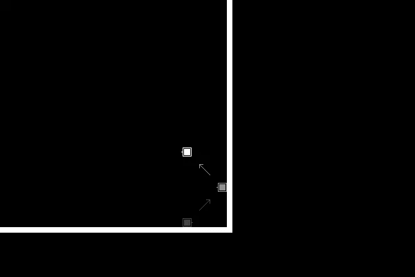
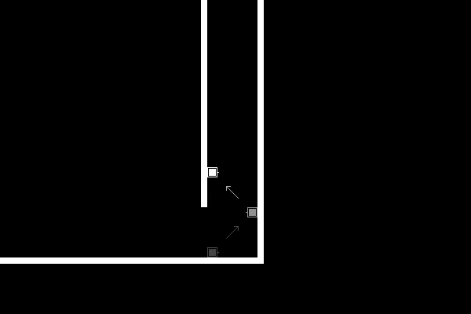
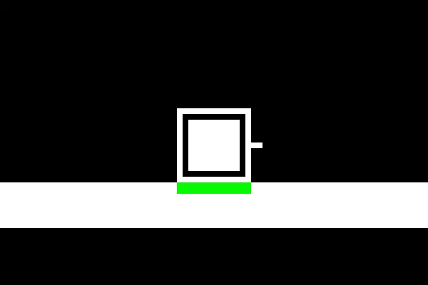
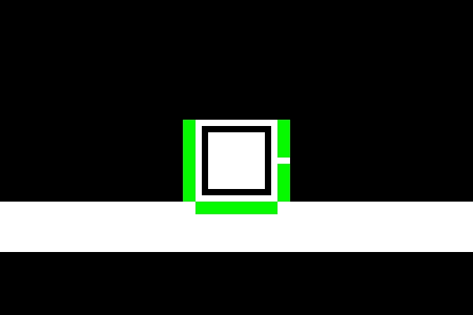
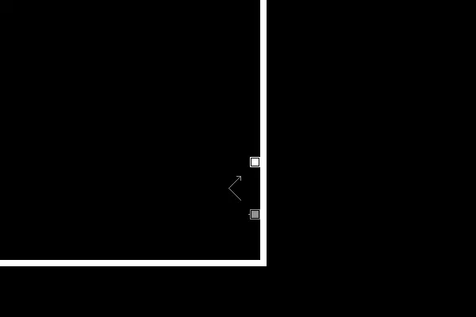
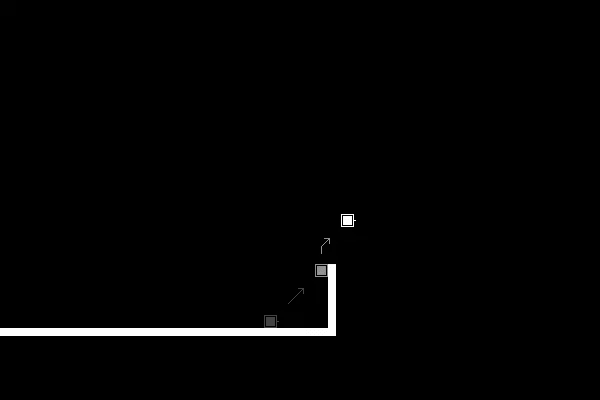

# 改进 2D HTML5 游戏中的动作

> 原文：<https://www.sitepoint.com/improving-movement-in-2d-html5-games/>

最近，我发布了[空黑](http://emptyblack.com/)，我的 2D 射击游戏/谜题游戏/平台游戏。在这篇文章中，我将描述我是如何让玩家的动作变得灵巧和直观的。[在你继续读下去之前玩游戏](http://emptyblack.com/play.html)，这样你就知道我在说什么了。

我的一般方法是改变一些东西，然后尝试它。我从几个来源获得了调整的想法。

一个。我检查了其他 2D 平台中影响玩家角色移动的参数。地板滑吗？侧身动作和跳跃高度的比例是多少？角色移动时会加速吗？角色的跳跃高度受玩家按住跳跃按钮的时间长短影响吗？当角色撞到一个可移动的物体时会减速吗？

两个。我研究了其他 2D 平台中玩家角色的不寻常行为。超级肉仔让角色在跳墙时自动跳离墙壁。洞穴探险让角色自己爬上和越过壁架。在恶魔城，角色可以在半空中多跳一次。

三个。我找人来玩测试。[凯末尔](http://kemalenver.com/)告诉我，人物动作要毫不费力。具体来说，如果角色撞到顶部附近的一面墙，它应该会向上滑过。里奇告诉我，玩家无法控制角色跳跃的高度，这很奇怪。他向我展示了当他在一个天花板很低的房间里跳过一个障碍物时，他是如何撞到头的。[瑞奇](http://www.honeyslug.com/)也指出了角色跳跃后落地时最初减速的不和谐效果。每个人都告诉我空降运动太敏感了。每个人都告诉我，翻墙太挑剔了。

四个。我读过程序员写的关于他们的角色移动算法的文章。这些文章大多局限于简短的评论，而不是深入的分析。因此，这篇文章。

算法。

简而言之:一堆黑客。

长版:

玩家按下跳转键。第一个问题是:角色会跳吗？也就是说:角色是否接触到任何可以作为跳跃点的东西？

空黑用 [Box2D](http://box2d.org/) 控制游戏世界的物理。任何运动都受制于 Box2D 的摩擦力和重力模型。此外，Box2D 处理碰撞物体的反应:反弹、推挤、旋转和滑动。该游戏可以询问 Box2D，并询问特定对象正在触摸什么对象。如果角色当前正在触摸固体，角色可能会跳跃。

只不过，事情没那么简单。除了从地面跳跃，这个角色还可以翻墙。这意味着着陆并抓住一面墙，然后再次跳离墙。

这种技术经常被玩家用来让角色爬上狭窄的竖井。他们在垂直、平行的竖井壁之间来回跳跃，每次跳跃都会上升。

这种能力是有限的。玩家可以让角色从一面墙上跳出来，然后落在同一面墙上。此时，它可能不会再跳了。如果玩家试图让它跳起来，角色就会掉下来。这个界限是为了改善游戏性。如果我能依靠一堵墙的不可伸缩性，设计有趣的关卡会更容易。

这个界限使得判断角色是否有稳固的立足点变得更加困难。角色应该可以从地面跳起来，次数不限。但它不应该能连续两次从同一面墙上跳下来。

幸运的是，Box2D 有一个形而上的物体来补充有形的墙壁、敌人和子弹:传感器。这种精神生物没有实体存在。它在世界上有一个位置，它记录碰撞。程序员可以像询问物理对象一样询问它这种碰撞。

我所做的是在角色的底部安装一个宽而短的传感器。如果你能看到的话，它会是这样的:

注意传感器是如何与地面重叠的。

现在，游戏不是询问角色对象关于碰撞的问题，而是询问角色的底部传感器。

这有什么帮助？并没有。但是我可以在这个角色身上再安装两个传感器，一边一个。

这意味着游戏可以询问每个传感器是否正在触摸任何东西。如果底部传感器接触到一些坚实的基础，总是允许跳跃。如果只有一个侧面传感器接触到坚实的立足点，游戏必须进一步调查。

除了两种情况外，所有情况下都允许跳跃。

一个。角色降落在刚刚跳下的墙上。

游戏会记录下最后一个记录了跳跃的稳固立足点的传感器。如果它是一个侧面传感器，并且角色使用同一个传感器来注册当前的稳固基脚，则不允许跳跃。

如果玩家在跳墙上升过程中失去控制，角色将开始下落。玩家可能会在它落下时碰到墙壁时设法按下 jump。很可能这面墙就是他们最近跳下的那面。如果是，跳跃将被阻止。但是，有一个例外，如果角色比上次跳时低，则允许跳。这个例外允许玩家从错误中恢复过来。这使得控制更加宽容。

两个。角色着陆并粘在墙上。玩家继续按下将角色靠在墙上的方向键。他们再次按下跳跃键。不允许跳跃。如果是的话，角色会像这样滑上墙:

为了避免这种情况，游戏只允许玩家在没有把角色压到墙上的情况下跳跃。

有一个例外。如果角色靠近墙的顶部，它可能会跳。这让它滑了起来，越过墙壁。

游戏现在知道角色是否被允许跳跃。为了实现跳跃，向上的力被施加一个瞬间。角色刚开始移动时速度很快。它因重力而逐渐减弱。在空中一段距离后，角色的所有动力都将消失，它将开始下落。

如果玩家在角色到达跳跃的最高点之前释放跳跃按钮，角色将立即开始下落。这个想法是我从超级肉仔那里偷来的。效果是一个玻璃天花板被插在角色的头上。这允许玩家控制跳跃的高度。这能防止里奇头疼。

跳跃力的大小通常是不变的。但是，它在两种情况下会增加。

首先，当角色拿着一个板条箱时。这阻止了被加重的角色的跳跃变成跛脚的小兔子跳跃。

第二，当角色比平时下降得更快时。想象一下这个角色正在跳墙，由于一个玩家的失误，他击中了下一面墙，击中点比他跳下的点低。为了帮助玩家恢复，他们下一次从墙上跳下的尝试将会用比平常更大的力量举起角色。与法向力的差异与坠落的法向力和实际力之间的差异成比例。

现在:侧身运动。

玩家按下左箭头键。会发生什么？

持续施加向左的力，直到玩家释放该键。力的大小取决于角色当前移动的速度。如果它在最高速度，没有力量被应用。如果它是静止的，则施加一个大的力。这个想法是让角色尽可能快地达到最高速度，然后保持这个速度。这使得运动更加可预测。这也解决了里奇的第二个问题。该角色在跳跃落地后立即恢复最高速度。

玩家释放向左移动角色的键。会发生什么？

角色立即停止。没有打滑。因此，角色更容易控制。

当我设计角色动作时，很难保持代码整洁。我试图找到最少的规则，这些规则需要最少的后续修改。

举两个例子。

一个。我试图通过将摩擦力设置得很高来消除地板的打滑。但是这带来了许多不良后果。很难让玩家以最快的速度横向移动而不使空中移动过于敏感。板条箱不能再被推挤，误扔会使它们停留在壁架上。我添加了代码来在释放移动键时立即停止角色。

两个。滑上和越过一个壁架仅仅是玩家在墙顶附近按下跳跃键的问题。但是，如果这个角色只是爬上了墙的一半，这样的跳跃意味着它会向上滑动并搁浅。我本可以让那种行为保持原样。但是那会使翻墙变得更加困难。我本可以自动将角色从墙上跳开。但这似乎太幼稚了。所以，当玩家压入墙内但没有靠近墙顶时，我阻止了跳跃。

在这两种情况下，用一个丑陋但没有影响的小黑客稍微修改一个通常正确的行为是值得的。

一般的方法是尝试一些东西来探索各种选择。但目标是一些宽泛的规则。我这样做是因为在仔细检查了结果之后，我决定做一个永久性的改变。我有时会完全重新制定规则，比如给角色添加传感器。

这里有一个袖珍摘要给你。

检查其他游戏的整体行为和具体参数。尽可能多地获得玩家反馈。做出许多改变。自己收拾一下。

*这篇文章最初发表在[BuildNewGames.com](http://buildnewgames.com)上，由[博客](http://www.bocoup.com/)和[网络浏览器的团队合作完成。](http://ie.microsoft.com/testdrive/)*

## 分享这篇文章