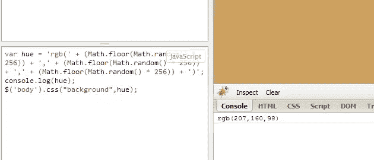

# 使用 JavaScript 生成随机颜色值

> 原文：<https://www.sitepoint.com/generating-random-color-values/>

生成随机 RGB 颜色的 JavaScript 代码片段。对于用一行代码向/从过渡提供颜色值可能很有用。


[参见演示](https://jsfiddle.net/86s6y/)

```
var hue = 'rgb(' + (Math.floor(Math.random() * 256)) + ',' + (Math.floor(Math.random() * 256)) + ',' + (Math.floor(Math.random() * 256)) + ')';
```

## 分享这篇文章