# 如何将你对 Photoshop 的精通转化为 Illustrator 的专业技能

> 原文：<https://www.sitepoint.com/how-to-turn-your-photoshop-mastery-into-illustrator-expertise/>

学习新软件似乎总是一项艰巨的任务，尤其是当它包含如此多的功能时，Adobe 产品总是如此。设计良好的软件足够灵活，可以适应各种各样的用户和他们的偏好。幸运的是，Adobe 产品的构造彼此相似，所以如果你牢牢掌握了其中一个，那么你就可以通过其他产品导航。

Illustrator 和 Photoshop 是两个 Adobe 产品，它们的布局和设置相似，但每个程序都有自己明显的差异。如果你正在考虑将 Illustrator 添加到你的设计库中，当你将 Photoshop 技能转化为 Illustrator 技能时，有几件事你应该知道。

## Illustrator 和 Photoshop 的相似之处

从 Photoshop 过渡到 Illustrator 的最佳方式是找到它们的共同点，即使它们的名称不同。Photoshop 和 Illustrator 的基本布局是一样的。你在 Photoshop 中有画布，你在那里做你的大部分工作。在 Illustrator 中，它被称为画板，一个文档中可以有多个画板。在 Illustrator 中，如果您正在创建基本的故事板，这将非常方便。创建 pdf 时也很方便，因为它会将每个画板保存到自己的页面。在 Photoshop 中，要更改文档大小，您需要更改画布大小，但在 Illustrator 中，您需要选择画板工具并调整手柄的大小，就像在各种 Adobe 程序中处理任何其他可调整大小的框一样。

[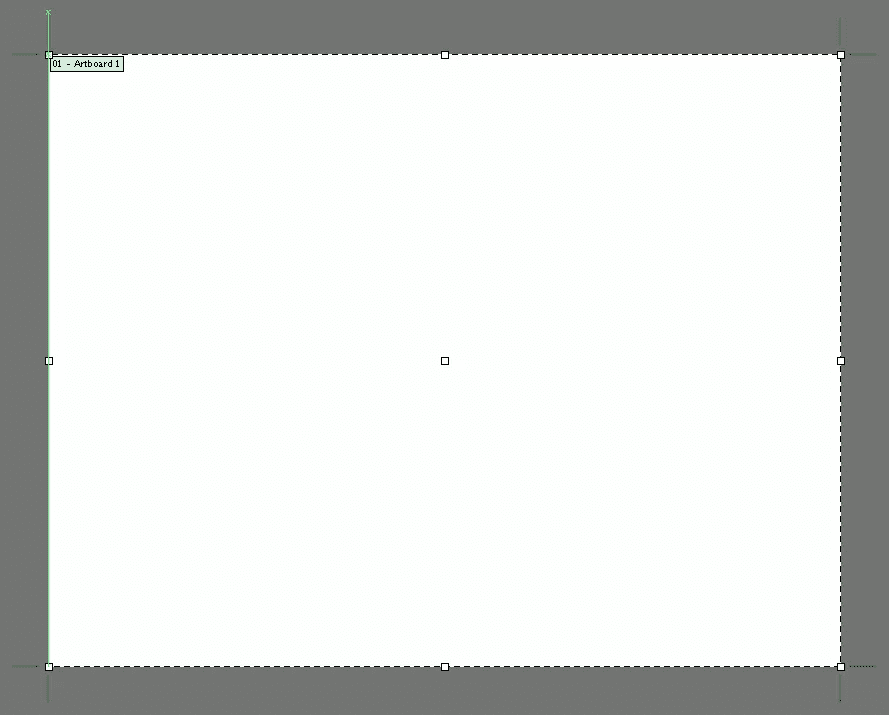](https://www.sitepoint.com/wp-content/uploads/2012/11/Screen-Shot-2012-11-13-at-12.17.25-AM.png)

面板在 Illustrator 中的设置与在 Photoshop 中的设置相同。左侧是可用的工具，右侧是主要的面板集。像 Photoshop 一样，它们是完全可自定义的，您可以保存和加载您指定的预设。

[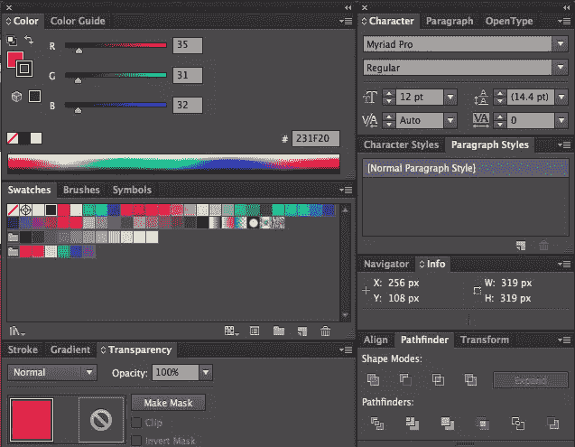](https://www.sitepoint.com/wp-content/uploads/2012/11/Screen-Shot-2012-11-13-at-12.26.38-AM.png)

Illustrator 和 Photoshop 都使用图层来堆叠对象和作品的其他部分，因此您可以轻松地组织您的作品。Illustrator 的不同之处在于它还具有附加的外观面板。此面板的工作方式类似于“图层”面板，但它是针对每个单独的形状的。它使您能够控制填充、描边和效果的堆叠方式。这对你的各种物品的外观有一定的影响。

[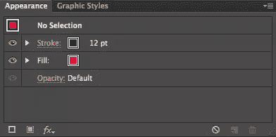](https://www.sitepoint.com/wp-content/uploads/2012/11/Screen-Shot-2012-11-13-at-12.31.12-AM.png)

[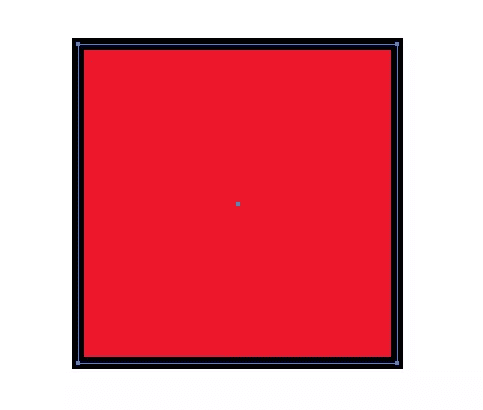](https://www.sitepoint.com/wp-content/uploads/2012/11/Screen-Shot-2012-11-13-at-12.31.45-AM.png)

上面显示的正方形具有默认外观。默认情况下，Illustrator 会创建一个以所绘制对象的边框为中心的描边。“外观”面板使您能够重新排列堆叠顺序，以便描边不会侵蚀对象，如下例所示。

[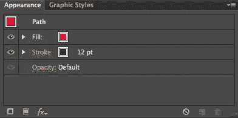](https://www.sitepoint.com/wp-content/uploads/2012/11/Screen-Shot-2012-11-13-at-12.35.28-AM.png)

[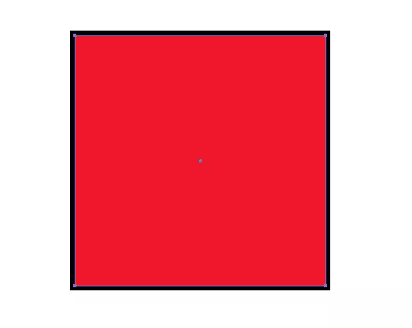](https://www.sitepoint.com/wp-content/uploads/2012/11/Screen-Shot-2012-11-13-at-12.35.42-AM.png)

您可以继续添加任意多的笔画，并且可以很容易地在一个对象上创建多个笔画，并对每个笔画进行控制。请注意下面示例中长方体上笔划的堆叠顺序。您可以从“外观”面板内部控制填充或描边的颜色以及描边的大小。

[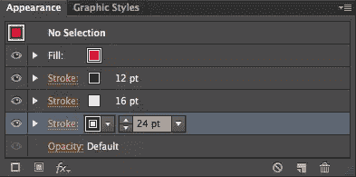](https://www.sitepoint.com/wp-content/uploads/2012/11/Screen-Shot-2012-11-13-at-12.38.06-AM.png)

[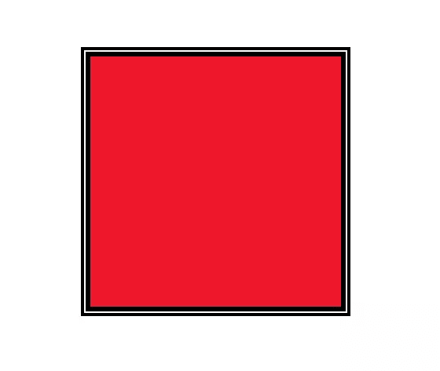](https://www.sitepoint.com/wp-content/uploads/2012/11/Screen-Shot-2012-11-13-at-12.38.25-AM.png)

## 过滤

Photoshop 中的大多数滤镜都出现在 Illustrator 中，从艺术设置，一直到风格化和纹理设置。不过，Illustrator 确实有自己的一套效果。这些是我之前提到的出现在外观面板中的相同效果。这些效应都有不同的作用，下面是它们作用的简要概述:

### 三维（three dimension 的缩写）

Illustrator 有自己的一套 3D 效果，您可以在 3D 空间中挤出、旋转和旋转对象。在这里，您可以将 3D 效果应用于在 Illustrator 中创建的文字和其他对象。

### 转换为形状

此效果会将您当前的选择转换为指定的形状。这将把矩形转换成圆角矩形，等等。

### 作物标记

这将为您在 Illustrator 中创建的图形添加裁剪标记。这通常用于打印目的。

### 扭曲和变换

这允许您使用各种效果和设置来扭曲和操纵您的形状，如“折叠和膨胀”,这将向内拉动对象的边缘或向外膨胀它们。“自由扭曲”允许您在没有常规手柄和设置的情况下弯曲和改变形状。粗糙化给你的形状添加了粗糙的边缘，使它们看起来粗糙或憔悴，这用手很难做到。

### 小路

这允许您偏移路径、勾勒对象轮廓或勾勒在 Illustrator 中创建的对象的描边。

### 探路者

这与“路径查找器”面板的设置相同，它允许您组合、减去和分割在 Illustrator 中创建的形状。

### 将…转变成可显示的像素

这将采用您在 Illustrator 中选择的矢量对象，并根据像素将其转换为光栅图形..

### 使风格化

这些效果允许您在 Illustrator 中为对象添加发光、投影和羽化效果。

### SVG Filters

这会将可缩放矢量图形(SVG)效果添加到矢量图形中。这些在 Illustrator 的普通图形上并不总是很好。当您使用 Illustrator 为 web 创建可缩放的矢量图形时，这些更有意义。

### 弯曲

这组效果会弯曲在 Illustrator 中创建的矢量对象。Illustrator 中的默认设置会根据预设来弯曲对象，但它们都有可以调整值的滑块。这是为了精确地创建困难的圆形。

## 建筑形状

在 Illustrator 中构建形状通常比在 Photoshop 中更容易。Photoshop 使用路径，您可以使用 Photoshop 的钢笔工具添加、减去和操作路径。在 Illustrator 中，您仍然可以执行所有这些操作，但是您可以使用路径查找器面板和 Illustrator 的形状生成器工具来组合形状。

[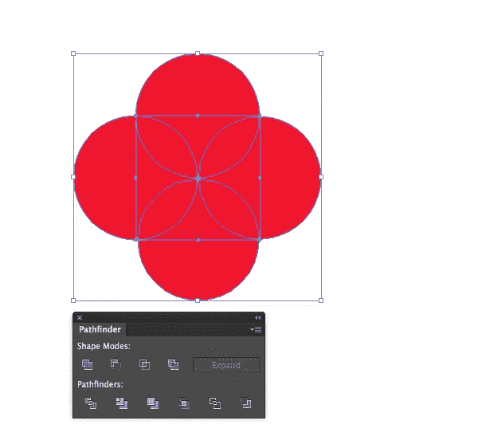](https://www.sitepoint.com/wp-content/uploads/2012/11/Screen-Shot-2012-11-13-at-1.52.59-AM.png)

上面的形状都是相互重叠的独立形状。使用“路径查找器”面板，您可以单击这些图标中的任何一个来执行不同的操作。例如，右上角的图标组合了所有选定的形状。下一个从其余的形状中减去顶部的形状。第三个图标将去掉任何不重叠的部分。第四个图标将删除所有重叠区域。这是一种快速定位所有形状并删除不需要的形状的方法。在 Illustrator 中，它又快又简单。

[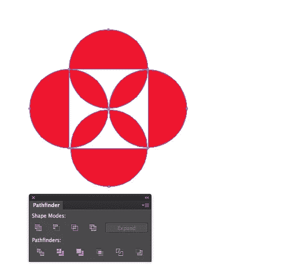](https://www.sitepoint.com/wp-content/uploads/2012/11/Screen-Shot-2012-11-13-at-1.57.32-AM.png)

我点击了第一行的第四个选项来去掉形状的重叠部分。当我们这样做时，我们所有的部分都是相互关联的，所以现在它们被组合在一起。您可以双击该对象进入编辑模式，在该模式下您可以单独操作每个部分。然后，双击画布返回正常模式，在这里它们再次组合在一起。

[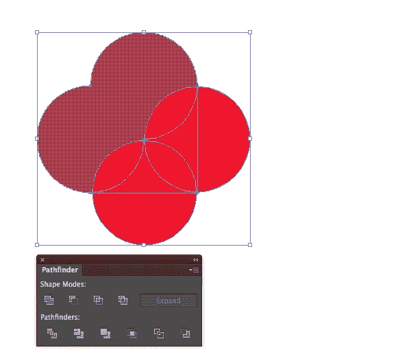](https://www.sitepoint.com/wp-content/uploads/2012/11/Screen-Shot-2012-11-13-at-2.01.21-AM.png)

形状生成器工具基本上做同样的事情。单击并拖动多个形状，将它们组合成一个形状。一旦他们结合在一起，他们各自的道路就消失了。除非您撤消最后一步，否则无法恢复到原始形状。您可以按住 Option/Alt 键并单击形状来移除它。在下面的例子中，我将两个形状从组中移除，并将所有其他形状合并。

[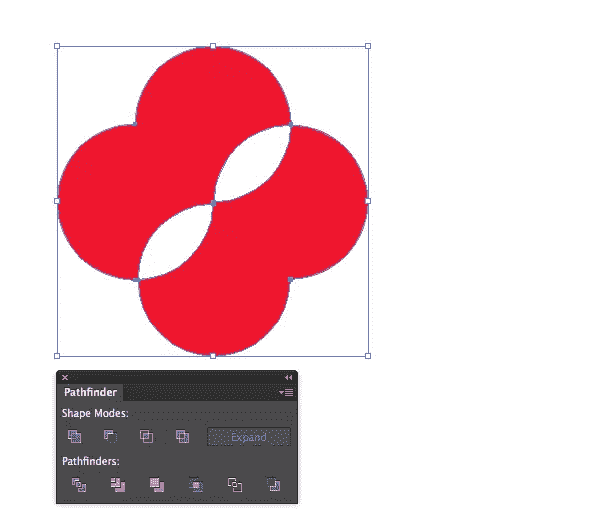](https://www.sitepoint.com/wp-content/uploads/2012/11/Screen-Shot-2012-11-13-at-2.05.38-AM.png)

Illustrator 和 Photoshop 的另一大区别是 Illustrator 的渐变网格工具。这就是 Illustrator 处理复杂矢量形状渐变的方式。网格的工作方式取决于对象的形状和它有多少锚点。取消选择对象并选取不同的颜色(取决于它是高光还是阴影)。然后，选择渐变网格工具，点击你想要高亮的区域。Illustrator 将根据锚点交点处的形状来确定网格，如下例所示。

[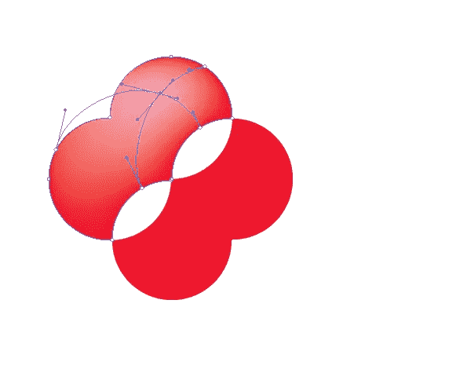](https://www.sitepoint.com/wp-content/uploads/2012/11/Screen-Shot-2012-11-13-at-2.12.19-AM.png)

您可以通过移动或改变网格内部的锚点来操纵网格。这可能需要一些时间来适应。

## 刷子

画刷在 Illustrator 中的行为也有所不同。在 Photoshop 中，画笔是光栅绘画，一旦放在画布上就不容易更改。但是，在 Illustrator 中，每个画笔描边都是一条路径。你可以选择这个路径，改变它，改变画笔的颜色，改变它的粗细，甚至它的风格。下面，我用水彩笔分别画了三笔。在画板上躺下后，我可以选择一条路径并改变颜色。我这样做了所有三个笔触。让我们看看 Photoshop 是怎么做的吧！

[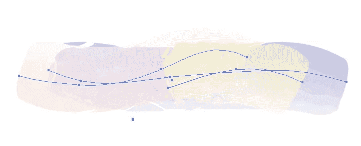](https://www.sitepoint.com/wp-content/uploads/2012/11/Screen-Shot-2012-11-13-at-2.23.55-AM.png)

## 结论

从 Photoshop 过渡到 Illustrator 可能看起来是一项艰巨的任务，但是如果您看一看主要的区别并了解 Illustrator 如何创建其对象和形状，您就可以很快上手并运行。过一段时间后，你可能会发现你可以在 Illustrator 中更快地进行设计，然后将那些设计带入 Photoshop 中进行点睛之笔。你会发现你可以在这两个程序之间来回切换，创作出优秀的作品，这在任何一个程序中都不容易做到。

你已经从 Photoshop 飞跃到 Illustrator 了吗？你觉得很难吗？如果不是，是什么帮助你更容易地完成过渡？在下面的评论区分享你的建议。

## 分享这篇文章