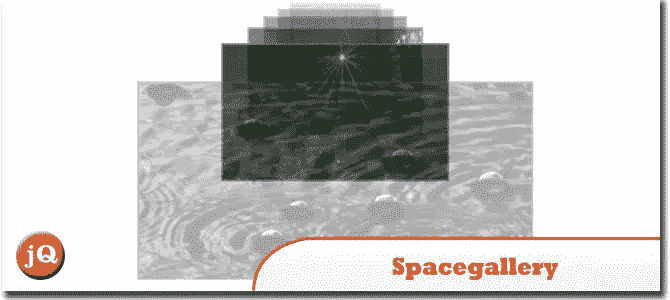
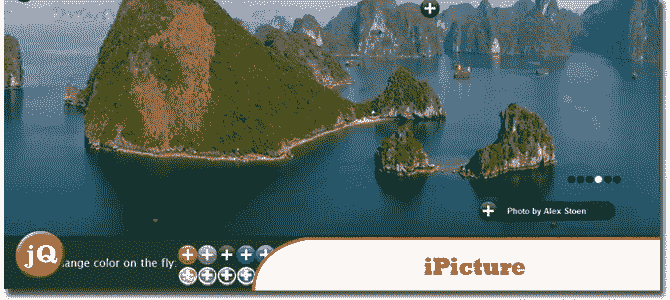
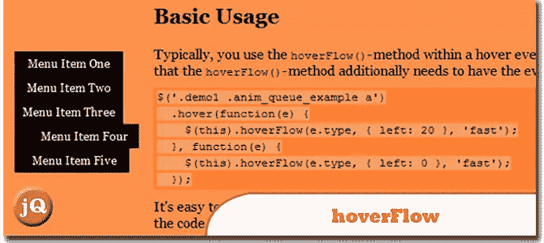
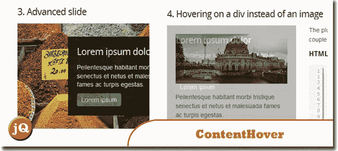
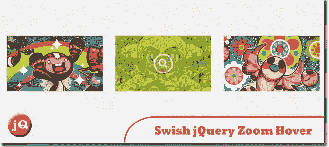

# 5 个 jQuery 图像悬停/点击/滚动插件

> 原文：<https://www.sitepoint.com/5-jquery-image-hoverclickscroll-plugins/>

你想让你的图像悬停效果整洁漂亮吗？嗯，你可能想看看这些 **jQuery 图片悬停/点击/滚动插件！这些插件可以很好地设计你的图片和图片标题，让你的网站看起来更有活力，更有生气！**

## 1.space gallery–jQuery 插件

另一个 jQuery 图库插件。请看下面的演示。
 
[源+演示](http://www.eyecon.ro/spacegallery/#about)

## 2.图片

一个 jQuery 插件，用于创建带有额外描述的交互式图片。
 
[源+演示](http://ipicture.justmybit.com/)

## 3.气垫流

Ralf Stoltze 开发的 jQuery 插件。该插件需要 jQuery 1.2.3 或更高版本。在 Firefox 2+，Internet Explorer 7+，Opera 9.6，Chrome 1 中测试。我见过它在 IE6 中(慢慢地)工作，但是谁在乎…
 
[来源](http://www.2meter3.de/code/hoverFlow/) [演示](http://www.2meter3.de/code/hoverFlow/demos.html)

## 4.jQuery ContentHover 插件

当鼠标悬停在元素上时，在元素顶部显示隐藏内容的插件。
 
[源和演示](http://www.backslash.gr/demos/contenthover-jquery-plugin/)

## 5.Swish jQuery 缩放悬停效果插件

有了这个插件，你可以在悬停时给你的图片添加缩放风格的效果，也可以给它添加一个覆盖层(这是你在很多灯箱主题上看到的)。
 
[来源](http://thefinishedbox.com/freebies/plugins/jquery-zoom-plugin/) [演示](http://thefinishedbox.com/files/freebies/hoverzoom/index.html)

## 分享这篇文章