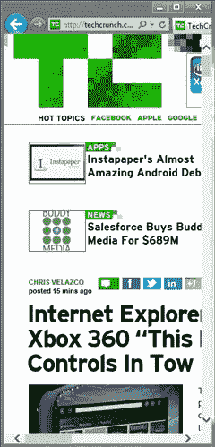
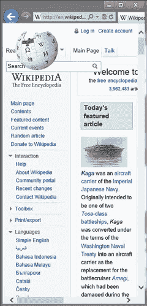
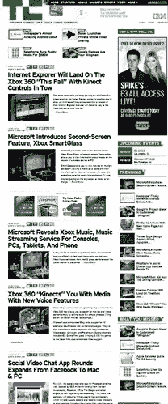
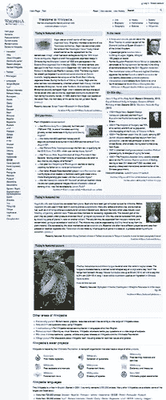

# 使你的网站适应不同的窗口大小

> 原文：<https://www.sitepoint.com/adapting-your-site-to-different-window-sizes/>

像最新版本的 Internet Explorer、Firefox、Safari 和 Opera 这样的现代浏览器支持 W3C 工作草案 [CSS 设备适配](https://www.w3.org/TR/2011/WD-css-device-adapt-20110915/)的宽度和高度属性，截至 11 月 1 日，该草案已经发展成为[编辑草案](http://dev.w3.org/csswg/css-device-adapt/)。这为 Web 开发人员提供了一个简单的工具来控制不同窗口尺寸的自动内容缩放。特别是，它使网站能够轻松适应在触摸式平板设备上以快照视图和纵向方向浏览。

## 自动缩放及其使用时间

许多网站优先优化 1024 像素宽的窗口。当浏览器最大化时，这确保了各种显示器的良好用户体验。然而，如果网站没有针对其他窗口尺寸进行[优化，它们可能无法在平板电脑和纵向屏幕方向等新形式上很好地工作。特别是，当在狭窄的宽度上查看时，页面经常会裁剪或扭曲布局。](http://blogs.msdn.com/b/ie/archive/2011/01/12/the-css-corner-css3-media-queries.aspx)

 

这种狭窄的布局在 Windows 8 中尤其重要，浏览器的快照视图正是处于这种状态。由于外形尺寸较小，这种情况也会发生在平板设备的纵向模式中。

默认情况下，对齐视图和纵向模式会自动缩放，以确保至少 1024 像素的布局宽度。当在狭窄的外形上显示非移动优化的网站时，移动设备采取类似的方法。由于大多数网站在 1024 像素下运行良好，这确保了它们布局良好，默认情况下不会裁剪内容。

 

虽然这种方法确保了良好的默认体验，但用户需要放大才能查看站点并与之交互。

## 在狭窄的窗口中工作良好

最好的窄布局是由 Web 开发者定制的。除了使网站适应更窄的区域之外，这还可能需要改变图像大小、重新排序内容、网站导航的替代工具或对内容的其他基本改变。

如果您的站点已经针对窄窗口进行了这些修改，那么设备自适应可用于覆盖默认比例。

关于适应性布局的一些很好的例子，请查看[媒体查询](http://mediaqueri.es/)。Metal Toad Media 也有一篇很棒的文章，基于市场上流行的设备和屏幕尺寸讨论了[布局宽度支持](http://www.metaltoad.com/blog/simple-device-diagram-responsive-design-planning)。

## 使用@viewport

**对快照视图的简单支持**

如果您的站点已经支持 320 像素宽度的布局，您可以轻松地选择在快照视图中显示该版本。将设备自适应与 CSS 媒体查询相结合，可以有选择地覆盖自动缩放功能。此 CSS 覆盖默认的自动缩放，而是对所有 320 像素宽或更窄的窗口强制实施一致的 320 像素布局宽度:

```
@media screen and (max-width: 320px) { @viewport { width: 320px; } }
```

当窗口宽度小于 320 像素时，内容将缩小以适合窗口。例如，300 像素宽的窗口将以 93.75%的比例显示内容。对于较大的宽度，正常缩放适用(例如，当浏览器处于纵向模式时)。

在尚不支持设备适配的浏览器中，设备适配会适度降低。这些浏览器仍然可以受益于窄布局支持——它们只是不能自动缩放以适应窗口内容。

## 肖像支架

如果您的站点也支持 768 像素宽的布局，那么可以通过第二个视口规则轻松添加纵向模式支持:

```
@media screen and (max-width: 320px) { @viewport { width: 320px; } }   @media screen and (min-width: 768px) and (max-width: 959px) { @viewport { width: 768px; } }
```

除了 1024 像素和更宽的布局宽度(横向)之外，我建议在 768 像素(大多数石板上的纵向)和 320 像素(快照浏览器)的布局宽度下测试您的站点。您可以在 [Make it Snappy 中看到 viewport 规则的示例。](http://ie.microsoft.com/testdrive/Graphics/MakeItSnappy/)在 [IE 试驾](http://ie.microsoft.com/testdrive/Default.html)现场演示。

## 分享这篇文章