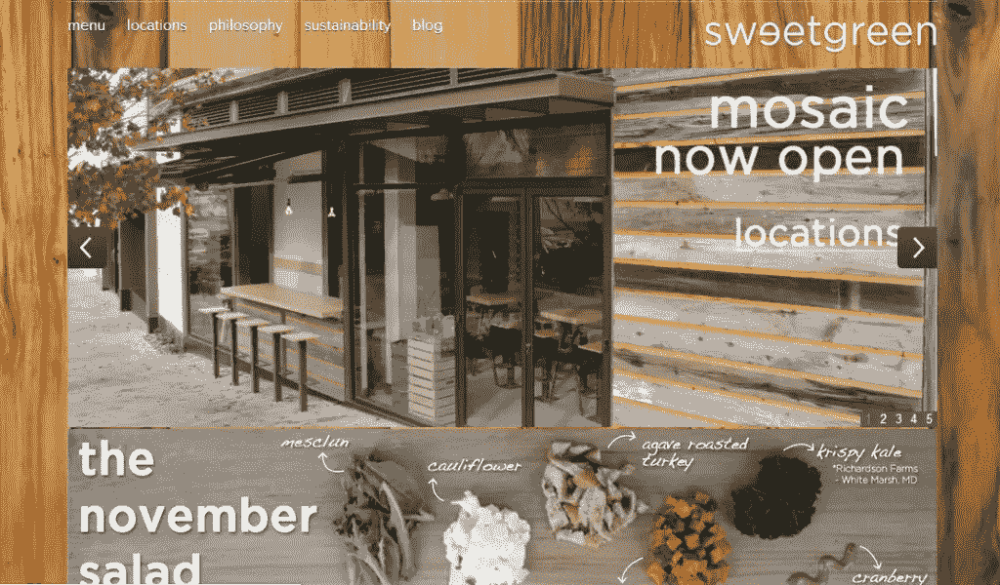
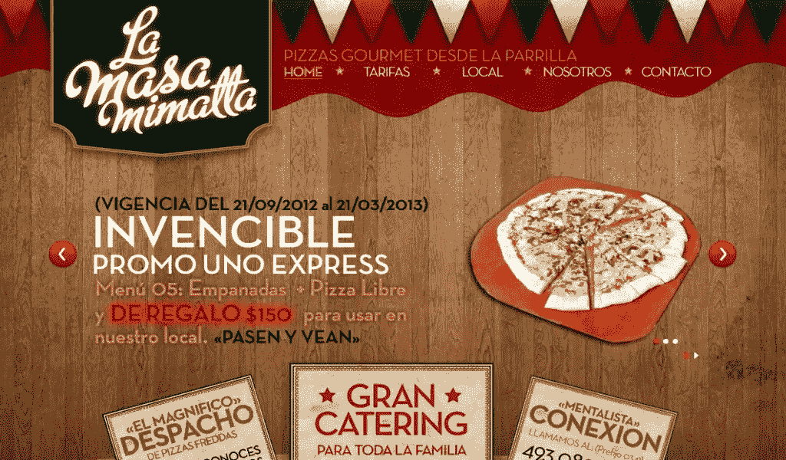
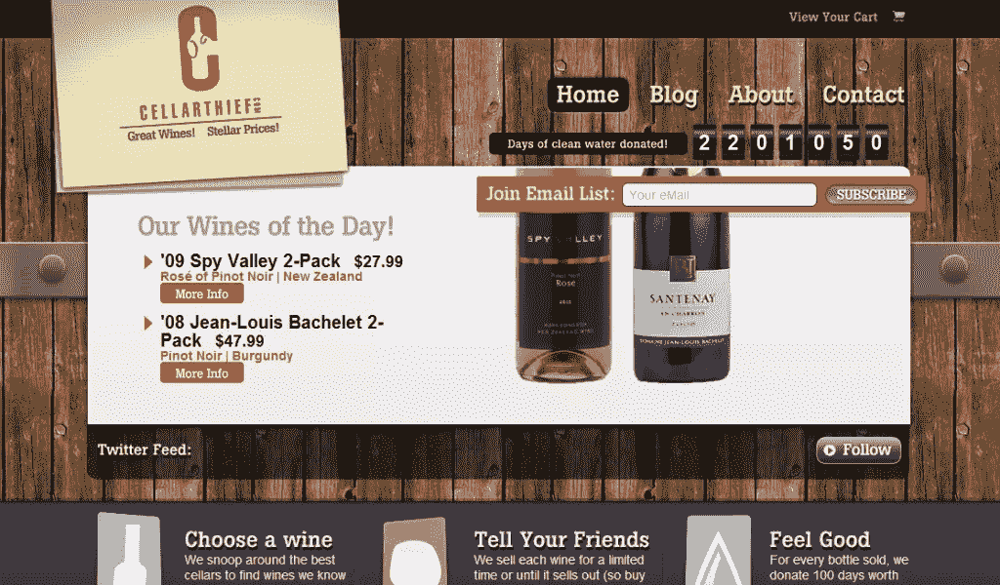
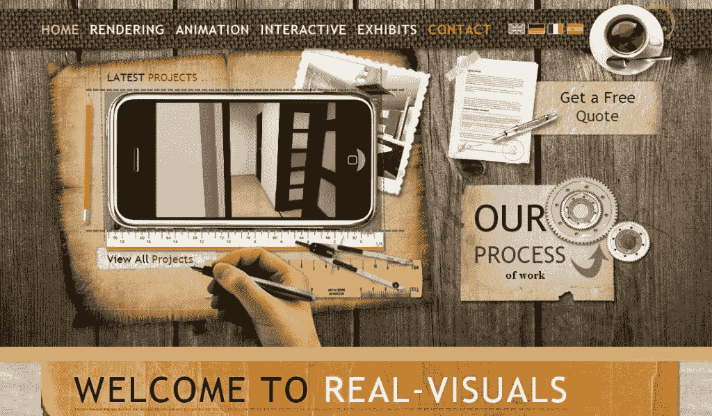
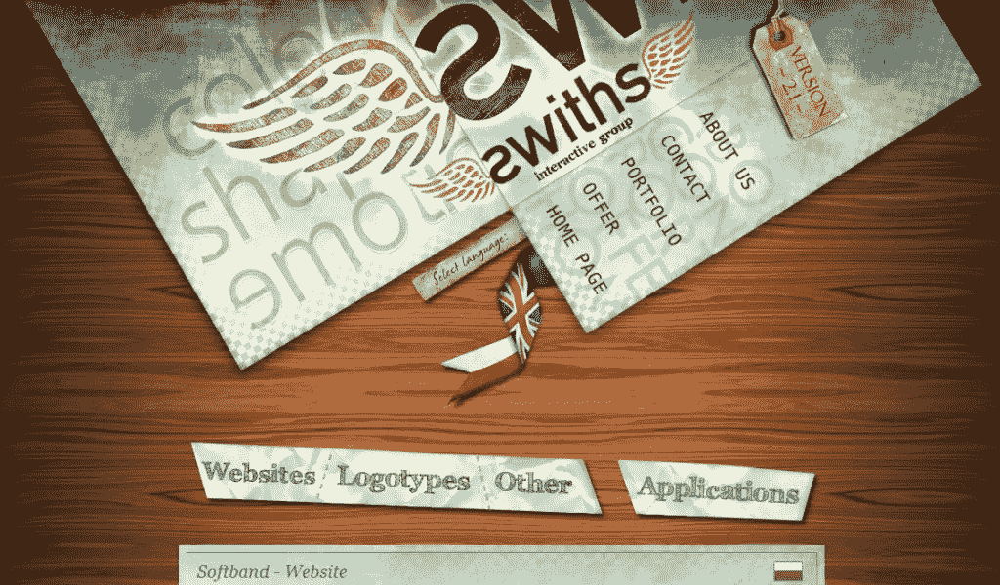
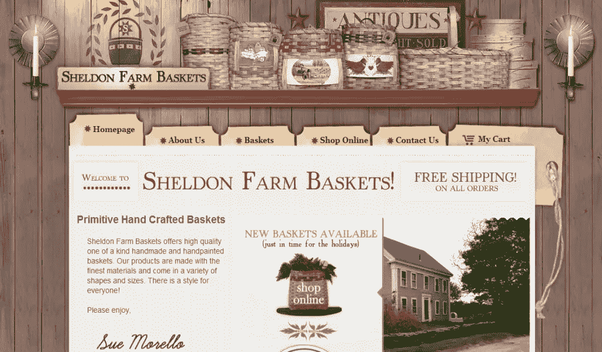
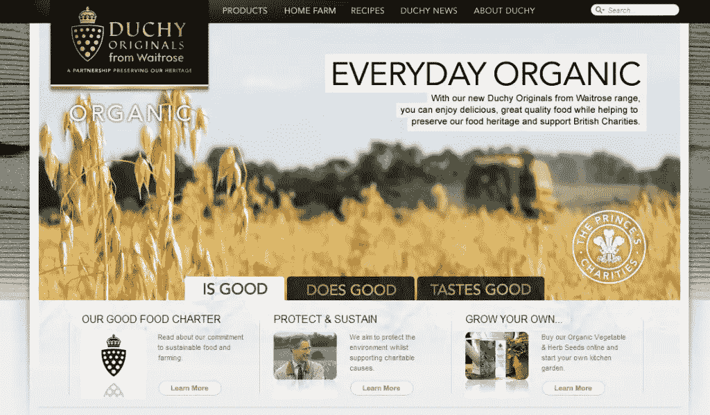
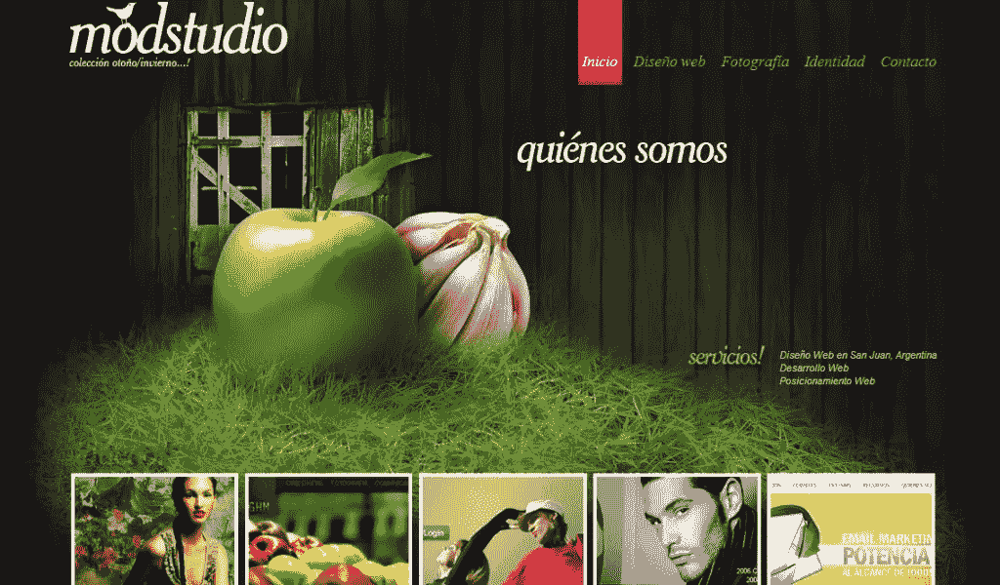
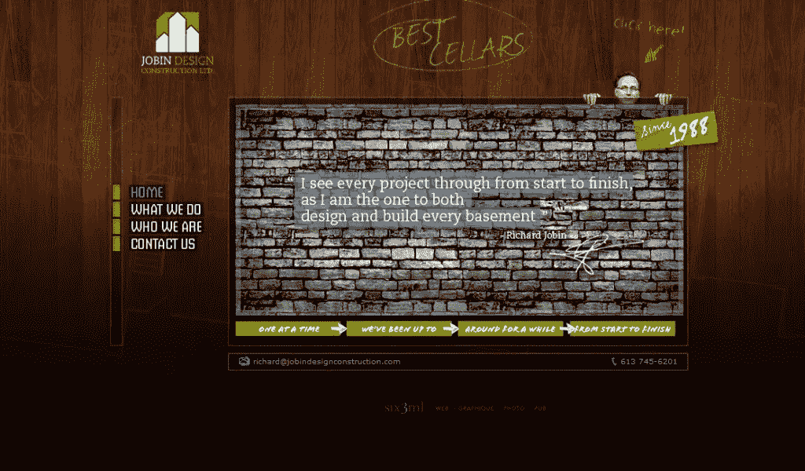
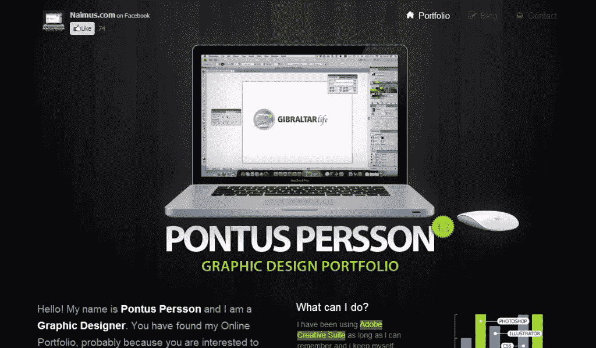

# 10 个精彩的木质网页设计

> 原文：<https://www.sitepoint.com/10-wonderful-wooden-web-designs/>

在设计中使用纹理是一种常见的做法，但是，无论是在图形、网页还是建筑设计中，设计中的木质纹理都具有独特的吸引力。木质纹理给设计带来了一些纹理所不能带来的东西。使用木质纹理的好处是它不会限制你。无论你是在为一家餐厅设计，还是仅仅是一个在线作品集，你都有可能优雅地将木材融入某种形状或时尚。

无论如何，这种趋势并不新鲜，但它正被稳定地用于给网站带来更自然和复杂的外观。如果你曾经想在自己的设计中使用一些木质纹理，但不知道如何融入其中，那么你很幸运。今天的综述展示了十个精彩的木质网页设计，这一定会激发你去看看那些提供免费木质纹理的网站。

### 1.甜绿色

### 2.拉马萨米马塔

### 3.地窖窃贼

### 4.真实图像

### 5.斯怀兹

### 6.谢尔顿农场篮子

### 7.公爵原件

### 8.Modstudio

### 

### 9.工程设计施工

### 第十名

## 分享这篇文章