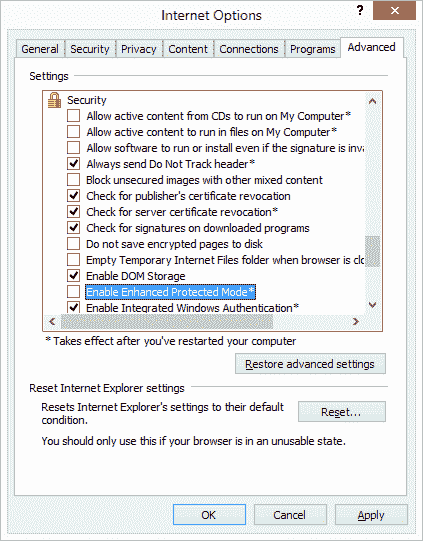
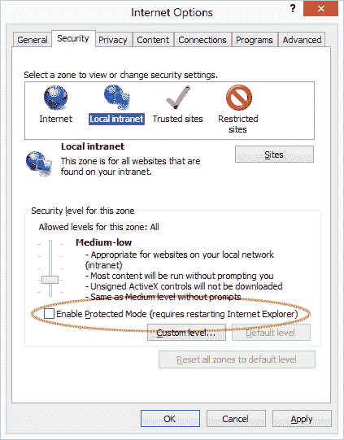
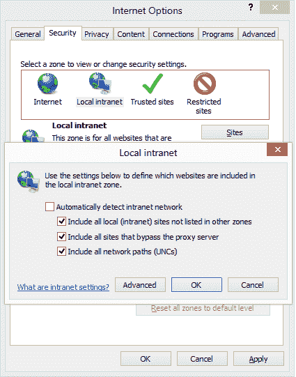
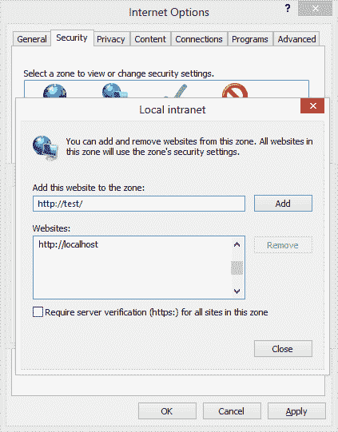
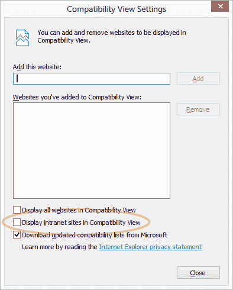

# 如何在 IE10 中启用内部网浏览

> 原文：<https://www.sitepoint.com/enable-ie10-intranet-browsing/>

你已经安装了 Windows 8。您已经配置了一个 web 服务器。你点燃了 IE10。您已经在地址栏中输入了**http://localhost/**……但没有任何反应。

微软在 Windows 8 中实施了严格的安全协议，默认情况下会阻止本地/内部网站点。它会影响 IE10，但也会给使用标准 Windows 互联网选项的 Chrome 带来问题。幸运的是，您可以避开这个问题，再次测试本地站点…

## 启用 Intranet 浏览

第一次访问本地站点时，您会被告知内部网浏览已被禁用，并给出一个启用它的选项。但这还不是故事的全部。

## 关闭增强保护模式

默认情况下，不应启用增强保护模式；它使用 64 位内容进程并禁用各种控件。如有必要，在 Cog/Tools > Internet Options > Advanced > Security 部分将其关闭:

假设您已经启用了内部网浏览，单击“安全”选项卡，然后单击“本地内部网”图标。确保未选中“启用保护模式”:

## 定义内部网站点

幸运的话，您的测试站点现在可以加载了。否则，内部网页面将超时，因为 IE 无法解析本地 DNS 设置。返回 Cog/Tools > Internet Options > Security 选项卡，点击“本地内部网”图标，然后点击 **Sites** 按钮。

首先，尝试检查“自动检测内部网网络”，确定你的方式退出，并重新加载一个本地页面。如果仍然失败，返回到同一个对话框，取消选中该框。然后点击高级按钮:

您现在需要添加您使用的所有本地地址。再次确定你的出路，并重新测试一页。它应该可以加载，但看起来可能很糟糕…

## 禁用兼容性视图

默认情况下，IE 为所有本地和 intranet 站点启用兼容性视图。你精心制作的页面会以 IE7 模式呈现，就好像又回到了 2006 年。要禁用此选项，您必须启用菜单栏(右键单击 IE 工具栏的空白部分)或按住 Alt。选择工具>兼容性视图设置:

取消选中“在兼容性视图中显示内部网站点”并点击关闭。您的本地站点应该以 IE10 模式显示在桌面和城域网视图上。

唷。幸运的是，这个过程你只需要经历一次。但是如果你在听的话，微软，请你解决下一版本 IE 中的网络选项对话框！

## 分享这篇文章