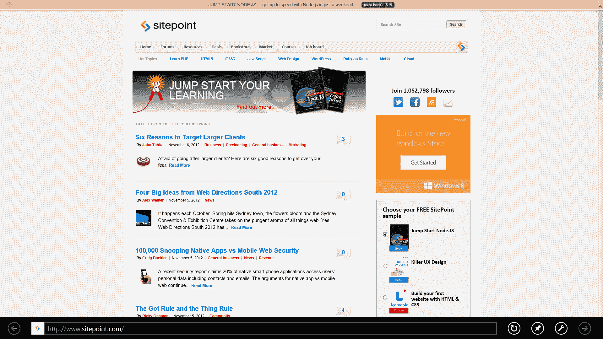
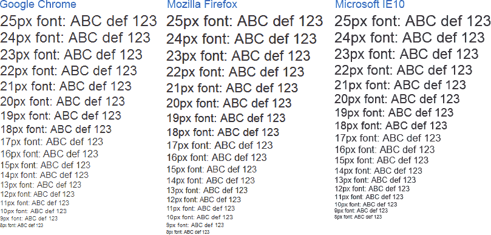

# 互联网浏览器 10:回顾

> 原文：<https://www.sitepoint.com/internet-explorer-10-review-ie10/>

自 10 月 26 日以来，微软 Internet Explorer 10 的最终版本一直与我们在一起。它在网络上受到了冷遇——可能是因为它只在 Windows 8 上可用，相对来说很少有人使用。但是 IE10 标志着一个重要的里程碑，值得全面回顾…

## 装置

IE10 是随 Windows 8 一起安装的，所以在它可用于 Windows 7 之前，不可能确定你是否会遇到安装或兼容性问题。但你应该注意到，Windows 8 安装起来非常快速和简单——30 分钟的硬盘运行时间就能让你启动并运行。

正如你所料，IE10 是默认浏览器，尽管如果你要升级，Windows 8 会保留你当前的偏好。欧盟的用户也将获得臭名昭著的[浏览器选择界面](https://www.sitepoint.com/european-browser-choice-today/)，在这里你可以选择 Chrome、Firefox、Opera 或者一些鲜为人知的选择。在[苹果决定放弃 Windows 版本](https://www.sitepoint.com/safari-6-whats-new-windows-version/)后，Safari 已经消失。

最令人兴奋的消息是，微软终于实现了自动更新。默认情况下它是打开的，所以让我们希望大型组织在 2026 年部署 Windows 8 时保持这种状态。

## 连接

IE 是两个浏览器合二为一。当从桌面启动时，你会被误认为什么都没有改变；IE10 看起来和 IE9 一样:

我们还有 Windows 8 UI 风格的版本。抱歉，微软——我不能给它起这个名字，所以从现在开始它将被称为 Metro:

Metro 版本使用相同的底层渲染引擎提供了更时尚、更简单的用户界面。它支持滑动等手势，这使它成为触摸屏平板电脑和大电视的理想选择。我不认为你会在个人电脑上经常使用它，但这部分是因为 Metro 版本只能在 IE 被设置为默认浏览器时使用。

IE10 和 Windows 8 的集成在 Windows 7 上和 IE9 一样好。该浏览器支持 UI 功能，如 Metro 开始屏幕或任务栏上的固定站点、跳转列表、窥视和窗口捕捉。

总的来说，IE10 的界面是功能性的，不会碍事。它可能没有 Chrome、Firefox 或 Opera 那么吸引人，但你很少会注意到它。我唯一的抱怨是互联网选项对话框，自从 15 年前 IE4 推出以来几乎没有改变过——它令人困惑，过于技术化，需要彻底改革。也就是说，它最终允许您从之前会话中打开的选项卡开始。

## 网络标准

IE10 支持你会在其他浏览器中发现的现代 HTML5 网络功能。这最后包括文本阴影、变换和动画。我的[星球大战 3D 滚动文字](https://www.sitepoint.com/css3-starwars-scrolling-text/)管用！

虽然自动化合规性测试很少展示整个故事，但我们可以看到 IE10 远远超过 IE9:

| 浏览器 | [HTML5test.com](http://html5test.com/) | [acid3.acidtests.org](http://acid3.acidtests.org/) |
| Internet Explorer 10 | 320+6 / 500 | 100 / 100 |
| Internet Explorer 9 | 138+5 / 500 | 95 / 100 |
| 铬 22 | 434+13 / 500 | 100 / 100 |
| 火狐 16 | 372+10 / 500 | 100 / 100 |

唯一的例外是 WebGL，微软已将其确定为“安全风险”。虽然我对这种说法有点怀疑，但这项技术目前在特定浏览器的游戏和演示中并不可行。

有趣的是，字体渲染在三种主要浏览器中有所不同*(点击查看全尺寸)*:

这可能取决于你的电脑、设置和个人偏好，但 IE 的文本似乎比其他浏览器更具可读性。

本质上，微软已经创造了一个现代浏览器，它不会带来我们在它的前辈身上所经历的开发挑战。我还没有发现 IE10 失败的网站。

## 表演

IE9 并不轻松，所以我对 IE10 有很高的期望。浏览器像以前一样快速地打开、渲染和关闭。不幸的是，基准测试显示并非如此…

| 试验 | IE10 | 铬 22 | 火狐 16 |
| [Webkit SunSpider(较低=较好)](http://www.webkit.org/perf/sunspider/sunspider.html) | 6244.7 毫秒 | 200.3 毫秒 | 211.2 毫秒 |
| [谷歌 V8(更高=更好)](http://v8.googlecode.com/svn/data/benchmarks/v7/run.html) | One hundred and forty-three | Eleven thousand three hundred and sixty-eight | Seven thousand two hundred and twenty-three |
| [MS 2000 鱼 fps(更高=更好)](http://ie.microsoft.com/testdrive/Performance/FishBowl/) | nine | Seventeen | Thirty-four |

基准测试不一定反映真实世界的使用情况，但我很惊讶 IE10 的表现有多差*(以及 Firefox 的表现有多好)*。这可能是由我的电脑上发生的一些奇怪的事情引起的，但浏览器是在一个干净的 Windows 8 安装上测试的，没有运行其他应用程序。

IE10 并不觉得慢，而且肯定比 Chrome 或 Firefox 启动更快，但自从 IE9 发布以来，微软的浏览器已经被其他浏览器取代。

## 内存使用

很少有人担心浏览器的内存使用，但我想确保 IE 不会占用系统。在四个标签打开的情况下，表现最差的是 Chrome，大约 350MB(分布在十几个进程中)。IE10 用 240MB 消耗了这些资源的三分之二，尽管不可否认，Windows 8 可以运行其他后台进程。最不饥渴的浏览器是 195MB 的 Firefox。

## 安全

微软没有生产安全软件的名声，但该公司正在努力纠正这一点。Internet Explorer 与其竞争对手一样好，如果不是更好的话。功能包括:

1.  增强保护模式隔离每个选项卡。
2.  InPrivate 浏览是按选项卡而不是按会话隔离的。
3.  IE 加载模块时使用随机内存地址。
4.  微软的 SmartScreen 下载信誉服务在 IE 和 Windows 8 中使用，因此无论您使用哪种浏览器，您都可以得到保护。

正如我上个月报道的那样，当你安装 Windows 8 时，[“不跟踪”是默认启用的](https://www.sitepoint.com/ie10-do-not-track/)。这让广告客户感到不安，但很少有人遵守 [DNT 指导方针](https://www.sitepoint.com/what-is-do-not-track/)，所以你不太可能注意到任何差异。

## 增强功能和附件

IE10 安装了一个性能增强版本的闪存，与之前的报道相反，它可以在桌面和地铁模式下工作。

然而，IE 的插件选择仍然令人失望。尽管是首批支持插件的浏览器之一，但很少有公司为该浏览器开发。那些提供垃圾购物或搜索工具栏的网站。微软需要一个不同的模式，如果他们想让扩展开发者认真对待 IE 的话。采用类似于 Chrome、Opera 或 Firefox Jetpack 的插件技术会有很大的不同。

## 开发工具

IE10 提供了与 IE9 相同的 F12 开发工具。这比什么都没有好，但与 Firefox 工具、Firebug、Webkit Inspector 和 Opera 蜻蜓相比，质量越来越差。

除了 IE10 的默认标准呈现模式，开发人员和测试人员还必须应对:

*   IE10 兼容模式
*   IE9 标准和怪癖模式
*   IE8 标准和怪癖模式
*   IE7 标准和怪癖模式
*   IE5 怪癖模式

公平地说，这些对于测试来说是实用的。不幸的是，IE10 禁用内部网浏览，并在默认情况下将这些页面切换到兼容模式。因此，不可能测试托管在本地机器上的站点。您可以绕过这一限制，但这有点古怪——请注意即将发表的一篇文章。

最终，微软几乎没有借口。他们不能指望开发者在没有提供好的工具选择的情况下就蜂拥回到 IE。我希望他们把注意力集中在这些设备上，现在三叉戟渲染引擎的工作已经不那么紧迫了。

## 结论

IE10 是一款优秀的浏览器。它速度很快，并提供了我们在 Chrome 和 Firefox 中发现的大多数 HTML5 和 CSS3 功能。

**IE10 好点:**

*   一个快速、不显眼的界面，具有出色的操作系统集成
*   强大的标准支持
*   地铁模式是平板电脑和触摸屏的理想选择
*   自动更新。最后。

**IE10 坏点:**

*   仅限于 Windows 8 (Windows 7 有望很快到来)
*   糟糕的开发工具、很少的附加组件和铺天盖地的选项对话框
*   微软的发展速度太慢了
*   IE10 已经赶上了其他浏览器——但并没有更好。

考虑到 Windows 8 19 个月的开发周期和彻底的变化，我希望能多一点。用户会喜欢 IE10，*但我怀疑他们会喜欢它*。微软可能会减缓 Internet Explorer 迁移的速度，但 IE10 并没有提供从另一种浏览器切换的令人信服的理由。

如果你喜欢读这篇文章，你会爱上[可学的](https://learnable.com/)；向大师们学习新技能和技术的地方。会员可以即时访问 SitePoint 的所有电子书和交互式在线课程，如[建立你的第一个网站:HTML 和 CSS 入门](https://learnable.com/courses/build-your-first-website-getting-started-with-html-css-2279)。

## 分享这篇文章