# 在 Photoshop 中制作一个有说服力的、漂亮的 125×125 的广告

> 原文：<https://www.sitepoint.com/build-a-persuasive-pretty-125x125-advertisement-in-photoshop/>

如果广告没有吸引力和说服力，发布广告就没有什么意义，而且由于在网络上注意力持续时间是以毫秒计算的，你只有一瞬间的时间给感兴趣的眼球留下强烈而持久的印象。在大多数情况下，你的网络广告会放在观众精心挑选的内容旁边，放在争夺相同注意力的广告旁边，或者同时放在两者旁边。

由于网络广告在激烈、持续地争夺日益缩小的观众注意力，广告商尽可能利用战术优势是至关重要的。从设计师的角度来看，这意味着从最大的整版广告到最小的邮票大小的促销活动，打磨你的广告以获得最大的视觉吸引力。

由于尺寸限制，设计具有巨大吸引力的小广告可能有点棘手。但是，如果你能把你的信息浓缩成几句话，并结合一些精心设计的技巧，你就能产生坚实的兴趣，并给广告商带来惊人的价值。所以，今天我们要设计 125 像素乘 125 像素的横幅广告。我们将使用一些有趣的技术和混合选项来创建这个小而强大的广告。那么，我们开始吧。

**最终结果:**

### 第一步:调整画布大小

创建一个 125 像素宽和高的新文件。

[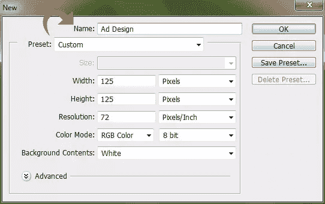](https://www.sitepoint.com/wp-content/uploads/2012/10/Step-110.jpg)

### 第二步:建立你的背景

选择油漆桶工具，用颜色#363844 填充背景。

[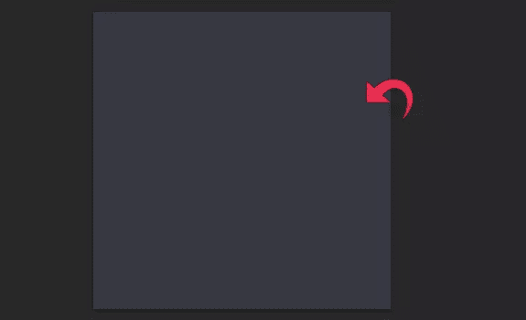](https://www.sitepoint.com/wp-content/uploads/2012/10/Step-26.jpg)

### 第三步:抓取渐变

现在点击“图层”>“图层样式”>“渐变叠加”，使用下面的设置添加一个径向渐变。

### 第四步:划分你的画布

选择钢笔工具并创建一个路径，然后右键单击路径并单击“选择”

[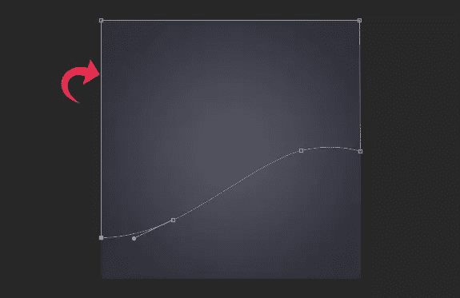](https://www.sitepoint.com/wp-content/uploads/2012/10/Step-42.jpg)

### 第五步:创建对比

新建一个图层，填充颜色#f76e25。

### 步骤 6:给你的新图层添加样式

现在，点击“图层”>“图层样式”>“渐变叠加”使用下面显示的设置。

[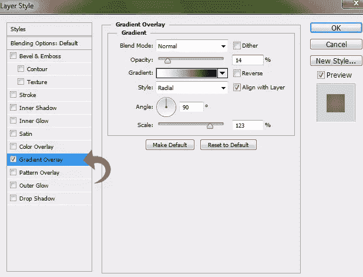](https://www.sitepoint.com/wp-content/uploads/2012/10/Step-62.jpg)

并且，使用下面的设置添加“投影”。

[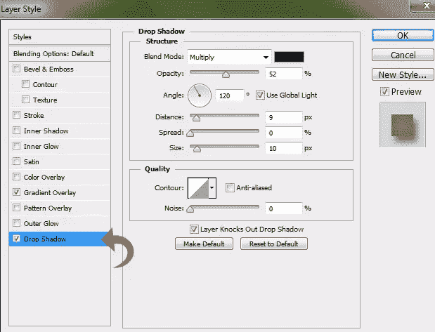](https://www.sitepoint.com/wp-content/uploads/2012/10/Step-6a.jpg)

### 第七步:添加一个重音**角** 

选择钢笔工具，在左上角选择一个区域，然后用#363844 填充。

### 第八步:建立一个阴影

点击“图层”>“图层样式”，添加一个阴影。

[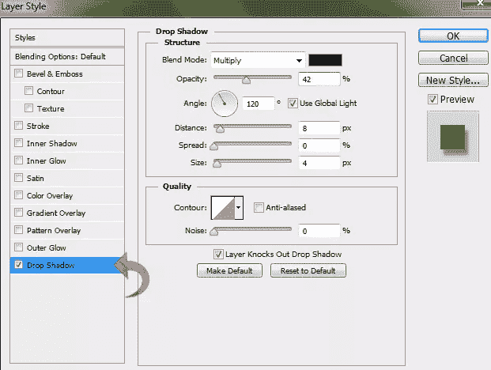](https://www.sitepoint.com/wp-content/uploads/2012/10/Step-82.jpg)

### 第九步:添加明细

选择 Photoshop 的 4px 大小的硬圆笔刷，#ffa87b 作为你的前景色。现在，选择钢笔工具创建一个路径，右键单击它，并选择“笔画路径”

[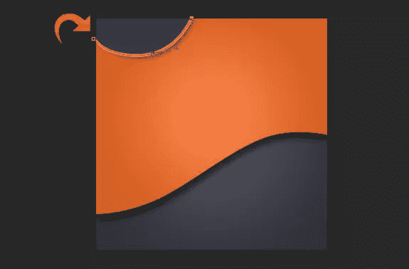](https://www.sitepoint.com/wp-content/uploads/2012/10/Step-92.jpg)

### 第十步:添加造型

再次，使用钢笔工具，这一次用 2px 硬圆刷，颜色#202128。

[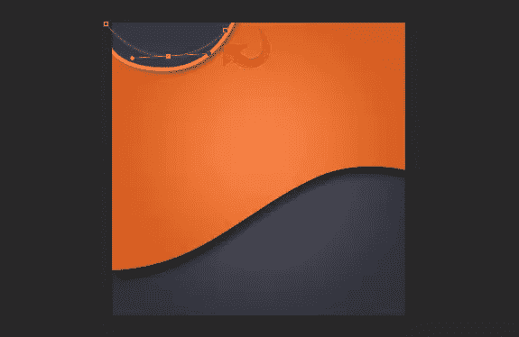](https://www.sitepoint.com/wp-content/uploads/2012/10/Step-101.jpg)

**第十一步:重复** 

重复同样的过程添加更多的线条。

[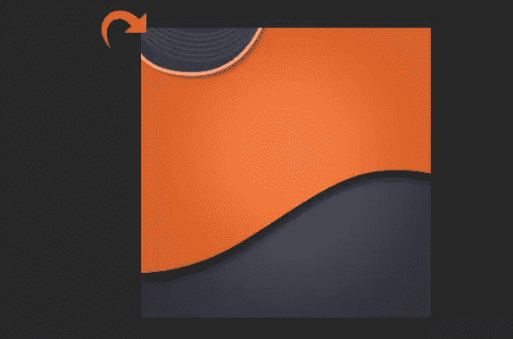](https://www.sitepoint.com/wp-content/uploads/2012/10/Step-112.jpg)

### 第 12 步:复制你的设计

现在添加两个半圆形状和线条，使用步骤 7 到 11 中的相同技术。您可以通过复制层来节省时间，但请确保重新定位和重新定向形状以增加变化。

[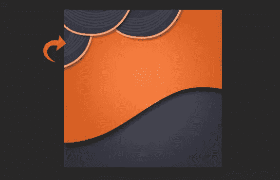](https://www.sitepoint.com/wp-content/uploads/2012/10/Step-122.jpg)

### 第十三步:添加您的消息

现在，我们的背景设计完成了，让我们从广告的文字开始。选择 Photoshop 的文本工具，使用颜色#363844 添加文本。

### 第十四步:添加文字阴影

点击“图层”>“图层样式”>“投影”，用下面的值给你的文本添加一个投影。

[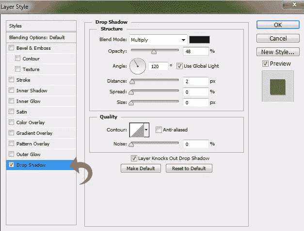](https://www.sitepoint.com/wp-content/uploads/2012/10/Step-142.jpg)

### 第十五步:改变你的文字

使用颜色#ffd6c0 添加更多的文本，并使用上面的设置添加相同的阴影。改变文本颜色会给你的信息增加视觉变化。

### 第十六步:更多文字变化

使用颜色#ee793a 和步骤 14 和 15 中使用的相同阴影添加文本的最后一行。

### 第十七步:**建立一个页脚** 

选择矩形工具，使用颜色#22232a 创建一个小矩形。

### 第 18 步:给你的屁股打上的烙印

现在，使用颜色#ffd6c0 在中间添加文本，并添加阴影。

现在，只需使用 Photoshop 的“保存为 web 格式”操作，我们就完成了。我希望你们喜欢这个教程。欢迎在评论中展示你自己的广告。

## 分享这篇文章