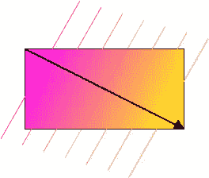
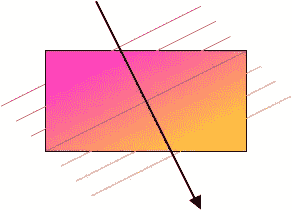
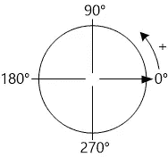
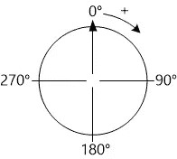
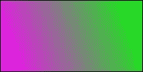
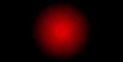

# 在现代浏览器中使用无前缀的 CSS3 渐变

> 原文：<https://www.sitepoint.com/using-unprefixed-css3-gradients-in-modern-browsers/>

像 HTML5 和 CSS3 这样的 Web 标准在不断变化。最重要的变化之一是 W3C 推荐的 CSS 渐变标准 T1，它允许开发者在不使用 T2 厂商前缀 T3 的情况下为现代浏览器如 Internet Explorer 10 编写代码。在本文中，我将带您了解新旧语法和行为之间的一些差异，并对这种变化提供一些见解。希望它能为你节省一些时间，因为你支持许多浏览器。

注意:IE10 仍然支持 2011 年 2 月 17 日 W3C 工作草案中厂商前缀`-ms-`后面的[旧 CSS 渐变语法](https://www.w3.org/TR/2011/WD-css3-images-20110217/#gradients)，所以你当前的代码不会被破坏。

## 主要变化

如果您选择通过从供应商前缀的 CSS3 渐变到无前缀的 CSS3 渐变来简化您的 CSS，需要注意一些关键的语法变化。许多渐变生成器都提供了跨浏览器标记，包括无前缀渐变的标记。在许多情况下，根据覆盖渐变的 W3C 候选推荐标准的 [CSS 图像值，无前缀标记不再有效。以下是你应该知道的变化。](https://www.w3.org/TR/2012/CR-css3-images-20120417/)

### 线性和重复线性渐变

|  | **工作草案** | **候选人推荐** |
| **方向关键词** | `top`、`bottom`、`left`和`right`关键字通过其起点描述渐变线的方向。 | 关键字`top`、`bottom`、`left`和`right`前面的介词`to`通过渐变线的终点描述渐变线的方向。 |
| 例子 | `-ms-linear-gradient(top, orange, black);` | `linear-gradient(to bottom, orange, black);` |
|  |  |  |
| **拐角计算** | Corner 关键字指定从该角到对角绘制的渐变线。 | 拐角关键字以`to`开头，指定从指定象限开始到相反象限结束的渐变线。渐变线的中心点与在其余两个角之间绘制的线相交。 |
| 例子 | `-ms-linear-gradient(top left, fuchsia, yellow);` | `linear-gradient(to bottom right, fuchsia, yellow);` |
|  |  |  |
| **角度方向** | `0deg`是一条指向右边的渐变线。角度沿逆时针方向增加。 | `0deg`是一条指向顶部的渐变线。角度沿顺时针方向增加。使用公式`new = abs(old−450) mod 360`可以将旧角度转换为新角度 |
|  |  |  |
| 例子 | `-ms-linear-gradient(200deg, lime, magenta);` | `linear-gradient(250deg, lime, magenta);` |
|  |  |  |

### 径向梯度和重复径向梯度

|  | **工作草案** | **候选人推荐** |
| **位置** | 位置关键字或长度描述渐变中心的位置。 | 位置关键字或长度以介词`at`开头，用于描述渐变中心的位置。现在，在渐变形状和大小(如果存在)之后指定位置。 |
| 例子 | `-ms-radial-gradient(center, aqua, black);` | `radial-gradient(at center, aqua, black);` |
|  |  |  |
| **尺寸关键词** | 渐变尺寸由六个关键字之一定义:`farthest-corner`、`farthest-side`、`closest-corner`、`closest-side`、`contain`和`cover`。 | 渐变尺寸由四个关键字之一定义:`farthest-corner`、`farthest-side`、`closest-corner`和`closest-side`。`contain`和`cover`不再有效，分别对应`closest-side`和`farthest-corner`。 |
| 例子 | `-ms-radial-gradient(circle cover, lime, black);` | `radial-gradient(circle farthest-corner, lime, black);` |
|  |  |  |
| **大小和形状语法** | 用长度指定的径向坡度必须同时指定水平和垂直半径长度。 | 对于圆，可以仅使用单一半径长度来指定径向渐变。 |
| 例子 | `-ms-radial-gradient(center, 50px 50px, red, black);` | `radial-gradient(circle 50px at center, red, black);` |
|  |  |  |

## 背景

CSS3 渐变在 [CSS 图像值中定义，并被替换为内容模块级别 3 W3C 候选推荐标准](https://www.w3.org/TR/2012/CR-css3-images-20120417/)。渐变在 2009 年首次被添加到规范中。它们基于 WebKit 中引入的[渐变，但是改进了语法。当时 WebKit 有一个针对`-webkit-gradient()`的实现。CSS 工作组迭代了这个特性并改变了它的语法。径向梯度和线性梯度将被指定为单独的属性值，`linear-gradient()`和`radial-gradient()`。几年后，所有主流浏览器——Chrome、Firefox、IE10 Platform Preview 1 和 Opera——都引入了对 CSS 渐变版本的支持，这在 2011 年 2 月 17 日的 W3C 工作草案](http://www.webkit.org/blog/175/introducing-css-gradients/)[中有所描述。](https://www.w3.org/TR/2011/WD-css3-images-20110217/)

当工作草案被仔细审查时，提出了一些修改建议，经过大量讨论后，对规范进行了编辑以反映这些修改。上表中列出的主要变化通过解决清晰性和一致性问题改进了旧规范。例如，在旧的角度坐标系中，正角度以逆时针方式增加。这与 CSS 变换和 SVG 变换相反，在 CSS 变换和 SVG 变换中，正角度旋转以顺时针方式发生。随着规范的更改，描述 CSS 渐变的角度现在与其他 CSS 角度一致，并以顺时针方式增加。

在改变渐变语法的过程中，兼容性是一个公认的问题，尽管规范仍处于工作草案阶段。并非所有情况都兼容，但许多现有内容将继续工作。默认值保持不变，因此它们的渲染也不会改变。对于梯度线方向，所需的`to`介词既增加了清晰度，又改变了有效的语法。使用旧语法的无前缀渐变的现有内容将无效，从而退回到供应商前缀版本。

## 更新您的无前缀渐变

既然 CSS3 渐变已经稳定，我们鼓励您将渐变标记更新为正确的候选推荐无前缀渐变语法。《Internet Explorer 10 开发者指南》包含了无前缀语法的[完整更新文档](http://msdn.microsoft.com/en-us/library/ie/hh673532(v=vs.85).aspx)。你也可以删除前缀为`-ms-`的渐变实例，因为 IE10 支持无前缀版本。如果您使用角落关键字或角度来描述渐变方向，您可能想要验证您的渐变是否仍按预期渲染。

虽然厂商前缀的渐变在 [Internet Explorer 10](http://ietestdrive.com) 和其他现代浏览器中仍然有效，但添加对无前缀渐变的正确支持可以让您的内容经得起未来考验，并帮助您节省时间。

## 分享这篇文章