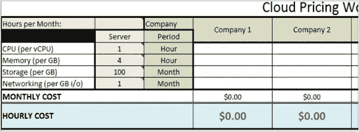
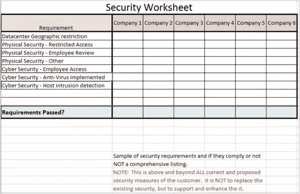

# 实施您自己的 IaaS 解决方案

> 原文：<https://www.sitepoint.com/implimenting-an-iaas-solution/>

## 您的 IaaS:选择提供商

我最近发现需要一个独立于我的固定雇主的个人服务器实验室。我最初想要一台自己的服务器，在那里我可以设置我的虚拟化选择、设置和破坏环境，并且可以进行全方位的操作。然而，在看了成本之后，我认为这太贵了，而且坦率地说，对我的需求来说是不必要的。相反，我可以购买一个云实例，以比任何单个有能力的服务器低得多的成本获得一个更强大、企业级、可扩展的数据中心，并提供全面支持。

确定最佳云解决方案(如果有)的关键在于用例。我的用例是我正在测试的一个预定义的“虚拟设备”。作为一个设备，我所有的需求都是在虚拟机中预定义的；我必须确保供应商能够满足这些要求。在我的使用案例中，这已经定义了 2 个关键要求——1)必须能够加载我的设备，2)必须比购买我自己的服务器便宜。我对专用服务器并不特别感兴趣，因为与共享实例相比，专用服务器的相关成本更高。如果我感兴趣，我会购买一台物理服务器，但如果有意义的话，这是您在自己的部署中应该考虑的选项。在无法使用共享实例，但又不需要本地服务器的情况下，这往往是一个特别有吸引力的选择。另外两种常见的定价模式是合同和随用随付。合同定价是一件简单的事情，供应商就保证最低使用场景达成协议。对于这个最低使用协议，你可能会得到一个很大的价格折扣，而对于超过这个最低使用量的任何东西，你仍然需要支付更少的费用。按使用量付费定价(也称为无合同定价)始终是每小时使用费用最高的路线，但如果不是一直都是这样，到了付费的时候可能还是会更便宜。这定义了我的第 3 个第 1 个要求——按量付费，没有专门的最低价格。

这些关键需求是绝对的交易破坏者，但是还有其他几个问题需要考虑；事实证明，在平等的基础上对供应商进行比较是非常困难的。即使在符合关键要求的提供商中，许多也提供不同级别的支持、功能，当然还有定价。此外，定价方案很困难，因为他们对每个功能的定价完全不同。定价总是基于每单位时间的资源，但他们如何衡量资源和时间范围因供应商而异。

经过长时间的研究，我能够提出一个电子表格来定义供应商成本明细，它足够灵活，可以比较大多数供应商。通过根据网站上列出的因素和应用于每个成本细分的时间段来定义服务器，我能够得出每月的成本，然后除以 730(一个月的大概小时数)，我能够确定一个实例的每小时成本。比较每小时的总成本提供了一个直接的比较。

云计算成本工作表–定价页面

一旦我找到了能够满足需求的供应商，我就开始比较区分供应商的其他因素。当您考虑云供应商时，许多事情都被认为已经解决了，例如安全性和合规性能力，但是您如何衡量它们之间的优劣呢？他们的问题响应和解决 SLA 是什么？违反 SLA 会给我带来什么样的补偿？此外，在他们的环境中设置虚拟机后，它的可移植性如何？如果我想转移到不同的供应商，我可以将虚拟机导出为 OVF 文件吗？所有这些问题和许多其他问题本质上都是定性的。

最后，我为关注的每个方面做了一个简单的图表，并列出了该方面的所有关注点。我发现的一个秘密是，考虑你在这方面的所有问题或顾虑，并列出来。然后看看医疗服务提供者在这方面提供了什么。如果它们匹配，您可以很容易地检查是或否。然而，通常，它们会列出几个我在用例中不关心或者从未考虑过的项目。使用这些扩展您的列表。如果供应商对它们足够关注，可以列出它们，那么您可能至少要考虑它们，并根据它们比较供应商，即使您不使用它们。如果没有别的，它表明了供应商遵守和解决这方面问题的能力和意愿。一旦你有了清单，比较一下你的各个竞争对手，如果他们没有列出一个项目，不要害怕联系他们。

云计算成本工作表–安全性页面

到目前为止，我已经把范围缩小到只有两家竞争厂商。这实际上是几乎等同的服务，所以任何一家供应商都可以。需求得到了满足，关注的问题同样得到了解决，每小时使用的定价不到 1/10 便士的差异，所以我只选择了一个。然而，在未来，我可能会改进我的电子表格，为每一个关注点开发一个加权系统。然后，我会权衡所有不同的方面，尝试客观地确定哪个提供商最适合我的所有需求。

## 设置 IaaS:事后分析

我发现实施我的虚拟设备就像选择提供商一样简单明了。在传统数据中心，我一直认为理所当然的事情对于任何 IaaS 实施都至关重要。即使是我认为重要的事情也会有一些意想不到的惊喜，它们是多么的重要。这让我想到了很多我在真正阅读之前从未考虑过的注意事项。

我一直认为，就其本质而言，网络连接是任何云解决方案的生命线。我没有想到的是，对于这项服务来说，拥有像样的上传速度有多么重要。大多数消费级和 SMB ISP 都提供异步连接，这是下载的重中之重。这个问题是云服务是一个虚拟数据中心。数据中心和最终用户之间的带宽使用比普通的最终用户 ISP 通常提供的要平衡得多。不要误解我的意思，你不需要相同的上行和下行速度，但你确实需要比你通常只收发电子邮件和网上冲浪所需的速度高得多的上传速度。例如，威瑞森 FiOS 公司可能会提供适当的上行带宽支持，但我的本地 DSL 提供商的消费级接入却不能。

另一个网络问题是云数据中心本身的网络连接。这一网络部分是一个相当不透明的领域，经常被掩饰为“10Gb 连接”，甚至经常不被披露。事实上，我认为这在很多情况下是不相关的，但是这是值得考虑的。这是我在 LinkedIn 上看到的一篇比较 Zunicore 和 Amazon EC2 内部网络性能的文章。我不会透露细节；我宁愿让你来决定。

我发现的另一个奇怪之处是 CPU 的大小。大多数提供商提供简单数量的 CPU，但也有一些提供商提供更细粒度的 CPU，让您也可以考虑 CPU 的大小。我从来没有真正想过这种节流是计量的，但我们内部一直在这样做，以回收浪费的处理器时间，为什么不是云提供商呢？我能想到的供应商不向客户提供这种服务的原因有两个:1)大多数供应商提前提供服务器，并且只出售那些事后可能调整或不调整的映像(或层)。2)提供商限制允许的 CPU 使用量，以保证其他机器的时间和预测增长需求。可能还有其他原因，但如果你想像在内部一样拥有这种粒度控制，请注意，并预先将它作为你需求的一部分。考虑到这些小问题，我真的很惊讶，内存大小或存储没有任何问题值得注意。它们都是实际使用的简单单位成本。

我最后一个大惊喜也是我最大的一个需求——OVF 进口。我不能在云上安装任何操作系统，因为应用程序无法安装。然而，上传 OVF 是一件非常头疼的事情。该提供商承认，OVF 上传容易失败，而且都不太可靠。他们建议的解决方法是旋转他们的一个可用映像，构建一个 FTP 服务器，将其放入我的虚拟数据中心，然后使用 OVF 上传来安装它。这是一个笨拙的解决办法，但它的工作。如果 OVF 上传对你来说很重要，请确保你有一个快速、稳定的连接到你的云提供商。或者，您可以将它上传到文件服务器或 http 服务器，在那里可以从云服务中实现的机器上下载它。另请注意，如果您有特别大量的数据和/或 OVF 文件，许多提供商提供一项服务，您可以向他们发送包含压缩文件的物理介质，以便将它们放在他们的网络上。如果您对此感兴趣，请在购买前与提供商讨论。

这些都不是特别难，但是很费时间。你有什么经历？我错过了什么？您是如何处理采购或实施云计算的问题的？下面让我知道。

## 分享这篇文章