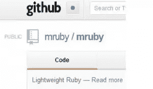

# 试试今天的卢比

> 原文：<https://www.sitepoint.com/try-mruby-today/>

Ruby 主宰着网络:运行着 Github、Heroku 和 Living Social 等热门网站。但是为什么网络开发者应该享受所有的乐趣呢？如果游戏开发人员、嵌入式系统工程师或其他任何人都可以在他们的 C 程序中使用 Ruby 的漂亮语法，那不是很好吗？幸运的是，这正是 mruby 打算做的。

Matz 的最新 Ruby 实现希望通过变小变大。mruby 的目标是在任何设备上运行，同时保持超小的占用空间。这是一个非常雄心勃勃的愿望，因为运行一个常规的 ruby (MRI/cRuby)进程可能会占用 20mb 或更多的内存。所以 mruby 听起来很有趣，但是我们怎样才能让它达到我们可以破解它的程度呢？

跟随我们从源代码编译 mruby，并让它在您的计算机上运行。在运行 mruby 之前，我们需要下载源代码并编译一个二进制文件，但是什么是二进制文件呢？

## 什么是二进制？

二进制文件是任何不是文本文件的文件。非常简单，但是我们关心一种特定的二进制文件。这些是全功能程序，不需要安装程序，可以直接由您的计算机运行。现在你的计算机上已经有不少这样的二进制文件了，但是你可能从来没有这样想过。如果您的系统上安装了 ruby，那么它是一个二进制文件。您可以运行命令`which ruby`来获取二进制文件的位置。