# 在 Photoshop 中创建一个 DVD 模型

> 原文：<https://www.sitepoint.com/create-a-dvd-mock-up-in-photoshop/>

模型对每个网页和平面设计师来说都是至关重要的。他们在说服客户、进行销售以及赋予数字商品和其他无形媒体以有形的感觉方面发挥着关键作用。买家总是在寻找价值，虽然这听起来可能微不足道，但顾客总是想要一些触觉上的东西来回报他们的血汗钱。在销售软件或在线营销其他媒体形式时，向你的潜在客户展示一张物理磁盘会有惊人的说服力。

因此，在本教程中，我们将学习如何从头开始在 Photoshop 中创建一个 DVD 模型。我们将使用不同的形状工具、钢笔工具、混合选项和图层样式来设计 DVD 的两面。我们开始吧！

**资源:**

[DVD 刷](http://altereg0.deviantart.com/art/DVD-Resource-Brushes-19588112)

在我们开始之前，让我们先看看我们的最终结果:

[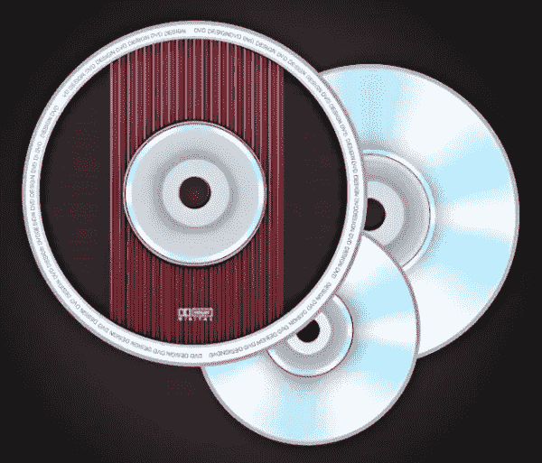](https://www.sitepoint.com/wp-content/uploads/2012/10/Finals.jpg)

### 第一步

打开 Photoshop，新建一个宽 800 像素、高 700 像素的文件。

[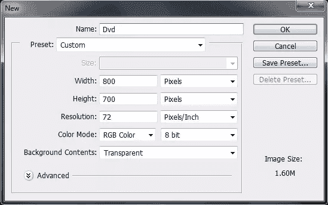](https://www.sitepoint.com/wp-content/uploads/2012/10/Step-11.jpg)

### 第二步

创建一个新的背景层，填充一个基本的渐变。

[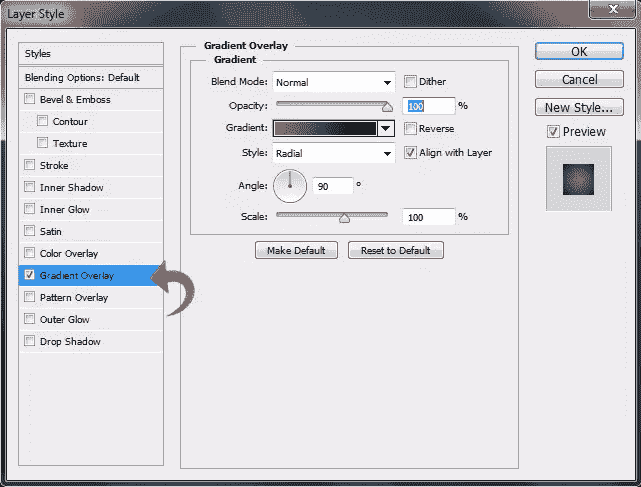](https://www.sitepoint.com/wp-content/uploads/2012/10/Step-2.jpg)

### 第三步

现在，我们将从 DVD 的亮面开始。所以选择椭圆工具，用纯白创建一个圆。

[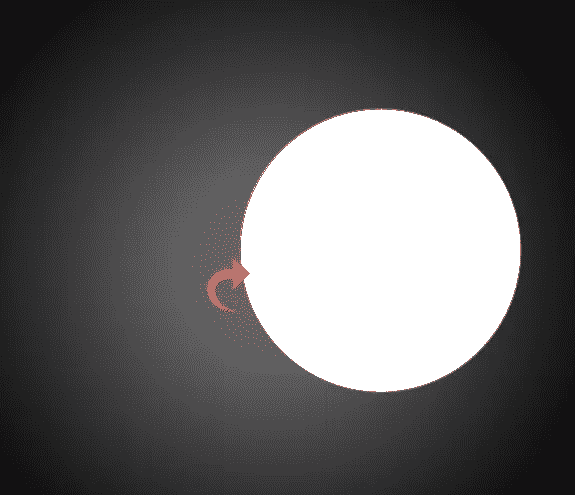](https://www.sitepoint.com/wp-content/uploads/2012/10/Step-3.jpg)

### 第四步

点击“图层”>“图层样式”>“描边”，使用#acacac 颜色添加一个 6 像素的描边。

[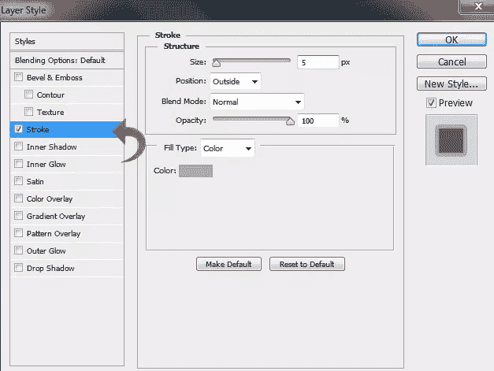](https://www.sitepoint.com/wp-content/uploads/2012/10/Step-4.jpg)

### 第五步

现在点击“渐变叠加”，选择“角度”作为渐变的样式。

[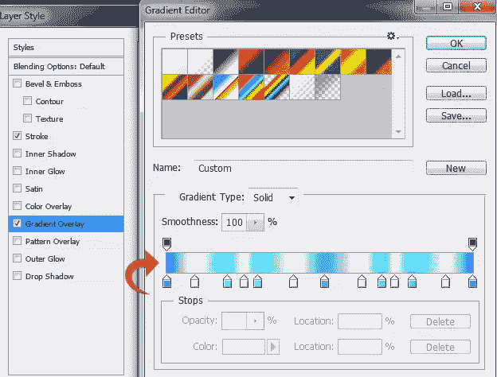](https://www.sitepoint.com/wp-content/uploads/2012/10/Step-5.jpg)

### 第六步

用颜色#e1e1e1 再画一个小圆，放在中间。

[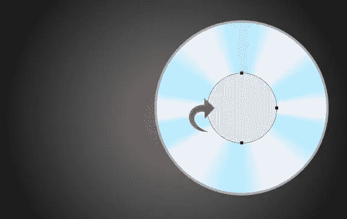](https://www.sitepoint.com/wp-content/uploads/2012/10/Step-6.jpg)

### 第七步

点击“图层样式”,使用下面的设置添加一个笔触和阴影。

[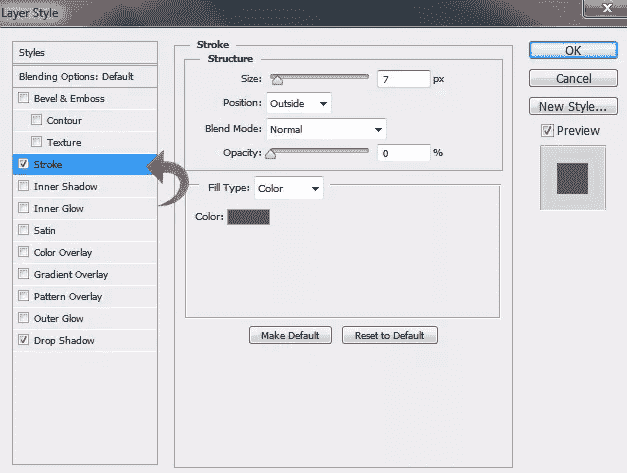](https://www.sitepoint.com/wp-content/uploads/2012/10/Step-7a.jpg)

[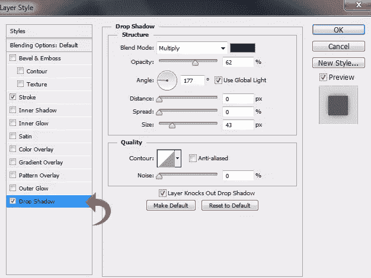](https://www.sitepoint.com/wp-content/uploads/2012/10/Step-7b.jpg)

### 第八步

使用椭圆工具创建另一个同样大小的圆，填充颜色#c9d0d9。

[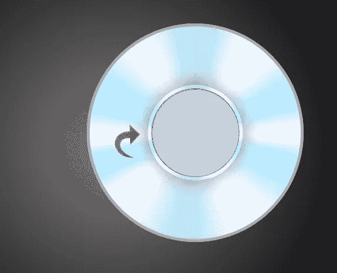](https://www.sitepoint.com/wp-content/uploads/2012/10/Step-8.jpg)

### 第九步

现在，使用下面的笔画设置给这个新的圆添加一个笔画。

[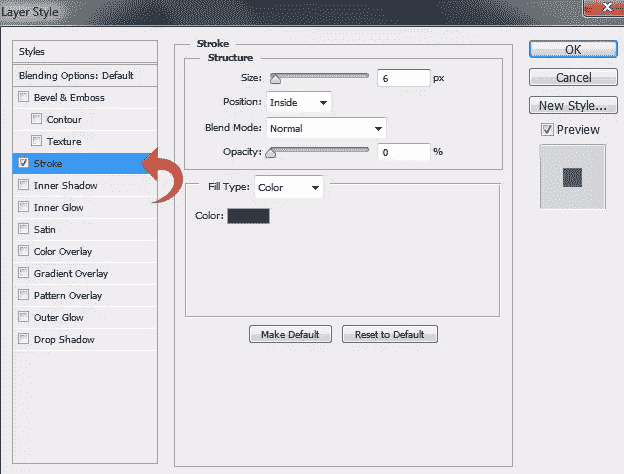](https://www.sitepoint.com/wp-content/uploads/2012/10/Step-9.jpg)

### 第十步

创建另一个圆，填充颜色#d4dae2。然后，点击“图层样式”，添加另一个笔画和阴影。

[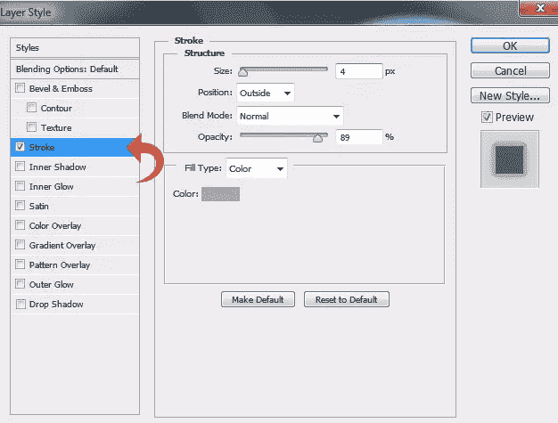](https://www.sitepoint.com/wp-content/uploads/2012/10/Step-10a.jpg)

[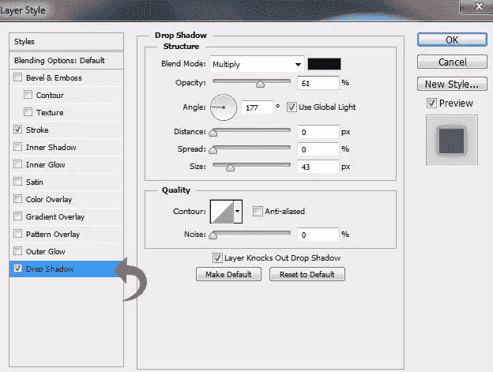](https://www.sitepoint.com/wp-content/uploads/2012/10/Step-10b.jpg)

### 步骤 11

选择橡皮擦工具，并在中心使用它来创建 DVD 的中心孔。然后，选择一个硬圆刷在边缘使用它来创建一点深度，保持前景色为#242424。

[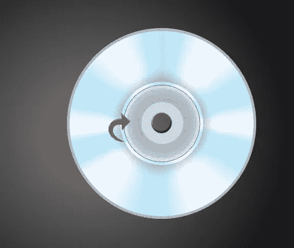](https://www.sitepoint.com/wp-content/uploads/2012/10/Step-111.jpg)

### 步骤 12

现在，让我们从 DVD 的顶部开始。首先，创建一个圆圈，填充纯白色。

[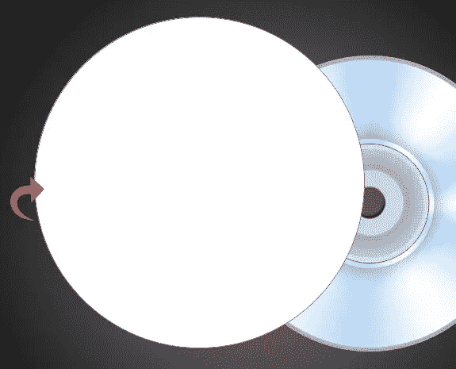](https://www.sitepoint.com/wp-content/uploads/2012/10/Step-12.jpg)

### 第十三步

点击“图层样式”,用下面的值添加一个笔画。

[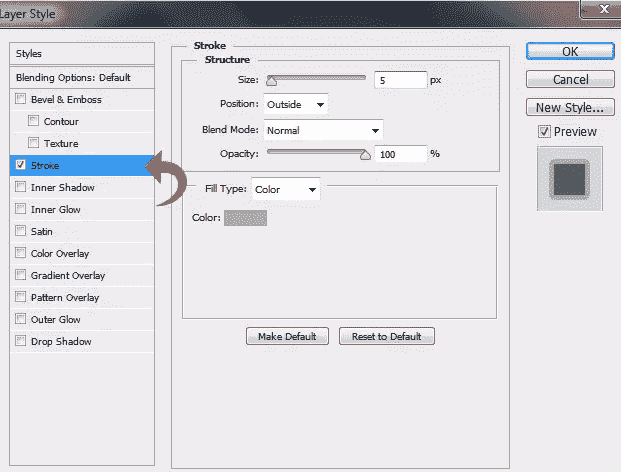](https://www.sitepoint.com/wp-content/uploads/2012/10/Step-13.jpg)

### 步骤 14

现在，用和上面一样的方法创建中心区域。第二圈不加笔画就行。

[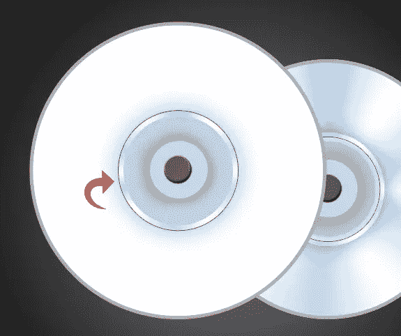](https://www.sitepoint.com/wp-content/uploads/2012/10/Step-14.jpg)

### 第十五步

选择椭圆工具，并将工具模式更改为“路径”然后，在靠近边缘的白色区域内创建一个圆。

[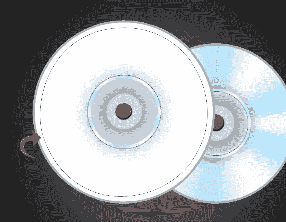](https://www.sitepoint.com/wp-content/uploads/2012/10/Step-15.jpg)

### 第十六步

现在，选择文本工具并在路径上添加文本。

[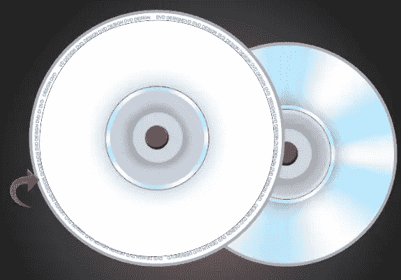](https://www.sitepoint.com/wp-content/uploads/2012/10/Step-16.jpg)

### 步骤 17

选择椭圆选框工具，在中间创建一个圆，填充颜色#302c2b。使用中间的橡皮擦工具。

[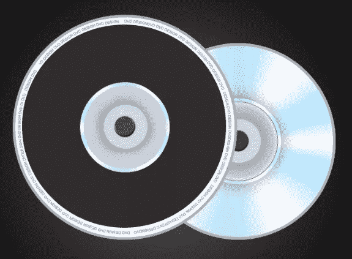](https://www.sitepoint.com/wp-content/uploads/2012/10/Step-17.jpg)

### 步骤 18

点击“图层样式”,使用下面的设置添加一个笔触和一个内部发光。

[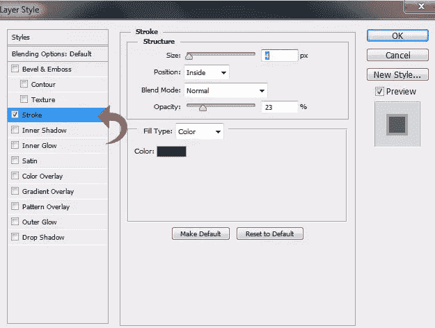](https://www.sitepoint.com/wp-content/uploads/2012/10/Step-18a.jpg)

[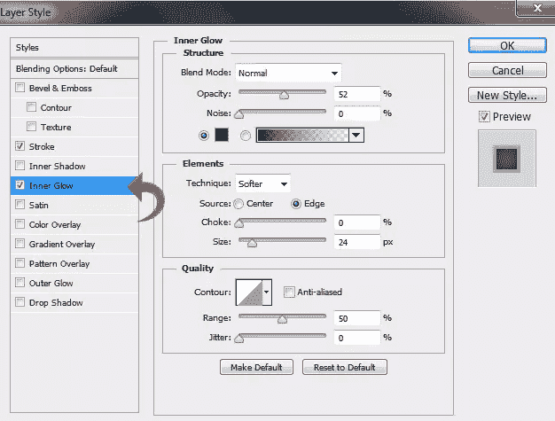](https://www.sitepoint.com/wp-content/uploads/2012/10/Step-18b.jpg)

### 步骤 19

选择线条工具，权重为 3px，使用颜色#ab203e 和#951a20 创建一些直线。为了清楚起见，请看下面。

[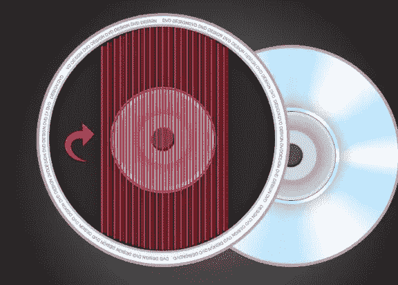](https://www.sitepoint.com/wp-content/uploads/2012/10/Step-19.jpg)

### 步骤 20

使用中间的橡皮擦工具，用下面的值添加一个渐变。

[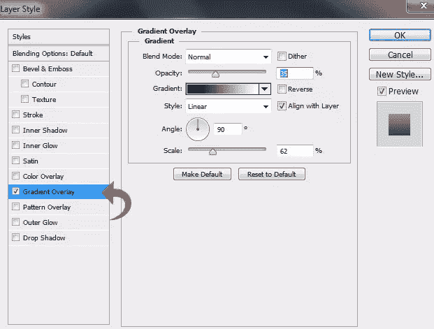](https://www.sitepoint.com/wp-content/uploads/2012/10/Step-20.jpg)

### 步骤 21

现在，创建一个新层，选择一些我上面提到的 DVD 笔刷。如果你愿意的话，你可以在最终结果中增加一些 DVD。

[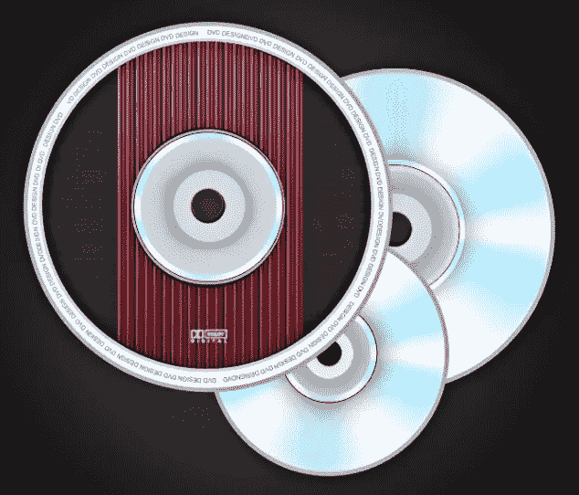](https://www.sitepoint.com/wp-content/uploads/2012/10/Final1.jpg)

我们完了！我们的 DVD 模型准备好了。我希望你们喜欢它，并发现它很有用。

## 分享这篇文章