# 用 Canvas 和 SVG 构建 HTML5 游戏的完整指南

> 原文：<https://www.sitepoint.com/the-complete-guide-to-building-html5-games-with-canvas-and-svg/>

我目前花了大部分时间向学生、业余爱好者、专业开发人员和教师解释如何使用 HTML5 构建游戏。然后，我最近想，与其把这些细节都留给小观众，不如和大家分享一下，岂不是更聪明？

这篇文章是基于我自己的经历。我可能会省略一些你们可能知道的重要事情。但是我会尝试用我自己的新发现来更新这篇文章，当然，是基于你在评论中或通过 [Twitter](http://twitter.com/davrous) 提供的反馈。

## 但是为什么现在这么多人对 HTML5 游戏感兴趣呢？

嗯，仅仅是因为今天我们可以*真正*使用 HTML5 针对**多平台**使用相同的代码:对于**台式机**当然(使用 IE9/IE10、Firefox、Chrome、Opera 和 Safari)，对于 iOS 和 Android **平板电脑**和**手机**和 **Windows 8** (以及其未来关联的数百万台平板电脑和个人电脑，也热烈欢迎 HTML5 游戏！然后，我经常看到一些 HTML5 游戏项目毫不费力地移植到这些平台上。

此外，现代 JavaScript 引擎的性能与 GPU 硬件加速图形层相结合，使我们能够满怀信心地在 HTML5 中构建出色的游戏。

**注:** 本文我们只讲 HTML5 的`<canvas>`标签和关于 SVG。

## Canvas 和 SVG:在屏幕上绘图的两种方式

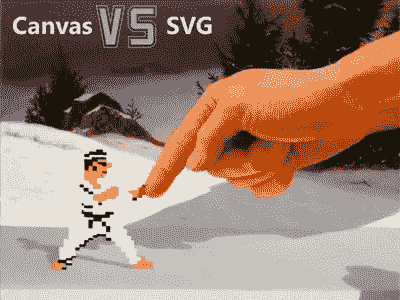

在构建你的第一个 HTML5 游戏之前，你需要理解的第一件事是如何在屏幕上绘制漂亮的对象。有两种方法可以做到这一点，为了更好地理解它们的区别，您应该从阅读 Patrick Dengler(SVG W3C 工作组成员)的这篇文章开始:[关于何时使用 Canvas 和 SVG 的想法](http://blogs.msdn.com/b/ie/archive/2011/04/22/thoughts-on-when-to-use-canvas-and-svg.aspx)。

你也应该看看 MIX11 的这两个精彩片段:

–[使您的网站现代化:SVG 遇到 html 5](http://channel9.msdn.com/Events/MIX/MIX11/HTM15)
–[深入探究 HTML5 <画布>](http://channel9.msdn.com/Events/MIX/MIX11/HTM03)

一旦你回顾了所有这些内容，你可能会更好地理解为什么几乎所有的 HTML5 游戏都使用 Canvas 而不是 SVG。Canvas 为游戏开发者提供了一个众所周知的开发模型(低级绘图 API ),并且现在被大多数最新的浏览器很好地硬件加速了。不过，SVG 及其基于向量的技术自然更适合跨设备扩展而不损失质量。您只需要使用 SVG 的 magic ViewBox 属性，它会为您处理这个问题。你的游戏资产将会以一种非常简单的方式从 3 英寸扩展到 80 英寸。

有时，使用这两种技术甚至可以实现完全相同的游戏。例如，这是一个同样简单的游戏，首先使用 SVG，然后使用 Canvas: [SVG 球拍](https://david.blob.core.windows.net/html5graphics/010_SimpleGame_SVGVersion.htm)和 [Canvas 球拍](https://david.blob.core.windows.net/html5graphics/009_SimpleGame_CanvasVersion.htm)。他们都来自这个 MSDN 文档:[使用 Canvas 或 SVG](http://msdn.microsoft.com/en-us/library/gg589521(v=VS.85).aspx) 编程简单的游戏。

在这种情况下，分析每种技术的性能可以帮助您决定在游戏中使用哪种技术。例如，这里有两个有趣的实验，使用 SVG 在屏幕上显示一千个小球: [1000 个球在 SVG 中](http://themaninblue.com/experiment/AnimationBenchmark/svg/?particles=1000)，使用 Canvas: [1000 个球在 Canvas 中](http://themaninblue.com/experiment/AnimationBenchmark/canvas/?particles=1000)。在你最喜欢的浏览器中测试这两个实验。一般来说，在这种特殊情况下，画布性能更适合在屏幕上绘制大量对象。但这通常也是我们希望在视频游戏中实现的。为了更好地了解性能比较，下面是一个有趣的图表:

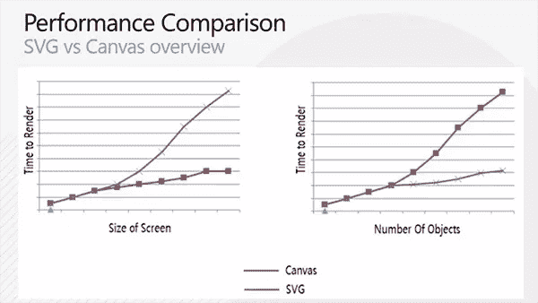

但是没有什么能阻止你混合这两种技术。事实上，我们完全可以想象使用基于 SVG 的第一层来显示游戏菜单，第二层在背景中使用游戏本身的画布。然后你将使用我们称之为浏览器合成引擎。但是，您必须真正关注最终的性能结果，因为在这个领域中，浏览器和设备远非平等。别忘了 HTML5 的主要兴趣是针对所有平台。

几个月前，我的同事大卫·卡图赫用这种合成原理创作了一个小的砖块粉碎游戏:[如何用 HTML5 和 JavaScript 编写一个小游戏——BrikBrok](http://blogs.msdn.com/b/eternalcoding/archive/2011/09/06/write-a-small-game-using-html5-and-javascript-brikbrok.aspx)。第一层使用 SVG 使砖块断裂，背景可以使用 canvas 标签显示隧道效果。你可以完美地模仿这个概念，在后台显示主游戏(托管一个平台或者射击游戏，等等)。)而不是隧道，您的第一层将简单地显示 SVG 中的菜单和配置选项。

## 有用的库和工具

### 制图法

手动编写 SVG 的 XML 节点，甚至是玩 Canvas 的低级 API，可能一时很有趣，但效率不高。这里有一套我喜欢的有用的工具和库，可以帮助你构建 HTML5 游戏的一部分。

为了**生成一些 SVG** ，这里有一些**酷工具**:

–[InkScape](http://inkscape.org/):一款免费开源的桌面软件
–[SVG 编辑器](http://svg-edit.googlecode.com/svn-history/r1771/trunk/editor/svg-editor.html):一款直接在你的浏览器中运行的在线软件

Adobe Illustrator 也支持将 SVG 作为导出目标，但是它有点贵。；-)

如果你正在寻找你的游戏资产(菜单或控件)，你应该看看这个**免费图标库** : [名词项目](http://thenounproject.com/)。所以，如果你没有足够的运气和设计师一起工作，它可以拯救你。这里还有另一个包含一些免费 SVG 内容的库:[打开剪贴画库](http://openclipart.org/)。

总结一下 SVG，**您必须知道的最终库**名为[拉斐尔伊斯](http://raphaeljs.com/)。这是一个 JavaScript 库，它将帮助您用几行代码生成动态 SVG。你会在网站上找到很多很酷的演示，比如 SVG 元素的非线性动画功能，动画图表等等。但是如果你专门寻找**图表**(比如显示一些玩家的统计数据)，最终的图表库被命名为 [HighCharts](http://www.highcharts.com/) 。这两个库太棒了，它们甚至为 IE8 或更老的版本实现了 VML 回退。但是如果你正在开发 HTML5 游戏，这不应该是一件需要担心的事情。你的目标可能至少是 IE9 及以上。

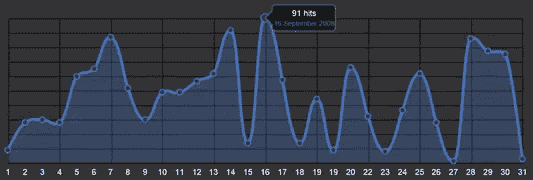

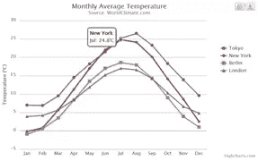

如果你想用画布显示图表，我是 T2 JavaScript InfoVis 工具包库的忠实粉丝。看看他们网站上的演示就知道了，简直棒极了，而且简单易用。

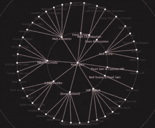

让我们继续图形方面。有一个非常著名的库，名为 [ThreeJS](https://github.com/mrdoob/three.js/) ，用来简化 JavaScript 中 3D 的使用。大部分时候是用来通过 WebGL 渲染一些硬件加速的 3D。但是你可以要求在 HTML5 的 2D 画布元素中进行渲染。为此，只需查看网站的“CanvasRenderer 示例”部分。这是我们已经使用的库，例如，在 [IE 测试驱动](http://ie.microsoft.com/testdrive/)上构建我们的[银河演示](http://ie.microsoft.com/testdrive/Performance/Galactic/Default.html)。使用“CanvasRenderer ”,您可以构建在所有 HTML5 浏览器中工作的 3D 场景。一些值得知道的事情。

**注意:** 我们还可以将所有这些图形效果与 CSS3 2D 和 3D 变换的使用结合起来，再加上游戏中的[过渡](http://blogs.msdn.com/b/eternalcoding/archive/2011/11/01/css3-transitions.aspx)或[动画](http://blogs.msdn.com/b/davrous/archive/2011/12/06/introduction-to-css3-animations.aspx)。但是我决定在本文中继续关注 Canvas 和 SVG。

### 物理引擎

当然，显示图形远不是你在游戏中需要做的唯一任务。还有你需要编码的 AI(人工智能)给你的角色带来生命。不幸的是，您需要独自编写代码并发挥创造力。但是你会很高兴知道你不需要担心游戏中的物理和碰撞部分。简单的学习如何使用 [Box2D JS](http://box2d-js.sourceforge.net/) 。去玩各种各样的样品吧，你会惊奇地发现:

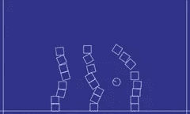

如果你对这个话题感兴趣，那么你应该在这里阅读由 [Seth Ladd](https://plus.google.com/118397406534237711570) 撰写的优秀教程系列:[面向 JavaScript 开发者的 Box2D】。Seth 甚至使用网络工作者在你的 CPU 的几个可用核心上计算物理。如果你不知道什么是 Web Workers，我在这里写了关于这些新 API 的介绍:](http://blog.sethladd.com/2011/08/box2d-orientation-for-javascript.html)[html 5 Web Workers 简介:JavaScript 多线程方法](http://blogs.msdn.com/b/davrous/archive/2011/07/15/introduction-to-the-html5-web-workers-the-javascript-multithreading-approach.aspx)。这在你的游戏的某些场景中可能会有用。

## 处理多点触摸事件

如果你想开发一个跨设备的游戏，你必须支持触摸。目前，有两个关于触摸事件的现有规范。所以现在还没有官方的标准。如果你想知道更多的原因，这里有一篇有趣的文章:[对专利越来越敏感](http://blog.jquery.com/2012/04/10/getting-touchy-about-patents/)

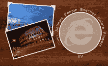

你将需要编写在 IE10 和 Windows 8 中运行良好的代码，以及来自苹果设备的实现。为此，你一定要看看这个示例，它展示了一种支持两种触摸事件的可能模式:[手指绘画](http://ie.microsoft.com/testdrive/ieblog/2011/oct/fingerpainting.html)及其相关文章:[在所有浏览器中处理多点触摸和鼠标输入](http://blogs.msdn.com/b/ie/archive/2011/10/19/handling-multi-touch-and-mouse-input-in-all-browsers.aspx "http://blogs.msdn.com/b/ie/archive/2011/10/19/handling-multi-touch-and-mouse-input-in-all-browsers.aspx")。但是，如果你有兴趣测试 IE10 内部处理多点触摸的能力，请测试这个很酷的演示:[浏览器 Surface](http://ie.microsoft.com/testdrive/Browser/BrowserSurface/) 。你需要一个最新的 IE10 版本和运行它的多点触控硬件。

Boris Smus 已经开始为他的部分工作，创建一个名为 [Pointer.js](https://github.com/borismus/pointer.js) 的库。这个想法是整合所有类型的触摸(IE10，iOS like，鼠标和笔)来简化您的开发人员生活。你可以在这里阅读他的文章:[跨设备网络上的广义输入](http://smus.com/mouse-touch-pointer/)。目前，该库只是一个草案，还不支持 IE10 的 MSPointer*。所以，请随时参与这个项目来帮助他！(我已经计划在我有空闲时间的时候试着帮助他)

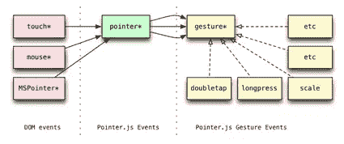

## 构建互联游戏

如果你想构建多人游戏或者仅仅是一个连接到服务器的游戏，你自然会对使用 [WebSockets](http://ie.microsoft.com/testdrive/HTML5/WebSocketsFlipbook/Default.html) 感兴趣。这个 W3C 规范(以及 IETF 处理的底层协议)确实足够稳定，可以开始用于生产。

但是如果你想支持尽可能多的用户，你需要考虑为那些还不支持 WebSockets 或者支持旧版本的浏览器或设备提供后备。我们可能会想到这样的解决方案，比如为 IE9 这样的浏览器自动退回到旧的池或长池方法，并为 IE10 这样的新浏览器提供 Web 套接字。是的，有没有可能有一个独特的代码来处理呢？

好了，别做梦了:社区成功了。我知道有两种解决方法:

–[插座。在 IIS 和 ASP.NET 之上工作的 node . js
–](https://github.com/learnboost/socket.io/)[SignalR](http://signalr.net/)的 IO 库

这两个库将帮助您处理所有支持不同级别的浏览器和设备。

**一些游戏框架**

要构建一个 2D HTML5 游戏，有几件事你需要关心:

1-**处理你的精灵**:将它们分割成一个序列，制作动画，效果等等。
2—**处理你的声音和音乐**(这在 HTML5 中并不总是容易的！)
3—**通过专用加载器/资产管理器
从 web 服务器异步加载您的资产**4—构建一个**碰撞引擎**，为您的游戏对象构建一个高级逻辑，等等。

好吧，你可以从头开始做，或者你可以测试和回顾其他优秀的开发者已经在网上做了什么。我肯定会建议你选择第二个选项，因为 JS 游戏框架开始真正成熟，并在游戏生产中得到测试。

因为网络上有大量的 JS 游戏框架(嗯，有大量的*任何东西*)。以下是在所有浏览器中构建 HTML5 2D 游戏的最著名的框架:

–[melon js](http://www.melonjs.org/):一个公开了许多有用服务的免费框架。它最大的优点是可以和[平铺地图编辑器](http://www.mapeditor.org/)工具配合使用。
–[CraftyJS](http://craftyjs.com/)可惜我不是很了解
–[impact js](http://impactjs.com/):一个高质量的知名框架。它不是免费的，但也不太贵。
–[EaselJS](http://www.createjs.com/#!/EaselJS):我最喜欢的一个！一个老 Flash 开发者写的。所以如果你已经用 Flash 写了一些游戏，你应该对这个框架很熟悉。它是 CreateJS 套件的一部分。它非常完整，有据可查，而且…免费。

所以，你现在应该被警告了。由于 EaselJS 是我最了解的框架，所以我不会不偏不倚。由你来测试其他人并形成你自己的观点。

## 一些初学者教程

好吧，作为一个纯粹的自大狂，让我从分享我自己的教程开始。一年前，多亏了 EaselJS，我有幸将一款 XNA C#游戏移植到 HTML5/JavaScript 中。于是我决定写三篇初始教程来分享这种体验:

–[html 5 游戏:用 EaselJS](http://blogs.msdn.com/b/davrous/archive/2012/03/16/html5-gaming-animating-sprites-in-canvas-with-easeljs.aspx "http://blogs.msdn.com/b/davrous/archive/2012/03/16/html5-gaming-animating-sprites-in-canvas-with-easeljs.aspx")T2 在画布上制作精灵动画—[html 5 游戏:用 EaselJS](http://blogs.msdn.com/b/davrous/archive/2012/03/19/html5-gaming-building-the-core-objects-amp-handling-collisions-with-easeljs.aspx "http://blogs.msdn.com/b/davrous/archive/2012/03/19/html5-gaming-building-the-core-objects-amp-handling-collisions-with-easeljs.aspx")T5—[html 5 平台构建核心对象并处理碰撞:将 XNA 游戏完全移植到 EaselJS](http://blogs.msdn.com/b/davrous/archive/2012/03/21/html5-platformer-the-complete-port-of-the-xna-game-to-lt-canvas-gt-with-easeljs.aspx "http://blogs.msdn.com/b/davrous/archive/2012/03/21/html5-platformer-the-complete-port-of-the-xna-game-to-lt-canvas-gt-with-easeljs.aspx") 画布上

几个月后，我添加了另外三篇文章来增强/扩展这个游戏:

–[教程:如何借助 PhoneGap 在 Windows Phone 上创建 HTML5 应用程序](http://blogs.msdn.com/b/davrous/archive/2011/12/23/tutorial-how-to-create-html5-applications-on-windows-phone-thanks-to-phonegap.aspx)我将向您展示如何借助 PhoneGap/Cordova 在 Windows Phone 上移植相同的游戏。但你将能够在你的 Android 或 iOS 设备上遵循同样的指令。
–[使您的 HTML5 画布游戏现代化第 1 部分:硬件缩放和 CSS3](http://blogs.msdn.com/b/davrous/archive/2012/04/06/modernizing-your-html5-canvas-games-with-offline-apis-file-apis-css3-amp-hardware-scaling.aspx) ，我们将使用 CSS3 3D 变换、过渡和网格布局来增强游戏体验
–[使您的 HTML5 画布游戏现代化第 2 部分:离线 API、拖放和文件 API](http://blogs.msdn.com/b/davrous/archive/2012/04/17/modernizing-your-html5-canvas-games-part-2-offline-api-drag-n-drop-amp-file-api.aspx) ，我们将支持在离线模式下玩游戏。你甚至可以创建自己的关卡，并直接拖放到游戏中。

在跟随他们之后，你将建立这个游戏:

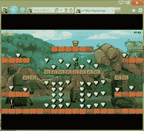

嗯，从逻辑上来说，感谢这六个教程，你应该能够编写自己的 HTML5 游戏，无论你的目标是什么浏览器或设备。

你还会在 EaselJS 网站:[http://www.createjs.com/#!/EaselJS](http://www.createjs.com/#!/EaselJS)以及上面提到的每个框架的网站上找到很多简单易懂的演示和很棒的教程。

您还可以在这些网站上找到更多通用教程:

–[HTML5 游戏开发教程](http://www.html5gamedevelopment.org/html5-game-tutorials "http://www.html5gamedevelopment.org/html5-game-tutorials")
–[10 款超酷的 html 5 游戏以及如何创建自己的游戏](http://www.designer-daily.com/10-cool-html5-games-and-how-to-create-your-own-23820 "http://www.designer-daily.com/10-cool-html5-games-and-how-to-create-your-own-23820")

最后，我想给你推荐两篇更“高级”的文章，但读起来很有启发性。第一篇是微软的 David Catuhe 写的:[释放游戏用 HTML 5 Canvas 的力量](http://blogs.msdn.com/b/eternalcoding/archive/2012/03/22/unleash-the-power-of-html-5-canvas-for-gaming-part-1.aspx)。他会和你分享一些他在做“演示”时发现的优化，就像我们在“演示场景”中写的一样。找到的提示可以为你自己的 HTML5 游戏带来一些想法。第二篇是由谷歌的 [**鲍里斯·斯穆斯**](http://www.html5rocks.com/profiles/#smus) 写的:[提高 HTML5 画布性能](http://www.html5rocks.com/en/tutorials/canvas/performance/)，它包含了大量的好建议。

**一些有趣的在线工作游戏和经验反馈**

再说一遍，这是我个人的最爱。你可能会在网上找到其他很酷的例子来分享。无论你喜欢什么样的游戏，分析一下开发者是如何制作出来的都很有趣。多亏了网络的魔力，你只需要右键点击“查看源代码”。即使代码可能会被精简，你仍然可以通过观察游戏的全局架构学到一些有趣的东西。

让我们从一些使用 EaselJS 框架的作品开始。第一本是[格兰特·斯金纳](https://twitter.com/#!/gskinner)写的[海盗爱雏菊](http://www.pirateslovedaisies.com/):

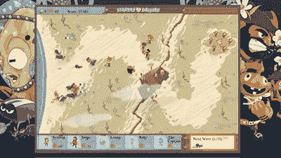

Grant 在构建这个 HTML5 游戏时已经开始了他的 EaselJS 框架。

**Windows 8 注意:** 你会注意到你会在这里的 Windows 商店里找到在 Windows 8 中运行的完全相同的游戏:[海盗喜欢 Windows 8 的雏菊](http://apps.microsoft.com/webpdp/en-us/app/pirates-love-daisies/a357342e-7444-4516-b0fe-29ad13b8ee0c)。事实上，如果你有一个在 IE9 或 IE10 中运行良好的 HTML5 游戏，构建 Windows 8 版本几乎只是简单的复制和粘贴！该游戏将直接在 Windows 8 应用程序体验中运行。但要制作一款真正优秀的 Windows 8 游戏，你还必须关注我们正在打造的独特的 Windows 8 体验。这是在这里描述的:[为 Windows 设计伟大的游戏](http://msdn.microsoft.com/library/windows/apps/hh868271/)

另一个使用 EaselJS 的游戏是 [BKOM 机器人游戏](http://www.bkom.com/robotgame/)，它使用了我喜欢的 3D 精灵:

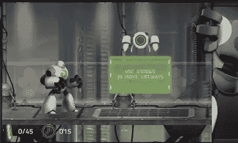

目前最著名的两个 HTML5 游戏当然是[愤怒的小鸟](http://chrome.angrybirds.com/)(它使用了我上面提到的 Box2D 库):

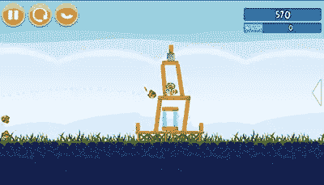

然后[割断绳子](https://www.crazygames.com/game/cut-the-rope):

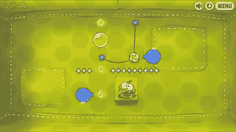

你也可以在 Windows 商店找到它的 Windows 8 版本:[割断 Windows 8 的绳子](http://apps.microsoft.com/webpdp/en-us/app/cut-the-rope/2d85eb97-3ee6-4aff-9618-3f6cdfd68291)

移植到 Windows 8 非常简单。流程如下:

1–将网页版复制/粘贴到 Windows 8 的 HTML5 风格应用程序项目中
2–添加对触摸的支持
3–添加对快照视图的支持并暂停游戏
4–构建一些高分辨率资产( **1366×768** 和 **1920×1080** )，为所有即将推出的 Windows 8 平板电脑和 PC 提供最佳体验。

我也很喜欢围绕“割断绳子”的故事。读起来很有意思。这是一个用 Objective-C 为苹果 iOS 设备编写的成功游戏。它被移植到 HTML5/Canvas 中。

我也曾愉快地阅读过这个体验反馈: [Wooga 的 HTML5 冒险](http://www.wooga.com/2012/06/woogas-html5-adventure/)。

最后，这里列出了 40 款或多或少不错的 HTML5 游戏 : [40 款由 HTML5 驱动的令人上瘾的网页游戏](http://www.hongkiat.com/blog/html5-web-games/?t=1320286727)，这里还有一些其他的游戏:【HTML5games.com】T4

我现在希望所有这些资源将帮助你建立你自己的 HTML5 游戏。如果你正在这样做和/或如果你有任何关于好的框架/教程/概念的建议想要分享，请与我分享你的想法！

如果你喜欢读这篇文章，你会喜欢[可学的](https://learnable.com/)；向大师们学习新技能和技术的地方。会员可以即时访问 SitePoint 的所有电子书和交互式在线课程，如 [Learn HTML5](https://learnable.com/courses/learn-html5-201) 。

## 分享这篇文章