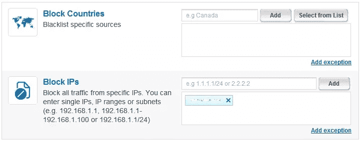
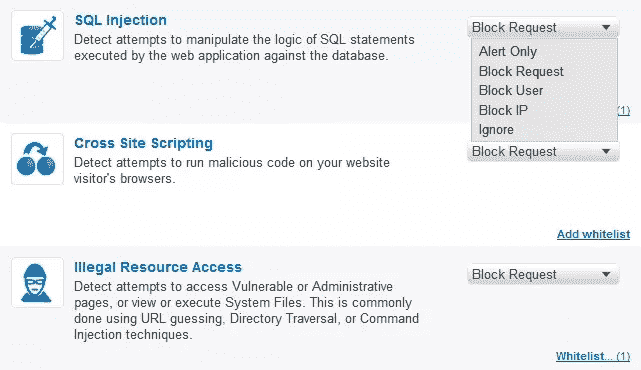
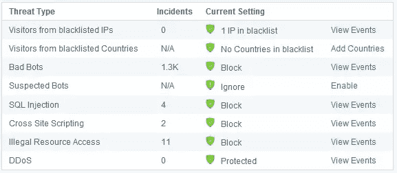
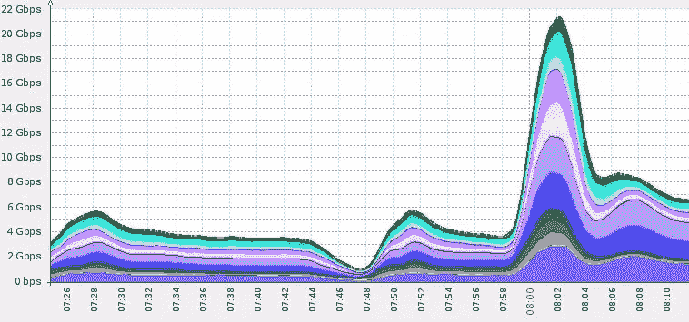

# Incapsula:云中的安全性

> 原文：<https://www.sitepoint.com/incapsula-a-multi-layered-website-security-solution/>

"网络攻击是当今网上交易面临的最大威胁。"这种说法可能看起来势不可挡，然而，在过去几年中，我们目睹了许多高调的网络攻击，这些攻击实际上导致了各种规模的企业崩溃——大规模的数据泄露对公司形象、品牌价值和用户信任造成了几乎不可挽回的损害。

对于这个问题的范围，人们可以参考美国国家安全局局长基思·亚历山大最近的一项估计，他对仅在美国因网络犯罪而浪费的时间和失去的机会的总价值进行了令人难以置信的年度评估——高达 3880 亿美元。

也许当今网络犯罪最令人担忧的一个新方面是，攻击者正在改变他们的重点，不仅瞄准大型和知名网站，还瞄准中小型企业。这些网站直到最近才开始关注网络安全，对任何潜在的攻击者来说都是一个容易的目标。因此，最近的几项安全研究表明，2012 年针对中小企业网站的网络攻击数量翻了一番，而且还在继续增长。

幸运的是，中小企业网站所有者和运营商开始意识到众多的安全威胁，并积极寻求负担得起但仍然有效的在线保护手段。在选择在线安全解决方案时，中小型企业应采取多层安全方法——从简单的 Bad bot 和自动化保护开始，逐步扩展到 WAF 和 DDoS 解决方案。

## 封装:自动化和不良机器人保护

机器人是一种非人类实体，具有各种各样的、通常是恶意的目的。Incapsula 最近的研究表明，平均 51%的网站流量来自这些非人类——其中 31%的潜在破坏性自动流量来自各种黑客、垃圾邮件发送者和漏洞扫描器，它们通常被用作更具破坏性的攻击的先头部队。

*车内仪表盘:交通报告*

 *Incapsula 的第一层保护可以识别并过滤掉恶意的僵尸程序。由于许多这样的机器人会试图用虚假的用户代理和欺骗的 IP 来伪装自己，该系统使用许多识别技术，在 HTTP 头和机器人行为模式中寻找线索。如果需要，系统还将应用一组挑战:从 cookie 支持挑战开始，继续到 JS 支持挑战，并且在某些情况下甚至使用验证码来进行明确的人类识别。

所有收集的数据被收集并保存为“机器人签名”，使后续的机器人识别更快、更可靠。多年来，Incapsula 已经收集了大量的机器人数据，这些数据最近被整合到 Botopedia.org，这是一个基于社区的目录，与所有需要的人免费共享机器人信息。

用户可以自定义 Bot 保护，根据用户代理、原始 IP、使用的应用程序类型(例如所有 CURL 访问的白名单)等选择白名单或黑名单。

*封装内设置:IP 和国家封锁规则*

*Incapsula 设置:Bot 黑名单/白名单规则*

规则管理 GUI 构建得快速而直观，使用复选框和自动完成功能使事情变得简单。该系统还提供了详细的事件日志，以帮助跟踪最近的机器人相关活动。

## 网络应用防火墙(WAF)

Incapsula 的 PCI DDS 兼容 WAF 作为第二道防线，保护网站及其数据库免受高级网络威胁。为了应对这些威胁，Incapsula 的 WAF 监控用户输入和应用程序行为，采用广泛的安全规则来识别和缓解不同的攻击媒介，并使用交叉引用来防止误报。

晶圆规则定期更新。因此，这种防火墙可以处理大量的现有威胁，并在新威胁出现时扩展其覆盖范围以处理新威胁。以下是 Incapsula 的 WAF 如何防范最常见的 OWASP 十大威胁:

| **威胁** | **英卡苏拉的解决方案** |
| **A1:注入–**注入缺陷，尤其是 SQL 注入，在 web 应用程序中很常见。当用户提供的数据作为命令或查询的一部分被发送到解释器时，就会发生注入。攻击者的恶意数据欺骗解释器执行非预期的命令或更改数据。 | Incapsula 可以使用消极或积极的安全策略，通过验证用户输入来检测和阻止注入攻击。 |
| **A2:跨站点脚本(XSS)–**每当应用程序获取用户提供的数据并将其发送到 web 浏览器而没有首先验证或编码该内容时，就会出现 XSS 漏洞。XSS 允许攻击者在受害者的浏览器中执行脚本，从而劫持用户会话、破坏网站、引入蠕虫等。 | Incapsula 通过使用消极或积极的安全策略验证用户输入来检测和阻止跨站脚本(XSS)攻击。 |
| **A3:断认证&会话管理**
账户凭证和会话令牌往往得不到妥善保护。攻击者泄露密码、密钥或身份验证令牌来冒充其他用户的身份。 | Incapsula 通过根据已知的攻击向量、行为和偏差验证用户输入，来检测和阻止不安全的直接对象引用攻击。Incapsula 还分析所需的应用程序行为和访问规则，为每个客户应用程序应用特定的策略。 |
| **A5:跨站点请求伪造(CSRF)–**CSRF 攻击创建伪造的 HTTP 请求，并通过图像标签、XSS 或其他技术诱骗受害者提交这些请求。如果用户通过了身份验证，攻击者就成功了。CSRF 利用网络应用程序让攻击者预测交易的所有细节。由于浏览器会自动发送像会话 cookies 这样的凭证，攻击者可以创建恶意网页，这些网页会生成无法与合法请求区分开来的伪造请求。 | Incapsula 持续监控推荐使用模式，并结合其其他外部源，使用黑名单安全模型来检测潜在的恶意行为模式和违规网站。 |
| **A6:安全错误配置—**安全错误配置可能发生在应用攻击的任何级别，包括平台、web 服务器、应用服务器、框架和定制代码。这些缺陷会让攻击者访问默认帐户、未使用的页面、未修补的缺陷、未受保护的文件和目录，从而获得对系统数据的未授权访问。 | Incapsula 应用通用和应用特定的安全措施来适应安全错误配置。这减少了管理和其他访问漏洞，还包括应用程序特定的“虚拟修补”。 |
| **A7:不安全的加密存储–**许多 web 应用程序无法通过适当的加密或散列来保护敏感数据，如信用卡、社会安全号码(SSN)和认证凭证。攻击者可能使用这些保护薄弱的数据进行身份盗窃、信用卡欺诈或其他犯罪。 | Incapsula 不直接存储机密数据。 |
| **A8:未能限制 URL 访问–**通常，应用程序仅通过阻止向未授权用户显示链接或 URL 来保护敏感功能。攻击者可以利用这一弱点，通过直接访问这些 URL 来访问和执行未经授权的操作。 | Incapsula 应用特定于应用程序以及基于签名和客户端的非法资源访问策略。 |
| **A9:传输层保护不足–**在需要保护敏感通信时，应用程序经常无法加密网络流量。 | Incapsula 全力支持 HTTPS 交通。在将流量传输到受保护的主机之前，Incapsula 能够终止 HTTPS 流量，对其进行检查并重新加密。Incapsula 还保证了 SSL 协议的加密级别(比如加密强度)。 |
| **A10:无效的重定向和转发–**当需要保护敏感通信时，应用程序经常无法加密网络流量。 | Incapsula 分析应用程序行为，缓解已知的安全漏洞，如未经验证的重定向和转发。 |

*封装内设置:晶圆定制规则屏幕*

*柜内仪表盘:安全威胁监控*

Incapsula 的 WAF 行为可以定制，以不同的方式处理每种类型的攻击，选项范围从“仅警报”到自动阻止来自攻击 IP 的所有访问。

该系统还可以每周、每月或每季度自动发布一份 PCI DDS 6.6 合规性审计报告。与不良和可疑的僵尸程序访问一样，所有与 WAF 相关的事件都会出现在 Incapsula 的仪表板中，并记录在安全事件日志中，以供将来参考。

## DDoS 缓解服务

Incapsula 的企业计划针对所有类型的 DDoS 威胁提供全面保护，包括基于网络(第 3-4 层)的攻击，如 SYN 或 UDP 洪水，以及试图淹没服务器资源的应用程序(第 7 层)攻击。该服务还可以阻止利用应用程序和 web 服务器漏洞的高级攻击，如 Slowloris DDoS、HTTP Flood、Apache 黑仔等。

Incapsula 的全球清理中心网络能够按需扩展，以应对数千兆字节的 DDoS 攻击。因为这是云服务，所以缓解应用于客户端网络之外，只允许过滤后的流量到达主机。

Incapsula 的 bot 识别功能有助于缓解应用程序(第 7 层)DDoS 攻击，其中 DDoS 请求看起来像合法的访问者会话。虽然大多数 DDoS 保护服务都基于容易规避和容易出现误报的技术，如速率限制或向每个访问者显示令人讨厌的延迟屏幕，但 Incapsula 实际上可以区分人类和机器人，从而确保合法访问者可以继续不受阻碍地访问网站。

22Gbps DDoS 攻击在清理中心得到缓解。

## 总之:

Incapsula 的信息是“负担得起的高端安全”，它兑现了自己的承诺。在实施其“规模经济”原则的同时，Incapsula 通过利用已知威胁的集体知识库来保护网站，包括新的和正在出现的攻击方法。Incapsula 安全团队在幕后工作，确保所有新信息在整个服务网络中聚合，以造福所有服务用户。

## 分享这篇文章*