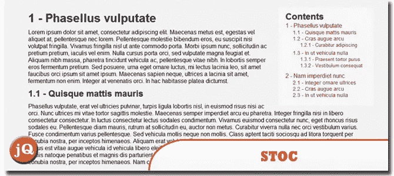
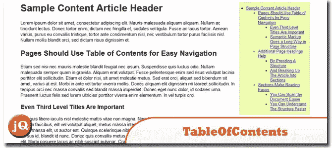
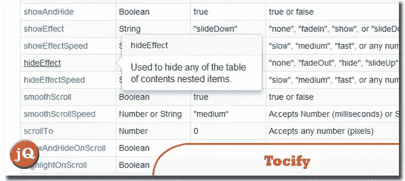
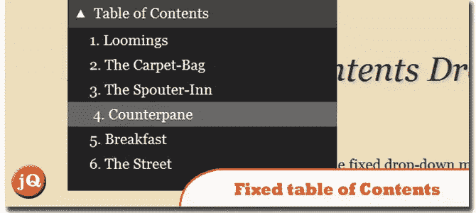
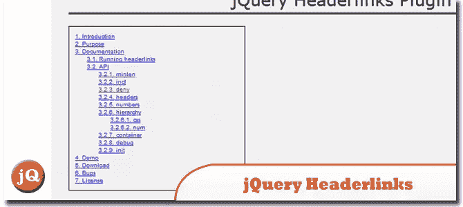

# 5 个 jQuery 目录插件

> 原文：<https://www.sitepoint.com/5-jquery-table-content-toc-plugins/>

今天我们给大家分享一组 **5 个 jQuery 目录(TOC)插件**。这些插件将动态地自动创建一个有组织的目录列表，在页面上任何你想要的地方，以任何风格。

## 1.STOC-平滑目录 jQuery 插件

平滑滚动的目录。
 
[来源](http://www.1stwebdesigner.com/css/jquery-plugin-smooth-scrolling/) [演示](http://cdn3.1stwebdesigner.com/wp-content/uploads/2011/06/jquery-smoooth-scrolling/index.html)

## 2.目录

这个插件基于

# 穿过

###### 网页或网页子集的标签。
功能:
>可以作用于页面的任何区域
>根据目录的容器 DOM 元素自动确定列表类型
>支持嵌套的有序和无序列表，以及链接的直接列表
>自动为每个标题创建类似 slug 的锚(在还没有 id 的标题上)
>支持 proportionateSpacing 格式选项，以创建表示实际内容量的可视 TOC
>完全可定制。插件中没有硬编码的 CSS 类或 ID。
>支持一页多实例。
 
[来源](http://fuelyourcoding.com/scripts/toc/) [演示](http://fuelyourcoding.com/scripts/toc/examples/example1.html)

## 3.澄清

一个动态生成目录的 jQuery 插件。Tocify 可以选择使用 Twitter Bootstrap 或 jQueryUI Themeroller 进行样式化，也可以选择使用 jQuery 显示/隐藏效果进行动画化。
 
[源+演示](http://gregfranko.com/jquery.tocify.js/)

## 4.固定目录下拉菜单(jQuery 插件)

一个单页网站，在屏幕顶部使用一个固定的下拉菜单，以“目录”样式折叠/展开。
 
[来源](http://www.impressivewebs.com/fixed-table-of-contents-drop-down-menu-jquery-plugin/) [演示](http://www.impressivewebs.com/demo-files/fixed-TOC-dropdown-jquery/)

## 5.jQuery Headerlinks 插件

jQuery headerlinks 插件将自动在页面的任意位置创建一个目录块。它有巨大的灵活性，可以自动做很多事情。
 
[源+演示](http://explosion-pills.com/development/jquery/plugins/headerlinks/#headerlinks_ident7)

## 分享这篇文章