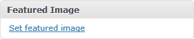

# 如何给你的 WordPress 主题添加特色图片缩略图

> 原文：<https://www.sitepoint.com/how-to-add-featured-image-thumbnails-to-your-wordpress-theme/>

在编辑文章或页面时，你可能已经注意到了“特色图片”框。它允许您上传或选择文章的相关图片。它通常在查看文章列表时以缩略图的形式出现，可能出现在分类索引或搜索结果中。

您的主题中必须启用缩略图支持。你可以[将它添加到一个插件](https://www.sitepoint.com/wordpress-easy-administration-plugin-1/)中，这样它就可以用于所有的主题，但是这并不适合所有的情况。因此，你需要在你的主题文件夹中打开或创建一个“functions.php”文件(WP-content/themes/*theme-name*/)。

要为所有文章类型添加缩略图支持，请在开始的< php:

```
 add_theme_support('post-thumbnails'); 
```

或者，您可以只为帖子启用缩略图:

```
 add_theme_support('post-thumbnails', array('post')); 
```

或者只是页面:

```
 add_theme_support('post-thumbnails', array('page')); 
```

## 设置缩略图大小

默认的缩略图大小可以在 WordPress 的设置>媒体屏幕中设置。但是，您也可以在 functions.php 设置默认的高度和宽度，例如

```
 set_post_thumbnail_size(100, 75); 
```

这将产生宽度为 100 像素、高度为 75 像素的缩略图(令人满意的 4:3 比例)。然而，当用户上传一个不同长宽比的图像时，比如 100 x 150，会发生什么呢？在这种情况下，整个图像会按比例缩小以适应空间，生成的缩略图为 50 x 75。

或者，您可以通过将“true”作为第三个参数来定义硬裁剪:

```
 set_post_thumbnail_size(100, 75, true); 
```

这将裁剪图像，使其符合纵横比。生成的缩略图将始终为 100 x 75，但顶部和底部或左侧和右侧边缘将被移除。



“特色图片”框现在应该出现在你的 WordPress 文章/页面编辑屏幕上。如果它不存在，请检查它在“屏幕选项”中启用或检查您的 functions.php 代码。

## 使用缩略图

三个主要的缩略图命令现在可以在任何 WordPress 循环中使用。通常，您会希望在名为 index.php、category.php、archive.php、author.php、taxonomy.php 或 search.php 的文件中使用它们:

*   `has_post_thumbnail()`如果设置了缩略图，则返回“真”
*   `the_post_thumbnail()`回显包含缩略图< `img` >标签的字符串
*   `get_the_post_thumbnail()`返回一个包含缩略图< `img` >标签的字符串

因此，最简单的实现之一是:

```
 if (has_post_thumbnail()) {
	the_post_thumbnail();
} 
```

或者我们可以添加一个链接和一个默认缩略图(如果没有的话):

```
 echo '<a href="', get_permalink(), '">';
if (has_post_thumbnail()) {
	the_post_thumbnail();
}
else {
	echo 
		'';
}
echo '</a>'; 
```

## 高级缩略图使用

两个可选参数可以传递给`the_post_thumbnail()`和`get_the_post_thumbnail()`。首先是规模——要么:

1.  一个字符串，包含在 WordPress 的设置>媒体屏幕中设置的文本“缩略图”、“中”或“大”，或者
2.  具有新的宽度和高度尺寸的数组，例如 array(120，90)

第二个是包含 src、class、alt 和 title 的关联数组。

例如:

```
 the_post_thumbnail(
	array(120, 90), 
	array(
		'src' => 'image.jpg',
		'class' => 'thumbnail',
		'alt' => 'post thumbnail',
		'title' => 'my custom title'
	)
); 
```

HTML 格式的结果，例如:

```
  
```

这大概是最复杂的了。为你所有的 WordPress 主题添加缩略图支持。

如果你喜欢读这篇文章，你会喜欢[可学的](https://learnable.com/)；向大师们学习新技能和技术的地方。会员可以即时访问 SitePoint 的所有电子书和交互式在线课程，如【WordPress 网站设计初学者指南。

## 分享这篇文章