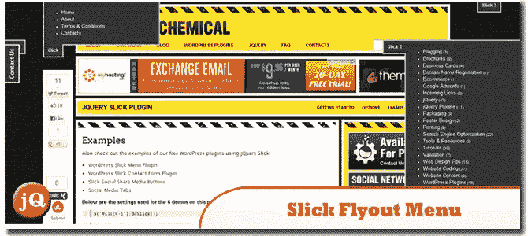
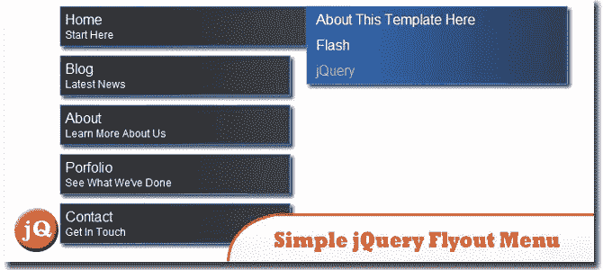
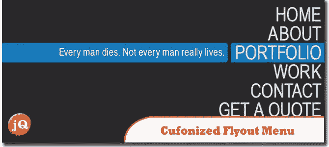
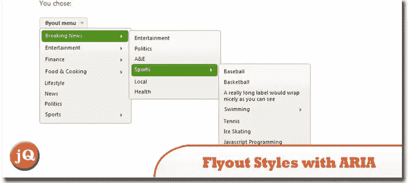
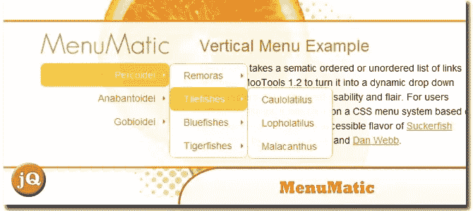
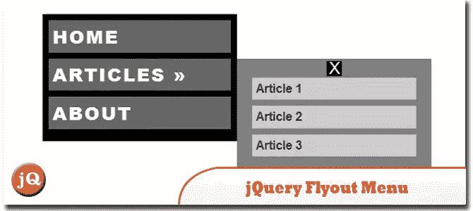
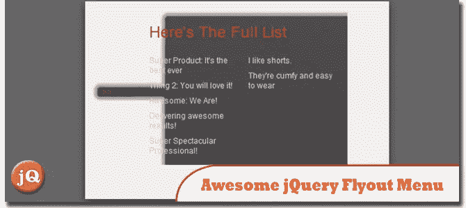
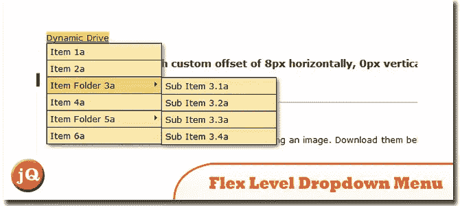
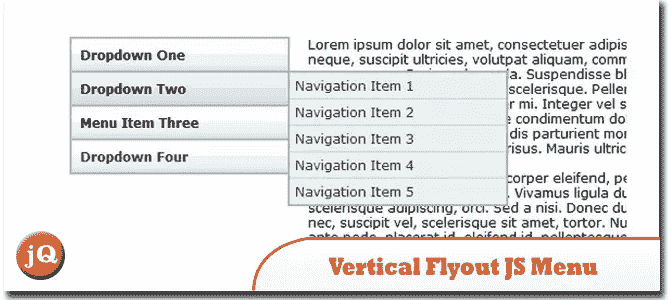
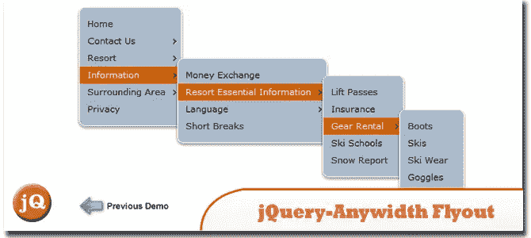

# 10 个很酷的 jQuery 弹出菜单插件

> 原文：<https://www.sitepoint.com/10-cool-jquery-flyout-menu-plugins/>

有许多现成的脚本可以很快实现到您的项目中，导航菜单只是可以通过 jQuery 增强的网站元素之一。为了帮助您缩短开发过程，我们分享了我们收集的 **10(预制的)非常酷的 jQuery 飞出式菜单插件**——一个动态菜单，出现在主菜单的左侧或右侧，紧挨着所选项。

## 1.jQuery & WordPress Slick 弹出菜单插件

功能:
>每页多个滑动标签
>使用“位置”和“偏移”的组合设置滑出标签的准确位置
>设置滑动标签的文本
>通过外部链接切换标签打开/关闭
>选项使标签在页面上打开加载
 
[源](http://churchm.ag/jquery-wordpress-slick-flyout-menu-plugins/) [演示](http://www.designchemical.com/lab/jquery-slick-plugin/examples/)

## 2.一个简单的 jQuery 弹出菜单

在本教程中学习如何创建一个非常简单的弹出菜单。
 
[来源](http://jc-designs.net/blog/2011/01/a-simple-jquery-fly-out-menu/) [演示](http://jc-designs.net/demo/flyout.html)

## 3.带有 JQUERY 和 CSS3 的超棒的 cuf 化弹出菜单

一个整页的菜单，有两个很好的特点:当悬停在菜单项上时，我们将移动一个适应当前菜单项宽度的悬停状态项，我们将从页面左侧滑出一个描述栏，到达当前菜单项。
 
[来源](http://tympanus.net/codrops/2010/06/28/awesome-cufonized-fly-out-menu/) [演示](http://tympanus.net/Tutorials/CufonizedFlyOutMenu/)

## 4.jQuery 菜单:下拉菜单、iPod 下拉菜单和弹出菜单样式，支持 ARIA 和主题滚动

默认情况下，菜单脚本会将一个无序的链接列表转换成一个简单的下拉菜单。当您将菜单的“弹出”选项设置为 true 时，脚本会将分层列表格式化为弹出。
 
[来源](http://www.filamentgroup.com/lab/jquery_ipod_style_and_flyout_menus/) [演示](http://www.filamentgroup.com/examples/menus/flyout.php)

## 5.菜单式的

采用语义有序或无序的链接列表，并使用 MooTools 1.2 将其转换为动态下拉菜单系统，具有增强的可用性和风格。
 
[源+演示](http://greengeckodesign.com/projects/MenuMatic/examples/vertical/index.htm?q=projects/menumatic/examples/vertical/)

## 6.jQuery 弹出菜单

在这篇文章中，我将向你展示如何用 animate()方法创建这个效果。
 
[来源](http://onwebdev.blogspot.com/2011/02/jquery-fly-out-menu.html) [演示](http://dev.css-zibaldone.com/onwebdev/post/jquery-flyout-menu.html)

## 7.真棒 jQuery 飞出菜单教程

它与你通常认为的“飞出式”菜单略有不同。这个例子实际上是一个定制的网站，你想要一些华而不实的和交互式的东西，但不需要太灵活，以适应动态内容。
 
[来源](http://ronaldvwilliams.com/archives/400) [演示](http://ronaldvwilliams.com/common/jquery_fly_out/fly_out_sample.html)

## 8.弹性级别下拉菜单(1.3 版)

这个灵活的菜单脚本允许您向页面上的任何链接添加多级下拉菜单。一个 Flex 级别的近亲弹出菜单，每个菜单既可以下拉也可以右边的锚元素(当链接是侧栏链接时有用)

[Source+Demo](http://www.dynamicdrive.com/dynamicindex1/flexdropdown.htm)

## 9.垂直弹出 JavaScript 菜单

这个动画 JavaScript 弹出菜单简洁轻巧，只有 1.6kb，已经在所有主流浏览器中测试过，在 creative commons 许可下，可以免费用于个人或商业项目。
 
[来源](http://www.scriptiny.com/2008/05/vertical-flyout-javascript-menu/) [演示](http://sandbox.scriptiny.com/flyout/flyout.html)

## 10.jQuery–任意宽度弹出按钮

一个 jQuery 驱动的弹出菜单，使用简单的嵌套无序列表，可以嵌套任意深度，而不必改变样式或脚本。每个子菜单将从左侧弹出，如果悬停在任何其他父子菜单链接或子链接上，将会关闭。
 
[源+演示](http://www.stunicholls.com/menu/jquery-anywidth-flyout.html)

## 分享这篇文章