# 15+非常令人兴奋的 jQuery HTML5 插件

> 原文：<https://www.sitepoint.com/15-exciting-jquery-html5-plugins/>

正在寻找可以在你的网站/博客中实现的奇妙功能吗？在 jQuery4u，我们总是确保只给你最好的 jQuery 插件供你检查。今天我们收集了 **15+个非常令人兴奋的 jQuery HTML5 插件**你可能以前没有用过。从简单的火焰效果到非常酷的翻书效果，一切都是为了你的观赏乐趣。享受吧。

## 1.HTML5 画布实验:使用粒子的酷炫火焰/火焰效果

这是一个简单的火焰效果，使用粒子创建。使用渐隐渐变着色的随机粒子源自鼠标坐标(默认情况下是画布的中心)来创建效果。
 
[源+演示](http://thecodeplayer.com/walkthrough/html5-canvas-experiment-a-cool-flame-fire-effect-using-particles)

## 2.jQuery HTML5 画布插件 gury

一个非常酷的 html5 canvas 实用程序库，它使用 jQuery to 和 html5 来创建一些带有新 canvas 元素的令人敬畏的动画效果。用 flash 的日子结束了！
[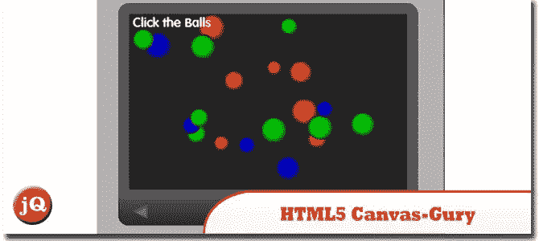](http://www.jquery4u.com/animation/jquery-html5-canvas-plugin-gury/#more-2586) 
[来源](http://www.jquery4u.com/animation/jquery-html5-canvas-plugin-gury/#more-2586) [演示](http://guryjs.org/)

## 3.HTML5 jQuery 画图插件

Websanova Paint 是一个基于 HTML5 canvas 的 jQuery 插件。它允许你在画布上自由绘制各种形状和颜色，包括橡皮擦。
[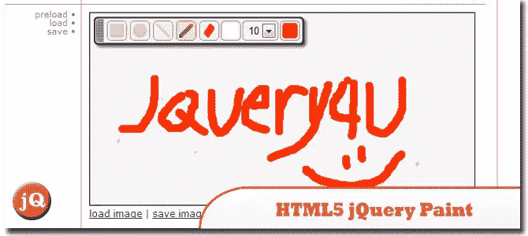](http://www.websanova.com/tutorials/jquery/html5-jquery-paint-plugin) 
[来源](http://www.websanova.com/tutorials/jquery/html5-jquery-paint-plugin) [演示](http://www.websanova.com/plugins/paint/html5#websanova)

## 4.在 HTML5 中创建一个类似 iPad 的下拉菜单

在本教程中学习如何在 HTML5 中创建一个类似 iPad 的下拉菜单..相当简单！
[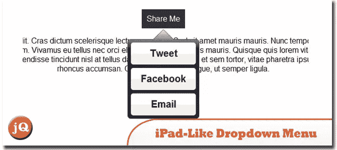](http://www.russellbeattie.com/blog/creating-an-ipad-like-dropdown-menu-in-html5) 
[来源](http://www.russellbeattie.com/blog/creating-an-ipad-like-dropdown-menu-in-html5) [演示](http://www.russellbeattie.com/blog/media/canvas.html)

## 5.用 jQuery 上传 HTML5 文件

今天，我们将开发一个名为 Upload Center 的小型 web 应用程序，它将允许人们通过将照片拖放到浏览器窗口来上传照片，这可能与现代浏览器提供的新 HTML5 APIs 有关。
[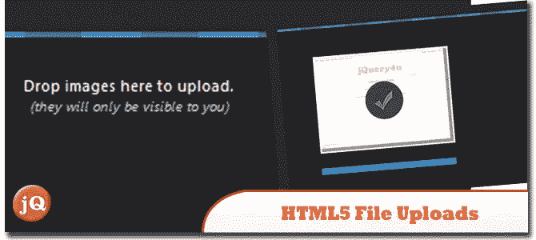](http://tutorialzine.com/2011/09/html5-file-upload-jquery-php/) 
[来源](http://tutorialzine.com/2011/09/html5-file-upload-jquery-php/) [演示](http://demo.tutorialzine.com/2011/09/html5-file-upload-jquery-php/)

## 6.动力帆布

一个 jQuery 插件，旨在尽可能简单地利用 HTML5 canvas 标签的所有特性。
[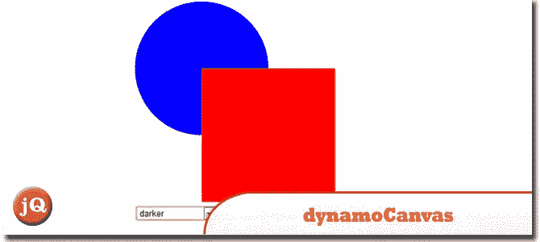](http://w3dynamo.com/) 
[来源](http://w3dynamo.com/) [演示](http://iwhitcomb.github.com/dynamocanvas/examples/layer-ops.html)

## 7.HTML5 占位符 jQuery 插件

一个 jQuery 插件，为还没有足够努力的浏览器启用 HTML5 占位符行为…
[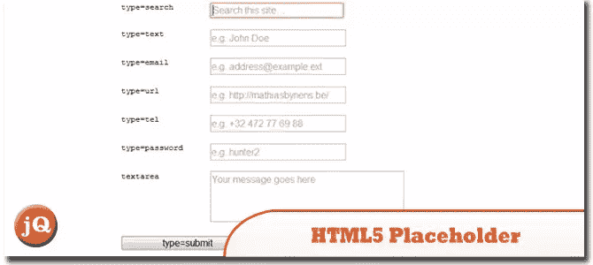](https://github.com/mathiasbynens/jquery-placeholder) 
[源](https://github.com/mathiasbynens/jquery-placeholder) [演示](http://mathiasbynens.be/demo/placeholder)

## 8.H5 验证

jQuery 的 HTML5 表单验证。
[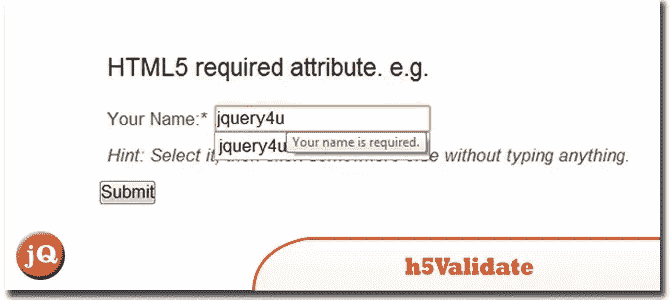](http://ericleads.com/h5validate/) 
[源+演示](http://ericleads.com/h5validate/)

## 9.jQuery 画布加载器

这个插件用一个相同宽度和高度的基于画布的加载器代替了典型的动画 gif 加载图像。这在开发可能在 Android 上查看的移动应用程序时非常有用。它还会在应用替换之前检测您是否有画布支持。
[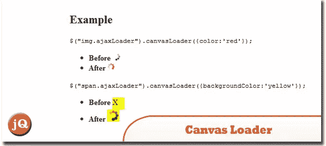](http://jamund.com/canvas-loader/) 
[源+演示](http://jamund.com/canvas-loader/)

## 10.身份 5

一个 JQuery 插件，采用 MD5 散列并将其转换为唯一的图像。它被称为 Identicon5，因为它通过 HTML5 Canvas 元素工作。
[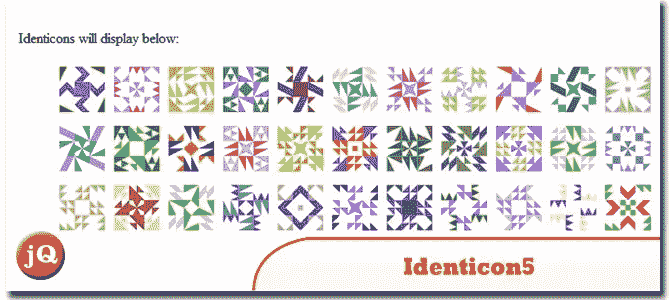](http://francisshanahan.com/index.php/identicon5) 
[来源](http://francisshanahan.com/index.php/identicon5) [演示](http://francisshanahan.com/identicon5/test.html)

## 11.jQuery filedrop 插件

使用 HTML5 文件 API 允许用户将多个文件从桌面拖到浏览器，将每个文件上传到用户指定的 URL。
[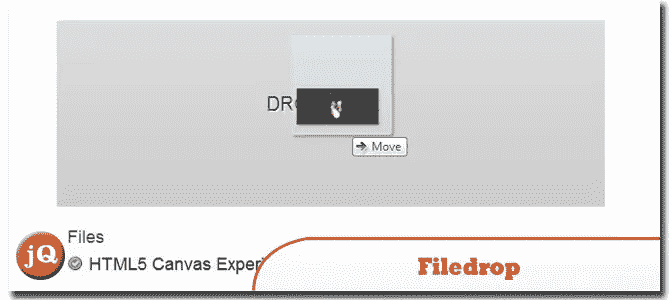](https://github.com/weixiyen/jquery-filedrop#readme) 
[来源](https://github.com/weixiyen/jquery-filedrop#readme) [演示](http://www.grgr.us/jquery_plugins/filedrop.html)

## 12.元数据插件

从 HTML5 自定义数据属性填充 jQuery 数据对象。
[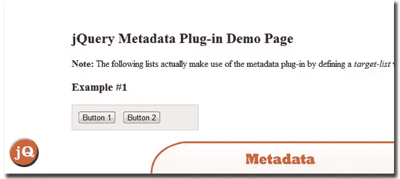](http://blog.jbstrickler.com/2010/06/metadata-plugin/) 
[来源](http://blog.jbstrickler.com/2010/06/metadata-plugin/) [演示](http://blog.jbstrickler.com/demo/metadata/index.html)

## 13.麦克洛尔皮克

一个简单的 lite jQuery 颜色选择器插件，带有一个样本来记住最近选择的 10 种颜色，使用 html5 标记。
[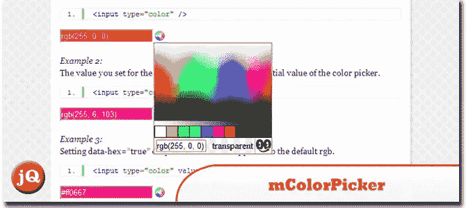](https://github.com/meta100/mColorPicker) 
[来源](https://github.com/meta100/mColorPicker) [演示](http://blog.meta100.com/post/600571131/mcolorpicker)

## 14.标签画布

这是一个 Javascript 类，可以绘制基于 HTML5 画布的标签云并制作动画。
[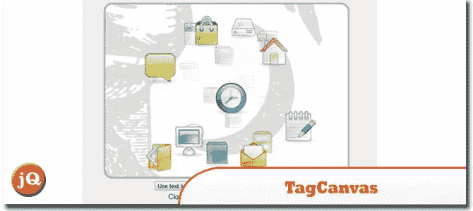](http://www.goat1000.com/tagcanvas.php) 
[源+演示](http://www.goat1000.com/tagcanvas.php)

## 15.HTML5 数据集 jQuery 插件

这个 jQuery 插件添加了 jQuery.fn.dataset 方法。它的使用方式可能与 jQuery 内置的 data 和 attr 方法类似。
[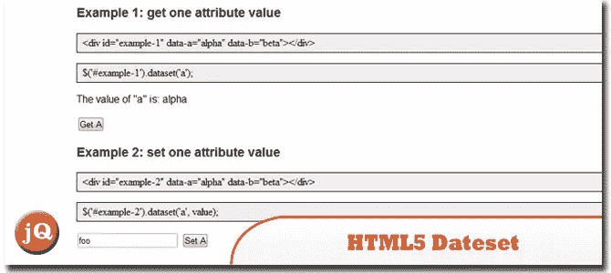](http://www.orangesoda.net/jquery.dataset.html) 
[源+演示](http://www.orangesoda.net/jquery.dataset.html)

## 16.HTML5 翻书 jQuery 插件

Turn.js 是 jQuery 的一个插件，它用 HTML5 添加了一个美丽的过渡，类似于书籍或杂志中的真实页面。它适用于所有现代浏览器，包括触摸设备。
[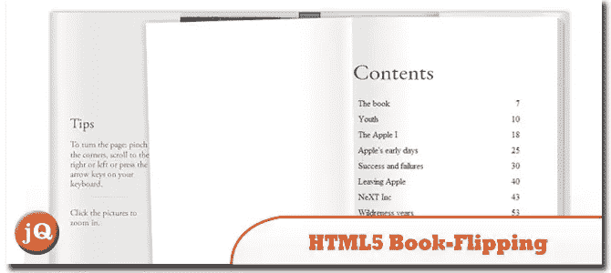](http://www.webappers.com/2012/02/06/html5-book-flipping-jquery-plugin/) 
[来源](http://www.webappers.com/2012/02/06/html5-book-flipping-jquery-plugin/) [演示](http://www.turnjs.com/#samples/steve-jobs)

## 分享这篇文章