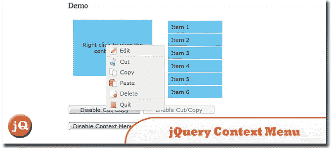
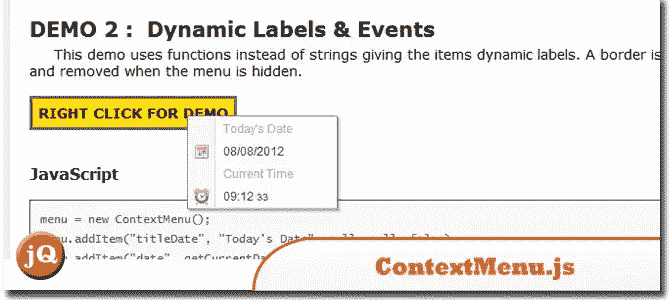
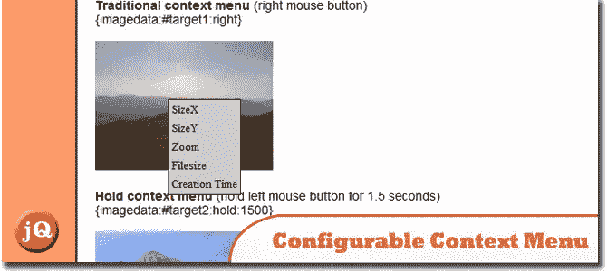
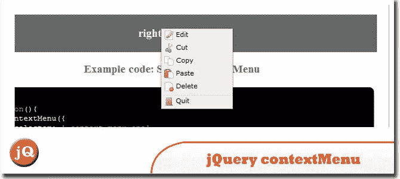

# 5 jQuery 右键单击上下文菜单插件

> 原文：<https://www.sitepoint.com/right-click-context-menu-plugins/>

我们已经看到了很多 jQuery 右键菜单插件，但是如果你正在寻找一些体面和轻量级的插件，你不必花费和浪费时间，这里是一些精心挑选的非常整洁的 **5 jQuery 上下文菜单插件** …享受！:)

## 1.jQuery 上下文菜单插件

它旨在使实现上下文菜单功能变得容易，并且只需要最少的配置工作。
 
[来源](http://www.abeautifulsite.net/blog/2008/09/jquery-context-menu-plugin/) [演示](http://labs.abeautifulsite.net/archived/jquery-contextMenu/demo/)

## 2.上下文菜单. js

一个非常容易使用的工具，让您添加自定义右键菜单到您的网站上的任何 HTML 元素！
 
[来源](http://codecanyon.net/item/context-menu-class/108671) [演示](http://codecanyon.net/item/context-menu-class/full_screen_preview/108671)

## 3.JQUERY 可配置上下文菜单

这是一个可配置的上下文菜单，它以 3 种方式工作:右键单击，按住，悬停。
 
[源+演示](http://www.smartango.com/articles/jquery-context-menu)

## 4.jQuery 上下文菜单插件& polyfill

它是为有数百个元素显示上下文菜单的应用程序而设计的——因此初始化速度和内存使用保持得相当小。它还允许注册上下文菜单，而不提供实际的标记。contextMenu 根据需要生成 DOMElements。
 
[来源](https://github.com/medialize/jQuery-contextMenu) [演示](http://medialize.github.com/jQuery-contextMenu/demo.html)

## 5.wdContextMenu–Jquery 上下文菜单插件

是一个非常轻量级的 jquery 插件，用于右键菜单。
 
[来源](http://www.downloadjavascripts.com/list/javasitelll99/Details.aspx) [演示](http://www.web-delicious.com/jquery-plugins-demo/wdContextMenu/sample.htm)

## 分享这篇文章