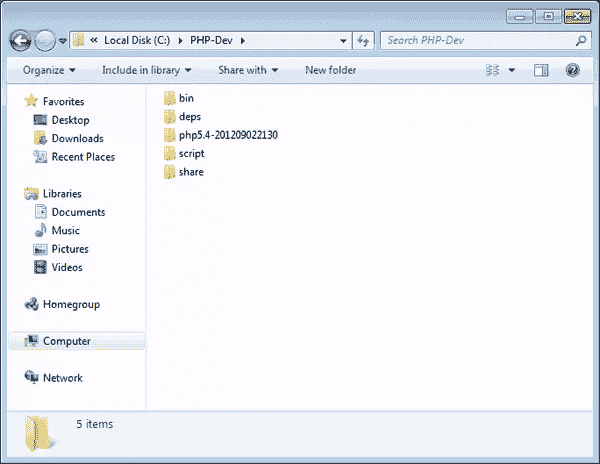

# 在 Windows 上编译 PHP

> 原文：<https://www.sitepoint.com/compiling-php-from-source-on-windows/>

从源代码编译 PHP 在 Unix 类型的系统上更常见。那些在 Windows 环境中工作的人更有可能从预编译的包中下载并安装 PHP。虽然我不反对使用预编译解决方案更容易，甚至在 Unix 系统上，但是从源代码编译二进制文件也有一些好处。总的来说:

*   当你编译时，你有能力微调最终产品。也许您希望将特定的扩展直接编译到二进制文件中，而不是作为外部库加载。或者，您可能希望关闭默认情况下通常可用的特定功能。
*   如果您愿意，您可以对编译过程进行调整，这可能会提高您特定环境的性能(当然，这是假设您已经知道自己在做什么，在这种情况下，您不会阅读本文)。
*   如果预编译的二进制文件是针对比您系统上运行的版本更老的支持软件和库构建的，那么编译可能是让事情正常运行的唯一方法。

但是预先警告:编译可能是一项令人沮丧的任务，尤其是在 Windows 上！您必须确保您的构建环境设置正确，了解如何正确使用编译器和其他构建工具，并满足任何库依赖性。希望这篇文章是你克服这些障碍的第一步。

## 设置构建环境

PHP 是用 C 语言编写的，所以如果你要从源代码中构建 PHP，C 编译器是必不可少的。C++是 C 的超级集合，所以一个好的 C++编译器也应该能够编译 C 代码，尽管有时情况并非总是如此。对于 Windows 来说，微软的 Visual C++ Express(以下我称之为 VC++)应该足够了，并且可以从微软的网站上免费获得。我用 2010 年版来写这篇文章。

当选择你的编译器版本时，你应该记住你将如何运行 PHP。如果您将使用官方预编译的 Apache 二进制文件运行 mod_php，那么您将希望使用 Visual Studio 6 编译 php，因为这是用于编译 Apache 的版本。该模块需要以 Apache 相同的运行时库为目标，在本例中为`msvcrt.dll`。如果您也从源代码构建 Apache，或者如果您将 PHP 作为 CLI 或 FastCGI 运行，那么这不是问题，2010 将会运行得很好。

您还需要安装 Windows 软件开发工具包(在 SDK 之后)。SDK 为我们提供了成功编译所需的 Windows 平台的重要头文件。它也是免费的。我用的是 7.1 版。

先安装编译器，再安装 SDK。我不会讨论安装，因为两者都有一个图形化的安装向导来指导您完成这个过程。

一旦你建立了一个有效的编译器，从 windows.php.net/downloads/php-sdk 下载二进制工具和 deps 包。二进制工具包(我使用的是 20110915 归档文件)包含 re2c、bison 等开发工具，以及构建 PHP 所需的一些附加命令。deps 包(我使用 5.4 存档，因为它与我将要编译的 PHP 版本相匹配)包含所需的最小头文件和库依赖项，比如`zlib.h`。

不用说，你可能也想从[windows.php.net/download](http://windows.php.net/download "windows.php.net - /download/")下载 PHP 源代码。在撰写本文时，PHP 的当前版本是 5.4.6，所以这是我的示例中您将看到的版本号。

创建一个工作空间是一个好主意，您可以将源代码解包到这个工作空间中并进行编译，而不会弄乱系统的其余部分。创建将作为工作目录的文件夹`C:PHP-Dev`，然后将二进制工具归档文件解压到其中。

接下来，将 PHP 源文件的内容提取到`C:PHP-Dev`中，这样就有了`php5.4`源文件文件夹，然后将 deps 文件提取到一个兄弟文件夹`deps`中。您的目录结构应该如下所示:



打开随 SDK 一起安装的 Windows SDK 命令提示符(开始> Microsoft Windows SDK > Windows SDK 命令提示符)并执行以下命令:

```
setenv /release /xp /x86
cd C:PHP-Dev
binphpsdk_setvars.bat
```

使用 SDK 命令提示符控制台比普通的`cmd.exe`控制台更可取，因为它设置了许多特定于编译源代码的环境变量。稍后的编译命令也应该在这个控制台中执行。

标志到`setenv`为环境设置一些构建属性；在这种情况下，我将环境设置为针对 Windows XP 32 位发布版本。如果你喜欢冒险，你可以尝试用`/x64`来构建，但是它仍然有一些问题。指定不同版本的 Windows(如`/vista`)很可能会产生问题，因为构建脚本中有一些奇怪的定义(PHP 的目标仍然是兼容 XP)。除非你真的知道你在做什么，否则坚持使用我上面使用的推荐值可能是最安全的。

然后脚本继续设置一些额外的环境变量，这样构建过程可以找到二进制工具。

请记住，所有这些变量设置只是暂时为您的控制台的会话。如果您关闭提示符并稍后返回编译，您将需要再次运行命令。否则，当您稍后在该过程中运行配置时，将会收到如下错误，并且无法继续:

```
Checking for bison.exe ...  <not found>
ERROR: bison is required
```

确保您拥有正确的构建环境、所需的源代码和所有依赖项是这个过程中最难的部分。现在，您的环境已经设置好了，源代码和依赖项也在适当的位置，是时候编译了！

## 编译 PHP

在 SDK 命令提示符下，导航到 PHP 源文件夹并运行`buildconf`。该命令负责生成一个配置文件，该文件将创建一个 Makefile 来驱动编译过程。

在`buildconf`完成后(应该只需要一秒钟)，运行`configure --help`并检查您想要启用/禁用什么功能，然后使用任何想要的选项重新运行`configure`。在继续之前检查输出是一个好主意，因为如果任何必要的依赖项不可用，它会警告您。如果发生这种情况，您可以安装依赖项并再次重新运行`configure`，或者调整调用以禁用需要它们的扩展。

最后，运行`nmake`开始编译。

```
cd C:PHP-Devphp5.4
buildconf
configure
nmake
nmake test
```

如果`configure`或`nmake`失败，很可能是以下两种情况之一:1)您的环境设置不正确，或者 2)您启用了一个依赖于外部库的功能，而该库没有安装在您的系统上。仔细检查您是否已经按照上面的说明设置了环境，并且已经安装了根据您的配置选项可能需要的任何额外的库。

当第一个`nmake`编译过程完成后，你会在`Release_TS`文件夹中找到闪亮的新 PHP 二进制文件。`nmake test`通过一系列错误测试运行新的二进制文件，以确保一切正常运行。`nmake test`的结果被转发给 QA 团队，QA 团队依靠这些结果来改进 PHP，因此尽管运行起来可能需要几分钟，但这是负责任的做法。

此时，您还可以执行额外的步骤，运行`nmake snap`，这将创建包含二进制文件的 ZIP 存档，您可以四处复制。

## 编译扩展

编译 PHP 扩展有两种方式:静态和动态。静态编译的扩展被编译成 PHP 二进制文件本身，而动态编译的扩展是一个单独的 DLL，可以在以后通过`php.ini`文件加载。扩展通常被编译成 dll，尽管静态编译也有一些优点；这最终取决于你的需求。

要在 Windows 上编译 PHP 扩展，将扩展的源代码文件夹提取到 PHP 源代码目录的`ext`文件夹中。然后，通过运行`buildconf --force`重新构建配置脚本，并使用适当的标志重新编译 PHP 以启用扩展。

作为一个例子，让我们静态地编译 AOP 扩展。从 PECL 下载[源代码，并将其文件夹解压到`ext`。然后执行以下命令:](http://pecl.php.net/package/AOP "PECL :: Package :: AOP - PECL - PHP")

```
cd C:PHP-Devphp5.4
buildconf --force
configure --enable-aop
nmake
```

`buildconf`的`--force`选项强制它重新构建配置脚本。然后，运行`configure --help`,您应该会看到在输出中包含新扩展的选项。这种情况下是`--enable-aop`。

当`nmake finishes`时，您将拥有一个新构建的 PHP 二进制文件，其中包含了 AOP 扩展。

如果您想让一个扩展作为一个 DLL 可用，而不是烘焙到 PHP 中，您可以遵循上述相同的步骤，但指定“shared”作为配置的 enable 选项的值。

```
buildconf --force
configure --enable-aop=shared
```

编译完成后，生成的 DLL 将会在 PHP 二进制文件旁边的`Release_TS`文件夹中，在本例中命名为`php_aop.dll`。

在 Windows 上编译仍然有点棘手，尤其是在扩展方面。windows 版本的`phpize`似乎被破坏了，我已经能够事后编译一个 DLL，就像 PECL 做的那样。在过去的五年左右的时间里，PHP 团队在让 PHP 在 Windows 上像在 Unix 上一样出色方面取得了巨大的进步，所以希望这些障碍和问题能够及时得到解决。同时，我建议同时编译 PHP 和你的共享 dll。

## 摘要

编译源代码的能力是一项很好的技能，尤其是如果您以后想要修改 PHP 的话。也许你想添加新的功能，链接一个新的库，或者只是想成为下一个伟大的 PHP 核心开发者(他们总是可以使用帮助！).现在你知道怎么做了，就可以自由地去破解和构建了！

<small>图片 via[Fotolia](http://us.fotolia.com/?utm_source=sitepoint&utm_medium=website_link&utm=campaign=sitepoint "Royalty Free Stock Photos at Fotolia.com")</small>

## 分享这篇文章