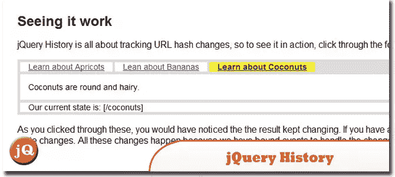
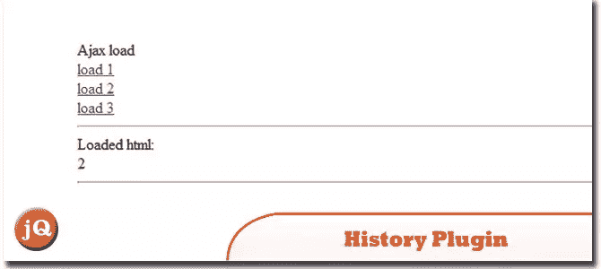
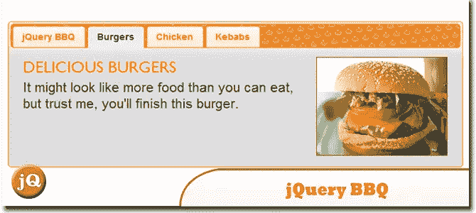
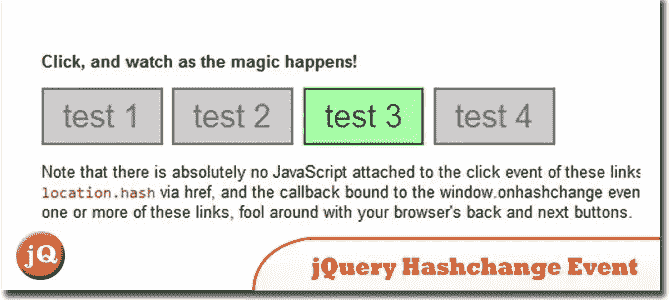
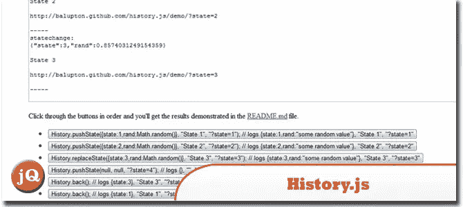
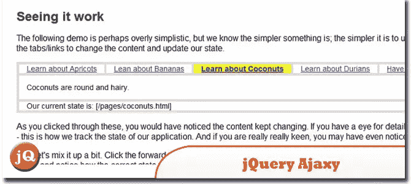
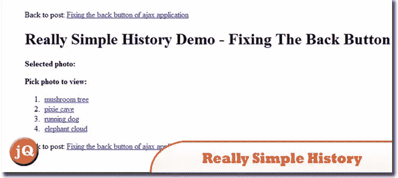
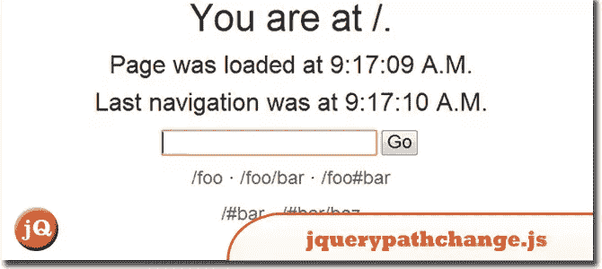
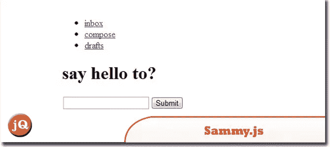

# 10 个 jQuery 历史/后退按钮插件

> 原文：<https://www.sitepoint.com/history-back-button-plugins/>

查看我们收集的 10 个 jQuery 历史/后退按钮插件。这些是非常好的插件。实现起来非常简单，大部分插件都有书签、刷新和后退/前进按钮。

## 1.jQuery 历史记录

简单的历史处理器/遥控器，用于哈希、状态、书签和前进后退按钮。
 
[源+演示](http://balupton.github.com/jquery-history/demo/)

## 2.历史插件

插件是为 Ajax 驱动的页面有后退/前进导航，并允许书签。
 
[来源](http://archive.plugins.jquery.com/project/history) [演示](http://nix.lv/history/demo.html#3)

## 3.jQuery 地址

提供强大的深度链接功能，并允许创建可指向网站部分或应用程序状态的唯一虚拟地址。它启用了许多重要的功能，包括:利用浏览器历史和重新加载按钮！
 
[来源](http://www.asual.com/jquery/address/) [演示](http://www.asual.com/jquery/address/samples/express/)

## 4.jQuery BBQ:后退按钮和查询库

jQuery BBQ 利用 HTML5 hashchange 事件来支持简单而强大的可添加书签的#hash 历史。
 
[来源](http://benalman.com/projects/jquery-bbq-plugin/) [演示](http://benalman.com/code/projects/jquery-bbq/examples/fragment-jquery-ui-tabs/)

## 5.jQuery hashchange 事件

这个 jQuery 插件通过一个跨浏览器的 HTML5 window.onhashchange 事件启用非常基本的可加书签#hash 历史。
 
[来源](http://benalman.com/projects/jquery-hashchange-plugin/) [演示](http://benalman.com/code/projects/jquery-hashchange/examples/hashchange/)

## 6.历史. js

这个项目是 jQuery 历史的继承者。在所有浏览器中优雅地支持 HTML5 历史/状态 API(pushState、replaceState、onPopState)。包括继续支持数据、标题、替换状态。
 
[来源](https://github.com/balupton/history.js#readme) [演示](http://balupton.github.com/history.js/demo/)

## 7.jQuery Ajaxy

简单的 Ajax 处理程序/遥控器，用于哈希、状态、书签和前进后退按钮。
 
[源+演示](http://balupton.github.com/jquery-ajaxy/demo/)

## 8.非常简单的历史

一个轻量级的 JavaScript 库，用于管理 Ajax/DHTML 应用程序中的书签和浏览器历史。RSH 在内部 JavaScript 缓存中序列化应用程序数据，以便书签和后退按钮可以用于将应用程序返回到早期状态。
 
[来源](http://code.google.com/p/reallysimplehistory/) [演示](http://www.geekpad.ca/blog/demos/fixing-the-back-button-of-ajax-application/)

## 9.jquery . path change . js-路径变更. js

在窗口对象上提供一个“pathchange”事件，当 URL 改变时通知应用程序。这个插件还提供了一种安全导航到 URL 的方法，它将使用 HTML5 历史管理来避免页面加载。一切都降级了，并支持 RESTful 客户端开发。
 
[来源](http://www.bcherry.net/static/lib/js/jquery.pathchange.js) [演示](http://www.bcherry.net/playground/sanerhtml5history)

## 10.萨米. js

一个构建在 jQuery 之上的小型 JS 框架。它是 restful 事件 JavaScript。
 
[来源](http://sammyjs.org/) [演示](http://nettuts.s3.amazonaws.com/763_sammyJSIntro/demo/index.html#/inbox)

## 分享这篇文章