# 使用 UI 设计模式构建您的完美界面

> 原文：<https://www.sitepoint.com/build-your-perfect-interface-with-ui-design-patterns/>

尽管现在有各种各样的 UI 工具包，设计直观的用户界面对我们许多人来说仍然是一项具有挑战性的任务，对于新设计师来说尤其困难。即使有了坚实的设计原则，仍然很难按照适当的比例实现它们，以做出吸引人的功能性设计。幸运的是，这种情况有一个解决方案——通过收集 UI 最佳实践和可重用的想法作为设计模式，设计师可以找到常见设计问题的解决方案，而无需每次开始新的设计项目时都“重新发明轮子”。

随着互联网的发展和新技术的出现，用户的期望也变得比以前更高。“好”的设计工作不再能够简单地通过遵守一些基本的设计原则来实现。不耐烦或沮丧的用户只需点击一个按钮就可以放弃，转而使用你的竞争对手。这就是为什么设计模式在今天如此重要——它们给你提供了行之有效的方法，让你的设计变得“好”,而不需要你付出额外的努力。

本教程的目的是作为一个指南和参考，描述什么是设计模式，为什么应该使用它们，以及在哪里可以学到更多关于它们的知识。

### 什么是设计模式？

那么，什么是设计模式呢？首先，*不是*可重复的背景图像——那是完全不同的模式。用简单的语言来说，设计模式是用户已经熟悉的、通用的、经过验证的界面元素集合。我们可以在周围观察到这种模式。如果我们从自然界中拿一个简单的例子——一棵树——我们会看到，所有的树，不管它们的种类，都遵循一个相同的重复模式:首先是根，然后是树干，最后是树枝和树叶。你认为如果我们颠倒这个顺序，这棵树还会是熟悉的和可辨认的吗？当然不是。大自然使用一种最有效、最省力的设计模式。我看不出有什么理由让我们在做 UI 设计时不采用同样的方法。

### 设计模式会损害创造力吗？

你们中的一些人可能害怕使用模式会削弱创造力，但这不是真的。模式只捕获一种常见的结构，比如表单布局。你仍然可以随心所欲地发挥创造力。回到我们的自然例子，你会看到许多种类的树，每一种都有其独特性。所有这些变化都是在遵循相同设计模式的情况下实现的。

让我们考虑一个与界面更相关的例子——一个简单的联系人表单。你可以浏览许多网站，你会发现几乎所有的联系方式都遵循相同的模式。它们有姓名和电子邮件的输入字段、消息的文本区域和将信息发送到服务器的按钮。与按钮、文本字段等单一元素不同，模式是许多元素的和谐逻辑组合/关系。它们就像似曾相识——似曾相识。如果你改变顺序，把“提交”按钮放在第一位，把消息区放在名字和电子邮件字段之间，这将偏离模式，破坏和谐，并在用户中引起混乱和沮丧。

模式专注于特定环境中的特定问题，并以一种被反复证明有效的方式，就何时、如何以及为什么可以应用解决方案为设计者提供指导。但是，请记住，这些更多的是建议，而不是要求。模式很像线框，您可以为每个设计环境定制。根据您的设计、环境和用户需求，您可以对它们进行调整。

如您所见，模式就像积木或砖块一样被使用。它们是用户体验的基本组成部分，描述并指导交互过程。通常，它们可以与其他模式(以及其他元素)混合，以创建交互式用户体验。

### 设计原则与设计模式

现在让我们看看为什么我们不能仅仅依靠设计原则来做出一个好的设计。设计原则和设计模式之间的简短比较突出了它们的区别。

*   原则比较理论化；图案更实用。模式描述了良好设计的具体实例，同时体现了高层次的原则和策略。
*   原则告诉你去哪里，但不告诉你如何去那里；模式充当了原则和它们在实际设计中的实现之间的桥梁，从而使您更接近最终的设计。
*   原则告诉你该怎么做；模式告诉你如何以最好的方式去做。此外，模式通常会向您解释何时以及为什么要使用它们。
*   原则就像低级机器语言；模式就像高级编程语言。这意味着大部分艰难的设计工作已经完成，您可以专注于实际的最终产品，而无需担心每一个细节。

模式比原则高一级——它们是以最佳方式实现的原则。但是，这不是使用设计模式的唯一好处。让我们看看他们还能提供什么。

### 使用模式有什么好处？

*   模式改进并加速了设计过程。您可以更加自信、更少猜测地设计出可用且吸引人的用户界面。
*   模式为您提供了经过验证的设计解决方案以及如何使用它们的指南。模式识别真正的解决方案，而不是抽象的原则。通过明确环境和问题并总结其有效性的基本原理，模式解释了如何解决问题以及为什么模式化的解决方案适合特定的环境。
*   开发一个可重用的用户界面模式库有助于开发一致的界面。
*   在解释和讨论设计解决方案时，模式通过开发一种公共的、共享的语言或词汇来改善来自不同学科的团队成员之间的交流。
*   对于有经验的设计师来说，模式可以有效地为那些没有正式设计背景的人提供设计指导。通过提供视觉和文字描述，界面设计新手更容易看到他们成功使用的例子。
*   因为模式是建立在长期成功使用的基础上的，它们的使用可以使 web 应用程序更加可用，因为模式提供的交互对用户来说已经很熟悉了。
*   最后，在使用设计模式的同时，您实际上也在学习底层的设计原则。

### 记录模式

模式可以用几种方式记录。第一种方法是将模式收集到一个库中，每个模式都有详细的解释和使用的可视化示例。每个模式库的模式文档略有不同。下面是一些你在探索模式库时会发现的最常见的部分。

*   **名称**–使其在设计师中易于识别的图案名称。
*   **问题**——模式解决的设计问题的简要描述
*   **解决方案**——问题的核心设计解决方案。这是一个关于解决方案(模式)的简短陈述，并附有一个说明其用法的示例图像。
*   **When**–这建议您何时适合使用该模式。
*   **How**–这解释了你如何在你的设计中实现这个模式。
*   **为什么**–这为您提供了设计解决方案有效性的基本原理。
*   **示例**–在这里你可以看到更多的示例，从而更加清晰地理解模式。
*   **相关模式**——因为经常会有几个模式一起使用来创建一个可用的设计解决方案，所以本节列出了设计师可能要考虑的相关模式，因为它们是一起使用的，或者与给定模式的使用相关。

第二种更简单的模式收集方法是简单地创建一个收集模式示例的图库，其中模式显示为屏幕截图，没有对它们的使用进行实际解释。除了单一模式的例子，你还可以找到整个网站设计的例子。当你需要灵感或者面对一个常见的界面难题时，模式库是一个很好的资源。

## UI 设计模式库和图库

为了帮助你开始使用设计模式，我分享了我在网上找到的设计模式库和图库的列表。

### 雅虎！设计模式库

雅虎！设计模式库是新设计师/开发者的绝佳资源。访问者可以下载一个[模板工具包](http://developer.yahoo.com/ypatterns/about/stencils/)，它有可拖动和可调整大小的形状，与库中的许多模式相对应，还有来自[雅虎的代码模块用户界面库](http://yuilibrary.com/)。这些形状有许多不同的格式，因此您可以在各种设计工具中使用它们，如 Fireworks 和 Photoshop。

### [Welie.com 模式库](http://www.welie.com/patterns/index.php)

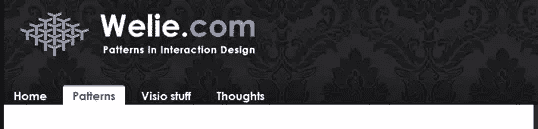

Welie 的模式库是我所发现的最丰富、文档最完善的库之一。这些模式按逻辑分组列出，从而使用户能够快速、轻松地找到他们要找的东西。

### [模式点击](http://patterntap.com/tags/types)

[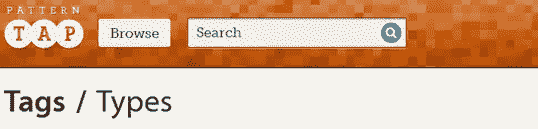](https://www.sitepoint.com/wp-content/uploads/2012/09/03.jpg)

Pattern Tap 是一个设计模式截图的集合，您可以通过类型、风格或用户标签来浏览。每个截图都有链接到它的来源，所以你可以看到这个模式在起作用。

### [用户界面模式](http://ui-patterns.com/patterns)

[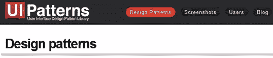](https://www.sitepoint.com/wp-content/uploads/2012/09/04.jpg)

UI 模式是另一个很好的来源。它既有设计模式库，也有截屏集。这些模式按类别分组。

### [设计元素](http://www.smileycat.com/design_elements/)

设计元素是一个大的设计收藏/画廊。它非常适合那些寻找灵感的人。这些示例以易于理解的导航方式进行分组。

### [CSSbake 配料](http://www.cssbake.com/ingredients/)

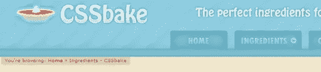

CSSbake Ingredients 是另一个设计模式示例的大集合。每张图片都有一个链接，链接到拍摄它的网站，所以你可以看到它的实际效果。

### [模式浏览器](http://www.patternbrowser.org/code/pattern/pattern.php?4,1,1,1,1,8)

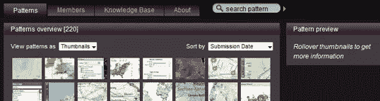

模式浏览器有一个很大的模式库，您可以按类别、设备和设备进行浏览和过滤。当您悬停在缩略图上时，您会在图案预览面板中获得一些关于图案的信息。这个库也有很好的文档记录。

### [公共模式](http://quince.infragistics.com/html/AllPatterns.aspx)

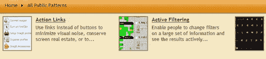

这个图书馆有最好最全面的图书馆之一。每个模式都有详细的实现描述、带有源代码链接的例子等等。

### [电子商务](http://www.ecommr.com/)

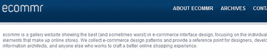

Ecommr 是一个专注于电子商务界面设计的画廊。它收集的电子商务设计模式对于处理网上商店的设计非常方便。

### [美福宝](http://box.mepholio.com/)

MephoBox 为您提供了一系列单一设计模式以及整个网站的设计。

### [模式](http://patternry.com/patterns/)

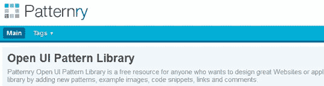

Patternry 是一个很酷的项目，它让您能够通过添加模式、示例图像和代码片段来参与其中。由于如今移动设备无处不在，而且它们的作用比以往任何时候都更重要，因此接下来的四个资源只关注移动设计。

### [移动设计模式库](http://www.mobiledesignpatterngallery.com/mobile-patterns.php)

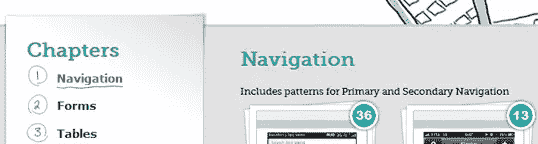

在这里，你可以找到 Theresa Neil 的巨著《移动设计模式库:iOS、Android 和更多应用的 UI 模式》中的设计模式示例。

### [移动用户界面模式](http://mobile-patterns.com/)

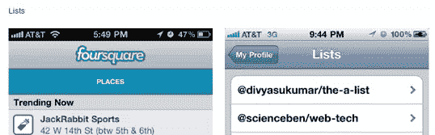

这是一个很棒的移动设计模式的集合，有漂亮的大截图例子。

### [灵感 UI](http://inspired-ui.com/)

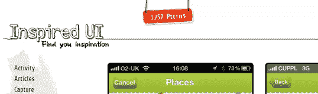

灵感 UI 是一个丰富的移动设计模式集合。

### [设计图案](http://www.patternsofdesign.co.uk/)

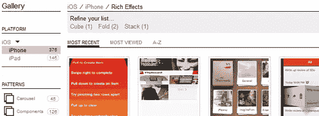

最后，这里有一个专门用于 iOS 应用程序设计的图库。

### 更多资源

如果你有一些闲钱，想深入研究设计模式，可以查一下下面这些优秀的书籍:

*   设计网络界面:丰富交互的原则和模式
*   [设计界面:有效交互设计的模式](http://shop.oreilly.com/product/0636920000556.do)
*   设计社交界面:改善用户体验的原则、模式和实践
*   [设计移动界面:交互设计模式](http://shop.oreilly.com/product/0636920013716.do)
*   [移动设计模式库:用于 iOS、Android 等的 UI 模式](http://shop.oreilly.com/product/0636920026419.do)

而且，因为模式本身是基于设计原则的，所以阅读更多关于原则的内容也是一个好主意:

*   [漂亮网页设计的原则](https://www.sitepoint.com/premium/library)
*   [性感网页设计](https://www.sitepoint.com/premium/library)

### 摘要

随着用户界面变得越来越复杂，使用设计模式的重要性变得越来越重要。为了创造一个好的用户界面设计，你需要一个坚实的基础。这就是设计模式的作用。他们将这些设计原则付诸行动，帮助你在完成工作的同时遵守抽象的设计法则。我希望这篇教程作为你进入用户界面和交互设计世界的第一步对你有用。

## 分享这篇文章