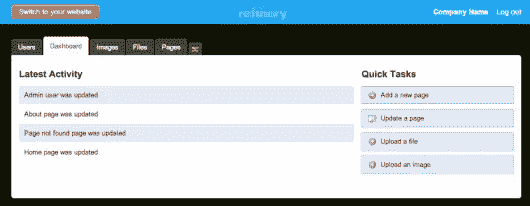

# 与炼油厂合作

> 原文：<https://www.sitepoint.com/working-with-refinery/>

CMS 市场已经相当饱和。我很自信地说，每个开发者都曾经使用过 [WordPress](http://wordpress.com/) 、 [Joomla](http://www.joomla.org/) 或其他 PHP 解决方案。在 Ruby 的世界里，选择要少得多，其中一个比较成熟的是[精炼厂 CMS](http://refinerycms.com/) 。

Refinery 不仅为客户提供了一个灵活的接口，通过将 CMS 实现为 Rails 引擎，它使 CMS 成为我个人使用过的最灵活的接口之一。

## 入门指南

Refinery 有两种安装方式:您可以使用 Refinery `refinerycms <name_of_your_application>`附带的定制二进制文件，或者将 CMS 功能添加到现有的应用程序中。在我的日常工作中，我发现后者是更常见的选择。我认为这是一种祝福，我很少被要求创建*只是*一个 CMS。一个应用程序，也需要一个内容控制的“商店窗口”，以及更常见和更有趣。

向 rails 应用程序添加 CMS 功能轻而易举。简单地将精炼宝石`gem 'refinerycms'`添加到你的宝石文件中，然后运行`bundle install`。

关于精炼宝石的安装有一个简单的提示:当我遇到关于`jquery-rails`的依赖错误时，我有一个挠头的时刻。项目中有几个[问题](https://github.com/resolve/refinerycms/issues/1887)描述了类似的错误。如果你遇到同样的问题，一个很好的老式的`bundle update`排序依赖关系，只要确保你有你的 Gemfile 内容版本。

安装完成后，您将获得一个定制的 rails 生成器，用于应用程序的内容管理区域。简直就是`rails generate refinery:cms --fresh-installation`。如果像我一样，像鹰一样观察这些东西的输出，您将会看到 Refinery 的迁移被复制到您的应用程序中并随后运行。第一项工作是看看是否一切顺利。这只是启动服务器并检查应用程序的管理区域。默认会是`localhost:3000/refinery`。在全新安装时，系统会提示您创建一个默认用户并设置密码，一旦完成，您将被定向到主管理区。管理世界一切都很好，但是我们的用户将会看到什么，在哪个 url 上？

炼油厂看起来光滑的管理区

## 配置 CMS

查看`config/routes.rb`文件，我们可以看到 CMS 已经安装在我们的应用程序的根目录下。`rails generate refinery:cms`安装增加了线路`mount Refinery::Core::Engine, :at => '/'`进路。因此，导航到域的根目录，我们将看到内容管理区域。在大多数情况下，根目录将是安装 CMS 的理想位置，但是无论如何都可以随意地将其更改为适合您需要的位置，`mount Refinery::Core::Engine, :at => '/cms_content_here'`等等。

安装后，您可以使用一整套配置设置。只需查看新创建的`config/initializers/refinery`目录，即可检查这些设置。有太多太多的细节，但有几个我总是发现自己调整。

### 非常简单的配置(我每次都会更改这些配置)

当然，您可能希望更改站点名称，默认情况下是“公司名称”。这种变化如此之快，以至于在全新安装后还没有安装好，这在国际法上几乎是犯罪。在核心初始化器(`config/intailizers/refinery/core.rb`)中，更改行`config.site_name = "Company Name"`。

Google analytics 通常也是强制性的，Refinery CMS 让您不必在视图中管理这种配置。在同一个核心初始化器中，更改行`config.google_analytics_page_code = "UA-xxxxxx-x"`以适应您独特的分析代码。

Fresh out the box Refinery 使用本地文件系统来存储资产。作为知识渊博的网络公民，我们知道有时将我们的资产存储在“云中”会更好。Refinery 使利用 S3 账户变得非常简单。在核心初始化器(`config/initalizers/refinery/core.rb`)中，我们看到了这个条目:

`config.s3_backend = !(ENV['S3_KEY'].nil? || ENV['S3_SECRET'].nil?)` 

基本上，如果 S3 键可以作为应用程序的环境变量，那么它将为您的图像和资源使用 S3，否则它将回到默认的文件系统。您甚至可以更好地控制 S3 上存储的内容，因为在 images ( `config/initalizers/refinery/images.rb`)和 resources ( `config/initalizers/refinery/resources.rb`)配置中也有类似的配置。

`config.s3_backend = Refinery::Core.s3_backend
config.s3_bucket_name = ENV['S3_BUCKET']
config.s3_access_key_id = ENV['S3_KEY']
config.s3_secret_access_key = ENV['S3_SECRET']
config.s3_region = ENV['S3_REGION']` 

这些细节不一定*有*生活的环境变量。如果您不习惯使用像`export S3_KEY='my_key`这样的命令，您可以简单地将 ENV 参数添加到您的环境中。例如，将`ENV['S3_KEY']='my_key'`添加到`config/environments/production.rb`文件中(或者添加到您喜欢的任何环境中)。

## 外观和感觉

尽管 Refinery CMS 的后端非常干净，非常漂亮，但是前端却非常乏味。实现品牌外观的一个重要部分是定制 HTML 标记。在任何两个步骤的视图中，你都有特定的元素来构建布局、页眉、页脚、侧边栏等等。Refinery 提供了许多 rake 任务来覆盖视图、布局元素和布局本身。运行任务

`rake refinery:override view=layouts/application` 

将提供一份精炼厂默认布局 ERB 文件在`views/layouts/application.html.erb`中。

我也喜欢使用 Refinery 支持多种布局的能力。我们再次期待初始化器来配置这一点。在`config/initializers/refinery/pages.rb`中，你简单地提供一个替代布局，就像这样。

`config.layout_template_whitelist = ["application", "three_col_layout"]
config.use_layout_templates = true` 

然后。通过 CMS 管理区域创建新页面时，您可以选择所需的布局类型。同样，您可以改变视图类型，允许更复杂和定制的内容区域。

一旦配置设置正确，您就可以微调内容布局

综上所述，从我个人的经验来看，只有主页(或者一两个其他的)打破了布局的模式。在这些情况下，创建和允许修改页面布局可能有点矫枉过正，也很危险。

## 扩建炼油厂

在上面的用例中，我们只想为主页设置一个自定义布局。实现这一点的最好方法就是装饰精炼厂的`PagesController`。您可能已经注意到了 refinery 安装后的`decorators/controllers/refinery`目录。在这个目录中，我们可以创建一个`pages_controller_decorator.rb`，并扩展 Refinery 提供的默认控制器的行为。

这种扩展提供了大量的控制，而且不费吹灰之力。它可以很好地为我们的页面添加更常见但复杂的功能，比如获取 twitter feed 或处理自定义表单提交。

## 结束炼油厂之旅

您可能已经领会了 Refinery 是一个全功能 CMS 解决方案的要点。它的好处之一是文档相当全面。这些指南是按照轨道布局的，简洁明了，简单易懂，尽管在一些更先进的领域还有所欠缺。

幸运的是，根据我的经验,[精炼厂 CMS 留言板](https://groups.google.com/forum/?fromgroups=#!forum/refinery-cms)是寻找信息的有用且友好的地方。当 Refinery 使用引擎时，您会发现扩展和定制您的 CMS 解决方案相对简单，因为它很少偏离 Rails 的做事方式。

我希望这篇文章能激励你下次需要 CMS 的时候尝试一下 Refinery。

## 分享这篇文章