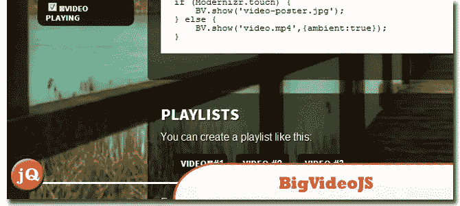
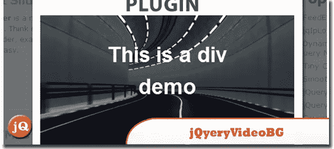
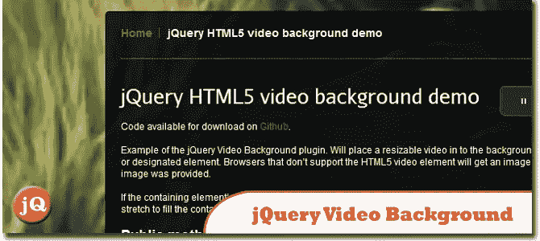
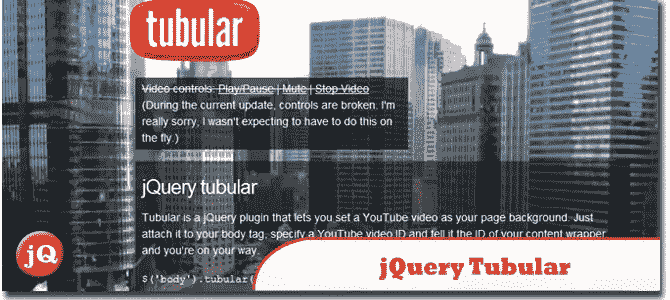
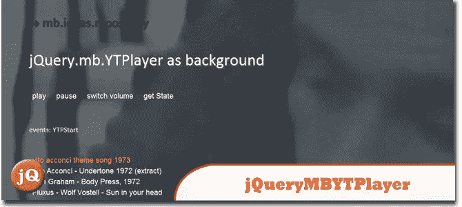

# 5 个 jQuery 背景视频插件

> 原文：<https://www.sitepoint.com/background-video-plugins/>

我们见过以图片为背景的网站，我们都认为它们看起来很酷。如果他们可以使用图像，为什么不用视频呢？在这里，我们给你我们收集的 5 个 jQuery 背景视频插件可以帮助你实现这一点！这些插件可以让你轻松地整合一些你喜欢的视频作为你的网站/博客背景。玩得开心！

**相关帖子:**

*   [**十大最佳 jQuery 和 HTML5 媒体播放器**](http://www.jquery4u.com/plugins/10-jquery-html5-players/)
*   [**jQuery 视差教程——动画标题背景**](http://www.jquery4u.com/animation/jquery-parallax-tutorial/)

## 1.大视频。射流研究…

这个插件可以很容易地将适合填充的背景视频添加到网站上。它可以播放无声的环境背景视频(或系列视频)。或者用它作为播放器来显示视频播放列表。
 
[源+演示](http://dfcb.github.com/BigVideo.js/)

## 2.JQUERY。视频 BG

这个 jQuery 插件使你能够非常容易地使用 HTML5 视频作为网站或任何 div 的背景。
 
[来源](http://syddev.com/jquery.videoBG/) [演示](http://syddev.com/jquery.videoBG/index.html#demos)

## 3.jQuery 视频背景插件

将可调整大小的视频放入页面或指定元素的背景中。如果提供了海报图像，不支持 HTML5 视频元素的浏览器将获得图像。
 
[来源](https://github.com/georgepaterson/jquery-videobackground#readme) [演示](http://www.georgepaterson.com/sandbox/jquery-html5-video-background-demo/)

## 4.jQuery 管状

一个插件，将你选择的 YouTube 视频作为背景放入你的页面。
 
[来源](http://code.google.com/p/jquery-tubular/) [演示](http://www.seanmccambridge.com/tubular/)

## 5.JQUERY(即时查询)。MB.YTPLAYER

这个 jquery 组件让你有一个 chrome 的，可定制的播放器来播放你最喜欢的 YT 电影。它可以用作 HTML 页面的背景。
 
[来源](http://pupunzi.com/#mb.components/mb.YTPlayer/YTPlayer.html) [演示](http://pupunzi.com/mb.components/mb.YTPlayer/demo/demo_background.html)

## 分享这篇文章