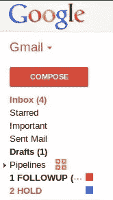

# 掌控你的收件箱

> 原文：<https://www.sitepoint.com/taking-control-of-your-inbox/>

上周，我在脸书受到了斥责。无可非议，那是。

像我们大多数在社交媒体领域工作和娱乐的人一样，很容易超载。所以我尽可能地尝试自动化。我已经将我的博客设置为在新文章发表后自动发布到我的脸书页面上。我知道它会自动更新(因为在 Twitter 上关注我的人比脸书多)，所以我倾向于偶尔查看一下我的脸书页面。所以当有人发帖提问时，我没有回应。这就是让我陷入困境的原因。

我没有意识到的是，当有人在你的页面上发帖时，没有发送电子邮件通知的本地功能。我告诉自己，如果我只有一封电子邮件，我就不会错过它，以此来为我的失误辩护。

我立即向我无意中忽略的人道歉，然后建议将来联系我的最好方式是通过我网站上的联系方式。

那天晚些时候，当我在清理我那拥挤不堪的收件箱时，我发现这个人*也从我的联系表格中给我发了邮件。哎呀…*

几个月前，我受够了我的收件箱，所以我花了几个小时把它从 1000 多条信息减少到零。我太骄傲了。我发誓我再也不会让自己回到那个状态了。但是我没有一个系统来防止它再次发生。所以，当然，它做到了。

除了在混乱中错过电子邮件，我还有一个坏习惯，那就是查看收件箱，不知道如何处理每封邮件，然后把它们留在那里。

我从[把事情做好](http://www.davidco.com/ "David Allen | Getting Things Done")中知道，有效的电子邮件管理的一部分是决定每封邮件是否需要行动。GTD 哲学认为，对于任何“可行的”任务，都有三种选择:

1.  这样做
2.  推迟它
3.  委派它

问题是我不知道如何处理需要延期或委派的信息，所以我会记得跟进它们。Gmail 不像 Outlook 那样有后续标志。为了找到解决办法，我做了一点研究，但是我做了以下事情来控制我的收件箱。

## 处理您的收件箱

为了给每封邮件贴上合适的标签，我创建了两个标签:跟进和保留。然后我像这样浏览我的收件箱:

**保留或删除**
不需要操作的消息被保存或删除。我想保留下来作为参考的文件被贴上标签并存档。除了订阅时事通讯，我还保留并存档了我创建的在线账户的购买收据和确认邮件。

做这件事
任何需要花两分钟或更少时间去做的事，我都会马上去做。如果我需要这封邮件作为将来的参考，我会给它贴上适当的标签并存档。否则，它会被删除。

**推迟**
需要推迟到以后的更长时间的任务会被分配后续标签并存档。

如果任务需要委派，一旦我这样做了，我就给它贴上保留标签并存档。这个标签的另一个用途是我回复并等待对方回复的任何邮件。

这个过程在几个小时内清空了我的收件箱，我很想松一口气。但是归档我的电子邮件让它们变得危险地“眼不见，心不烦”我需要一种方法让他们保持“第一印象”

Gmail 将标签放在左侧栏，类似于其他电子邮件程序中的文件夹。问题是我的跟进和保留标签都将从列表中消失。但是，我可以通过在前面添加下划线(_)或对它们进行编号，将这两个标签强制放置在顶部，如下所示:

我还利用了 Gmail 的多重收件箱功能，创建了一个名为“跟进”的收件箱，放在我的常规收件箱的正下方。(随着我养成定期跟进这些电子邮件的习惯，我可能会消除这一点。)

你可能会问，如果我所做的只是把我的电子邮件转移到另一个收件箱，在那里我可以继续忽略它们，这有什么意义。但是“跟进”标签的美妙之处在于，我知道所有贴上这个标签的事情都需要一个行动。现在只需要留出一段时间来处理每一个问题。理想情况下，一旦我赶上了，维护我的后续框中的消息不应该过于耗时。

尽管有这些保护措施，我仍然处于“眼不见，心不烦”的危险中。有人建议您将每封邮件的下一步行动添加到您的“待办事项”列表中。像 [Producteev](http://www.producteev.com/ "Producteev") 这样的生产力应用程序允许你通过将电子邮件转发到你的帐户来创建一个任务，这也会将其内容放在“注释”栏中。这让您可以为每封电子邮件指定一个截止日期。

## 组织你的混乱

当我在美国电话电报公司黄页公司工作时，不止一个经理评价我的桌子是多么整洁。这是因为我有一个单一的任务——销售广告——围绕这个任务很容易组织我的工作空间。

但是今天，我有无数的工作职能，任何一天我都在同时做不止一件事。对一些人来说，比如我的妻子，组织这种混乱是自然而然的事。对于像我这样的其他人来说，就不是这样了。如果你像我一样，需要把你的工作效率提高一个等级(或几个等级)，我强烈推荐大卫·艾伦的《把事情做完》。这不是一个快速解决方案；更确切地说，这是在学习一种全新的技能——一种我们很多人都迫切需要帮助的技能。

说到“把事情做好”，你是零分还是英雄？你做了什么来提高你的组织能力和个人生产力？请在下面的评论中分享你的经历。

*[形象功劳](http://www.sxc.hu/profile/LegendsWeb)*

## 分享这篇文章