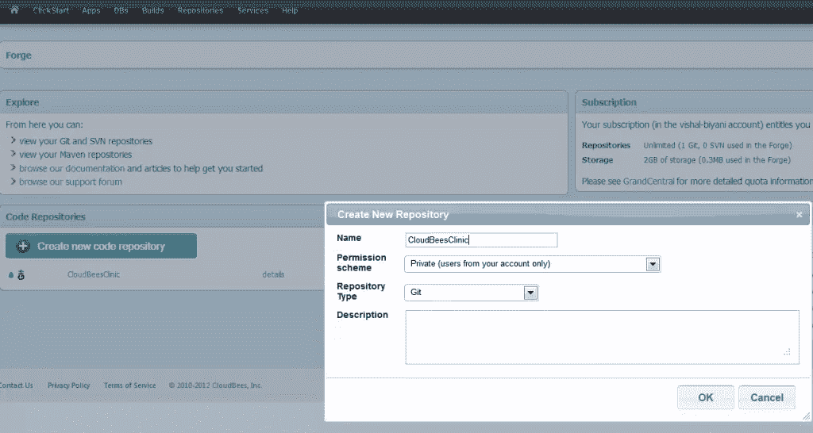
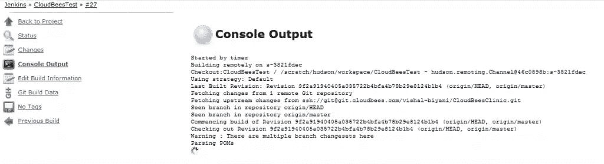

# 利用 CloudBees 加速 Java 应用

> 原文：<https://www.sitepoint.com/accelerate-java-apps-in-cloud-with-cloudbees/>

## CloudBees 平台:简介

随着 Maven 和 Jenkins/Hudson 的出现，Java 开发的世界发生了巨大的变化。Maven 改变了构建应用程序和管理依赖关系的方式。而 Jenkins 已经成为持续集成(CI)和持续交付(CD)的首选工具。详细探讨这些主题不在今天的议程上，我们将看看云平台，基于 Java/JVM 的开发人员将非常高兴地找到他所需要的一切:欢迎来到 CloudBees。CloudBees 为您提供从在云中存储代码到在云中构建和部署代码的服务。无需改变您的工作方式，您就可以在应用程序准备就绪后立即启动并运行它！事不宜迟，我们来动手做一些吧！

## 先决条件和范围

在本教程中，我们将分别使用 Maven 和 Jenkins 进行构建和持续集成。这些概念和工具的知识将有助于你更好地理解教程。点击这里了解更多关于[詹金斯](http://jenkins-ci.org/)的信息，点击这里了解更多关于[梅文](http://maven.apache.org/)的信息

为了简化本教程，我们将应用程序直接部署到云中，跳过本地部署部分。此外，为了保持应用程序的简单性，我们不会用应用程序配置数据库，而只使用内存数据库。

## 设置 CloudBees 和代码库

创建 CloudBees 帐户并设置代码存储库，进入服务–>存储库并“创建新的代码存储库”。我选择了 Git 并将其命名为 CloudBeesClinic，但是您也可以选择 SVN 作为您的代码库。出于本教程的目的，我将坚持使用 Git。



在我们将代码推送到我们的仓库之前，您还需要一个 git 客户机。我使用 GitHub 命令行客户端。一旦设置了 git 客户机，就可以生成 SSH 密钥来与代码存储库通信。如果您在 windows 上，使用刚刚安装的 git 客户端，对于基于 Linux/Unix 的系统，直接运行以下命令:

```
*ssh-keygen*
```

生成密钥后，从 id_rsa.pub(这是默认文件，如果您在生成 SSK 密钥时选择了默认值)复制公钥，然后转到 cloud bees Account –> SSH Keys。将您机器上的公钥添加到 CloudBees。关于如何安装 Git 客户端[的更多信息，请点击这里](https://help.github.com/articles/set-up-git)并生成 SSH 密钥[请点击这里](https://help.github.com/articles/generating-ssh-keys)

## 启动项目

我们将使用一个 RAD 工具创建一个项目:Spring Roo，你可以在本文的第一部分获得更多关于项目创建的细节。您应该会看到 src 目录和 pom.xml 等其他文件。

```
git init // Initializing the Git repo locally
git remote add origin ssh://git@git.cloudbees.com/<strong><em>YOUR_CLOUDBEES_ID</em></strong>/CloudBeesClinic.git
//(Abve URL is “Authenticated access” field when you created repository in cloudbees)
git add -A  // Adding all files and subdirectories to repository.
git commit -m 'Initial checkin' // Committing to local repository.
git push origin master // Pushing the committed changes to server repository.
```

## 设置项目构建和部署

CloudBees 提供 Jenkins 作为持续集成和交付的工具。虽然 Jenkins 是一个非常通用的工具，我可以写一本书来介绍它，但是让我们开始在我们的项目环境中使用它来更好地理解它。转到您的 cloud bees account –> Services –> Jenkins，创建一个“新工作”,然后选择“构建一个 maven2/3 项目”和一个合适的工作名称。我将暂时保留大多数字段的默认值，只配置需要的内容。这是我们的第一个最低限度的工作，需要以下参数

deploy now defaults–Checked:这将在构建成功后立即部署我们的构建。源代码管理:提供源代码库的 URL，在我们的例子中是 Git。这与我们之前提交代码时提供的 URL 相同。

在构建触发器部分，我将选择“定期构建”并提供值“00 0-23 * * *”，这是一个类似于 cron 作业中使用的语法。它将在每小时的第 0 <sup>分钟触发一次构建。在 Post build actions 中选择“Deploy to CloudBees ”,并提供一个合适的应用程序 ID 和您正在使用的帐户。</sup>

在你保存了项目/任务(Jenkins 称之为项目)后，从左侧菜单中选择“立即构建”。让我们看看我们的代码是否已经构建好并可以立即部署。当项目正在构建时，您将在作业上看到一个闪烁的蓝色信号，并且可以通过“控制台输出”查看日志:



由于我们选择了一键部署，应用程序将被部署，如日志末尾所示:

*【cloud bees-deployer】16mb*
*【cloud bees-deployer】17mb*
*【cloud bees-deployer】部署到应用 id vishal-biyani/vishalbiyani-CB test*
*【cloud bees-deployer】可在[http://vishalbiyani-cbtest.vishal-biyani.cloudbees.net](http://vishalbiyani-cbtest.vishal-biyani.cloudbees.net)*
*【cloud bees-deployer】指纹记录中记录部署*
*完成:成功*！应用程序是活的:一个管理宠物和医生和预约的宠物诊所。这是一个很小的应用程序，但是对于测试基本的东西来说已经足够好了。因为构建被设置为每小时运行一次，所以构建的趋势可以在以后看到。例如，在下图中，构建#23 失败了，但是其他构建都是健康的！**


## 探索云蜂

我们在本教程中介绍的内容相当简单，但是我们知道在 CloudBees 平台上部署一个基于 Maven 的 Java 项目有多简单。关于 CloudBees 平台，我们还没有介绍的更多，下面是一个快速的综述，当然不是详尽的:

*   像 Sonar 和其他用于代码覆盖、测试覆盖的插件这样的代码质量工具可以安装在 Jenkins 中，就像任何其他 Jenkins 安装一样
*   添加关系数据库，如 MySQL，或者非关系数据库，如 MondoDB 或 CouchDB
*   像 NewRelic 这样的性能监控工具，像 SendGrid 这样的电子邮件服务等等

## 关于 CI 和 CD 的进一步阅读

持续集成和交付是一个大话题，一个好的和不太好的软件项目之间的主要区别是 CI 和 CD 实践的设置和遵循的如何。不遵循以下三点，关于地球上 CI 和 CD 的讨论就不完整:

*   马丁·福勒关于持续集成的文章是任何初学者的速成班:[http://martinfowler.com/articles/continuousIntegration.html](http://martinfowler.com/articles/continuousIntegration.html)
*   Paul M. Duvall、Steve Matyas 和 Andrew Glover 关于持续集成的书
*   Jez Humble 和 David Farley 关于连续交付的书。

## 分享这篇文章