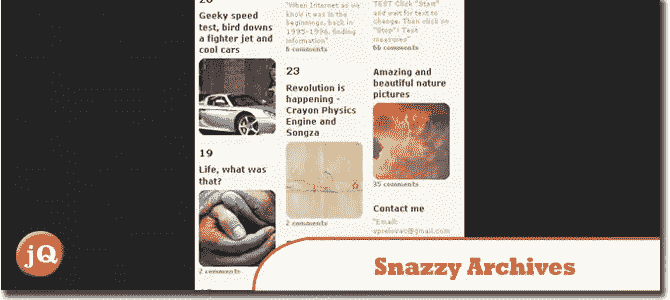
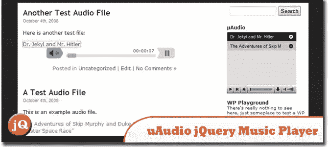
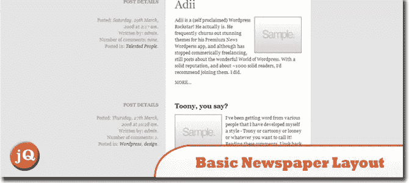
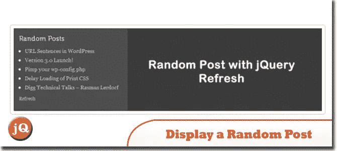
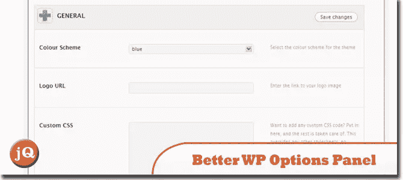
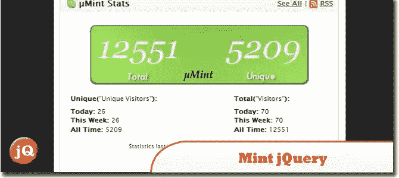
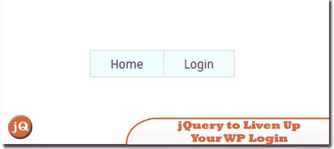
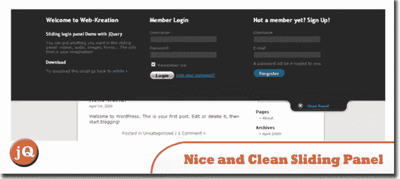

# 10 个很酷的 jQuery WordPress 插件和教程

> 原文：<https://www.sitepoint.com/cool-wordpress-plugins/>

WordPress 有一个广泛的创建插件的用户群，这也是它成为博客社区标准平台的原因。然而，默认情况下，它的功能有点简单和静态，所以我们认为我们应该拿出一些很酷的 jQuery WordPress 插件和教程，这些插件和教程吸收了 jQuery 的最佳功能，并将其与 WordPress 相结合。

**相关帖子:**

*   [**100 jQuery WordPress 插件**](http://www.jquery4u.com/plugins/100-jquery-wordpress-plugins/)
*   [**免费 jQuery 手机 WordPress 主题**](http://www.jquery4u.com/mobile/free-jquery-mobile-wordpress-themes/)
*   [**如何给单个 WordPress 帖子添加 JavaScript**](http://www.jquery4u.com/tutorials/add-javascript-single-wordpress-posts/)

**更新 2013 年 19 月 5 日:**发现一个好的 [WordPress 媒体图库插件](http://ghozylab.com/)。

## 1.时髦的档案

你的 WordPress 站点的可视化插件，以独特的方式显示你所有的文章。你的存档页面再也不会无聊了！
 
[源+演示](http://wordpress.org/extend/plugins/snazzy-archives/)

## 2.uAudio jQuery 音乐播放器

新的音频插件是动态音频的发展。精简(只有 495 字节的基本安装)，新的配置屏幕和一个更小，更瘦的播放器。
 
[源+演示](http://compu.terlicio.us/code/plugins/audio/)

## 3.集成渐变按钮导航

该按钮的目标是提供三种状态:常规、悬停和活动(按下)。这是任何一个好按钮的标准，但是我们会在其中加入一些淡入淡出的效果，让这个按钮真正令人满意。
 
[来源](http://digwp.com/2009/09/integrating-fading-button-navigation/) [演示](http://digwp.com/examples/FadingButtonNav/)

## 4.用 jQuery 为 WordPress 构建一个基本的报纸版面

在本教程中，我们使用 jQuery 的强大功能来创建一个具有缩小标题的网格布局！
 
[来源](http://net.tutsplus.com/tutorials/wordpress/build-a-basic-newspaper-style-layout-with-wordpress-and-jquery/) [演示](http://d2o0t5hpnwv4c1.cloudfront.net/023_Newspaper/preview/preview.html)

## 5.用 jQuery 刷新显示随机帖子

我们将利用 WordPress 和 JavaScript 库 jQuery 的一些真正的聪明之处。
 
[源+演示](http://digwp.com/2009/07/display-a-random-post-with-ajax-refresh/)

## 6.如何创建一个更好的 WordPress 选项面板

为 WordPress 主题创建管理选项面板的整个过程，以优秀的 WooFramework 为例。
 
[源+演示](http://net.tutsplus.com/tutorials/wordpress/how-to-create-a-better-wordpress-options-panel/)

## 7.Mint jQuery WordPress 插件

允许你轻松地将肖恩·因曼的造币厂整合到 WordPress。与目前存在的解决方案不同，Mint 不使用 iframes。
 
[源+演示](http://compu.terlicio.us/code/plugins/mint/)

## 8.使用 jQuery 来激活你的 WordPress 登录

我将展示一种使用 jQuery lightbox 简化客户端登录过程的快速方法。
 
[来源](http://wpguru.co.za/admin/using-jquery-to-liven-up-your-wordpress-login/) [演示](http://wpguru.co.za/wp-content/demos/login/#TB_inline?height=200&width=200&inlineId=form)

## 9.没有插件的 WordPress & jQuery 联系人表单

了解如何使用自定义页面模板在没有插件的情况下在 WordPress 中创建联系人表单。
 
[来源](http://trevordavis.net/blog/wordpress-jquery-contact-form-without-a-plugin/) [演示](http://wp.trevordavis.net/contact-form/)

## 10.用 jQuery 实现一个漂亮干净的滑动面板

在本教程中学习如何用 jQuery 实现一个漂亮干净的滑动面板。
 
[源+演示](http://web-kreation.com/wordpress/implement-a-nice-clean-jquery-sliding-panel-in-wordpress-27/)

## 分享这篇文章