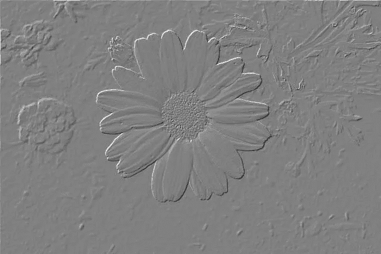
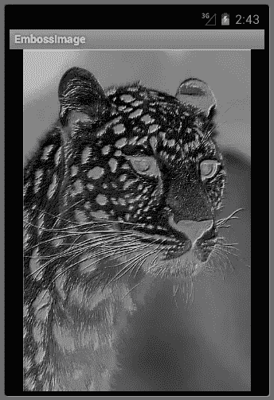

# 掌握手机友好的图像操作:使用 Android 的 Renderscript API 浮雕图像

> 原文：<https://www.sitepoint.com/master-mobile-friendly-image-manipulation-emboss-images-using-androids-renderscript-api/>

在你的 Android 开发生涯中，你可能不得不编写模糊、锐化、转换为灰度、浮雕或其他处理图像的应用程序。即使你的最新应用不一定专注于处理图像，你仍然可以采用界面设计技术，例如模糊背景内容，让用户关注前景中的重要警告，或者使用灰度在界面中提供可用和不可用选项之间的对比。为了快速执行这些操作，同时保持可移植性，您的 Android 应用程序必须使用 Renderscript。

本文重点介绍通过 Renderscript 浮雕图像。它首先向您介绍浮雕算法，然后介绍 Renderscript 入门，最后向您展示如何构建一个简单的应用程序，在 Renderscript 上下文中浮雕图像。

### 了解压花算法

用盲文书写的书籍，用热蜡密封以保证其真实性的文件，硬币上有浮雕图案，即从表面凸起内容的行为。压花通过凸起点的盲文系统帮助盲人阅读，并为盖章、密封的文件或铸造的硬币提供认证。(在过去，这些印章保证了硬币中使用的贵金属的重量和价值。)除了这些现实世界的用途之外，压花还赋予图像一种三维轮廓分明的外观。图 1 给出了一个例子。



**图 1:** 浮雕图像看起来也有点金属感。

把一幅图像想象成山区。每个像素代表一个高度:较亮的像素代表较高的高度。当一个假想的光源照在这个地形上时，面向光源的“上坡”被照亮，而背向光源的“下坡”被着色。压花算法捕捉这些信息。

该算法在光线移动的方向上扫描图像。例如，如果光源位于图像的左侧，其光线从左向右移动，因此扫描从左向右进行。在扫描期间，比较(扫描方向上的)相邻像素。强度差异由目标图像中的特定灰度级(从黑色、全阴影到白色、全亮)表示。

有八种可能的扫描方向:从左到右、从右到左、从上到下、从下到上和四个对角线方向。为了简化代码，该算法通常从左到右和从上到下扫描，并根据需要选择其邻居。例如，如果光源在图像的上方和左侧，则该算法将在从左到右和从上到下的扫描期间比较当前像素上方和左侧的像素。清单 1 中的浮雕算法伪代码演示了这种比较:

```
FOR row = 0 TO height-1
    FOR column = 0 TO width-1
        SET current TO src.rgb[row] `SET upperLeft TO 0
        IF row > 0 AND column > 0
           SET upperLeft TO
               src.rgb[row-1][column-1]

        SET redIntensityDiff TO
            red (current)-red (upperLeft)
        SET greenIntensityDiff TO
            green (current)-green (upperLeft)
        SET blueIntensityDiff TO
            blue (current)-blue (upperLeft)

        SET diff TO redIntensityDiff
        IF ABS(greenIntensitydiff) > ABS(diff)
           SET diff TO greenIntensityDiff
        IF ABS(blueIntensityDiff) > ABS(diff)
           SET diff TO blueIntensityDiff

        SET grayLevel TO
            MAX(MIN(128+diff, 255), 0)

        SET dst.rgb[row]` `TO grayLevel
    NEXT column
NEXT row`

**清单 1:** 这个算法以从左到右和从上到下的方式对图像进行浮雕。

清单 1 的压花伪代码将待压花的图像标识为`src`，并将存储压花结果的图像标识为`dst`。假设这些图像是 RGB 像素的矩形缓冲区(也可以容纳忽略阿尔法分量的 RGBA 像素的矩形缓冲区)。

因为最上面一行的像素上面没有邻居，而且最左边一列的像素左边也没有邻居，所以浮雕图像的顶部和左边有点不均匀，如图 1 所示。您可以通过在图像周围绘制实心边框来消除这种不均匀性。

在获得每个当前像素和它们各自的左上邻居的红色、绿色和蓝色强度之后，伪代码计算每个强度的差异。从当前像素的强度中减去左上邻居的强度，因为光线在从左上向右下的方向上移动。

伪代码标识当前像素与其左上角相邻像素的三个亮度差异之间的最大差异(可能是负的)。这样做是为了获得最好的“轮廓分明”的外观。然后将差值转换为 0 到 255 之间的灰度，该灰度存储在目标图像中与源图像中当前像素相同的位置。

### 渲染脚本初级程序

Renderscript 将基于 C99 的语言与一对低级虚拟机(LLVM)编译器和一个提供图形和计算引擎访问的运行时相结合。您可以使用 Renderscript 以本机代码编写应用程序的一部分，以提高 3D 图形渲染和/或数据处理性能，同时保持应用程序的可移植性，并避免使用繁琐的 Java 本机接口。

* * *

**注:** Google 在 Android 2.0 中引入了 Renderscript，但直到 Android 3.0 发布才公开了改进版本。由于后来的开发者反馈倾向于直接使用 OpenGL，谷歌从 Android 4.1 开始反对 Renderscript 的图形引擎部分。

* * *

浮雕和其他图像处理操作由 Renderscript 的计算引擎执行。虽然您可以利用 Android 的 GPU 加速(从 Android 3.0 开始)2D 画布 API 来执行这些 2D 任务，但 Renderscript 允许您超越 Dalvik 虚拟机，编写更快的本机代码，并通过可用 CPU 内核(以及未来的 GPU 和 DSP 内核)上的多线程运行这些代码。

将 Renderscript 引入你的应用时，你需要编写 Java 代码和基于 C99 的 Renderscript 代码，这就是所谓的*脚本*。Java 代码处理位于`android.renderscript`包中的类型。至少，您需要访问的类型是`Renderscript`(用于获取上下文)和`Allocation`(用于代表 Renderscript 分配内存):

*   `Renderscript`声明一个`static RenderScript create(Context ctx)`方法，该方法被传递一个对当前活动的引用，并返回一个对`Renderscript`对象的引用。该对象充当必须传递给其他 API 的上下文。

*   `Allocation`声明在 Java 端包装数据并将这些数据绑定到 Renderscript 运行时的方法，以便脚本可以访问这些数据。方法也可用于将脚本结果复制回 Java 端。

在 Android 构建过程中，LLVM 的前端编译器编译脚本并创建一个以`ScriptC_`为前缀的类，其后缀取自脚本文件的名称。您的应用程序实例化该类，并使用生成的实例来初始化和调用脚本，以及检索脚本结果。您不必等待脚本结果，因为 Renderscript 会为您处理这些。

C99 代码通常存储在一个文件中，该文件组织如下:

*   必须指定一对`#pragma`指令，通常出现在文件的顶部。一个`#pragma`标识文件符合的 Renderscript 版本号(当前为 1)。另一个`#pragma`标识文件关联的应用程序的 Java 包。

*   一对`rs_allocation`指令通常遵循并标识输入和输出分配。输入分配指的是要处理的数据(由一个`Allocation`实例包装)，输出分配标识结果存储的位置(由另一个`Allocation`实例包装)。

*   在 Java 端，`rs_script`指令通常跟随并标识以`ScriptC_`为前缀的实例，以便 Renderscript 可以将结果传递回脚本。

*   可以声明附加的全局变量，这些变量要么是脚本的本地变量，要么是绑定到 Java 代码的变量。例如，您可以声明`int width;`和`int height;`，并将图像的宽度和高度从您的 Java 代码(通过调用`ScriptC_`前缀对象上的`set_`前缀方法)传递给这些变量。

*   对于输入分配中的每个元素，通常会在每个 CPU 内核上执行一个`root()`函数。

*   一个`noargument init`函数通常会执行任何必要的初始化，并调用一个重载的`rsForEach()`函数。这个函数负责识别内核的数量，创建在这些内核上运行的线程，等等。每个线程调用`root()`。

您可以将这些项目放在文件中的任意位置。但是，基于`rs_allocation`、`rs_script`和任何其他全局变量必须在引用之前声明。

### 浮雕遇到渲染脚本

现在你已经对浮雕算法和 Renderscript 有了基本的了解，让我们把它们放在一起。本节首先向您介绍一个通过 Renderscript 演示浮雕的应用程序的 Java 和 C99 端(单个活动和一个浮雕脚本)，然后向您展示如何构建这个应用程序。

#### 探索压花应用程序的 Java 方面

清单 2 展示了`EmbossImage`活动类:

```
package ca.tutortutor.embossimage;

import android.app.Activity;

import android.os.Bundle;

import android.graphics.Bitmap;
import android.graphics.BitmapFactory;

import android.renderscript.Allocation;
import android.renderscript.RenderScript;

import android.view.View;

import android.widget.ImageView;

public class EmbossImage extends Activity
{
   boolean original = true;

   @Override
   public void onCreate(Bundle savedInstanceState)
   {
      super.onCreate(savedInstanceState);
      final ImageView iv = new ImageView(this);
      iv.setImageResource(R.drawable.leopard);
      setContentView(iv);
      iv.setOnClickListener(new View.OnClickListener()
                   {
                      @Override
                      public void onClick(View v)
                      {
                         if (original)
                            drawEmbossed(iv, R.drawable.leopard);
                              else
                                iv.setImageResource(R.drawable.leopard);
                              original = !original;
                         }
                });
   }

   private void drawEmbossed(ImageView iv, int imID)
   {
      Bitmap bmIn = BitmapFactory.decodeResource(getResources(), imID);
      Bitmap bmOut = Bitmap.createBitmap(bmIn.getWidth(), bmIn.getHeight(),
                                         bmIn.getConfig());
      RenderScript rs = RenderScript.create(this);
      Allocation allocIn;
      allocIn = Allocation.createFromBitmap(rs, bmIn,
                              Allocation.MipmapControl.MIPMAP_NONE,
                              Allocation.USAGE_SCRIPT);
      Allocation allocOut = Allocation.createTyped(rs, allocIn.getType());
      ScriptC_emboss script = new ScriptC_emboss(rs, getResources(),
                                                 R.raw.emboss);
      script.set_in(allocIn);
      script.set_out(allocOut);
      script.set_script(script);
      script.invoke_filter();
      allocOut.copyTo(bmOut);
      iv.setImageBitmap(bmOut);
   }
}
```

**清单 2:** 压花应用程序的活动通过`script`与压花脚本通信。

覆盖的`void onCreate(Bundle bundle)`方法负责设置活动的用户界面，它由一个注册了 click listener 的`android.widget.ImageView`实例组成。当用户点击该视图时，显示该图像的浮雕或原始版本，这由`boolean`变量`original`的当前值决定。

与脚本的通信发生在`void drawEmbossed(ImageView iv, int imID)`方法中。该方法首先获取一个包含要浮雕的图像内容的`android.graphics.Bitmap`对象，然后创建一个包含空位图的`Bitmap`对象，该空位图的尺寸和配置与另一个对象的位图相同。

接下来，通过执行`RenderScript.create(this)`获得 Renderscript 上下文。产生的`Renderscript`对象作为第一个参数传递给两个`Allocation`工厂方法和`ScriptC_emboss`构造函数。这个上下文类似于传递给小部件构造器如`ImageView(Context context)`的`android.content.Context`参数。

Dalvik 虚拟机和周围的框架控制内存管理。对象和数组总是被分配在 Java 端，随后通过将它们包装在`Allocation`对象中而对脚本可用。这个类提供了几个返回`Allocation`实例的工厂方法，包括下面的一对:

*   `static Allocation createFromBitmap(RenderScript rs, Bitmap b, Allocation.MipmapControl mips, int usage)`创建一个分配，用特定的 [mipmap](http://en.wikipedia.org/wiki/Mipmap) 行为和用法包装一个`Bitmap`实例。`bmIn`被传递给`b`，将输入的`Bitmap`实例(包含图像)标识为要包装的实例。`Allocation.MipmapControl.MIPMAP_NONE`被传递到`mips`，指示没有使用 mipmaps。`Allocation.USAGE_SCRIPT`传递给`usage`，表示分配被绑定到脚本并被脚本访问。

*   `Allocation createTyped(RenderScript rs, Type type)`创建一个由脚本使用的分配，其大小由`type`指定，默认情况下不生成 mipmaps。`allocIn.getType()`被传递到`type`，表示要分配的内存布局由先前创建的输入分配指定。

在创建输入和输出分配之后，`ScriptC_emboss`类(由 LLVM 在应用构建过程中创建)通过调用`ScriptC_emboss(rs, getResources(), R.raw.emboss)`被实例化。与之前创建的 Renderscript 上下文一起，以下参数被传递给构造函数:

*   对一个`android.content.res.Resources`对象的引用(用于访问应用程序资源)。这个引用通过调用`Context`的`Resources getResources()`方法返回。

*   `R.raw.emboss`(浮雕脚本的资源 ID)。在构建时，LLVM 前端编译器将脚本编译成一个包含可移植位代码的文件(扩展名为`.bc`),该文件存储在`res/raw`层次结构下的 APK 中。在运行时，LLVM 后端编译器提取该文件，并将其编译成特定于设备的代码(除非该文件已经编译并缓存在设备上)。

LLVM 前端编译器为它在脚本中找到的每个非`static`变量生成一个以`set_`为前缀的方法。因为压纹脚本包含两个`rs_allocation`指令(名为`in`和`out`)和一个`rs_script`指令(名为`script` ), `set_in()`、`set_out()`和`set_script()`方法被生成并用于将`allocIn`、`allocOut`和`script`传递给脚本。

通过在前缀为`ScriptC_`的类的实例上调用前缀为`invoke_`的方法来执行脚本。该方法的后缀取自脚本中出现的无参数 init 函数的名称(带有一个`void`返回类型)。在这种情况下，名称是`filter`。

因为 Renderscript 处理线程问题，所以可以在调用后立即执行`allocOut.copyTo(bmOut);`，将脚本结果复制到输出位图，然后通过`iv.setImageBitmap(bmOut);`显示结果图像。

#### 探索压花应用程序的 C99 面

清单 3 展示了压纹脚本。

```
#pragma version(1)
#pragma rs java_package_name(ca.tutortutor.embossimage)

rs_allocation out;
rs_allocation in;

rs_script script;

void root(const uchar4* v_in, uchar4* v_out, const void* usrData, uint32_t x,
          uint32_t y)
{
   float4 current = rsUnpackColor8888(*v_in);
   float4 upperLeft = { 0, 0, 0, 0 };
   if (x > 0 && y > 0)
      upperLeft = rsUnpackColor8888(*(uchar*) rsGetElementAt(in, x-1, y-1));
   float rDiff = current.r-upperLeft.r;
   float gDiff = current.g-upperLeft.g;
   float bDiff = current.b-upperLeft.b;
   float diff = rDiff;
   if (fabs(gDiff) > fabs(diff))
      diff = gDiff;
   if (fabs(bDiff) > fabs(diff))
      diff = bDiff;
   float grayLevel = fmax(fmin(0.5f+diff, 1.0f), 0);
   current.r = grayLevel;
   current.g = grayLevel;
   current.b = grayLevel;
   *v_out = rsPackColorTo8888(current.r, current.g, current.b, current.a);
}

void filter()
{
   rsDebug("RS_VERSION = ", RS_VERSION);
#if !defined(RS_VERSION) || (RS_VERSION < 14)
   rsForEach(script, in, out, 0);
#else
   rsForEach(script, in, out);
#endif
}
```

**清单 3:**`filter()`函数是浮雕脚本的入口点。

脚本以一对`#pragma`开始，它们将`1`标识为脚本的目标 Renderscript 版本，将`ca.tutortutor.embossimage`标识为 APK 包。一对`rs_allocation`全局变量和一个`rs_script`全局变量紧随其后，提供对它们的 Java 对应物的访问(通过前面提到的`set_`前缀的方法调用传递给脚本)。

随后声明的`void root(const uchar4* v_in, uchar4* v_out, const void* usrData, uint32_t x, uint32_t y)`函数为每个像素(在该函数中称为*元素*)和每个可用内核调用。(每个元素都独立于其他元素进行处理。)它声明了以下参数:

*   `v_in`包含正在处理的当前输入分配元素的地址。

*   `v_out`包含等效输出分配元素的地址。

*   `usrData`包含可传递给该函数的附加数据的地址。压花不需要额外的数据。

*   `x`和`y`标识传递给`v_in`的元素的从零开始的位置。对于 1D 分配，没有参数会传递给`y`。对于位图，参数同时传递给两个参数。

`root()`函数为当前输入元素实现了清单 1 的浮雕算法，这是一个 32 位的值，表示元素的红色、绿色、蓝色和 alpha 分量。这个元素通过 Renderscript 的`float4 rsUnpackColor8888(uchar4 c)`函数被解包成一个浮点值的四元素向量(每个向量在 0.0 到 1.0 之间)。

接下来，调用 Renderscript 的`const void* rsGetElementAt(rs_allocation, uint32_t x, uint32_t y)`函数来返回传递给`x`和`y`的位置处的元素。具体来说，获取当前元素西北方的元素，然后将其解包为浮点值的四元素向量。

Renderscript 提供了`fabs()`、`fmax()`和`fmin()`函数，它们与清单 1 中的算法是等价的。这些函数在后续逻辑中被调用。最终，Renderscript 的`uchar4 rsPackColorTo8888(float r, float g, float b, float a)`函数被调用来将浮雕元素组件打包成一个 32 位的值，该值被分配给`*v_out`。

* * *

**注意:**要获得 Renderscript 函数的完整列表，请查看[在线文档](http://developer.android.com/reference/renderscript/index.html)或 Android SDK 安装中的`.rsh`文件。

* * *

该脚本以`void filter()`函数结束。这个名字是任意的，并且对应于附加到前缀为`ScriptC_`的类的前缀为`invoke_`的方法的后缀。该函数通过调用 Renderscript 的一个重载的`rsForEach()`函数，执行任何需要的初始化，并在多个内核上执行`root()`函数。

代替初始化，这个函数调用 Renderscript 的一个重载的`rsDebug()`函数，这对于将信息输出到设备日志很有用，可以通过在命令行或从 Eclipse 中调用`adb logcat`来访问。在这种情况下，`rsDebug()`用于输出`RS_VERSION`常量的值。

`filter()`使用一个`#if`–`#else`–`#endif`构造来选择一个合适的`rsForEach()`函数调用来编译，这取决于脚本是在 Android SDK 还是 Eclipse 的环境中编译。`RS_VERSION`可以在每个编译上下文中包含不同的值，这个值决定了哪些重载的`rsForEach()`函数可以合法调用，如下所示:

```
00134 #if !defined(RS_VERSION) || (RS_VERSION < 14)
00135 extern void __attribute__((overloadable))
00136     rsForEach(rs_script script, rs_allocation input,
00137               rs_allocation output, const void * usrData,
00138               const rs_script_call_t *sc);
00142 extern void __attribute__((overloadable))
00143     rsForEach(rs_script script, rs_allocation input,
00144               rs_allocation output, const void * usrData);
00145 #else
00146
00165 extern void __attribute__((overloadable))
00166     rsForEach(rs_script script, rs_allocation input, rs_allocation output,
00167               const void * usrData, size_t usrDataLen, const rs_script_call_t *);
00171 extern void __attribute__((overloadable))
00172     rsForEach(rs_script script, rs_allocation input, rs_allocation output,
00173               const void * usrData, size_t usrDataLen);
00177 extern void __attribute__((overloadable))
00178     rsForEach(rs_script script, rs_allocation input, rs_allocation output);
00179 #endif
```

这段代码摘自在线查看的的 Renderscript 的`rs_core.rsh`头文件。`filter()`函数调用适当的`rsForEach()`函数，并根据`RS_VERSION`的当前值使用最少的参数，如下面的摘录所示。

### 构建和运行 EmbossImage

让我们构建并运行`EmbossImage`。为简洁起见，本节仅向您展示如何在命令行环境中构建和安装该应用程序的 APK。虽然它没有显示 Eclipse 的等价物，但是推断 Eclipse 环境的指令并不困难。

该应用程序是在以下背景下开发的:

*   Windows 7 是开发平台。将反斜杠改为正斜杠，并删除 Linux 环境中的`C:`驱动器指示符。

*   项目构建目录是`C:prjdev`。将`C:prjdev`事件替换为您首选的对等事件。

*   已经安装了 Android SDK 修订版 20，并且已经创建了与目标 ID 1 相关联的基于 Android 4.1 的 AVD。执行`android list targets`以识别您的等效目标 ID。

完成以下步骤来创建和构建一个`EmbossImage`项目:

1.  通过执行`android create project -t 1 -p C:prjdevEmbossImage -a EmbossImage -k ca.tutortutor.embossimage`创建`EmbossImage`项目。

2.  用清单 2 替换`EmbossImagesrccatutortutorembossimageEmbossImage.java`的框架内容。

3.  将包含清单 3 内容的`emboss.rs`文件引入到`src`目录中。

4.  创建`EmbossImageres`的`drawable`子目录。将本文代码档案中包含的`leopard.jpg`文件复制到这个目录中。

5.  以`EmbossImage`为当前目录，执行`ant debug`构建 app。

最后一步可能会失败，并显示以下警告消息(为便于阅读，请跨多行显示):

```
WARNING: RenderScript include directory
         'C:prjdevGrayScale${android.renderscript.include.path}'
         does not exist!
[llvm-rs-cc.exe] :2:10: fatal: 'rs_core.rsh' file not found
```

幸运的是，谷歌 Android 问题数据库中的[问题 34569](http://code.google.com/p/android/issues/detail?id=34569) 提供了一个补救办法。要解决这个问题，只需将以下属性添加到位于 Android SDK 主目录的`toolsant`子目录中的`build.xml`文件中(为了便于阅读，该属性分布在多行中):

```
<property name="android.renderscript.include.path"
          location="${android.platform.tools.dir}/renderscript/include:
                    ${android.platform.tools.dir}/renderscript/clang-include"/>
```

具体来说，将这个`<property>`元素放在下一个`<path>`元素之后:

```
<!-- Renderscript include Path -->
<path id="android.renderscript.include.path">
  <pathelement location="${android.platform.tools.dir}/renderscript/include" />
  <pathelement location="${android.platform.tools.dir}/renderscript/clang-include" />
</path>
```

执行

如果成功，您应该会在`EmbossImagebin`目录中发现一个`EmbossImage-debug.apk`文件。您可以通过执行`adb install binEmbossImage-debug.apk`将这个 APK 安装到您的仿真或真实设备上。

如果安装成功，转到应用程序启动器屏幕，找到`EmbossImage` APK 的通用图标。点击这个图标，应用程序应该启动。图 2 显示了使用 Android 4.1 AVD 的 Android 模拟器的初始屏幕。


**图 2:** 活动在启动时展示一只未雕刻的豹子。

点击豹纹图片(由 PublicDomainPictures.net 的维拉·克拉托奇维尔提供的[)，你应该可以观察到如图 3 所示的浮雕效果。](http://www.publicdomainpictures.net/view-image.php?image=17011&picture=leopards-head)



**图 3:** 点击活动会出现一个浮雕豹纹。

### 结论

浮雕和其他图像处理操作很容易用 Renderscript 编写。作为一个练习，增强浮雕脚本以支持来自西北以外方向的光源(如东北)。这项技术对于使用颜色、对比度和像素的固有“高度”来构建直观的界面和实现高级图像处理非常有价值。

## 分享这篇文章

```