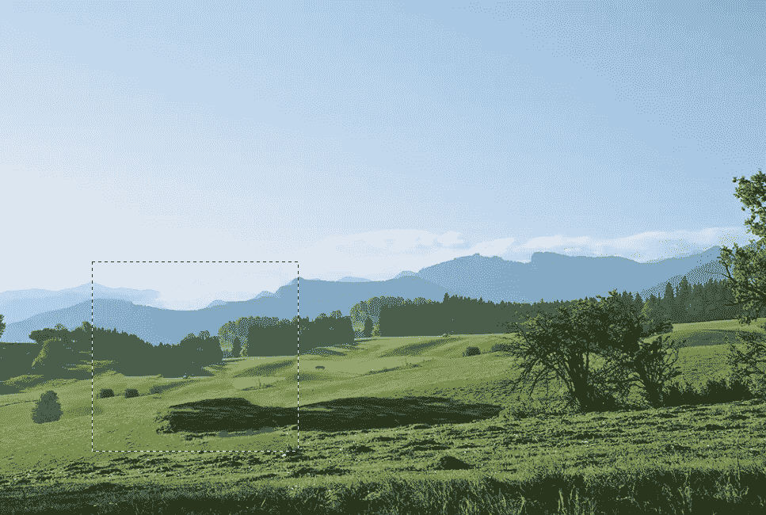
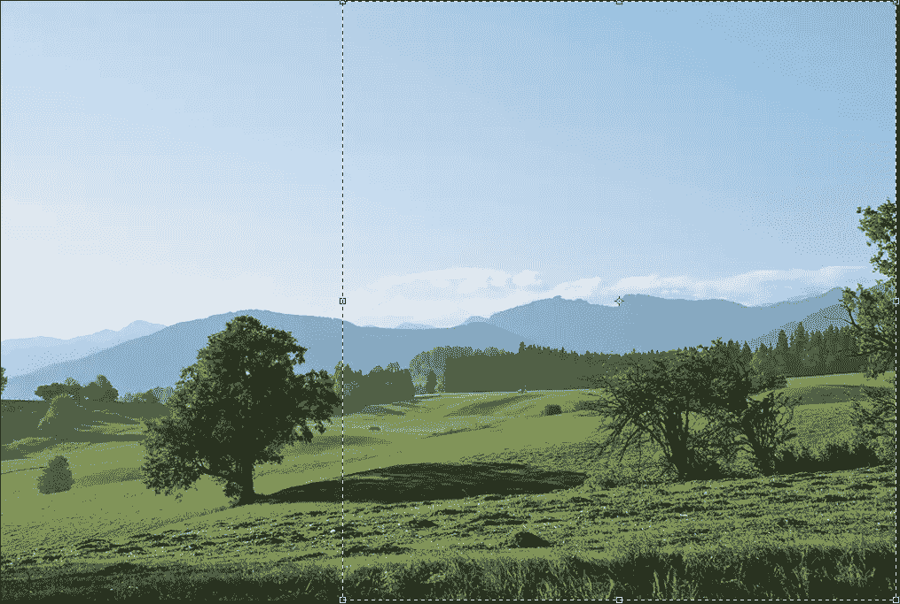
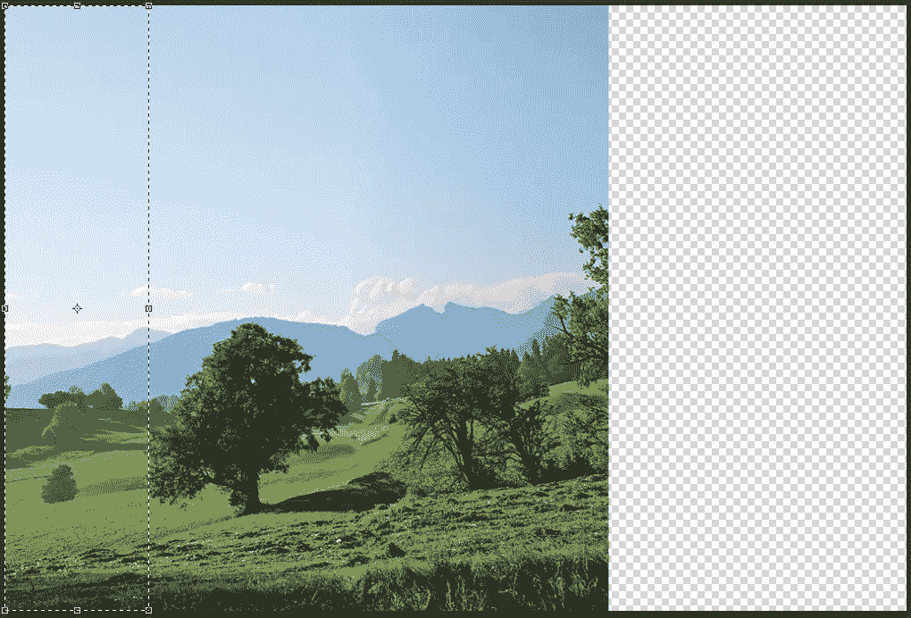
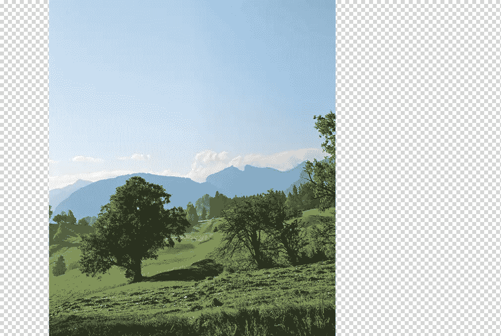

# 使用 Photoshop 的内容感知工具用意念移动对象

> 原文：<https://www.sitepoint.com/move-objects-with-your-mind-using-photoshops-content-aware-tools/>

在 Photoshop 中从图像中移除对象曾经是一件绝对难以处理的事情。就在 Photoshop CS6 之前的几个版本中，如果你想要从背景中移除一个物体或人，你必须使用克隆工具，费力地在你想要移除的物体上绘制周围的区域。你可以花几个小时进行复杂的克隆，只有非常熟练的 Photoshop 专家才能创造出令人信服的混合效果。令人欣慰的是，我们现在有一系列不同的工具，可以在几秒钟内擦除和混合图像中的对象！这些工具被称为 Photoshop 的“内容感知工具”，如果你没有充分利用它们，你真的错过了。

### 内容感知填充

内容感知填充是一个神奇的工具，可以让你几乎立即从图像中移除对象。让我们试一试。下载[这张样图](http://www.sxc.hu/browse.phtml?f=download&id=1397577)，在 Photoshop 中打开。

这已经是一个很棒的图片了，但是让我们假设你想从图片中移除最左边的树。在旧版本中，这可能需要几个小时来克隆树的周围区域并对齐所有边缘。你必须对一个区域取样，然后画一点，对另一个区域取样，然后再画一点。你可以想象这是多么的痛苦和乏味，尤其是在处理一些复杂的东西时，比如树叶。

要使用内容感知填充，请使用任何选择工具进行选择，如选框工具、套索工具、魔棒等。，并在要移除的对象周围绘制选区。按住 Shift 键并按“Delete”来打开填充对话框。您可以选择图案、渐变、实心填充等。，但是我们将做出的选择是“内容感知的”单击“确定”

请注意，在一个动作中，树不见了。有一点需要注意——如果你仔细观察，树线中的缺口(在背景中观察到的)是重复的。使用这种方法时，您需要注意这种重复，因为 Photoshop 会分析周围的区域，以便进行无缝混合。缺点是独特的人工，如树和阴影的形状是重复的。这可以通过在一小部分中单独选择这些区域，并再次使用内容感知填充(只是在更紧密的区域中)来轻松纠正。结果如下所示。

### 内容感知移动

有时，你不想删除图像的一部分，你只是希望你可以移动它或重新定位到另一个区域。为此，Adobe 在 Photoshop CS6 中添加了内容感知移动工具。这是非常容易使用的，它可以在工具面板中的污点修复笔刷工具和修补工具下找到。它看起来像两个交叉的箭头。要使用内容感知移动工具，您必须仔细选择要移动的对象。这一次，让我们移动这棵树，而不是把它一起移走。尽可能紧密地围绕对象进行选择。

做出选择后，当内容感知移动工具仍处于活动状态时，单击并拖动选择到您希望对象所在的区域。试着把物体放在有意义的地方。Photoshop 最终很好地混合了周围的区域，并填充了树原来所在的区域。请参见下面的示例:

内容感知移动并不总是完美的，但它通常做得很好。如果结果不是您所希望的，您可能需要将选择范围缩小一点，以获得更好的结果。

### 内容感知量表

内容感知比例是另一个伟大的工具，可以帮助你改变图像，以适应非常具体的需求。假设你找到一个你喜欢的图像，但它是风景，你需要它是肖像。构图可能无法实现这一点，但使用内容感知缩放，您可以缩放图像，并使主要对象更加靠近，而不会出现任何明显的失真。

你不需要一次选择整个图像并向内缩放；这通常会“弄乱”你试图拉近的主题。最好的方法是选择图像的整个高度，但只包含一个要包含的对象，以及要减少的大部分背景空间。请注意，在下面的例子中，我选择了完整的高度和大量的背景，但我只在前景中包括了两棵树中的一棵树。

现在，让我们伸出手抓住另一棵树。进入“编辑”>“内容感知量表”现在，你可以向另一棵树的内部缩放图像。让它尽可能靠近，但不要“挤压”中间太多，这将使它看起来扭曲和浮华。按 Enter/Return 键提交更改。如果您愿意，可以在图像的左侧重复相同的过程。

尽可能向内缩放图像后，选择裁剪工具，将比例设置为 8.5 x 11，您可以裁剪图像以适应纵向限制。最终结果如下所示:

### 修补工具中的内容感知模式

在修补工具中，您有正常模式，现在在 CS6 中，您可以使用内容感知修补，这意味着帮助您从修补工作中获得更好的结果。与内容感知填充类似，您可以将适应设置为从“严格”到非常“宽松”“宽松”会得到更好的结果，因为它比“严格”更能优雅地融合边缘“严格”会产生粗糙的边缘，因此使用此设置时要小心。进行选择，就像您使用内容感知填充一样，但是当您将选择移动到画布上的另一个点时，您正在选择从哪里对填充内容进行采样。注意下面例子中的树，填充是从右边的区域取样的。

### 使用修复画笔的内容感知模式

治疗刷通常用于更精细的治疗和移除神器。现在，您可以选择内容感知作为修复画笔类型。在下面的示例图像中，请注意中间的画笔线条。(我说的“画笔线条”指的是真实的*植物*，而不是 Photoshop 线条或 Photoshop 画笔。)

只需点击并拖动画笔即可。确保你的 Photoshop 笔刷足够大，能够覆盖*真实*笔刷(也就是植物)的厚度，然后简单地在笔刷上描摹一下。(懂了吗？)也可以越过远处的小栅栏追踪。下面，栅栏没了，刷子也没了。

### 结论

内容感知工具绝对让你喜欢更容易。它们可以节省您从背景中克隆不需要的对象的时间，在某些情况下，您可以通过向内缩放图像将横向图像更改为纵向图像，而不会扭曲关键内容。使用内容感知是任何聪明的设计师都应该有的聪明工具。

*您是否经常使用内容感知工具，还是更喜欢手动、细致的方法？*

## 分享这篇文章