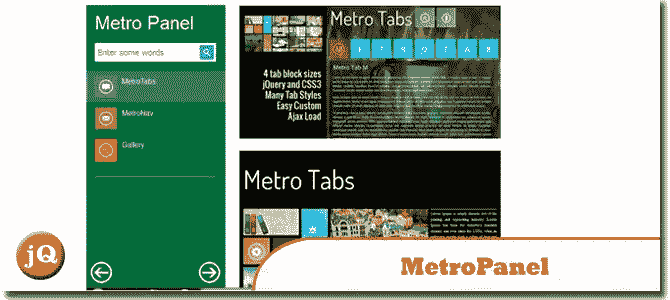
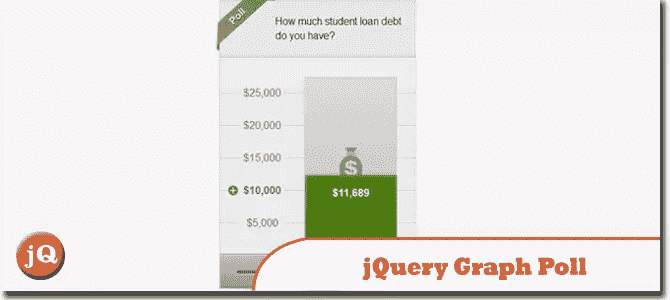
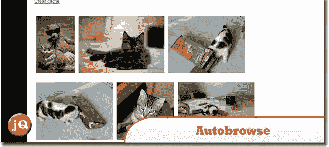
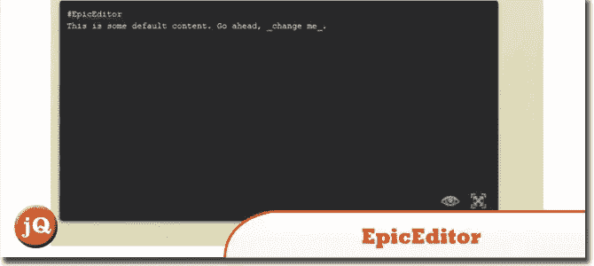
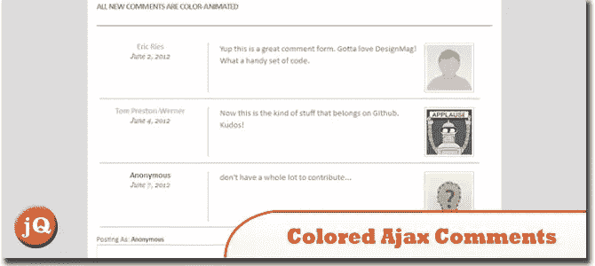
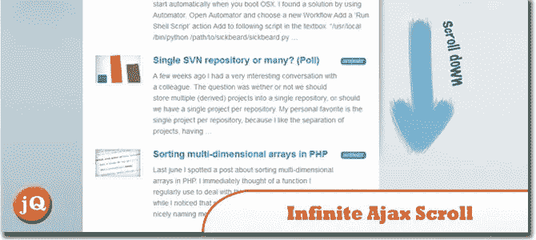
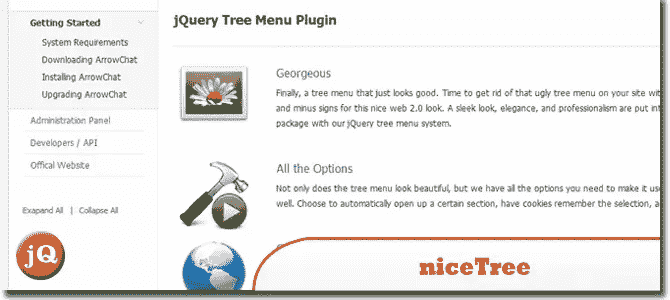
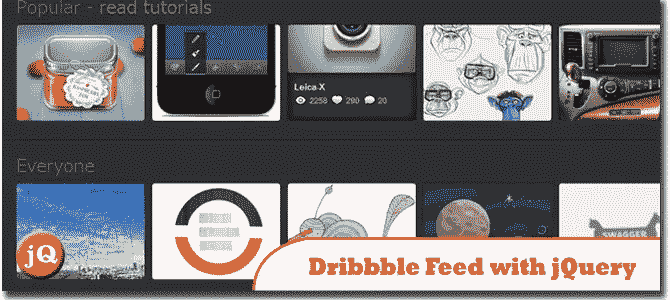

# 10 个随机的 Ajax 和 jQuery 插件

> 原文：<https://www.sitepoint.com/ajax-jquery-plugins/>

今天，我们分享给你我们的 10 个随机的好的 Ajax 和 jQuery 插件来满足你所有的网页设计需求。真的值得一查！玩得开心！

**相关帖子:**

*   [**jQuery Ajax 验证使用远程规则**](http://www.jquery4u.com/ajax/jquery-ajax-validation-remote-rule/)
*   [**jQuery Ajax 函数示例**](http://www.jquery4u.com/function-demos/ajax/)
*   [**jQuery 的 JSONP 举例说明**](http://www.jquery4u.com/json/jsonp-examples/)

## 1.metro panel——使用 jQuery、HTML5 和 Ajax 的现代网站导航器

一个新的导航系统，为现代网站提供以下功能:
>两个面板位置:左和右
>无限项目
>无限背景
> AJAX + HTML5 智能加载 SEO
> jQuery + CSS3 动画效果
>自动显示或自动隐藏面板
>便于为几乎所有的网站部署
>许多选项用于自定义
 
[来源](http://codecanyon.net/item/metropanel-the-new-navigator-for-modern-sites/2774852)

## 2.Twitter stream

jQuery、AJAX 和 Twitter 搜索 API。
 
[源+演示](http://www.iamnoahcooper.com/TwitStream/)

## 3.jQuery 图形轮询

创建和定制您自己的投票。创新，有趣的图表投票动态允许用户回答问题和投票。伟大的互动功能添加到您的网站。添加这个易于使用的投票将增加你的网站的粘性。
 
[来源](http://codecanyon.net/item/graph-poll/2746389) [演示](http://codecanyon.net/item/graph-poll/full_screen_preview/2746389)

## 4.autobrowse jquery 外挂程式

这个插件增加了当用户滚动页面时自动加载页面内容的 ajax 功能，内置了浏览器缓存。当用户到达页面的末尾时，它会获取更多的内容。
 
[来源](https://github.com/msjolund/jquery-esn-autobrowse) [演示](http://msjolund.github.com/autobrowse/)

## 5.EpicEditor

一个可嵌入的 JavaScript Markdown 编辑器，具有分屏全屏编辑、实时预览、自动保存草稿、离线支持等功能。
 
[源+演示](http://oscargodson.github.com/EpicEditor/)

## 6.用 jQuery 制作彩色 Ajax 注释动画

在本教程中，我想看看如何使用 jQuery 来制作自定义注释的动画。该表单将匿名提交每个帖子，不会将任何内容保存到本地数据库。这些效果只是为了展示——但是你可以很容易地将动态代码应用到一个系统中，比如 WordPress、vBulletin、Joomla！，甚至是您自己定制的后端。
 
[来源](http://designm.ag/tutorials/animating-colored-ajax-comments-with-jquery/) [演示](http://designm.ag/previews/colored-ajax-comments/)

## 7.无限 Ajax 卷轴，一个 jQuery 插件

一个插件，可以轻松地将你现有的分页变成无限滚动的分页。
 
[来源](http://www.fieg.nl/infinite-ajax-scroll-a-jquery-plugin) [演示](http://www.fieg.nl/ias-demo)

## 8.nice Tree-jQuery 树插件

用 niceTree 去掉你网站上难看的树形菜单。一个易于安装的 JQuery 插件，比你需要的选项更多。niceTree 将把你的 HTML 转换成一个可折叠的菜单系统，在菜单中有无限的菜单。
 
[来源](http://codecanyon.net/item/nicetree-jquery-tree-plugin/2735552?ref=jqueryrain) [演示](http://codecanyon.net/item/nicetree-jquery-tree-plugin/full_screen_preview/2735552)

## 9.简单的 jQuery XML 教程

jQuery 是一个奇妙的 JavaScript 库，它有一个简单的 API 来处理 AJAX。AJAX 的一部分是基于 xml 的，所以解析 XML 是 AJAX 请求的核心元素之一。
 
[来源](http://keycss.com/javascript/jquery-xml-tutorial.html) [演示](http://keycss.com/tutorials/jquery/jquery-xml-tutorial/)

## 10.如何用 jQuery 和 CSS3 抓取 Dribbble Feed

今天我们来看看 dribbble 的 API。Dribbble 是一个展示你的设计的地方，它是基于邀请的基础上，因此大多数设计都是高质量的。
 
[来源](http://www.queness.com/post/11929/how-to-grab-dribbble-feed-with-jquery-and-css3) [演示](http://www.queness.com/resources/html/dribbble-api-demo/index.html)

## 分享这篇文章