# 用 JavaScript 创建一个简单的 Windows 8 游戏:输入和声音

> 原文：<https://www.sitepoint.com/creating-a-simple-windows-8-game-with-javascript-input-and-sound/>

这一系列帖子将向您展示如何使用 HTML5、JavaScript、WinJS 和 [CreateJS](http://createjs.com/) 创建一个简单的 Windows 8 游戏。

游戏基于 XNA 样本游戏[《弹射器战争实验室》](http://msdn.microsoft.com/en-us/windowsphonetrainingcourse_2dgamedevelopmentwithxnalab.aspx)。在开发基于网络技术的新版 Windows 8 时，我们将重复使用该游戏中的资产。

在本帖中，我们将响应用户的输入，并通过添加声音使事情变得更加生动。

## 处理用户输入

当然，我们有很多方法可以进行射击瞄准——随机的、基于时间的、基于精度的(例如“点击…现在！”)，但在这种情况下，我们将让用户画一条线来指示方向和速度。

首先，让我们在`default.js`的顶部附近添加新的变量:

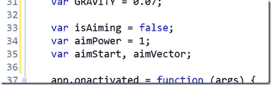

Windows 8 支持多种绘画方式——鼠标、触摸、笔——我们的游戏需要足够灵活，以支持用户拥有的任何方式。幸运的是， [MSPointer](http://msdn.microsoft.com/en-us/library/windows/apps/Hh781218.aspx) 系统将对所有这些的支持整合到了一起。我们将使用`MSPointerDown/Up`开始和结束瞄准，加上`MSPointerMove`在用户调整瞄准时提供反馈。

顺便说一下，通过`MSGesture`也有很大的支持来检测手势，如点击，双击等。处理输入和手势的一个很好的例子是 MSDN 上的[“ballin eight”示例](http://code.msdn.microsoft.com/windowsapps/Manipulations-and-gestures-26918bb3)。

这些事件通过指向侦听器函数来使用，这些函数在它们触发时被调用。现在让我们来处理这个问题，在`initialize()`函数的顶部附近添加:

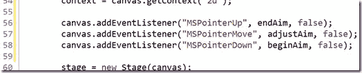

现在是函数本身:添加到你喜欢的地方，但是我放在了`update()`和`fireShot()`之间:

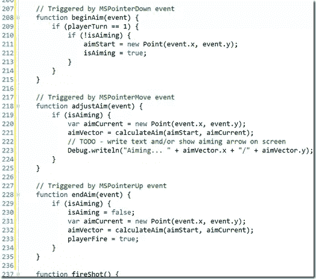

请注意，这里留下了一个练习。为了简单起见，我省略了显示带有 aim %的文本和/或在`adjustAim()`函数中画一个瞄准箭头。继续并尝试添加它——在前面的部分中，我们已经使用了您将需要的完全相同的技术。

和一个帮助我们计算目标的函数:

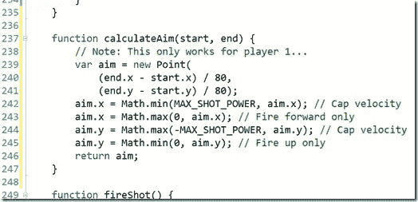

再一次，简单决定一切，这只适用于参与人 1，但事情是这样的:

*   **第 239-241 行**–从开始到结束`Point`秒的距离创建一个新的`Point`，将其缩小到一个合适的速度以应用于每帧/更新。
*   **第 242 行&第 244 行**——确保`x`和`y`被限制，这样镜头不会简单地从屏幕上消失，走得太快
*   确保子弹射向敌人……或多或少。

我们之前给`update()`添加了一些临时代码，让玩家 1 总是随机开火。现在我们可以替换它，使用新的`aimVector`:

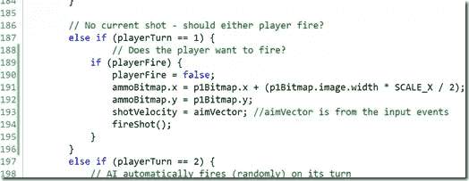

继续运行游戏…

现在，您可以使用鼠标、笔或触摸来控制拍摄！

## “我一定是听到了什么！”–添加声音

我们作为游戏开发者的工作直到我们有了声音才算完成。我们已经在[第 2 部分](https://www.sitepoint.com/creating-a-simple-windows-8-game-with-javascript-game-basics-createjseaseljs/)中添加了声音文件，所以让我们进行下一步加载它们。

首先，`default.js`中的几个变量让事情保持整洁:

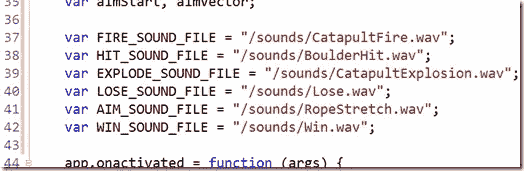

回想一下[第二部分](https://www.sitepoint.com/creating-a-simple-windows-8-game-with-javascript-game-basics-createjseaseljs/)中，我们已经连接好`PreloadJS`以确保我们的资源在游戏开始时准备就绪？我们可以对声音使用相同的方法，所以让我们将它们添加到清单中:

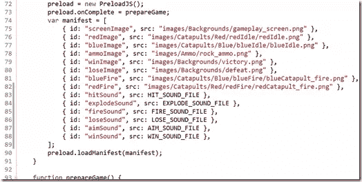

为了使用这些文件，我们将创建 HTML `audio`元素的实例。长话短说，如果您简单地为每个声音文件创建一个音频实例，您可能会遇到剪辑，因为一个声音在该实例的前一次播放完成之前无法播放。有几种方法可以处理这个问题(例如，参见[“html 5 音频和 JavaScript 控制”](http://www.storiesinflight.com/html5/audio.html))，但是我们将做简单的& *低效的*事情，即每次播放声音时使用一个实例。

注意，在这个例子中我们不会使用[sound js](http://createjs.com/#!/SoundJS)(create js 的另一部分)，但是当然欢迎你尝试一下！

添加`playSound(file)`辅助函数:

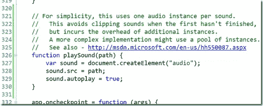

就是这样！现在我们只是调用它，指定指向正确文件的常量。我们将在几个地方这样做。

首先，添加对`fireShot()`的调用:

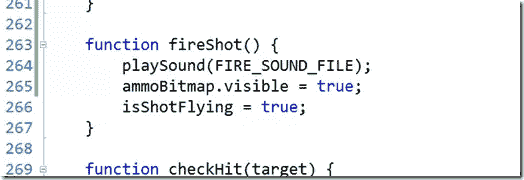

现在，`processHit()`:

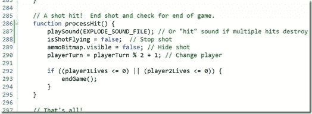

正如评论中提到的，如果你想用多次撞击来摧毁一个弹弓，你可以用“撞击”来代替“爆炸”。

最后，在`endGame()`中播放结束输赢声音:

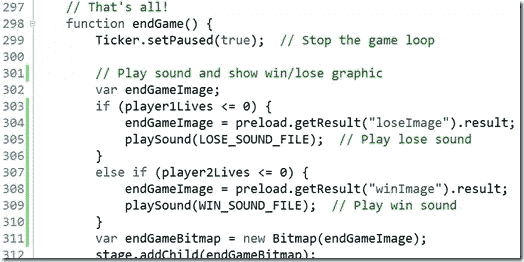

去试一试吧。

## 游戏继续…继续…继续…

恭喜你！你做了一个游戏！

我们已经在这些帖子中涉及了很多内容，但是像任何事情一样，还有很多其他的事情可以尝试。为什么不尝试一下呢？

*   屏幕调整–纵向/横向、对齐/填充。一个学习 CSS 媒体查询的好机会！
*   改进触摸/手势支持
*   精灵/动画-射击命中/未命中，弹射器拉回/开火，弹射器被摧毁
*   游戏动态——增加风，新场景，新的弹射功能/升级，弹药选择，等等。
*   添加一座山和移动的云到背景中(资产已经存在)
*   给目前非常*的人工*智能增加一些*智能*
*   考虑使用实时磁贴——也许显示玩家的最后/最高分？

尽情享受吧！期待听到你添加的令人敬畏的新东西！

## 分享这篇文章