# 在 Photoshop 中创建一个充满活力的矢量沙发

> 原文：<https://www.sitepoint.com/create-a-vibrant-vectorized-sofa-in-photoshop/>

你不可能总是在网上找到完美的矢量化对象。设计师经常被要求为独特的目的提供非常具体的插图。因此，保持你的插图技巧敏锐是至关重要的。任何人都可以寻找完美的股票照片或矢量图像，但你需要保持你的技能敏锐，以应对那些高度专业化的客户要求，这些要求不会满足简单的股票购买。

在本教程中，我将带你在 Photoshop 中从头开始创建一个时尚的沙发矢量的过程。插画师在设计矢量图像时很少关注沙发枕等“模糊”的物体；本教程将帮助你保持“柔软和蓬松”在你的矢量化技能集中。此外，如果你办公室里还没有舒适的沙发，你可以在几分钟内设计自己的沙发。在这个过程中，你将学习钢笔工具的使用，不同的图层样式技术，以及如何给物体添加一个微妙的阴影。我们还将为展示创建一个较暗的房间背景。所以，让我们开始吧！

**资源:**

Starnetblog 的垃圾纹理

[由 deiby 制作的木材纹理](http://www.flickr.com/photos/deiby/2528506906/sizes/l/in/photostream/ " Wood texture by deiby")

[插图由菲尔·邓斯基制作](http://www.behance.net/gallery/My-Way-Home/3910031 "Illustration by Fil Dunsky")

**最终结果:**

在我们开始之前，让我们看看我们的最终结果:

### 第一步

在 Photoshop 中创建一个宽度为 900 像素、高度为 650 像素的新文档。

[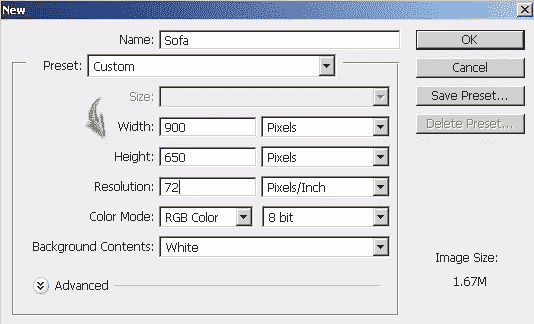](https://www.sitepoint.com/wp-content/uploads/2012/08/112.jpg)

### 第二步

首先，我们将创建沙发的椅背。为此，设置#43c609 作为你的前景色，并选择圆角矩形工具来绘制一个矩形。

[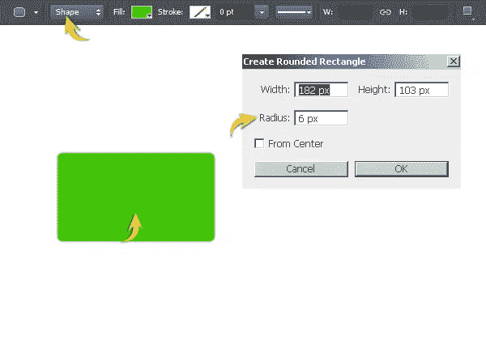](https://www.sitepoint.com/wp-content/uploads/2012/08/23.jpg)

### 第三步

双击矩形图层打开“图层样式”窗口。应用以下设置:

[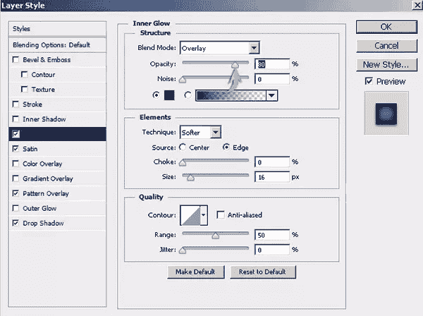](https://www.sitepoint.com/wp-content/uploads/2012/08/31.jpg)

[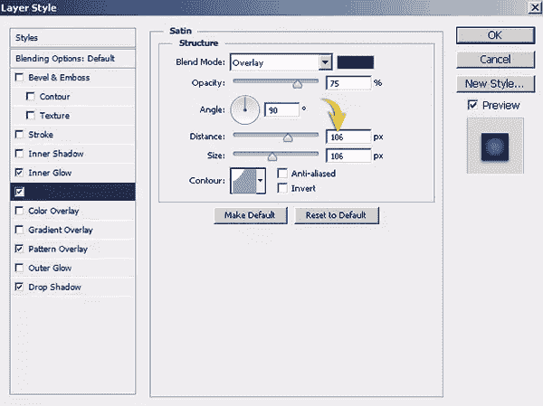](https://www.sitepoint.com/wp-content/uploads/2012/08/3b1.jpg)

[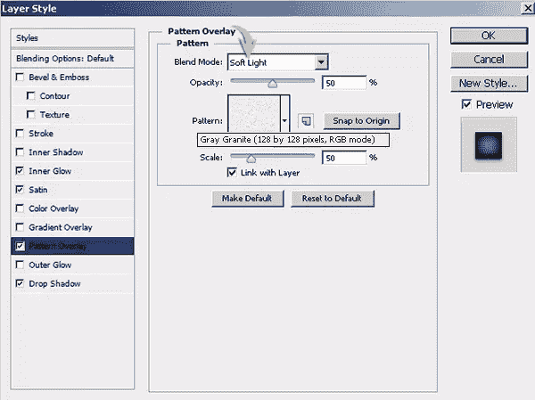](https://www.sitepoint.com/wp-content/uploads/2012/08/3c1.jpg)

[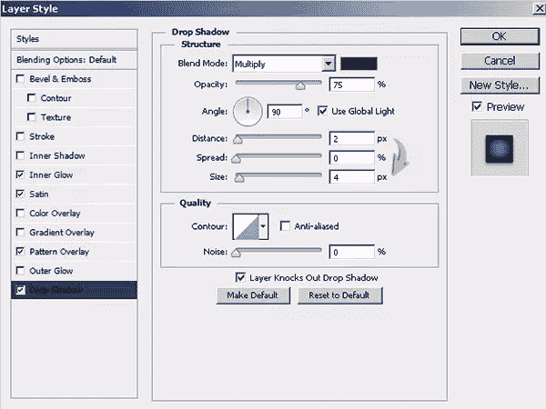](https://www.sitepoint.com/wp-content/uploads/2012/08/3d1.jpg)

[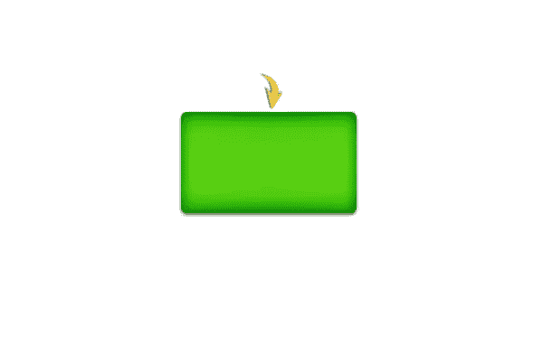](https://www.sitepoint.com/wp-content/uploads/2012/08/3e.jpg)

### 第四步

给它更多的字符，按 Ctrl + <click on="" the="" rectangle="" layer="">选择它周围，然后创建一个新的层。之后，进入“编辑”>“填充”，在内容框中使用 50%的灰色，将这一层的混合模式改为“叠加”</click>

[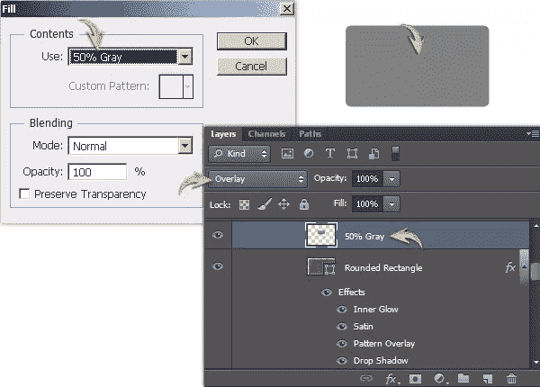](https://www.sitepoint.com/wp-content/uploads/2012/08/41.jpg)

现在使用加深工具(范围:阴影，曝光:45%)在这个选区的底部边框，使用减淡工具(范围:高光，曝光:45%)在顶部边框。一旦你完成了，收集圆角矩形层和这个灰色层在一组，并标记为“回 1。”

[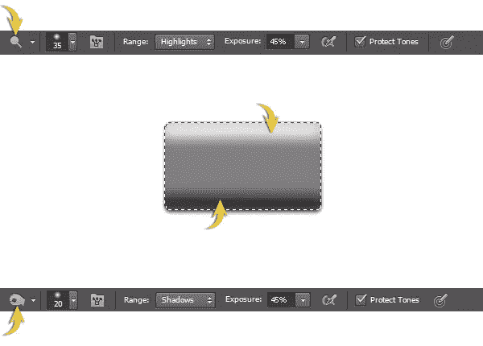](https://www.sitepoint.com/wp-content/uploads/2012/08/4b1.jpg)

### 第五步

通过“图层”>“复制组”复制“back1”组两次，然后在移动工具(“V”)的帮助下，如下图所示排列它们。

[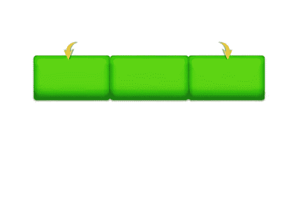](https://www.sitepoint.com/wp-content/uploads/2012/08/52.jpg)

### 第六步

现在，我们将创建沙发的座位。为此，设置#63c902 作为你的前景色，并选择钢笔工具(工具模式:形状)绘制如下所示的形状。

[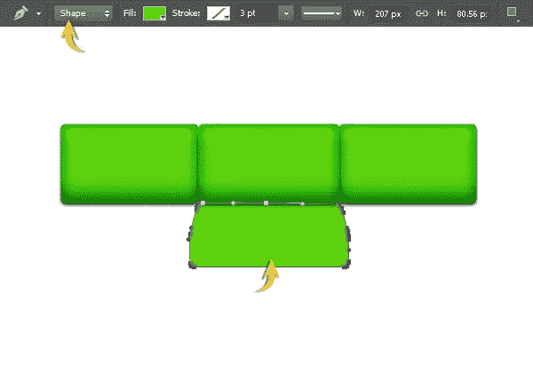](https://www.sitepoint.com/wp-content/uploads/2012/08/61.jpg)

### 第七步

现在，使用钢笔工具绘制如下侧座。

[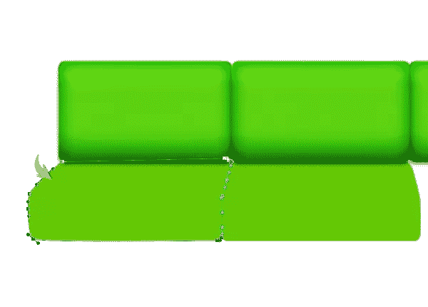](https://www.sitepoint.com/wp-content/uploads/2012/08/71.jpg)

之后，复制这个新的形状，进入“编辑”>“变换”>“水平翻转”，排列在右边，如下图。

### 第八步

现在，我们将风格化的座位。首先，双击中央座椅层，并使用以下设置。

[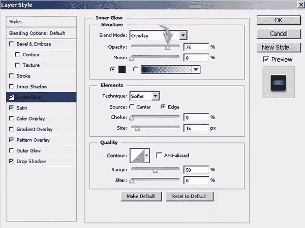](https://www.sitepoint.com/wp-content/uploads/2012/08/81.jpg)

[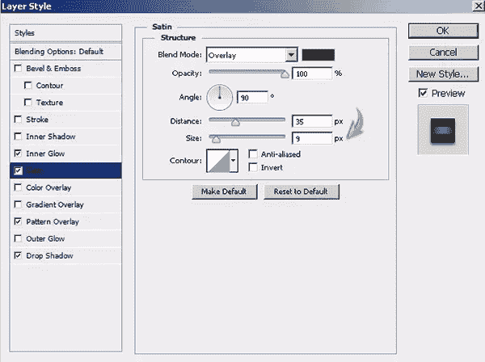](https://www.sitepoint.com/wp-content/uploads/2012/08/8b.jpg)

[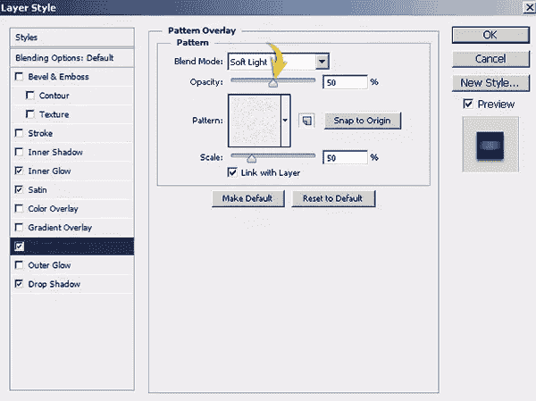](https://www.sitepoint.com/wp-content/uploads/2012/08/8c.jpg)

[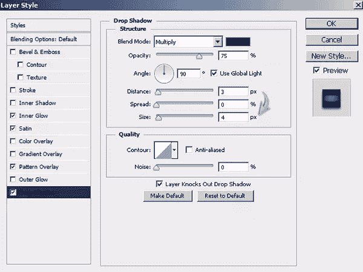](https://www.sitepoint.com/wp-content/uploads/2012/08/8d.jpg)

[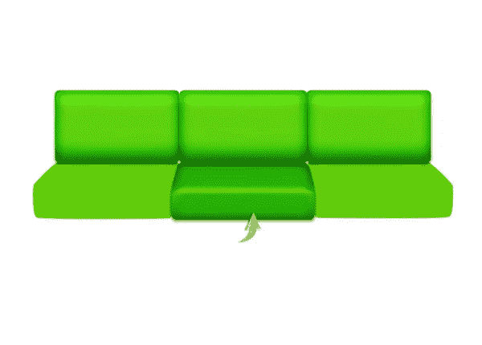](https://www.sitepoint.com/wp-content/uploads/2012/08/8e.jpg)

### 第九步

右键单击中间的座位层，选择“复制图层样式”，然后右键单击旁边的座位层一个接一个，选择“粘贴图层样式”应用相同的效果。但是，您需要分别调整左右座椅的“缎面”角度。双击左边的座位层，使用 73⁰的角度为“缎子”对于右侧座椅，使用 106⁰角。

[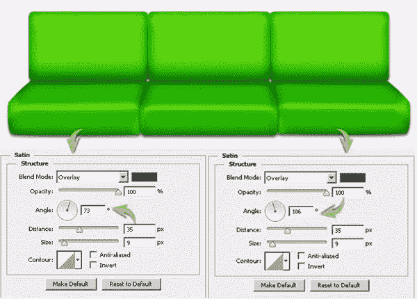](https://www.sitepoint.com/wp-content/uploads/2012/08/91.jpg)

### 第十步

接下来，我们将创建沙发的底座。为此，设置#37ba0b 为前景色，使用圆角矩形工具在背景图层上方的图层上绘制一个矩形。

[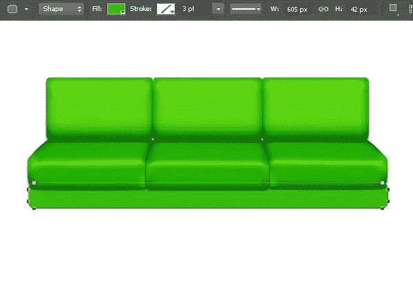](https://www.sitepoint.com/wp-content/uploads/2012/08/101.jpg)

### 步骤 11

现在，在这个新的矩形图层上应用下面的“描边”和“内阴影”设置。

[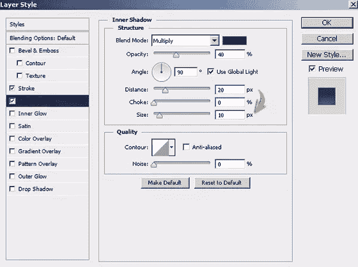](https://www.sitepoint.com/wp-content/uploads/2012/08/11b1.jpg)

[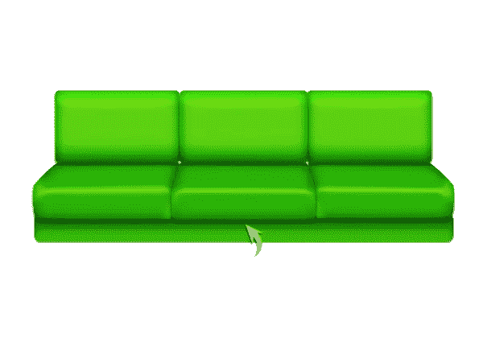](https://www.sitepoint.com/wp-content/uploads/2012/08/11c3.jpg)

### 步骤 12

接下来，使用矩形选框工具在其余图层下方绘制一个大矩形，并使用油漆桶工具填充颜色#0d5c00。目的是填满座位之间的所有微小间隙。

[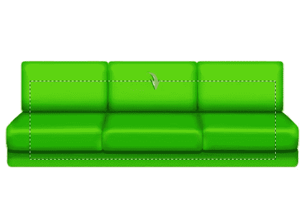](https://www.sitepoint.com/wp-content/uploads/2012/08/121.jpg)

### 第十三步

接下来，我们将制作沙发的扶手。设置#43c609 为前景色，选取钢笔工具(工具模式:Shape)绘制如下图的形状。

[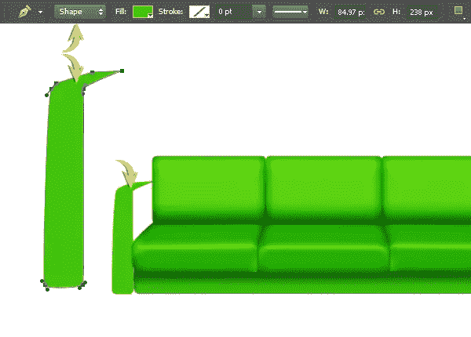](https://www.sitepoint.com/wp-content/uploads/2012/08/131.jpg)

### 步骤 14

在手臂形状上应用以下图层样式设置:

[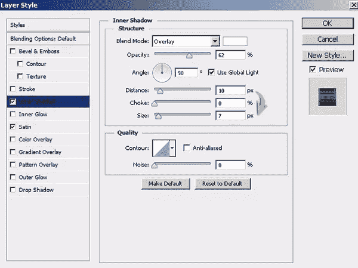](https://www.sitepoint.com/wp-content/uploads/2012/08/141.jpg)

[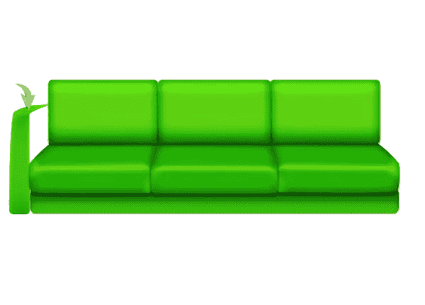](https://www.sitepoint.com/wp-content/uploads/2012/08/14c1.jpg)

### 第十五步

现在，为了完成手臂，使用颜色#257c07 画一个垂直的圆角矩形，然后进入“编辑”>“变换”>“扭曲”使用“扭曲”给它一个如下图所示的形状。

[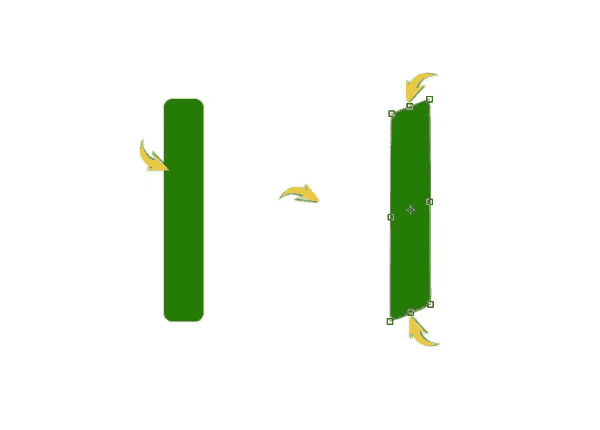](https://www.sitepoint.com/wp-content/uploads/2012/08/151.jpg)

现在，按 Ctrl + <click on="" this="" rectangle="" layer="">在它周围做一个选区，在矩形上面新建一个图层，用“50%灰色”填充这个选区然后，在这一层应用加深工具，如下图所示。最后，改变这个新图层的混合模式为“叠加”，就像我们在步骤 4 中所做的那样。</click>

[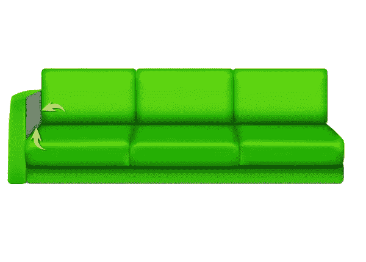](https://www.sitepoint.com/wp-content/uploads/2012/08/15b1.jpg)

### 第十六步

将形成扶手的所有层收集成一组，复制该组，水平翻转该组，形成沙发的相对扶手。

[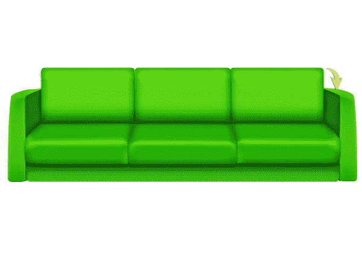](https://www.sitepoint.com/wp-content/uploads/2012/08/161.jpg)

### 步骤 17

接下来，我们将创建沙发的脚。使用圆角矩形工具创建一个半径为 3px 的矩形。然后，使用“扭曲”工具给它如下所示的形状。之后，选择椭圆工具，从顶部属性栏选择“合并形状”，在矩形的下边缘画一个椭圆来完成脚。

[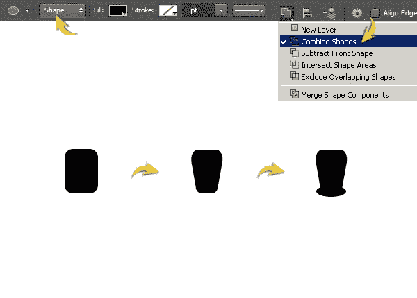](https://www.sitepoint.com/wp-content/uploads/2012/08/173.jpg)

### 步骤 18

现在，应用下面的图层样式设置在脚层:

[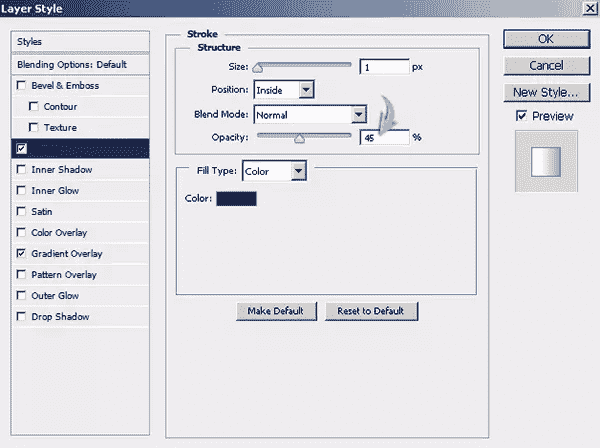](https://www.sitepoint.com/wp-content/uploads/2012/08/181.jpg)

[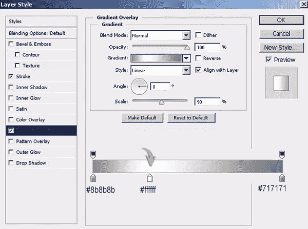](https://www.sitepoint.com/wp-content/uploads/2012/08/18b.jpg)

之后，复制脚层，水平翻转，形成沙发的另一只脚。

[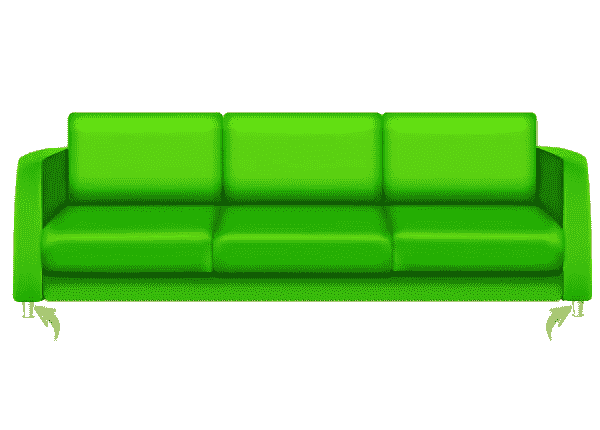](https://www.sitepoint.com/wp-content/uploads/2012/08/18c.jpg)

### 步骤 19

接下来，我们将创建阴影。选择矩形工具在背景上方画一个纯黑的矩形。在“扭曲”工具的帮助下，给它一个类似下图的形状。

[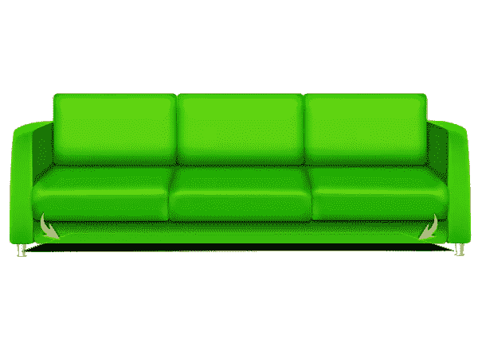](https://www.sitepoint.com/wp-content/uploads/2012/08/191.jpg)

### 步骤 20

右键单击阴影层，选择“栅格化层”然后，进入“滤镜”>“模糊”>“高斯模糊”对高斯模糊使用 3.5px 的 ta 值。现在，使用自由变换工具(Ctrl+“T”)拉伸阴影，如下所示。完成后，将阴影层的混合模式改为“正片”，不透明度降低到 50%。

[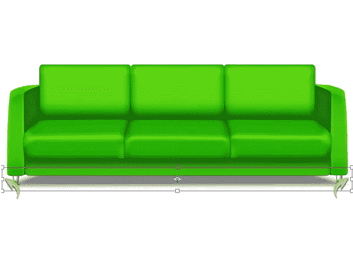](https://www.sitepoint.com/wp-content/uploads/2012/08/204.jpg)

沙发模型做好了。这是它的样子。

[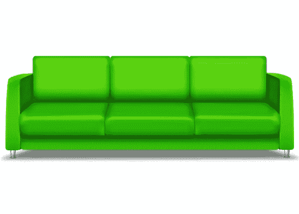](https://www.sitepoint.com/wp-content/uploads/2012/08/20b.jpg)

### 步骤 21

现在，我们将为展示创建一个较暗的房间背景，这将增强对模型和您的产品的关注。单击“图层”面板底部的“创建新的填充或调整图层”图标，在背景上方创建一个渐变调整图层。

[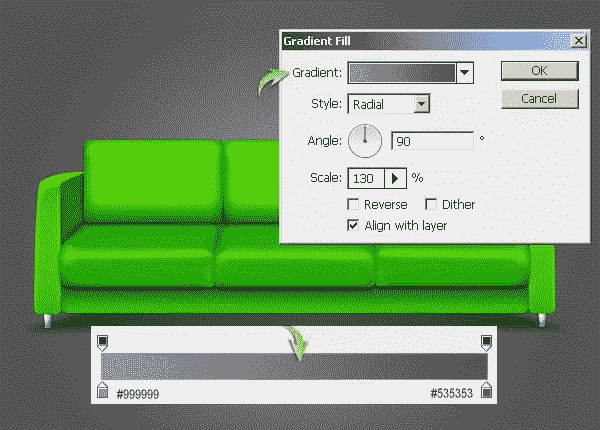](https://www.sitepoint.com/wp-content/uploads/2012/08/213.jpg)

在 Photoshop 中打开垃圾纹理，并将其拖动到渐变图层上方的文档中。改变纹理的混合模式为“光度”，降低其不透明度为 10%。

[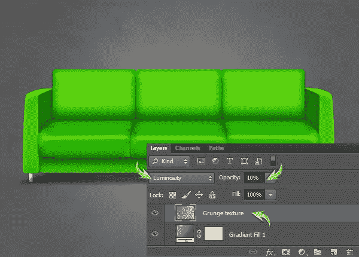](https://www.sitepoint.com/wp-content/uploads/2012/08/21b.jpg)

### 步骤 22

现在，将木头纹理放在垃圾纹理上面，使用“扭曲”工具如下图所示进行排列。

[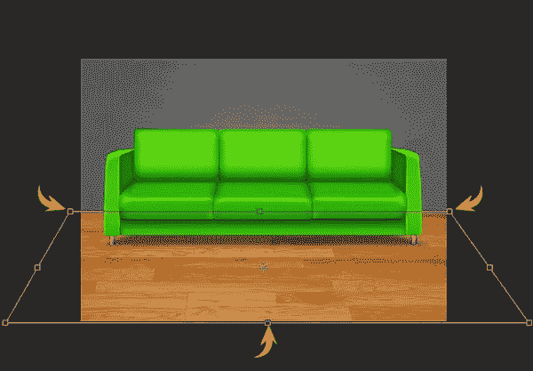](https://www.sitepoint.com/wp-content/uploads/2012/08/221.jpg)

我们需要在木材纹理上增加两个调整层:“色调/饱和度”来降低纹理的饱和度，以及“亮度/对比度”对它们使用以下设置。

[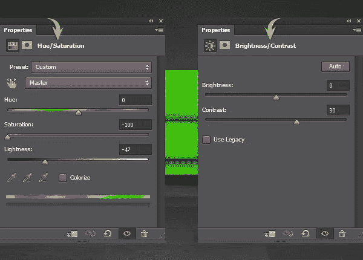](https://www.sitepoint.com/wp-content/uploads/2012/08/22b3.jpg)

### 步骤 23

在背景图层上面画一个颜色为#cdcdcd 的矩形，在这个图层上使用下面的“斜面和浮雕”设置。

[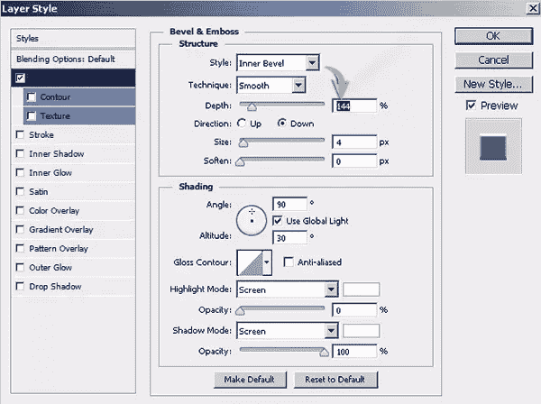](https://www.sitepoint.com/wp-content/uploads/2012/08/231.jpg)

[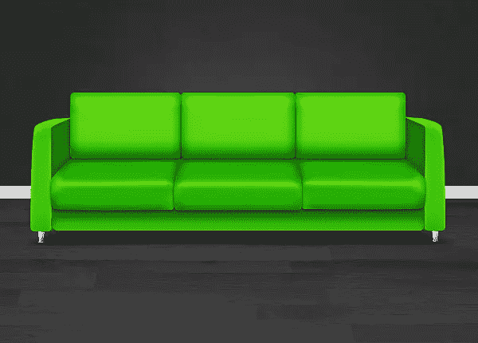](https://www.sitepoint.com/wp-content/uploads/2012/08/Final-result3.jpg)

以下是它如何支持并为采用现代艺术形式的广告添加内容:

[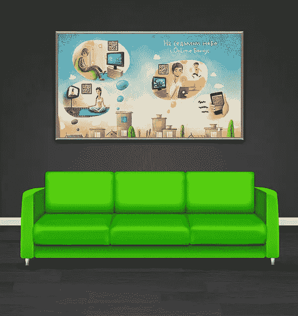](https://www.sitepoint.com/wp-content/uploads/2012/08/Final-result22.jpg)

就这样，伙计们。我希望你喜欢这个教程，并学到一些有用的东西。请分享你对此的想法。

## 分享这篇文章