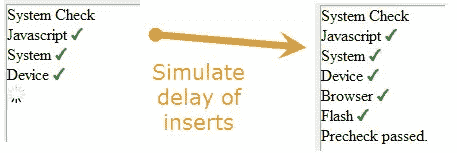

# 使用 jQuery 和 setTimeout()模拟延迟

> 原文：<https://www.sitepoint.com/simulating-delay-settimeout/>

有时您可能希望**模拟事件**的延迟，例如在页面上显示之前模拟结果的加载。这个例子使用了一个**递归 setTimeout()** 来调用一个函数，该函数循环遍历一个数据数组，该数组包含系统预检查的结果，以检查 JavaScript、Flash、浏览器版本等……*当我有时间时，我可能会将它编码到一个 jQuery 插件中，这将很容易，只需要确定提供哪些选项来满足不同的用途*。



[试玩](https://jsfiddle.net/ywsaS/3/)

### jQuery 代码递归 setTimeout()

 `//数据和设置
var result = '

预检查通过。

，//html 主结果
delay = 500，//子结果
data = Array(
)

*   Javascript 

，
'

*   系统

，
'

*   设备

，
'

*   浏览器

，
'

*   闪光

)；

//从数组索引 0
开始自动执行函数(function process_els(el_index) {

var el = data[el_index]，
pre check = $(' # pre check ul ')，
loadingLi = $('

*   

‘),
sysPreId = “syspre_”+el_index;

//显示加载图像
pre check ul . append(loading Li . clone()。attr("id "，sysPreId))；

//模拟延时后，用子检查结果
setTimeout(function()
{
pre check . find(' Li . loading:first))替换加载图像。replace with(data[El _ index])；

}，延迟)；

//模拟延迟递归调用自身，直到所有数组元素都被处理完
if (el_index + 1 HTML

```
 ## 系统检查

​
```` 

## `分享这篇文章`