# 用 JavaScript 创建一个简单的 Windows 8 游戏:游戏逻辑

> 原文：<https://www.sitepoint.com/creating-a-simple-windows-8-game-with-javascript-game-logic/>

这是为期四周的四篇系列文章中的第三篇，将向您展示如何使用 HTML5、JavaScript、WinJS 和 [CreateJS](http://createjs.com/) 创建一个简单的 Windows 8 游戏。

游戏基于 XNA 样本游戏[《弹射器战争实验室》](http://msdn.microsoft.com/en-us/windowsphonetrainingcourse_2dgamedevelopmentwithxnalab.aspx)。在开发基于网络技术的新版 Windows 8 时，我们将重复使用该游戏中的资产。

在本帖中，我们将通过一些游戏逻辑和 JavaScript 让事情变得生动起来。

## 游戏循环

任何游戏的心跳都是游戏循环。这是一个每秒运行多次的函数，有两个主要任务——更新正在发生的事情，然后绘制新的场景。

在[第二部分](https://www.sitepoint.com/creating-a-simple-windows-8-game-with-javascript-game-basics-createjseaseljs)中，我们已经把大纲放好了:

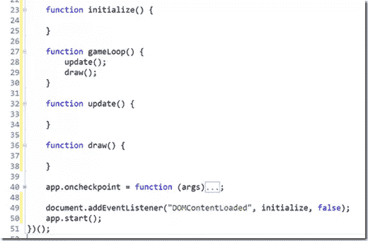

现在的问题是，我们如何启动`gameLoop()`函数，并保持它每秒运行多次？

## EaselJS Ticker 类

幸运的是，EaselJS 有一个 [Ticker](http://www.createjs.com/Docs/EaselJS/Ticker.html) 类，它有一些我们将会用到的特性:

*   管理游戏循环的时间
*   暂停/继续游戏循环
*   测量经过的时间

这是一个静态类，所以我们可以开始使用它。在`default.js`中，添加一个新的`startGame()`函数，并在`prepareGame()`的末尾调用它:

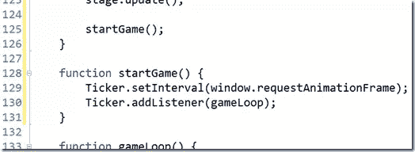

这里我们告诉 Ticker 使用`window.requestAnimationFrame`来控制调用 gameLoop 函数的频率。

是一个相对较新的网络应用程序 API，有助于确保工作不会被不必要的完成。为了理解为什么这比设置一个固定的定时器(例如用`setTimeout()`)更好，请参见 IE 试驾网站上的 [requestAnimationFrame 示例。](http://ie.microsoft.com/testdrive/Graphics/RequestAnimationFrame/Default.html)

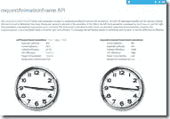

每次`requestAnimationFrame`准备好，我们的游戏循环就会运行。

## “准备，瞄准，开火！”

好了，现在我们有了一个运行游戏循环的游戏，是时候增加一些乐趣了！

每个玩家/弹射器都要向对方发射弹药/石头。我们需要知道一个镜头是否正在飞行，轮到谁了，以及这个镜头是如何移动的。

首先，让我们给`default.js`添加更多的变量:

现在让我们通过向`update()`函数添加以下内容来使用其中的一些:

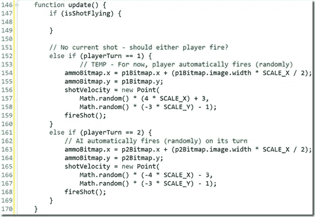

现在，两个玩家都在他们的回合中自动开火(以随机速度)。将`ammoBitma` p 移动到发射弹射器的顶部中心，`shotVelocity`被赋予一个有界范围内的随机值(针对屏幕分辨率进行调整。)

我们还将添加一个`fireShot()`函数来显示镜头，并告诉游戏它在空中:

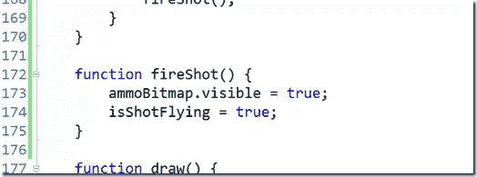

## 更新显示

在我们在空中移动镜头之前，让我们关注游戏循环等式的后半部分——绘制到屏幕上。这通常会非常复杂，但是 EaselJS Stage 负责绘制我们的内容(所有的子内容——位图、文本等)。–我们添加到 Stage)到画布上，所以这就是我们所需要的:

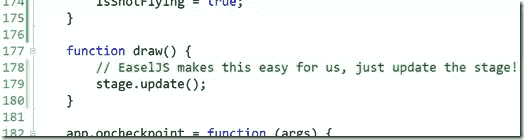

就是这样！如果你运行游戏，玩家 1 会自动开火，子弹会出现在红色弹射器上…

…但它一动不动。让我们开始行动吧。

## 移动镜头

让我们回到`update()`函数，向`if (shotIsFlying)`语句添加逻辑:

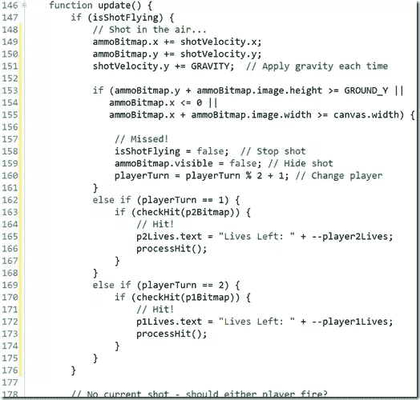

先不要运行它，我们仍然需要两个函数，但是下面是正在发生的事情:

*   **Lines 149&150**–通过增加速度来移动镜头(向上和/或向左可能是负值)
*   **第 151 行**–应用重力降低速度
*   **第 153-155 行**–镜头是落地了还是离开了屏幕的左边缘或右边缘？
*   **第 157-160 行**——错过——结束拍摄并更换球员
*   **第 162-168 行**–玩家 1 的射门–看看是否击中了玩家 2。如果是这样，更新 2 号玩家的生活。
*   **第 169-175 行**–玩家 2 的射门–看看是否击中了玩家 1。如果是，更新一号玩家的生活。

让我们添加`checkHit(Bitmap)`函数:

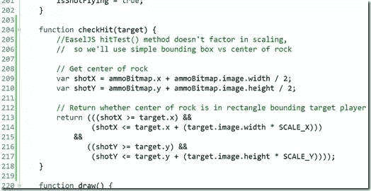

hitTest 是什么意思？EaselJS[display object](http://www.createjs.com/Docs/EaselJS/DisplayObject.html)s(`Bitmap`所基于的)支持一个`hitTest()`方法，这使得查看一个点是否在当前对象的位置上变得非常容易。不幸的是，我们正在缩放对象，hitTest 只适用于原始大小，所以我们需要自己检查命中。只需要一点数学知识，我们就可以了。

## 处理点击

现在，添加 *processHit()* 函数:

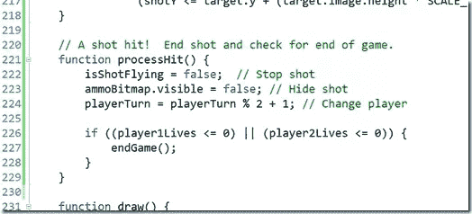

这只是结束射击，更换球员，并确保游戏没有结束。

## 结束游戏

让我们以结束游戏来结束这篇文章。添加`endgame(Image)`功能:

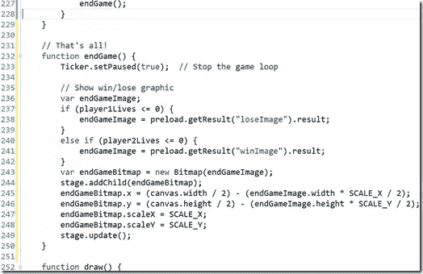

就是这样！现在你可以运行游戏，看看谁赢了。

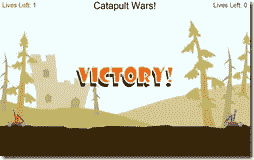 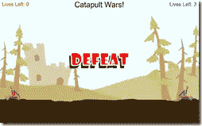

## 下一步是什么？

我们在这一部分添加了很多东西——画、移动、碰撞、结束……但是还有两个漏洞。第一，播放器实际上并没有**播放**，所以接下来我们会添加输入处理。第二，事情非常安静，特别是对于一场战争，所以我们也会加入一些声音。

继续第四部分:下周！

## 分享这篇文章