# 在 Photoshop 中创建一个彩色图像滑块

> 原文：<https://www.sitepoint.com/learn-how-to-design-a-colorful-image-slider-in-photoshop/>

图像滑块在网页设计领域非常流行。这是展示你的图像的一个很好的方式，它能瞬间抓住你的访问者的注意力。所以，今天我将带你在 Photoshop 中设计一个时尚的网页滑块。我们将使用钢笔工具，不同的形状工具，和图层样式技术来创建这个滑块。我们开始吧！

**资源:**

[静物画](http://www.behance.net/Microbot/frame/1259021 "Still Life Painting")

[雄激素字体](http://www.fontriver.com/font/androgyne/ "Androgyne Font")

**最终结果:**

在我们开始之前，让我们看看我们的最终结果:

**放大 100%时的滑块:**  

[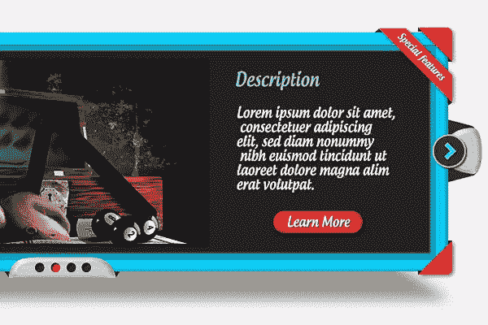](https://www.sitepoint.com/wp-content/uploads/2012/08/final.jpg)

### 第一步

在 Photoshop 中创建一个宽度为 1100 像素、高度为 650 像素的新文档。

[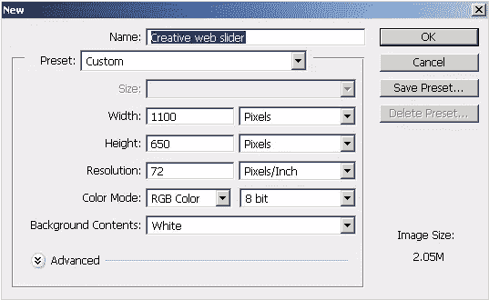](https://www.sitepoint.com/wp-content/uploads/2012/08/111.jpg)

### 第二步

首先，我们将制作滑块的框架。设置#06d0fb 为前景色，选择矩形工具画一个宽 960 像素，高 300 像素的矩形。

[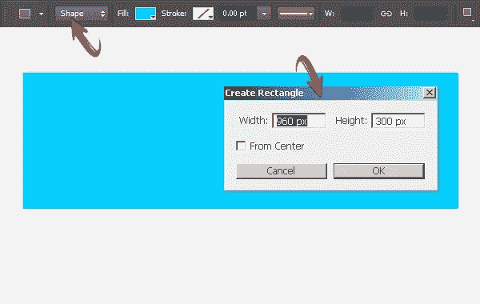](https://www.sitepoint.com/wp-content/uploads/2012/08/2.jpg)

### 第三步

双击矩形图层打开“图层样式”窗口。应用以下图层样式设置。

[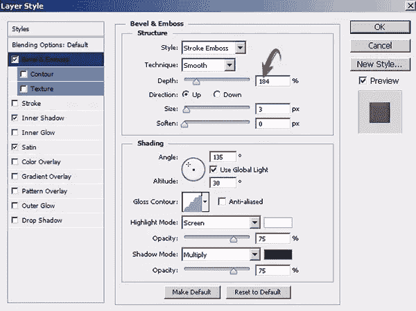](https://www.sitepoint.com/wp-content/uploads/2012/08/3.jpg)

[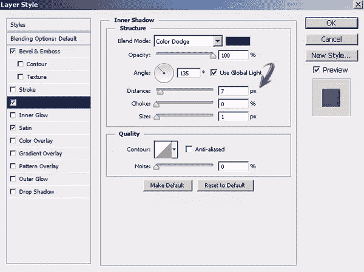](https://www.sitepoint.com/wp-content/uploads/2012/08/3b.jpg)

[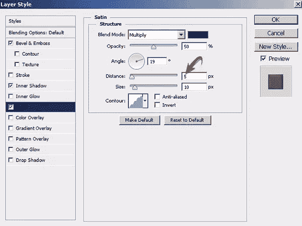](https://www.sitepoint.com/wp-content/uploads/2012/08/3c.jpg)

[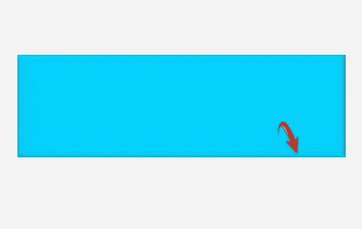](https://www.sitepoint.com/wp-content/uploads/2012/08/3d.jpg)

### 第四步

创建另一个宽度为 926 像素、高度为 270 像素的矩形。将颜色#08a2c3 用于此矩形。

[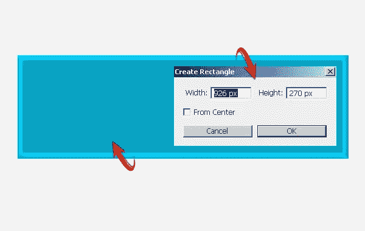](https://www.sitepoint.com/wp-content/uploads/2012/08/4.jpg)

将以下图层样式设置应用于此矩形。

[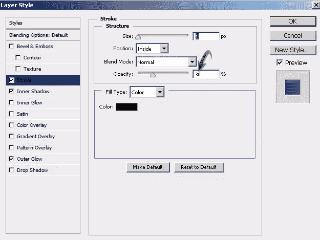](https://www.sitepoint.com/wp-content/uploads/2012/08/4b.jpg)

[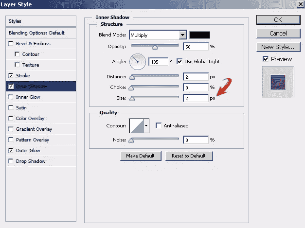](https://www.sitepoint.com/wp-content/uploads/2012/08/4c.jpg)

[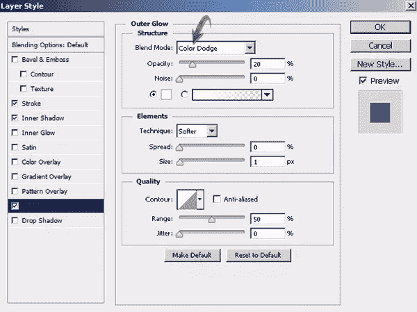](https://www.sitepoint.com/wp-content/uploads/2012/08/4d.jpg)

[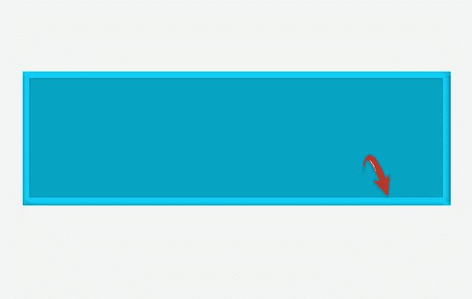](https://www.sitepoint.com/wp-content/uploads/2012/08/4e.jpg)

### 第五步

创建第三个矩形，宽 912 像素，高 252 像素。使用颜色#222222 填充矩形。

[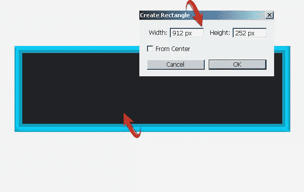](https://www.sitepoint.com/wp-content/uploads/2012/08/51.jpg)

### 第六步

在 Photoshop 中打开图像文件，并将其拖到滑块文档中。使用自由变换工具(Ctrl + "T ")调整大小并将其放置在图层顶部。

[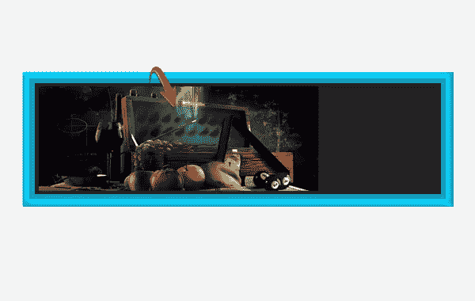](https://www.sitepoint.com/wp-content/uploads/2012/08/6.jpg)

双击图像层，并使用以下设置来应用一个中风。

[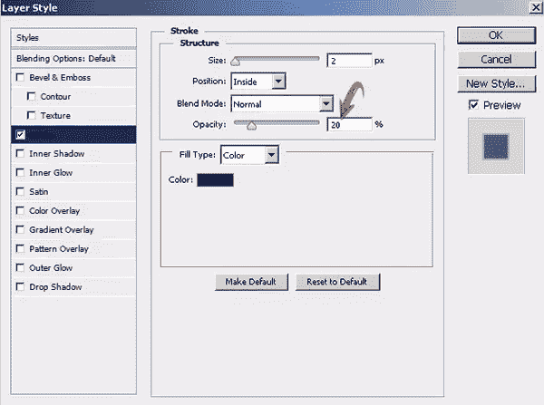](https://www.sitepoint.com/wp-content/uploads/2012/08/6b.jpg)

[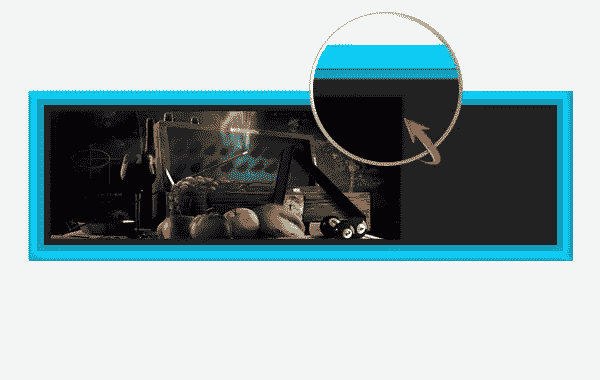](https://www.sitepoint.com/wp-content/uploads/2012/08/6c.jpg)

### 第七步

现在，选择文字工具在新图层上输入文字。我在这里使用一种叫做“雌雄同体”的字体。
[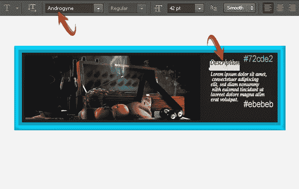](https://www.sitepoint.com/wp-content/uploads/2012/08/7.jpg)

### 第八步

接下来，我们将创建一个按钮。为此，设置#e32121 为前景色，并使用圆角矩形工具绘制一个圆角矩形。

[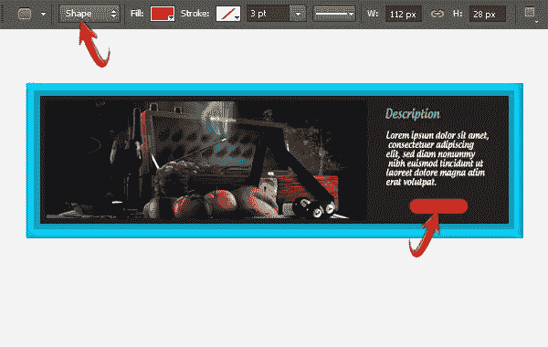](https://www.sitepoint.com/wp-content/uploads/2012/08/8.jpg)

### 第九步

在包含红色按钮的图层上应用以下图层样式设置。

[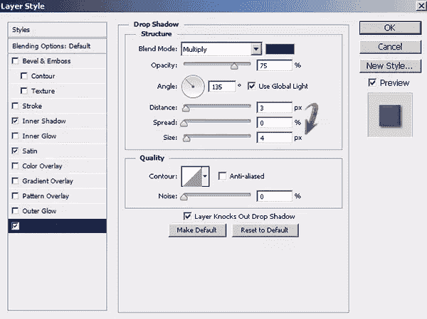](https://www.sitepoint.com/wp-content/uploads/2012/08/9c.jpg)

### 第十步

现在，我们将添加一些文本，我们希望在按钮上。使用的以下设置将投影应用于此文本。

[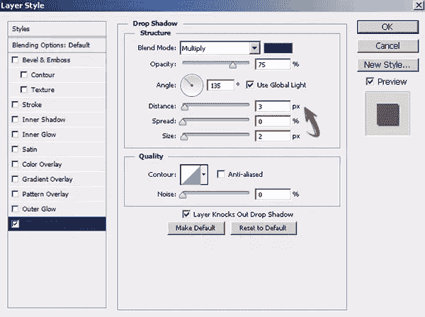](https://www.sitepoint.com/wp-content/uploads/2012/08/10.jpg)

右键单击这个红色按钮文本层，并选择“复制图层样式”选项然后，右键单击“描述”文本层，选择“粘贴图层样式”应用相同的阴影设置。

[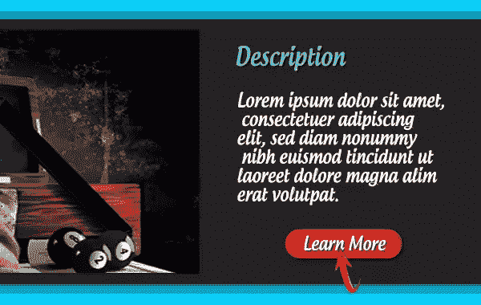](https://www.sitepoint.com/wp-content/uploads/2012/08/10b.jpg)

### 步骤 11

接下来，我们将添加滑块控件。为此，选择钢笔工具绘制如下所示的形状。确保在属性栏中选择“形状”设置。使用颜色#c1c1c1 绘制形状。

[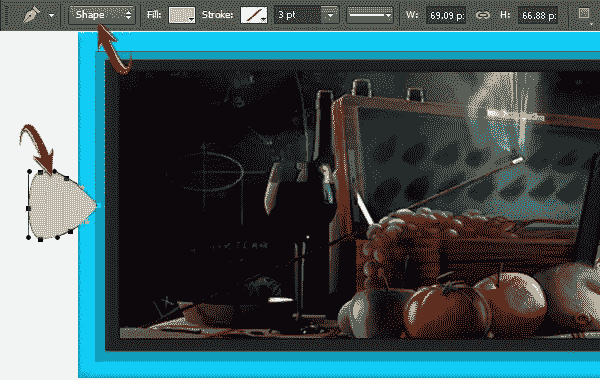](https://www.sitepoint.com/wp-content/uploads/2012/08/11.jpg)

现在，复制图层样式的红色按钮层，并粘贴到这个新绘制的形状层，以获得如下所示的效果。

[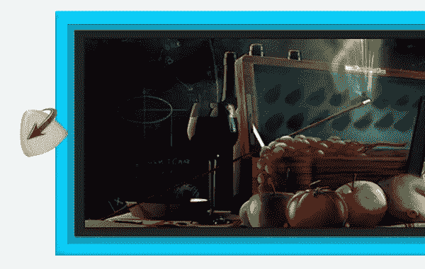](https://www.sitepoint.com/wp-content/uploads/2012/08/11b.jpg)

现在，让我们制作这个新形状的背面。用颜色#2e2e2e 画两个圆角矩形，把它们拖到其余图层下面。使用自由变换工具(Ctrl+“T”)将它们排列成一个角度，如下所示。

[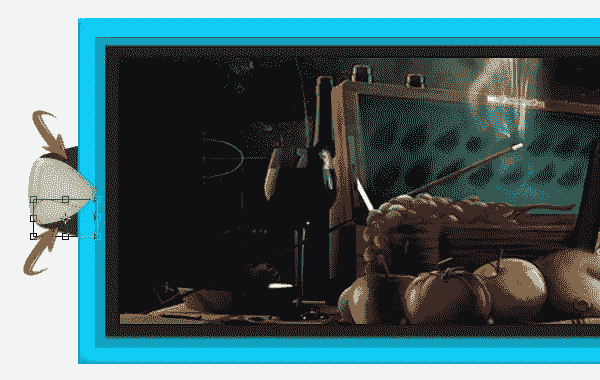](https://www.sitepoint.com/wp-content/uploads/2012/08/11c2.jpg)

### 步骤 12

使用“形状”工具模式选择椭圆工具，在图层顶部绘制一个椭圆。使用#313131 作为填充颜色，使用#c1c1c1 作为 2px 描边。

[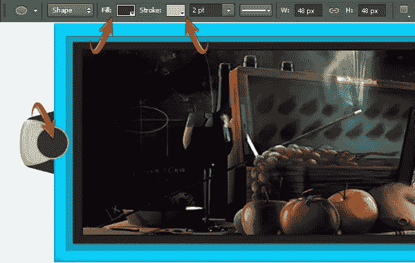](https://www.sitepoint.com/wp-content/uploads/2012/08/12.jpg)

对投影应用以下设置。

[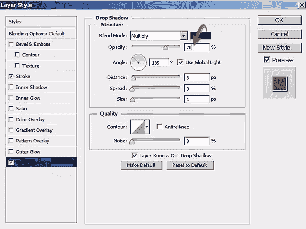](https://www.sitepoint.com/wp-content/uploads/2012/08/12b1.jpg)

[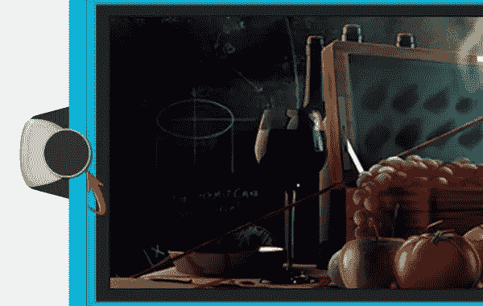](https://www.sitepoint.com/wp-content/uploads/2012/08/12c.jpg)

### 第十三步

现在，设置#57fff5 为前景色，用钢笔工具画一个箭头。

[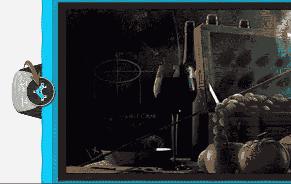](https://www.sitepoint.com/wp-content/uploads/2012/08/13.jpg)

### 步骤 14

将构成滑块控件最前面部分的层收集到一个组中，并将滑块控件的背面收集到一个单独的组中。现在，复制这两个组，通过“编辑”>“变换”>“水平翻转”将它们水平翻转，排列在滑块的右侧。结果如下所示。

[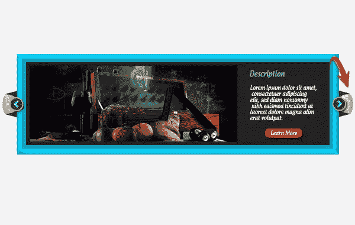](https://www.sitepoint.com/wp-content/uploads/2012/08/14.jpg)

### 第十五步

下一步，制作滑块导航，使用钢笔工具绘制如下所示的形状。使用颜色#d1d1d1。

[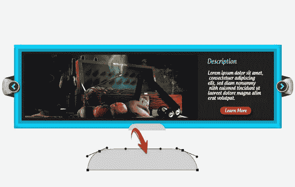](https://www.sitepoint.com/wp-content/uploads/2012/08/15.jpg)

现在，复制图层样式的红色按钮层，并粘贴到这个新的导航层。要制作它的背面部分，在背景上方的新图层上画两个矩形，并把它们排成一个角度，如下所示。
[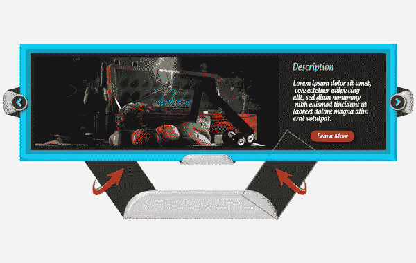](https://www.sitepoint.com/wp-content/uploads/2012/08/15b.jpg)

### 第十六步

要完成导航，制作四个大小相等的椭圆，并按如下所示排列它们。

[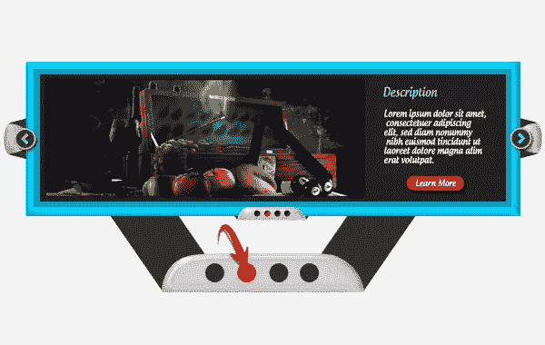](https://www.sitepoint.com/wp-content/uploads/2012/08/16.jpg)

用下面的值给这四个椭圆添加一个内阴影。

[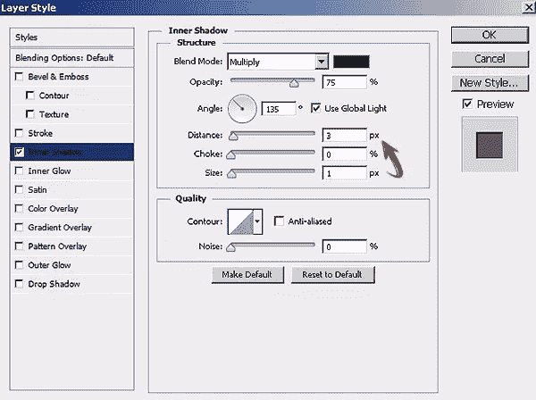](https://www.sitepoint.com/wp-content/uploads/2012/08/16b1.jpg)

[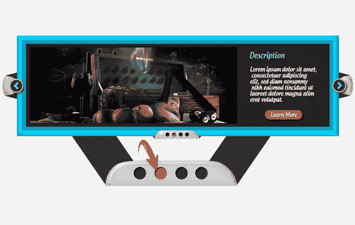](https://www.sitepoint.com/wp-content/uploads/2012/08/16c.jpg)

### 步骤 17

我们的滑块的基本布局几乎准备好了。现在，我们将添加几个项目，使它更有趣。绘制如下所示的三角形，并将红色按钮图层样式粘贴到上面。

[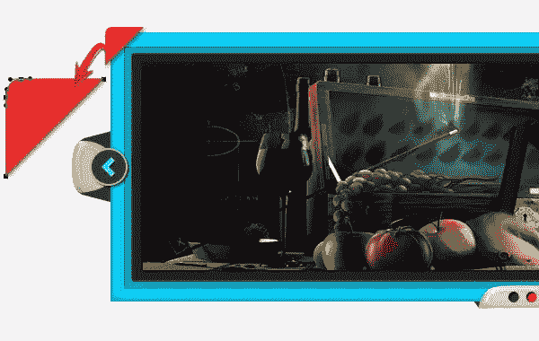](https://www.sitepoint.com/wp-content/uploads/2012/08/172.jpg)

现在，用黑色(#000000)画两个三角形来完成角盖。

### 步骤 18

将转角覆盖层收集成一组，复制三次。将这三组按如下所示的角度和位置依次旋转，排列在不同的角落。
[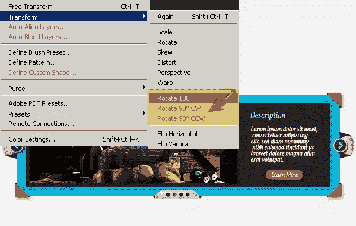](https://www.sitepoint.com/wp-content/uploads/2012/08/18.jpg)

### 步骤 19

现在，为右上角制作一个丝带，如下所示。

 在这个新的 ribbon 图层上应用下面的图层样式设置。

[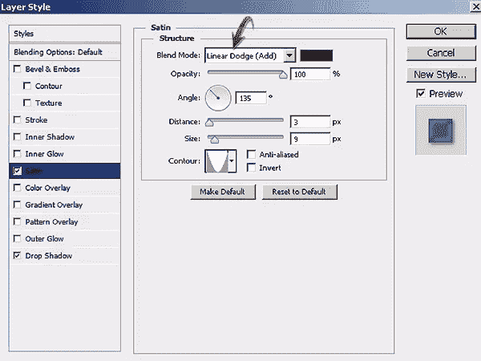](https://www.sitepoint.com/wp-content/uploads/2012/08/19b.jpg)

[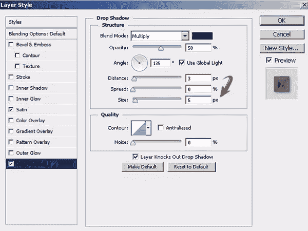](https://www.sitepoint.com/wp-content/uploads/2012/08/19c.jpg)

[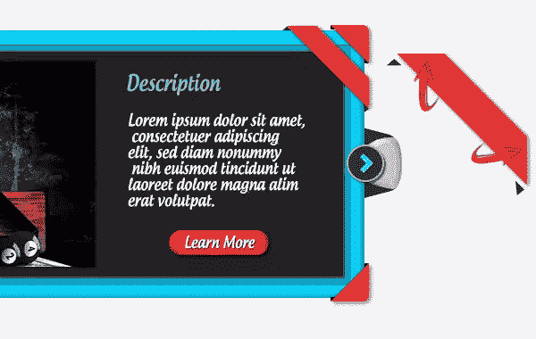](https://www.sitepoint.com/wp-content/uploads/2012/08/19d.jpg)

### 步骤 20

在功能区上添加一些文本，并将红色按钮文本层中的投影设置粘贴到功能区层上。

[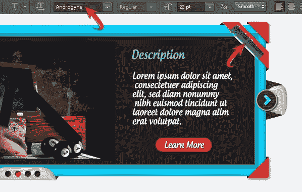](https://www.sitepoint.com/wp-content/uploads/2012/08/203.jpg)

### 步骤 21

最后，我们将为整个滑块制作阴影。在背景层上面画一个纯黑的矩形(#000000)，然后点击“编辑”>“变形”>“扭曲”用它来制作矩形，如下图所示。

[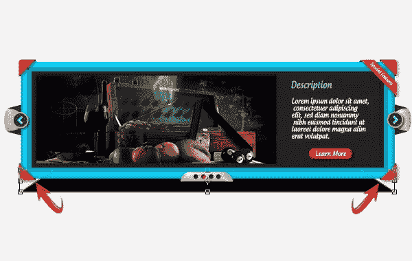](https://www.sitepoint.com/wp-content/uploads/2012/08/212.jpg)

### 步骤 22

现在，右键点击阴影层，选择“栅格化层”选项，进入“滤镜”>“模糊”>“高斯模糊”使用下面的高斯模糊值，并减少这个阴影层的不透明度为 40%，以获得所需的效果。

[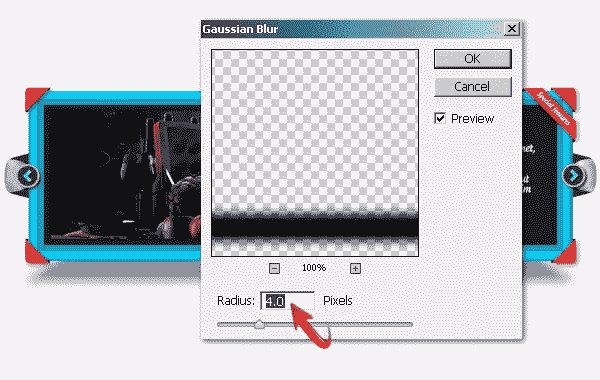](https://www.sitepoint.com/wp-content/uploads/2012/08/22.jpg)

[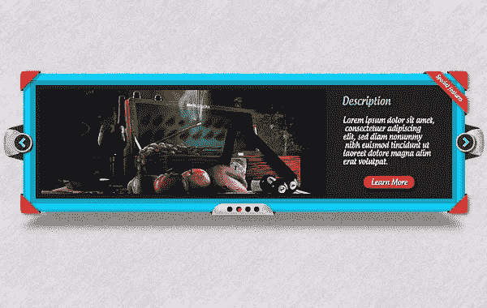](https://www.sitepoint.com/wp-content/uploads/2012/08/22b2.jpg)

就这样，伙计们。希望你喜欢，学到有用的东西。让我知道你的想法！

## 分享这篇文章