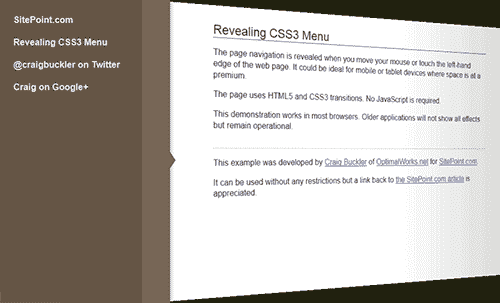

# 如何构建一个 CSS3 滑动菜单

> 原文：<https://www.sitepoint.com/css3-sliding-menu/>

通常最好把东西收起来，直到你需要它们的时候。导航菜单就是一个很好的例子。如果我正在阅读一篇文章，我不希望链接占据很大一部分屏幕空间——尤其是在移动设备上。

在本文中，我们将单独使用 CSS 构建一个滑出式菜单。如果你使用的是现代浏览器，它也会显示出可爱的 3D 页面效果。这是我们将实现的目标:

**查看 CSS3 滑动菜单演示…**



网络上有各种各样的解决方案，但我很难找到一个符合我要求的:

1.  它必须使用干净的语义 HTML5，没有多余的标签。
2.  它不能依赖于 JavaScript。
3.  它必须不需要额外的图形。
4.  它必须适用于移动设备和平板电脑触摸设备。
5.  在较旧的浏览器(IE7+)中或不支持特定的 CSS3 属性时，它必须正常降级。
6.  看起来一定很棒！

打开你最喜欢的编辑器，让我们开始编码…

## HTML

毫无疑问，我们有一个 HTML5 文档，IE shim，一个到样式表的链接，一个用于菜单的`nav`元素，以及一个用于正文的`article`:

```
<!DOCTYPE html>
<html lang="en">
<head>
<meta charset="UTF-8" />
<title>Revealing CSS3 Menu</title>
<!--[if lt IE 9]>
<script src="http://html5shiv.googlecode.com/svn/trunk/html5.js"></script>
<![endif]-->
<link rel="stylesheet" media="all" href="styles.css" />
</head>
<body>

	<!-- menu -->
	<nav>
		<ul>
			<li><a href="https://www.sitepoint.com/">SitePoint.com</a></li>
			<li><a href="https://www.sitepoint.com/css3-sliding-menu/">Revealing CSS3 Menu</a></li>
		</ul>
	</nav>

	<!-- main article -->
	<article>

		<h1>Revealing CSS3 Menu</h1>

		<p>body text</p>

	</article>

</body>
</html>
```

## CSS:文章样式

这篇文章有点不寻常，因为我们想在菜单滑动到位时应用 3D 效果。它的位置是固定的，因此与身体的尺寸相匹配:

```
article
{
	position: fixed;
	width: 70%;
	left: 0;
	top: 0;
	right: 0;
	bottom: 0;
	padding: 30px 15%;
	background-color: #fff;
	overflow: auto;
	z-index: 0;
	-webkit-transform-origin: 0 50%;
	-moz-transform-origin: 0 50%;
	-ms-transform-origin: 0 50%;
	-o-transform-origin: 0 50%;
	transform-origin: 0 50%;
}
```

我们还将变换原点定义在左侧边缘的中间。即使转换直到悬停时才发生，如果我们试图在:hover 样式中设置原点，Chrome 也会变得混乱。

当页面旋转时，我们还需要一个阴影覆盖，右边的边缘会更暗，所以我们可以对文章中的伪元素应用渐变:

```
article:after
{
	position: absolute;
	content: ' ';
	left: 100%;
	top: 0;
	right: 0;
	bottom: 0;
	background-image: -webkit-linear-gradient(right, rgba(0,0,0,0.2) 0%, transparent 100%);
	background-image: -moz-linear-gradient(right, rgba(0,0,0,0.2) 0%, transparent 100%);
	background-image: -ms-linear-gradient(right, rgba(0,0,0,0.2) 0%, transparent 100%);
	background-image: -o-linear-gradient(right, rgba(0,0,0,0.2) 0%, transparent 100%);
	background-image: linear-gradient(right, rgba(0,0,0,0.2) 0%, transparent 100%);
	pointer-events: none;
}
```

该元素被固定为屏幕右边缘的零宽度块，当菜单滑出时会调整其大小。注意`pointer-events`属性— [我说过它会派上用场](https://www.sitepoint.com/css3-pointer-events/)！

## CSS:导航样式

主导航块固定在屏幕的左侧。内容的宽度为 16em，所以我们用-16em 将其向左移动。但是，将显示 50px 的右边框。我们还可以应用一个伪元素来创建一个 CSS 三角形:

```
nav
{
	position: fixed;
	left: -16em;
	top: 0;
	bottom: 0;
	background-color: #654;
	border-right: 50px solid #765;
	box-shadow: 4px 0 5px rgba(0,0,0,0.2);
	z-index: 1;
	cursor: pointer;
}

nav:after
{
	position: absolute;
	content: ' ';
	width: 0;
	height: 0;
	right: -70px;
	top: 50%;
	border-width: 15px 10px;
	border-style: solid;
	border-color: transparent transparent transparent #765;
}
```

菜单样式没什么不寻常的。外部`ul`的宽度为 14em，填充长度为 1em，总共为 16em:

```
nav ul
{
	width: 14em;
	list-style-type: none;
	margin: 0;
	padding: 1em;
}
```

## CSS:动画

这就是有趣的地方。首先，让我们将过渡应用到`article`、`nav`和菜单项:

```
article, article:after, nav, nav *
{
	-webkit-transition: all 600ms ease;
	-moz-transition: all 600ms ease;
	-ms-transition: all 600ms ease;
	-o-transition: all 600ms ease;
	transition: all 600ms ease;
}
```

移动菜单很简单——当用户悬停在元素上时，我们将它从-16em 移动到 0:

```
nav:hover
{
	left: 0;
}
```

页面效果被应用于跟随在悬停的`nav`之后的任何文章兄弟。translateX 将其向右移动 16em，为菜单腾出空间。透视和旋转应用 3D 变换:

```
nav:hover ~ article
{
	-webkit-transform: translateX(16em) perspective(600px) rotateY(10deg);
	-moz-transform: translateX(16em) perspective(600px) rotateY(10deg);
	-ms-transform: translateX(16em) perspective(600px) rotateY(10deg);
	-o-transform: translateX(16em) perspective(600px) rotateY(10deg);
	transform: translateX(16em) perspective(600px) rotateY(10deg);
}
```

最后，应用于文章伪元素的阴影渐变将左边从 100%移动到 60%。换句话说，它增长到页面宽度的 40%:

```
nav:hover ~ article:after
{
	left: 60%;
}
```

安:就是这样。即使有供应商前缀，编码投资的回报也远高于您的预期。

[**查看 CSS3 滑动菜单演示……**](https://blogs.sitepointstatic.com/examples/tech/css3-sliding-menu/index.html)

[查看完整的样式表……](https://blogs.sitepointstatic.com/examples/tech/css3-sliding-menu/styles.css)

该页面适用于大多数浏览器。Firefox 是完美的，尽管:

*   在 Chrome 和 Safari 中，页面阴影会立即出现，而不是随着时间的推移而扩大(webkit 不支持伪元素动画)。
*   Opera 不支持 3D 页面转换——菜单在页面上滑出。
*   IE 不支持转换，所以菜单覆盖页面。IE7 和 8 中显示的效果很少，但菜单可以使用。
*   Android、Dolphin 和 Firefox Mobile 等移动浏览器运行良好，尽管在较慢的设备上可能会出现性能问题。

让我知道你是否在你的网站上应用类似的效果。

如果你喜欢读这篇文章，你会爱上[可学的](https://learnable.com?utm_source=sitepoint&utm_medium=link&utm_campaign=learnablelink)；向大师们学习新技能和技术的地方。会员可以即时访问 SitePoint 的所有电子书和互动在线课程，如 [Learn CSS3](https://learnable.com/courses/learn-css3-203?utm_source=sitepoint&utm_medium=link&utm_campaign=learnablelink) 。

对本文的评论已经关闭。对 CSS3 有疑问？为什么不在我们的[论坛](https://www.sitepoint.com/forums/forumdisplay.php?53-CSS-amp-Page-Layout?utm_source=sitepoint&utm_medium=link&utm_campaign=forumlink)上问呢？

## 分享这篇文章