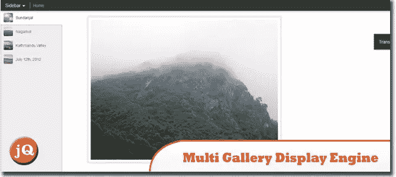
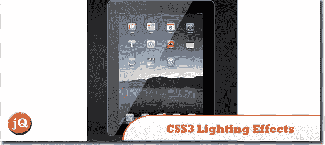
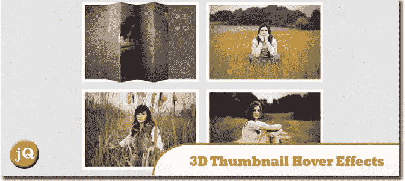
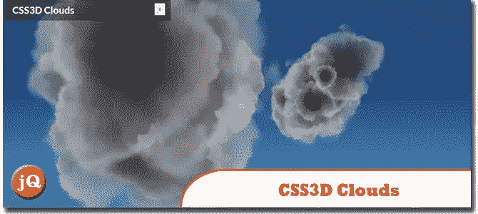
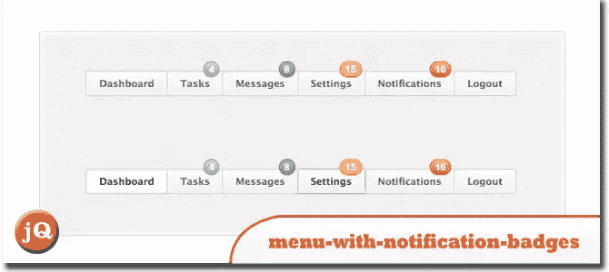
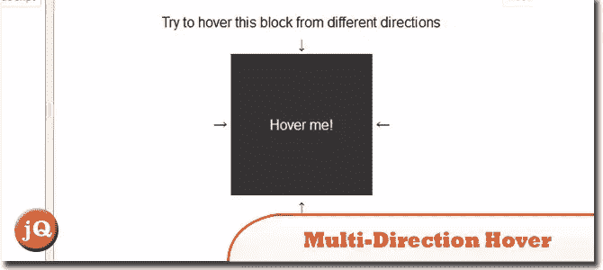
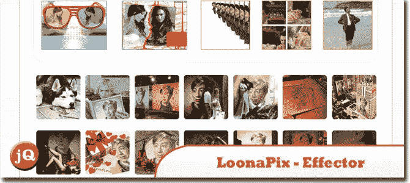
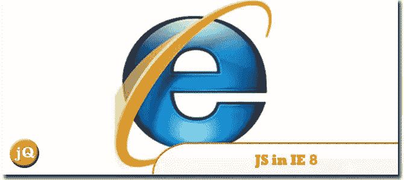

# 有趣的 JS 和 Web Dev 年 8 月

> 原文：<https://www.sitepoint.com/interesting-js-august-2012/>

截至 2012 年 8 月真正有趣的 JavaScript Web 开发列表。你可以在这个集合中找到一些你以前没有用过的最酷的 JavaScript 作品。玩得开心！

**相关帖子:**

*   [**2012 年 7 月版**](http://www.jquery4u.com/javascript/interesting-jquery-javascript-web-dev-july-2012/)
*   [**2012 年 6 月版**](http://www.jquery4u.com/javascript/interesting-jquery-javascript-web-dev-june-2012/)
*   [**2012 年 5 月版**](http://www.jquery4u.com/news/interesting-javascript-jquery-random-web-dev-net-2012/)

## Blogger 多图库显示引擎

这是一个相当可怕的多画廊显示引擎。
 
[源+演示](http://nepalinimages.blogspot.com.au/?view=sidebar)

## CSS3 灯光效果

高光是用 CSS 渐变和遮罩创建的。投射阴影依赖于长方体阴影和变换。
 
[源+演示](http://attasi.com/labs/ipad/)

## 3D 缩略图悬停效果

了解如何使用 CSS3 和 jQuery 创建一些令人兴奋的 3D 悬停效果。这个想法的灵感来自于谷歌 SketchUp Showcase 页面上很酷的悬停效果。
 
[来源](http://tympanus.net/codrops/2012/06/18/3d-thumbnail-hover-effects/) [演示](http://tympanus.net/Tutorials/3DHoverEffects/)

## CSS3D 云

关于如何使用 CSS 3D 变换创建基于精灵的 3D 类云的教程。
 
[源](http://www.clicktorelease.com/tutorials/css3dclouds/) [演示](http://www.clicktorelease.com/code/css3dclouds/)

## 带通知徽章的菜单

带有通知标记的导航菜单。
 
[来源](http://www.webinterfacelab.com/snippets/menu-with-notification-badges) [演示](http://demo.webinterfacelab.com/4-menu-notifications/)

## 多方向悬停

了解如何创建多方向悬停。
 
[源+演示](https://jsfiddle.net/kizu/zfUyN/)

## CSS3 激光器！

学习如何制作令人惊叹的激光效果。
 
[源+演示](http://www.ryancollins.me/?p=539)

## LoonaPix–效应器

在这里你可以用不同的效果在网上制作你的搞笑照片。
 
[源+演示](http://www.loonapix.com/effector/)

## Internet Explorer 8 中的 JavaScript

今天推出了第一个测试版，它显示了巨大的前景。它已经取得了远远超过我预期的成就，这让我渴望更多。
 
[源+演示](http://ejohn.org/blog/javascript-in-internet-explorer-8/)

## 分享这篇文章