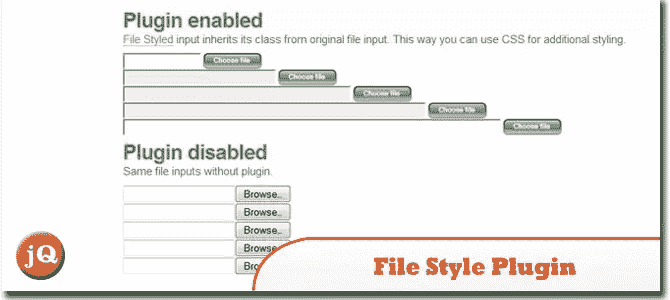
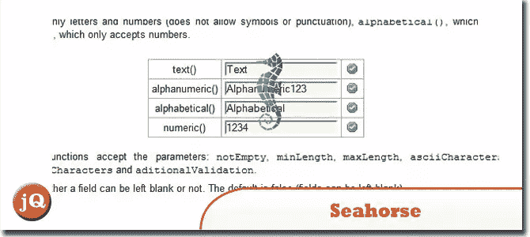
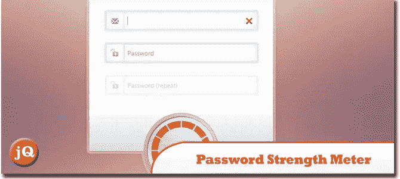
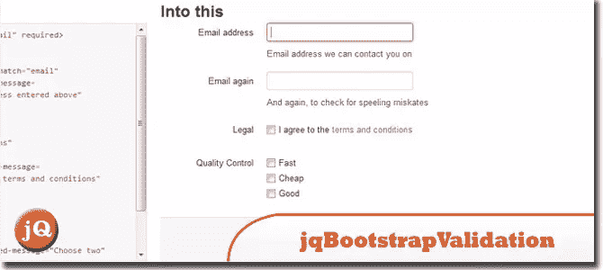
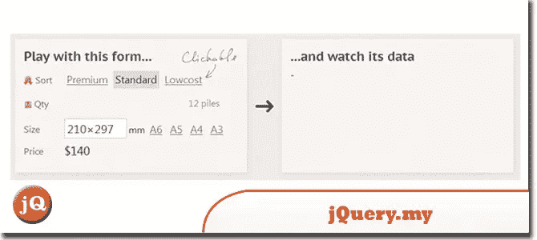
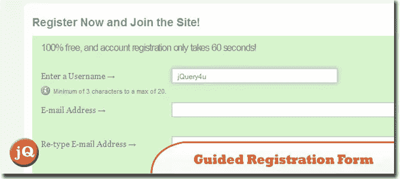
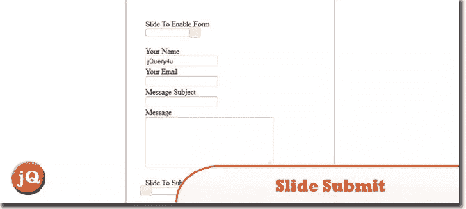
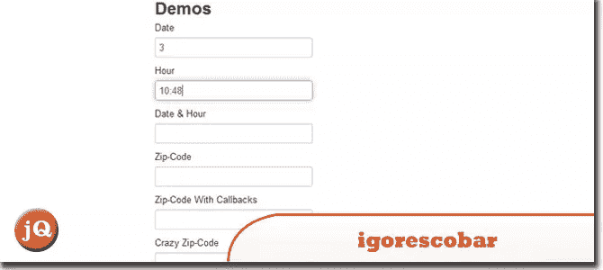
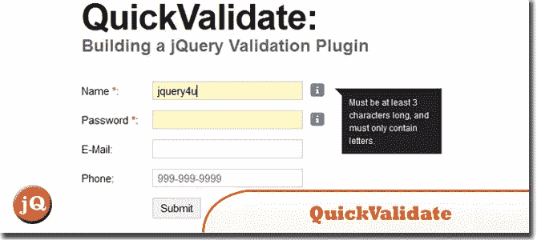

# 10 个时髦的 jQuery 表单插件

> 原文：<https://www.sitepoint.com/stylish-jquery-form-plugins/>

有时我们倾向于尝试让我们的 web 表单更吸引人。所以为了节省你的时间，我们今天给你 10 个时髦的 jQuery 表单插件，你的访问者一定会喜欢的！尽情享受吧！

**相关帖子:**

*   [**jQuery 表单> 30 个例子和插件**](http://www.jquery4u.com/forms/30-jquery-forms/)

## 1.样式选择 jQuery 插件

jQuery 的 styledSelect 插件允许您用可自由设置样式的标记替换<select>表单元素。原始的 select 元素保留在页面中，所以表单不会改变，没有 Javascript 的用户只需返回到原始的表单元素。SourceDemo</select>

## 2.jQuery 的文件样式插件

文件风格插件修复了这个问题。它使您能够使用图像作为浏览按钮。您也可以使用 CSS 将 filename 字段的样式设置为普通的 textfield。它是用 JavaScript 和 jQuery 编写的。
 
[来源](http://www.appelsiini.net/projects/filestyle) [演示](http://www.appelsiini.net/projects/filestyle/demo.html)

## 3.海马

是一个 JavaScript 库，作为自由软件获得许可，创建它是为了简化表单的使用，尤其是简化表单验证。
 
[来源](http://seahorsejs.sourceforge.net/index.php) [演示](http://seahorsejs.sourceforge.net/tutorial.php?cap=4)

## 4.在 jQuery 中创建一个漂亮的密码强度表

我们将创建一个漂亮的密码强度指示器。只有输入足够复杂的密码，用户才能继续注册。
 
[来源](http://tutorialzine.com/2012/06/beautiful-password-strength-indicator/) [演示](http://demo.tutorialzine.com/2012/06/beautiful-password-strength-indicator/)

## 5.jqBootstrapValidation

用于引导表单的 jQuery 验证插件。
 
[来源](https://github.com/ReactiveRaven/jqBootstrapValidation) [演示](http://reactiveraven.github.com/jqBootstrapValidation/)

## 6.jQuery.my

jQuery 库的简短插件。它允许 HTML 控件和本地 JavaScript 对象之间的实时双向绑定。非交互式 HTML 元素也可以与 JavaScript 对象绑定，以实时反映它们的值。
 
[源+演示](http://jquerymy.com/)

## 7.用 jQuery 编写引导式注册表单

我们可以嵌入隐藏的表单提示，只有当用户关注某个特定的字段时才会显示。这些提示可用于表示语法，例如用户名或密码的所需长度。但是这是一个很棒的可用性策略，它让我们变得活跃。
 
[来源](http://vandelaydesign.com/blog/web-development/guided-registration-form/) [演示](http://vandelaydesign.com/demos/registration-form/index.html)

## 8.Slide Submit:一个无垃圾表单的 jQuery 插件

一个 jQuery 插件，可以将几乎任何对象转换成表单提交或表单启用滑块。用户可以滑动滑块来提交表单，而不是按下按钮。
 
[来源](http://jasonlau.biz/home/jquery/slide-submit-a-jquery-plugin-for-spam-less-forms) [演示](http://jasonlau.biz/public/examples/slide-submit/)

## 9.igorescor:jquery mask 外挂程式

制作字段掩码的 jQuery 插件。
功能:字符串/数字/字母/混合遮罩。反转遮罩。数据类型验证。自动最大长度。Ajax/实时应用的现场活动。复试。即时更换面具。
 
[来源](https://github.com/igorescobar/jQuery-Mask-Plugin) [演示](http://igorescobar.github.com/jQuery-Mask-Plugin/)

## 10.快速验证:构建 jQuery 验证插件

用户输入无处不在，从联系表单到注册表单，从调查到复杂的用户界面。形式有许多形状和大小，颜色和风格，但它们都有一些共同点；验证。
 
[来源](http://www.onextrapixel.com/2012/05/09/quickvalidate-building-a-jquery-validation-plugin/) [演示](http://www.onextrapixel.com/examples/jq-quickvalidate/)

## 分享这篇文章