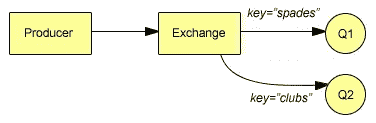

# 使用 RabbitMQ 进行消息代理

> 原文：<https://www.sitepoint.com/message-brokering-with-rabbitmq/>

RabbitMQ 是用 Erlang 编写的开源消息代理软件。MQ 顾名思义是指一种称为高级消息队列协议的标准。对于我们和大多数其他人来说，它充当生产者(发送)和消费者(接收)程序之间的中间人——它只是接受和转发消息。与 RabbitMQ 的一个常见类比是，它的行为就像一个运输服务，就像一个邮局。你给你在世界上任何地方的朋友寄了一个包裹，你的朋友最终收到了包裹，却不知道也不关心包裹是怎么到那里的。在这个类比中，RabbitMQ 是运输服务，生产者程序是你(发送包)，包是一个普通的 blob 数据，消费程序是你的朋友。

生产者和消费者都可以用任何语言编写，只要有可用的 RabbitMQ 或 AMQP 客户端库。在本文中，我将演示一个用 PHP 编写的生产者程序和一个用 Python 编写的消费程序。

## 安装 RabbitMQ 和客户端库

前往[rabbitmq.com/download.html](http://www.rabbitmq.com/download.html "RabbitMQ - Downloading and Installing RabbitMQ")并选择适合您特定系统的安装文件。我碰巧在使用 Ubuntu，并且在安装 Ubuntu 提供的软件包时遇到了问题(它不是可用的最新软件包)。在这种情况下，使用。来自 rabbitmq.com 的 deb 包提供了一个无故障的安装以及最新版本。

安装完成后，有一个插件安装工具叫做 rabbitmq-plugins。作为一个可选步骤，您可以安装 rabbitmq_management 插件，它将提供服务器的 web 浏览器视图，并使各种监控/管理任务变得更容易。为了在 Ubuntu 上启用插件，我运行了:

```
sudo rabbitmq-plugins enable rabbitmq_management
```

重新启动 rabbitmq 服务器以使更改生效:

```
sudo /etc/init.d/rabbitmq-server restart
```

将您的浏览器指向基于 web 的 GUI 的`http://localhost:55672/mgmt/`。默认登录用户和密码将是“guest”。

如果你更喜欢命令行工具，可以使用`rabbitmqctl`作为替代。

PIP 是 Python 的包管理器，类似于 PHP 的 PECL 之梨，或 Perl 的 CPAN。它可以用来轻松安装 Pika，Python 的 RabbitMQ 库。

```
sudo pip install pika
```

RabbitMQ 主页提供了一些不同的 PHP AMQP 库的链接，但我发现唯一一个没有问题的是 GitHub 提供的 [php-amqplib](https://github.com/videlalvaro/php-amqplib "videlalvaro/php-amqplib") 。如果您还没有安装 git，请安装它，因为项目的 make 文件依赖它来克隆一些附加的子模块。

完整的`README`可以在该项目的 GitHub 页面上找到，但是简短的版本如下:

```
git clone git://github.com/videlalvaro/php-amqplib.git
cd php-amqplib/
make
```

`config.php`文件将包含基本的连接设置。如果您已经在本地主机之外的任何地方安装了 RabbitMQ 服务器，则可以在这里进行任何更改。

## 队列和交换

快速浏览一下`amqp_publisher.php`的前几行可以揭示一些基本的 RabbitMQ 思想。

RabbitMQ 中的队列可以被认为是一个邮箱，或者一个收件箱，或者更一般地说是一个消息可以到达的端点。消费者通常使用队列来提取新消息并使有趣的事情发生，但是消费者和生产者都可以声明或创建他们将使用的队列。

```
$ch->queue_declare($queue, false, true, false, false);
```

额外的布尔参数对应于 RabbitMQ 使用的被动位、持久位、排他位和 auto_delete 位。它们现在不是非常重要，但是它们在网上有完整的记录。

`queue_declare()`创建名为“msgs”的队列。如果名为“msgs”的队列已经存在，则不会发生任何额外的事情。一次只能为每个唯一名称创建一个队列。因此，通常消费者和生产者程序都会调用`queue_declare()`。这确保当您不确定哪个程序(生产者或消费者)将首先运行时，队列将总是准备好的。还需要注意的是，消息不是直接写入队列的，它们必须经过交换。

当你想到运输服务或邮局的 RabbitMQ 时，交易所就是“中间的所有东西”。我们不会把包裹直接发到朋友的邮箱里，而是把它放在某个可以接受的取件点，然后它会神奇地被送到目的地。在这个演示源代码中，`$exchange` name 变量被恰当地命名为‘router ’,这是考虑交换的另一个好方法。

```
$ch->exchange_declare($exchange, 'direct', false, true, false);
```

这里还有一些额外的参数:passive、durable 和 auto_delete。有关更多信息，请参见文档。

第二个参数“直接”是交换的类型。为了理解不同类型的交换，我们需要了解绑定键和路由键。路由关键字是生产者向交易所发布消息时使用的标识符。绑定密钥是将特定队列绑定到交换的标识符。两个密钥的长度都被限制为 255 字节。

在直接交换中，路由关键字与消息一起发送到交换机。如果某个队列使用与路由关键字直接匹配的绑定关键字绑定到该交换，则消息会被路由到该队列。

在下图中，队列 Q1 被绑定到带有`binding_key="spades"`的交换机，队列 Q2 被绑定到带有`binding_key="clubs"`的同一个交换机



如果我们发送形式为`(message="Ace", routing_key="spades")`的消息，那么该消息将在 Q1 结束。以`(message="King", routing_key="clubs")`的形式发送消息将导致 Q2。Q1 或 Q2 可能对同一个交换有多个绑定。Q1 可以用“黑桃”和“红心”来绑定，这样任何带有路由关键字“黑桃”或“红心”的消息都将被路由到 Q1。

另一种交换称为扇出。在这种类型的交换中，路由关键字并不重要，因为交换会将消息广播给所有已知的有界队列。这可能是最简单的交换。

一种更有趣的交流方式叫做话题。主题交换使用点分隔的单词组作为路由关键字，这提供了更复杂的路由功能。例如“error.production.database”或“weather.ny.syracuse”。

当将队列绑定到主题交换时，我们可以使用两个特殊字符以有限的正则表达式方式匹配路由键。

*   *(星号)-仅匹配一个单词
*   #(octo Thorpe)-匹配一个或多个单词

如果 Q1 与绑定密钥“*.production.*”绑定，Q1 将接收任何严重级别的任何生产消息。以下所有路由关键字都将被路由到 Q1:

*   错误.生产.数据库
*   信息.生产.数据库
*   调试.生产.网络

Q2 与“信息”绑定。# "接收任何信息消息，而不管其来源。所有这些路由关键字最终都会出现在 Q2:

*   信息.暂存.数据库
*   信息.生产.网络

Q3 可以接收带有绑定“*”的所有数据库消息。*.数据库”。

## 演示生产者和消费者

让我们创建两个简单的演示程序，一个用 PHP 编写，它将生成消息，另一个用 Python 编写，它将充当消费者。所有消息将通过主题交流发送。

```
<?php
include("config.php");
use PhpAmqpLibConnectionAMQPConnection;
use PhpAmqpLibMessageAMQPMessage;

$exchange = "rabbitmq_demo";
$exchangeType = "topic";
$queue = "events";

$message = $_SERVER["argv"][1];
$routingKey = $_SERVER["argv"][2];

$connection = new AMQPConnection(HOST, PORT, USER, PASS, VHOST);
$channel = $connection->channel();

// declare/create the queue
$channel->queue_declare($queue, false, true, false, false);

// declare/create the exchange as a topic exchange.
$channel->exchange_declare($exchange, $exchangeType, false, false, false);

$msg = new AMQPMessage($message, array("content_type" => "text/plain"));

$channel->basic_publish($msg, $exchange, $routingKey);
print "Sent $message ($routingKey)n";
$channel->close();
$connection->close();
```

```
import sys
import pika

EXCHANGE = "rabbitmq_demo"
EXCHANGE_TYPE = "topic"
QUEUE = "events"

# consume callback function
def callback(ch, method, properties, body):
   print " - Received '%s' on routing_key %s" % (body, method.routing_key)
   # Anything else could happen here:
   # Send an email alert, send an xmnp message, trigger another process, etc

connection = pika.BlockingConnection(pika.ConnectionParameters(host='localhost'))
channel = connection.channel()
channel.exchange_declare(exchange=EXCHANGE, type=EXCHANGE_TYPE)
result = channel.queue_declare(queue=QUEUE, durable=True)

if len(sys.argv) != 2:
   sys.exit("You must provide a binding key.")
else:
   key = sys.argv[1]
channel.queue_bind(exchange=EXCHANGE, queue=QUEUE, routing_key=key)

print " Listening for messages..."
channel.basic_consume(callback, queue=QUEUE, no_ack=True)
channel.start_consuming()
```

生产者 PHP 程序将接受两个命令行参数:消息本身和路由关键字。消费者 Python 程序将把一个绑定键作为它唯一的参数。他们会创建一个名为“rabbitmq_demo”的话题交换和一个名为“events”的队列。

运行 Python 程序，如下所示:

```
python topic_consumer.py python topic_consumer.py errors.production.*
```

这将监听来自任何来源(数据库、web 服务器等)的生产错误。).

现在运行带有错误消息和路由关键字的 PHP 程序:

```
php topicProducer.php "the prod database has been deleted. call the authorities" errors.production.database
```

您应该会看到 Python 消费者获取的消息。

```
Listening for messages...
- Received 'the prod database has been deleted. call the authorities' on routing_key errors.production.database
```

消费者应该忽略来自生产者的这条消息，因为它的路由关键字不匹配:

```
php topicProducer.php "DNS server timeout" warnings.prod.dns
```

您可以随时按 Control+C 来停止 Python 消费者，然后使用不同的绑定键重新启动它，以试验消息是如何路由的。

这个基本示例应该做两件事。首先，它应该提供一种方法来尝试不同的路由键，看看主题交换如何路由消息。第二，它应该让你思考，在以任何语言排列编写的任意数量的独立程序之间提供一种通信方式是多么简单。

## 结论

如果您在运营领域工作，维护一系列生产级物理服务器和软件服务，会怎么样？如果您有一个从 Perl 到 Ruby 再到 Haskell.NET 的所有程序都在监控您系统的不同部分，并且需要一种方法让它们通过中央通道进行报告，那会怎么样呢？RabbitMQ 可以让你的生活轻松很多。尤其是如果您的消费程序能够利用电子邮件或 XMNP 库来提醒现实生活中的人们生产层面的问题。

或者如果你有一个用 PHP 编写的网站前端，负责上传，然后处理大量的用户照片或视频，会怎么样？您可能希望将处理负担转移到可以在后台或不同的服务器实例上运行的更快或更专业的语言上。对于这种情况，可以将 RabbitMQ 配置为工作队列。

希望我已经激起了对 RabbitMQ 的兴趣，也许它会成为解决您可能面临的特定解耦或可伸缩性问题的正确工具。它很容易安装，并有广泛的客户机库供您选择语言。操作监控系统和用于执行大型作业的工作队列的例子只是 RabbitMQ 可以发挥作用的两个真实例子，但是可能还有更多它可以发挥作用的场景。发挥你的想象力。

<small>图片 via[Fotolia](http://us.fotolia.com/?utm_source=sitepoint&utm_medium=website_link&utm=campaign=sitepoint "Royalty Free Stock Photos at Fotolia.com")</small>

## 分享这篇文章