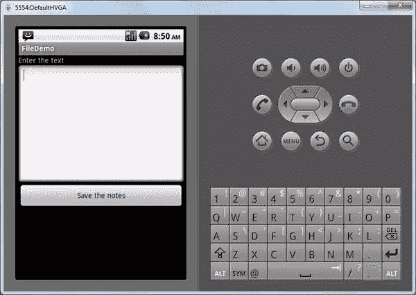
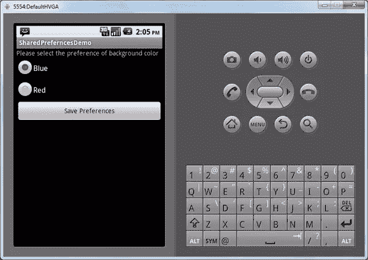
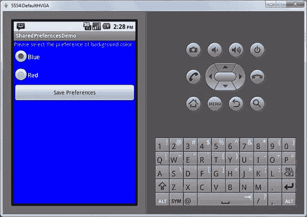
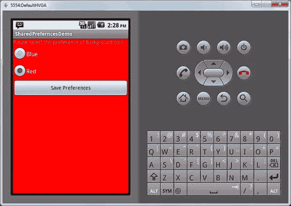

# 在 Android 中使用简单的文本文件和 API 存储用户数据

> 原文：<https://www.sitepoint.com/store-user-data-using-simple-text-files-and-apis-in-android/>

Android 应用程序具有各种各样的特性、功能和用途。这些不同的 Android 应用程序需要来自 Android 系统 API 的类似的不同支持。许多应用程序需要在短期内存中存储数据，这些数据只在应用程序运行期间存在。但是，一些应用程序需要持久地存储数据或用户偏好，以便无限期地维护用户数据和用户偏好。在本文中，我们将演示如何在文件中存储数据，以及如何使用 Android APIs 存储用户偏好。我们将创建两个小应用程序:一个用来存储和读取用户输入的文件，另一个用来存储用户偏好。

### 创建文件存储应用程序的用户界面

让我们首先创建一个简单的应用程序，它显示一个文本编辑器，并允许用户输入任何文本保存为文件。下次通过读取存储文件启动应用程序时，保存的文本将保存在文本编辑器中。

首先，我们将为应用程序创建 UI。在 UI 中，我们将在屏幕上创建一个文本编辑器和一个保存按钮。

该用户界面的布局如下:

```
<?xml version="1.0" encoding="utf-8"?>

<LinearLayout xmlns:android="http://schemas.android.com/apk/res/android"

android:orientation="vertical"

android:layout_width="fill_parent"

android:layout_height="fill_parent"

>

<TextView

android:layout_width="fill_parent"

android:layout_height="wrap_content"

android:text="Enter the text"

/>

<EditText

android:id="@+id/textbox"

android:singleLine="false"

android:gravity="top"

android:lines="10"

android:layout_width="fill_parent"

android:layout_height="wrap_content"/>

<Button android:id="@+id/save"

android:layout_width="fill_parent"

android:layout_height="wrap_content"

android:text="Save the notes"

android:onClick="saveClicked"/>

</LinearLayout>
```

上面，我们使用标签 **< TextView >** 创建了一个文本视图，它只是将文本显示为*“输入文本”。*

接下来，我们创建一个编辑器来接收来自用户的文本。我们使用 **< EditText >** 标签创建它，因为我们希望文本是多行的，我们还在 **EditText** 上设置了属性**Android:single line =*【false】***和**Android:lines =*【10】***。然后，我们使用 **<按钮>** 标签创建一个按钮，用于将修改后的文本保存到一个文件中。

一旦创建了布局，我们将使用 onCreate 函数来设置内容视图的布局，如下所示:

```
public class FileDemo extends Activity {

/** Called when the activity is first created. */

private final static String STORETEXT="storetext.txt";

private EditText txtEditor;

@Override

public void onCreate(Bundle savedInstanceState) {

super.onCreate(savedInstanceState);

setContentView(R.layout.main);

txtEditor=(EditText)findViewById(R.id.textbox);

}

}
```

现在，如果我们运行应用程序，用户界面将如下所示:



### 保存文件

用户界面完成后，我们需要添加功能，在按下“保存”按钮后将文本内容保存到文件中。为此，代码如下:

```
public void saveClicked(View v) {

try {

OutputStreamWriter out=

new OutputStreamWriter(openFileOutput(STORETEXT, 0));

out.write(txtEditor.getText().toString());

out.close();

Toast

.makeText(this, "The contents are saved in the file.", Toast.LENGTH_LONG)

.show();

}

catch (Throwable t) {

Toast

.makeText(this, "Exception: "+t.toString(), Toast.LENGTH_LONG)

.show();

}

}
```

点击“保存”后，调用函数 **saveClicked** 。在函数 **saveClicked** 中，我们使用 Android API**openfile output**打开一个文件，向它传递要打开的文件的名称，我们在类中定义为

```
private final static String STORETEXT="storetext.txt";
```

然后，我们使用 **openFileOutput** 的输出创建一个对象 **OutputStreamWriter** 。

最后，我们获取文本编辑器的文本，并将其传递给我们的 **OutputStreamWriter** 的 write 方法，以将其写入文件。一旦文本被写入文件，我们显示一个 *Toast* 来表示文本被保存。下面，*吐司*写着“内容保存在文件中”


### 加载应用程序时读取文本文件

现在，让我们编写一个函数来读取这个新创建的文件，并用文件的内容填充文本编辑器。我们将在 **onCreate** 函数中调用这个函数，这样一旦应用程序启动，编辑器就会被文件中的信息填充。该功能如下所示:

```
public void readFileInEditor()

{

try {

InputStream in = openFileInput(STORETEXT);

if (in != null) {

InputStreamReader tmp=new InputStreamReader(in);

BufferedReader reader=new BufferedReader(tmp);

String str;

StringBuilder buf=new StringBuilder();

while ((str = reader.readLine()) != null) {

buf.append(str+"n");

}

in.close();

txtEditor.setText(buf.toString());

}

}

catch (java.io.FileNotFoundException e) {

// that's OK, we probably haven't created it yet

}

catch (Throwable t) {

Toast

.makeText(this, "Exception: "+t.toString(), Toast.LENGTH_LONG)

.show();

}

}
```

在这个函数中，我们首先用 API **openFileInput** 打开文件，然后从它创建一个 **InputStream** 。由此，我们创建了一个**输入流阅读器**和一个**缓冲流阅读器**。使用 **BufferedReader** ，我们逐行读取存储文件的文本，并将文本存储在缓冲区中。一旦读取了整个文件，我们就将文本发送到编辑器中。现在，如果应用程序正在运行，应用程序将加载带有文件内容的编辑器文件，如下所示。


### 共享首选项简介

共享偏好设置允许您在 Android 应用程序中存储您想要的不同设置对，即使应用程序会话已关闭。您可以存储许多本地首选项类型，如 Boolean、int、strings 等。下面，我们将创建一个小应用程序，用户可以在其中存储他希望活动背景颜色是蓝色还是红色的偏好。

#### 创建用于存储首选项的 UI

首先，我们必须创建应用程序的 UI。应用程序的布局如下:

```
<?xml version="1.0" encoding="utf-8"?>

<LinearLayout xmlns:android="http://schemas.android.com/apk/res/android"

android:orientation="vertical"

android:layout_width="fill_parent"

android:layout_height="fill_parent"

android:id="@+id/myScreen"

>

<TextView

android:layout_width="fill_parent"

android:layout_height="wrap_content"

android:text="Please select the preference of background color"

/>

<RadioGroup

xmlns:android="http://schemas.android.com/apk/res/android"

android:orientation="vertical"

android:layout_width="fill_parent"

android:layout_height="wrap_content"

android:id="@+id/prefgroup"

>

<RadioButton android:id="@+id/blue"

android:layout_width="wrap_content"

android:layout_height="wrap_content"

android:text="Blue" />

<RadioButton android:id="@+id/red"

android:layout_width="wrap_content"

android:layout_height="wrap_content"

android:text="Red" />

</RadioGroup>

<Button android:id="@+id/savepreferences"

android:layout_width="fill_parent"

android:layout_height="wrap_content"

android:text="Save Preferences"

android:onClick="savepreferencesClicked"

/>

</LinearLayout>
```

上面，我们创建了一个线性布局，然后添加了一个 **TextView** 来显示要求用户选择其背景颜色偏好的消息。然后，我们创建一个包含两个单选按钮的单选按钮组，为用户提供两种颜色选项。最后，我们创建了一个按钮，当用户按下时，它将保存用户的颜色偏好..

如果我们现在运行应用程序，用户界面将如下所示:



#### 保存首选项

现在，让我们看看如何保存用户选择的首选项。函数**savebgcolorposition 中保存首选项的代码如下。**

```
public void saveBgColorPreference()

{

RadioGroup g = (RadioGroup) findViewById(R.id.prefgroup);

int selected = g.getCheckedRadioButtonId();

RadioButton b = (RadioButton) findViewById(selected);

String selectedValue = (String) b.getText();

SharedPreferences myPrefs = this.getSharedPreferences("myPrefs", MODE_WORLD_READABLE);

SharedPreferences.Editor prefsEditor = myPrefs.edit();

prefsEditor.putString("bgcolor", selectedValue);

prefsEditor.commit();

}
```

在这个函数中，我们获得了**单选按钮组**，并找到了被选中的单选按钮的 ID。然后，我们获取所选单选按钮的文本，以检查用户选择了哪种颜色。然后，我们使用函数 **getSharedPreferences** 获得 **SharedPreferences** 对象。因为我们想要编辑共享的首选项，所以我们必须获得 **SharedPreferences。编辑器**然后调用函数 **putString** 在上面写字符串然后调用 commit 完成写事务。这将在存储的首选项中存储颜色值。

#### 使用保存的偏好设置来更改应用程序的属性

现在我们已经编写了存储用户颜色偏好的代码，我们将编写一个函数 **setColorOnPreference** 来根据偏好实际更改背景颜色。该功能如下所示:

```
public void setColorOnPreference()

{

mScreen = (LinearLayout) findViewById(R.id.myScreen);

SharedPreferences myPrefs2 = this.getSharedPreferences("myPrefs", MODE_WORLD_READABLE);

String prefName = myPrefs2.getString("bgcolor", "Blue");

if(prefName.equals("Blue"))

mScreen.setBackgroundColor(0xff0000ff);

else

mScreen.setBackgroundColor(0xffff0000);

}
```

在这个函数中，我们使用 ID 来获取线性布局。然后，我们使用函数 **getSharedPreferences** 获得共享的首选项对象。然后，使用函数 **getString** ，我们得到背景颜色偏好。

如果背景颜色是蓝色，我们设置背景为蓝色。否则，我们将其设置为红色。

现在，按下按钮后，我们将调用函数**savepreferrencesclicked**，如下所示:

```
public void savepreferencesClicked(View v) {

saveBgColorPreference();

setColorOnPreference();

}
```

为了用(用户选择的)所需背景颜色启动应用程序，我们将在**中调用**setcolornopreference**来创建**如下:

```
public void onCreate(Bundle savedInstanceState) {

super.onCreate(savedInstanceState);

setContentView(R.layout.main);

setColorOnPreference();

}
```

现在，如果我们运行该应用程序，它将如下所示:



现在，如果我们选择并将颜色更改为红色并保存，应用程序将进行(并存储为用户首选项)以下颜色更改:



### 结论

Android APIs 为想要在 Android 应用程序的两个不同会话之间共享持久数据的开发人员提供了很好的支持。使用文件和首选项 API，我们可以存储用户数据和首选项，使应用程序对最终用户来说更加个性化和实用。API 设计的灵活性使得它们的使用非常简单，使用这些强大的 API 可以非常快速地开发应用程序。所以，祝 Android 应用开发愉快！ ****

## 分享这篇文章