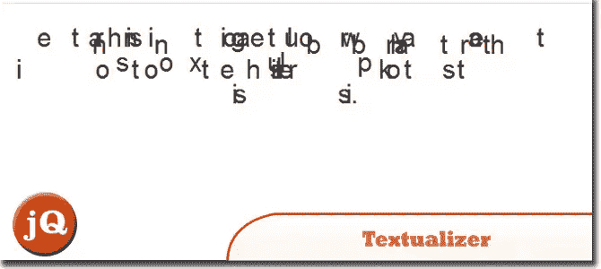
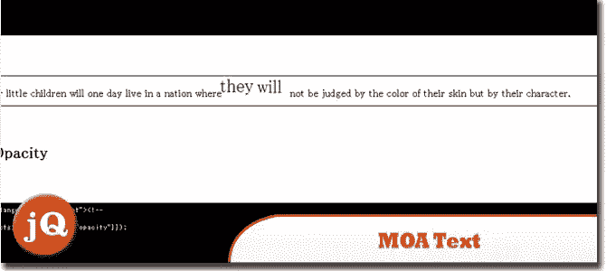
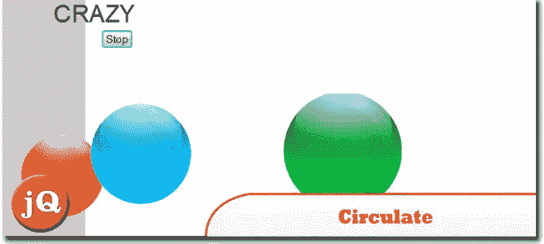
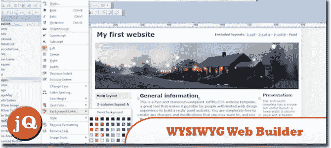
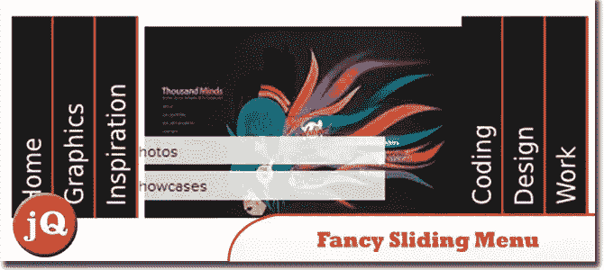
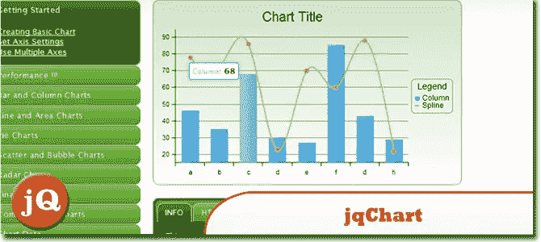
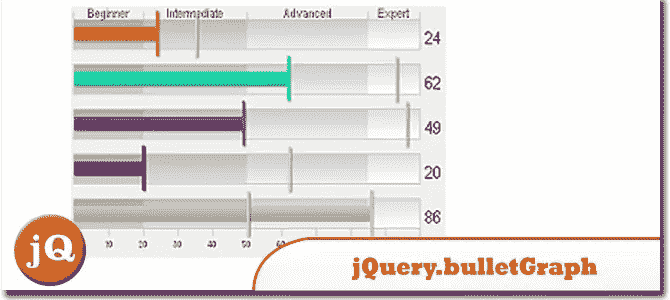

# 10 个随机 jQuery 插件的优点

> 原文：<https://www.sitepoint.com/10-random-jquery-plugin-goodness/>

当然，将一个列表项目像 iPhone 主屏幕一样整合到我们的网站上会很棒。当然，有了 jQuery 插件，我们也可以在我们的网站上给我们的文本消息添加一些非常酷的动画和效果…我们可以让我们的图像在我们的网页上循环，所有这些和更多你会在这 10 个随机的 jQuery 插件集合中发现！

**相关帖子:**

*   [**有趣的 JavaScript，jQuery &网上随机网页开发——2012 年 4 月**](http://www.jquery4u.com/news/interesting-javascript-jquery-random-web-dev-net-april-2012/)

## 1.Promptumenu 菜单

一个 jQuery 插件，允许你以类似 iPhone 主屏幕的方式显示列表项。如果项目数量超过一个屏幕上显示的项目，用户可以在屏幕上滑动。
 
[源+演示](http://natrixnatrix89.github.com/promptu-menu/)

## 2.文本化器

是一个非常酷的 jQuery 插件，可以给你的文本添加漂亮的过渡效果。
 
[源+演示](http://kiro.me/projects/textualizer.html)

## 3.文字呢

您可以使用这个 jQuery 插件为您的 web 站点增添趣味。通过这个插件，你的网站上的文本信息在鼠标经过时是动画的。
 
[来源](http://sourceforge.jp/projects/moatext/) [演示](http://labs.bitmeister.jp/moamoa/demo.html)

## 4.传播

一个 jQuery 插件，让你的图片在你的页面上循环。这个插件需要 jQuery 库以及 easing 插件…
 
[源码](http://css-tricks.com/circulate/) [演示](http://css-tricks.com/examples/Circulate/)

## 5.JavaScript 中的镜头光晕

这个 jQuery 插件允许你给图片添加一个镜头光晕效果。
 
[源+演示](http://www.professorcloud.com/mainsite/lens-flare.htm)

## 6.所见即所得 Web 生成器

Web Builder 是一个 WYSIWYG(所见即所得)程序，用于创建网页。
 
[来源](http://www.wysiwygwebbuilder.com/) [演示](http://www.wysiwygwebbuilder.cimg/screenshot1.jpg)

## 7.用 jQuery 创建一个漂亮的滑动菜单

学习使用 jQuery 框架创建滑动菜单。本教程面向初学 jQuery 的开发人员和刚刚接触客户端脚本的人。您将学习如何从零开始逐步构建这个简单的效果。
 
[源+演示](http://coding.smashingmagazine.com/2010/09/05/create-a-fancy-sliding-menu-with-jquery/)

## 8.amCharts

是一个交互式(最好的 JS 图表)JavaScript 图表。
[源+演示](http://www.amcharts.com)

## 9.jqChart

一个使用 HTML5 画布绘制图表的 jQuery 插件。jqChart 可以生成类似 Excel 的图表，具有许多特性。
 
[来源](http://geekswithblogs.net/jqchart/archive/2011/06/11/html5_jquery_chart_plugin_getting_started.aspx) [演示](http://www.jqchart.com/samples)

## 10.jQuery.bulletGraph

一个 jQuery 插件，把一个 html 选择元素变成一个项目符号图滑块。
 
[源+演示](https://github.com/johdax/jQuery.bulletGraph)

## 分享这篇文章