# 在 Photoshop 中创建发光的文本效果

> 原文：<https://www.sitepoint.com/create-a-luminous-text-effect-in-photoshop/>

今天我将向你展示如何在 Photoshop 中创建一个发光的文本效果。我们将在途中学习如何操作字体来获得想要的效果，图层样式如何帮助我们在画布上带来惊人的效果。你将学习如何给纯文本添加灯光效果，以及如何进一步实验来得到我想要的效果。

**资源:**

[黄金墙](http://www.flickr.com/photos/friendlydragon/7144895553/ "Wall of gold")
包豪斯 93 字体

在我们开始之前，让我们看看我们的最终结果。

### 第一步

在 Photoshop 中创建一个宽度为 600 像素、高度为 900 像素的新文档。

### 第二步

使用油漆桶工具给背景填充颜色#010517。

### 第三步

在 Photoshop 中打开“黄金之墙”资源，将它复制并粘贴到您的文档中背景正上方的新图层(“图层”>“新图层”)上。将纹理层的不透明度降低到 15%。双击这一层打开混合选项窗口，并使用以下设置应用颜色覆盖。

[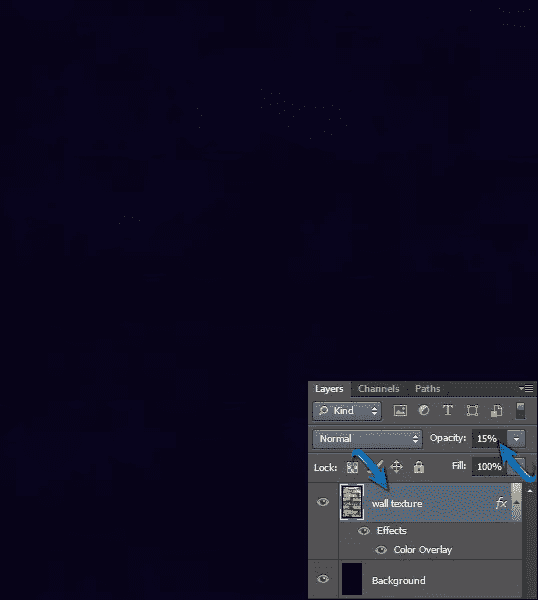](https://www.sitepoint.com/wp-content/uploads/2012/06/3b.jpg)

### 第四步

现在设置#ffffff 作为你的前景色，选择文字工具来输入你的文字。我们将在这里使用一种叫做“包豪斯 93”的字体。在一个新的图层上键入每个字母，并按如下所示排列它们。

### 第五步

接下来，我们给这些字母加圆头。选择椭圆工具，画一个圆。我对省略号使用了不同的颜色，以区别于原文。现在按 Ctrl + "T "激活自由变换工具，你可以调整椭圆的大小，以匹配" L "字母的大小。将这个圆拉长一点，按一定角度排列，如下图。

让所有的字母都以同样的方式变圆。完成后，将字母“L”和形成其两端的椭圆收集到同一个组中，并将该组命名为“L”。你可以这样做，选择所有的层形成圆形的“L”，按下 shift 键，并前往“层”>“组层。”

### 第六步

右键单击字母“I”层，选择选项“栅格化类型”，然后使用硬圆形橡皮擦工具擦除形成“I”点的白色圆圈。之后，选择椭圆工具，形成两个圆，如下图所示。

### 第七步

我们已经完成了文本的基本形状，所以现在我们将继续给它一个明亮的效果。我们会给它一种“管光”的外观。为了达到理想的美感，首先我们将合并单个字母组。为此，右键单击字母“L”组并选择“合并组”选项以同样的方式合并其余的字母组。一旦你完成了，复制“L”字母层得到两个副本，进入“层”>“复制层”因此，为每个字母形成三个相同的层。您可以将它们标记为 1、2 和 3，以保持有序。我们将在每个图层上应用不同的图层样式。

### 第八步

现在，双击 L1 层打开混合选项窗口，应用以下图层样式设置:

[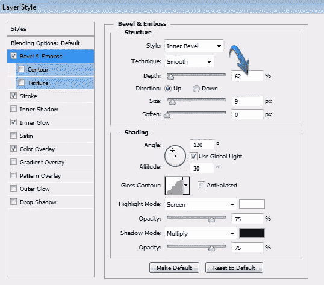](https://www.sitepoint.com/wp-content/uploads/2012/06/8.jpg)

[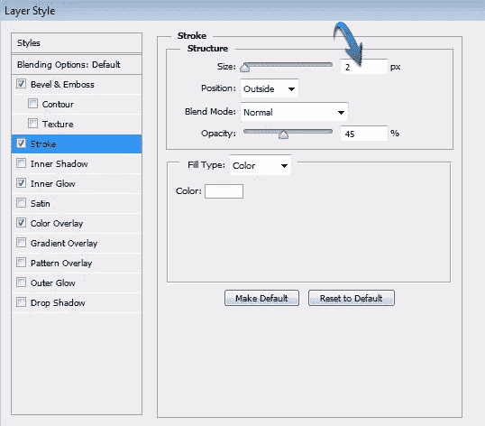](https://www.sitepoint.com/wp-content/uploads/2012/06/8b.jpg)

[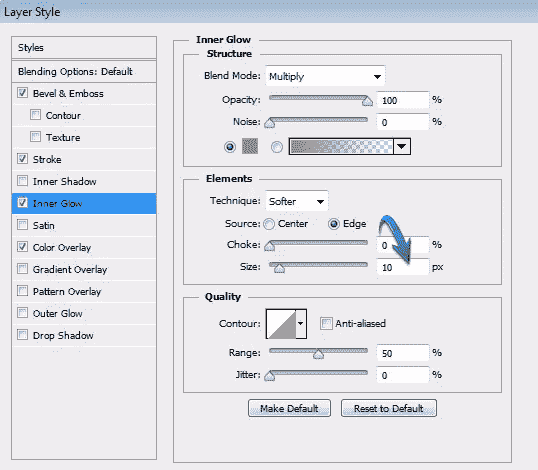](https://www.sitepoint.com/wp-content/uploads/2012/06/8c.jpg)

[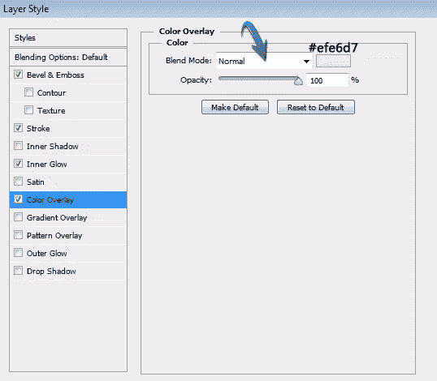](https://www.sitepoint.com/wp-content/uploads/2012/06/8d.jpg)

完成后，右键单击 L1 层，选择“复制图层样式”选项现在，右键单击 i1，g1，h1 和 t1 层一个接一个，并使用“粘贴图层样式”应用相同的效果。

[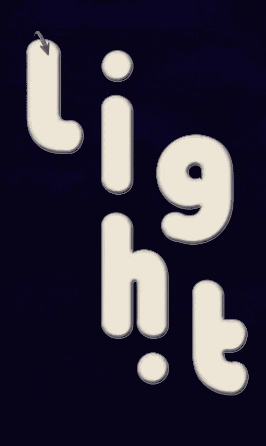](https://www.sitepoint.com/wp-content/uploads/2012/06/8e.jpg)

### 第九步

现在双击 L2 层，应用以下设置。确保将它填充到 0%。

[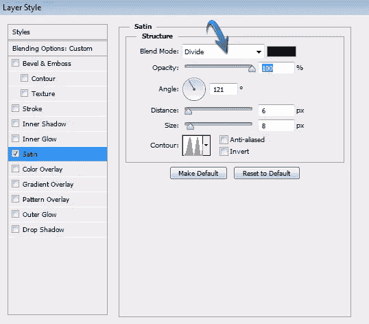](https://www.sitepoint.com/wp-content/uploads/2012/06/9.jpg)

复制这个图层样式，粘贴到层 i2，g2，h2 和 t2。

### 第十步

将 L3 的填充设置为 0%。然后，双击 L3 层，使用以下设置为缎面。

[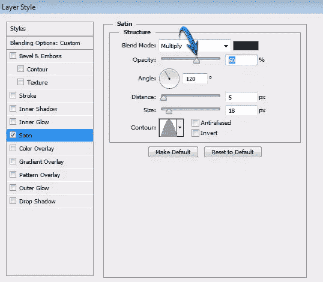](https://www.sitepoint.com/wp-content/uploads/2012/06/10.jpg)

### 复制它的图层样式，粘贴到 i3，g3，h3，t3 上。
[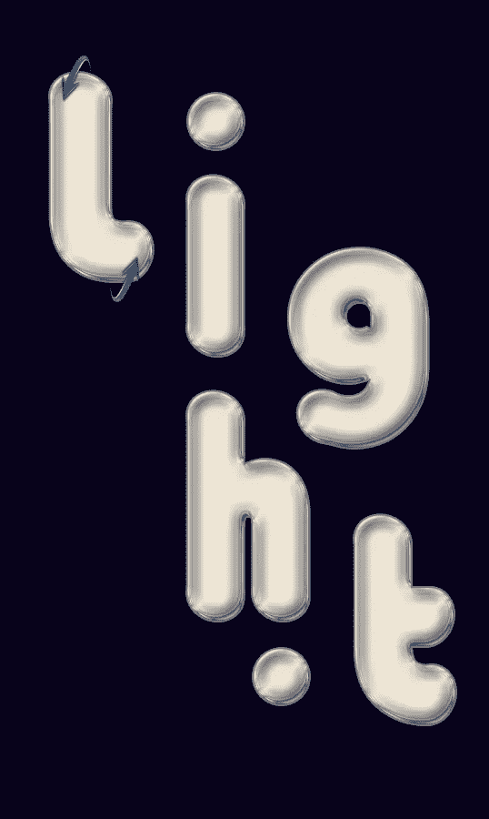](https://www.sitepoint.com/wp-content/uploads/2012/06/10b.jpg) 
第十一步

到目前为止，我们已经创造了一个很好的发光效果。现在我将向你展示如何进一步操纵它，使效果更有趣。复制“轻”文件夹，并合并这个复制组。之后，双击这个合并组，使用给定的设置应用颜色覆盖。

[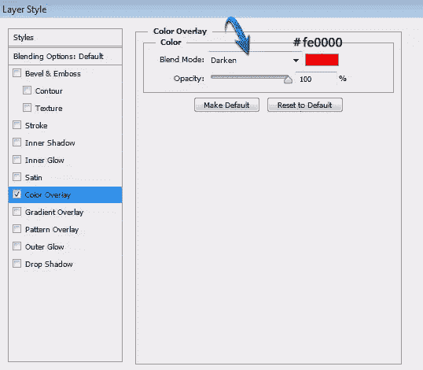](https://www.sitepoint.com/wp-content/uploads/2012/06/11.jpg)

[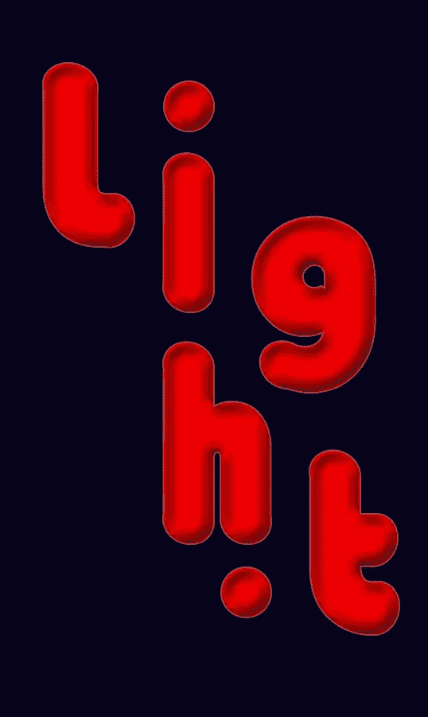](https://www.sitepoint.com/wp-content/uploads/2012/06/11b.jpg)

### 步骤 12

再次复制原始的“light”文件夹，然后合并它，将新的副本放在红色版本的“Light”上面现在，我们将选择不同的领域，我们的文字在这一层的帮助下，钢笔工具，和，我们将删除他们。这将使红光透过擦除区域可见。因此，选择钢笔工具，并从顶部的选项栏中选择“路径”。现在，画出如下所示的形状。完成后，右键单击，选择“进行选择”，然后转到“编辑”>“清除”。"按 Ctrl + "D "取消选择该区域。

[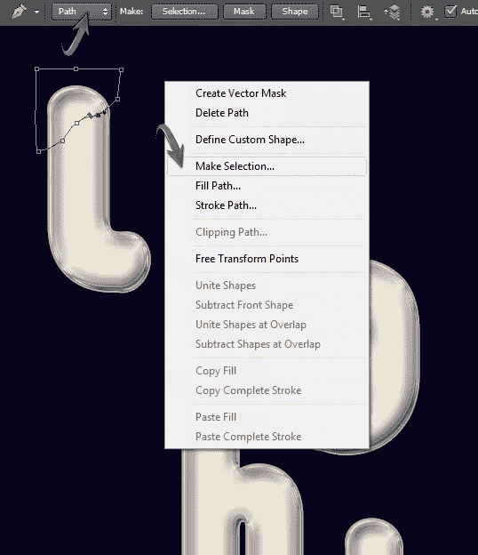](https://www.sitepoint.com/wp-content/uploads/2012/06/121.jpg)

重复同样的方法清除字母“L”的另一端。

[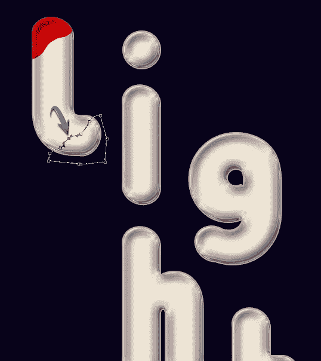](https://www.sitepoint.com/wp-content/uploads/2012/06/12b.jpg)

### 第十三步

继续使用钢笔工具在其余的字母中创建相似的形状，并清除它们以达到下面的效果。

[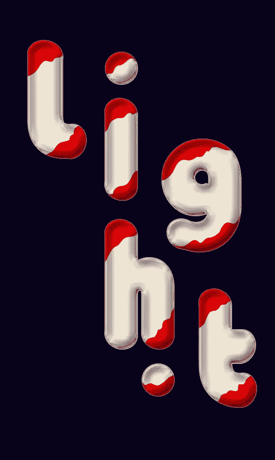](https://www.sitepoint.com/wp-content/uploads/2012/06/13.jpg)

### 步骤 14

现在，复制红色版本层，在“颜色叠加”中将其颜色改为蓝色，并将这个副本放在红色版本层下面。之后，将其向右上方移动，给文本带来 3D 效果。

[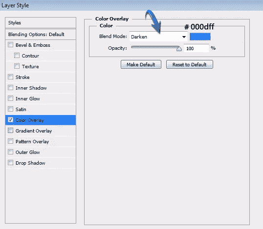](https://www.sitepoint.com/wp-content/uploads/2012/06/14.jpg)

[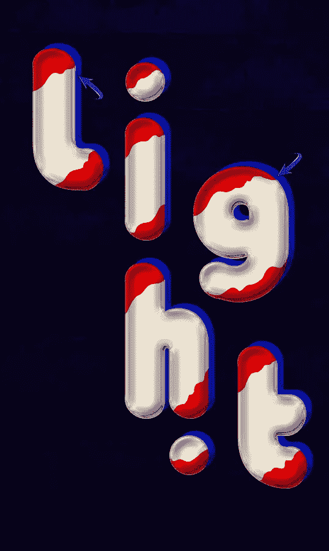](https://www.sitepoint.com/wp-content/uploads/2012/06/14b.jpg)

### 第十五步

要得到一个稍微暗一点的蓝色文本层，按 Ctrl + <click blue="" layer="">在它周围做一个选择。现在，点击适当的图标“创建新的填充或调整层”(这是在层面板的底部)，并选择“色调/饱和度”选项。在此使用以下设置。</click>

[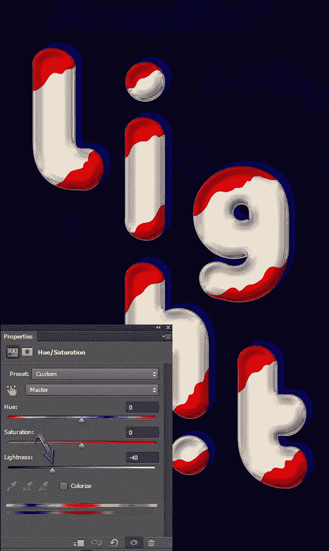](https://www.sitepoint.com/wp-content/uploads/2012/06/15.jpg)

再次选择蓝色图层，新建一个“亮度/对比度”的调整图层使用下面提供的给定。

[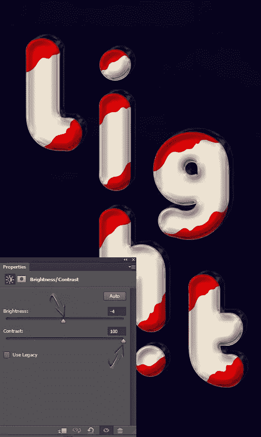](https://www.sitepoint.com/wp-content/uploads/2012/06/15b.jpg)

### 第十六步

再次，复制红色版本的“光”，并把这一层下面的蓝色版本层。向右上方拖动一点，如下所示。您可以增加红色版本的对比度，如步骤 15 所述。

[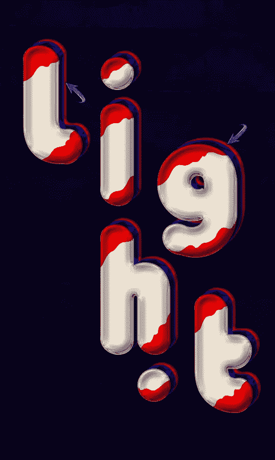](https://www.sitepoint.com/wp-content/uploads/2012/06/16.jpg) 
第 17 步
接下来，我们将为文本创建一个排序。选择矩形工具来绘制一个棒，如下所示。

[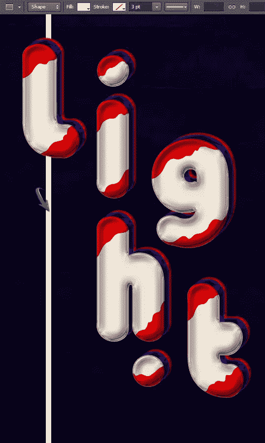](https://www.sitepoint.com/wp-content/uploads/2012/06/17.jpg)

### 步骤 18

双击这个棍子层，应用以下设置为“斜面和浮雕”图层样式。

[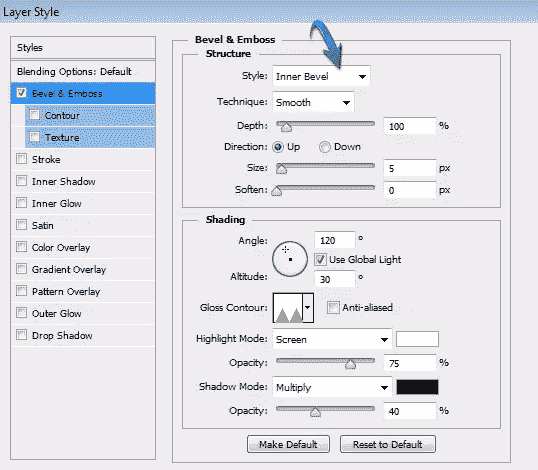](https://www.sitepoint.com/wp-content/uploads/2012/06/18.jpg)

[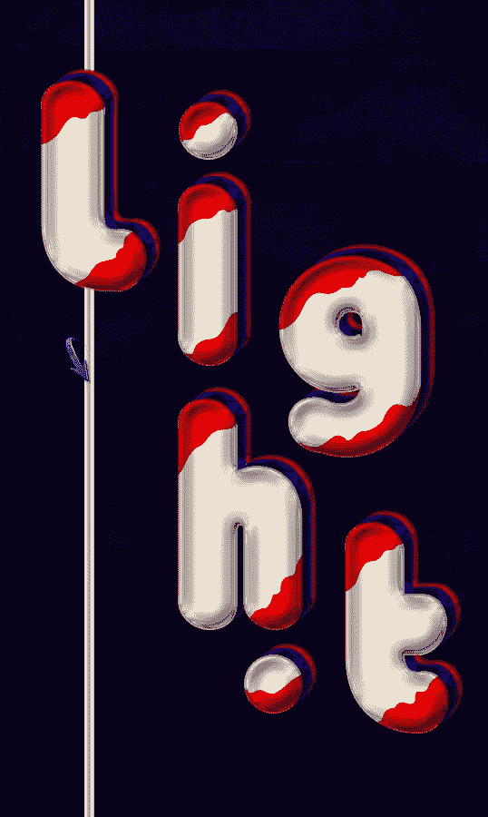](https://www.sitepoint.com/wp-content/uploads/2012/06/18b.jpg)

### 步骤 19

现在，复制这个棍子层几次，垂直和水平排列棍子，如下所示。

### 步骤 20

最后，点击图标“创建新的填充或调整层”，并选择“级别”选项。对“级别”应用以下设置请确保将此调整图层放在其余 Photoshop 图层的顶部。

[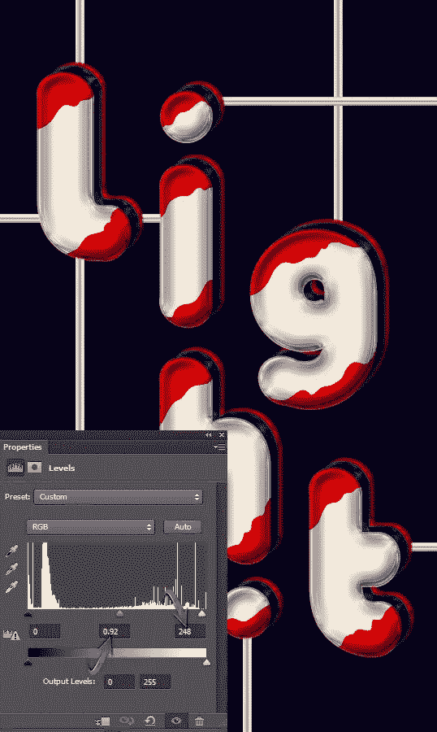](https://www.sitepoint.com/wp-content/uploads/2012/06/20.jpg)

[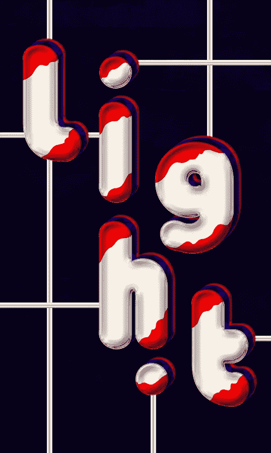](https://www.sitepoint.com/wp-content/uploads/2012/06/Final-result1.jpg)

就这样，伙计们。我希望你喜欢这个教程，并学到一些有用的东西。让我知道你的想法！

## 分享这篇文章