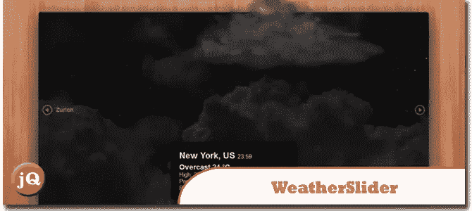
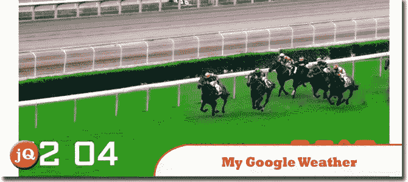
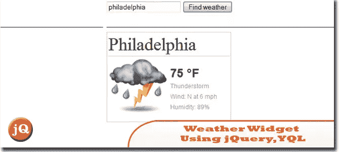
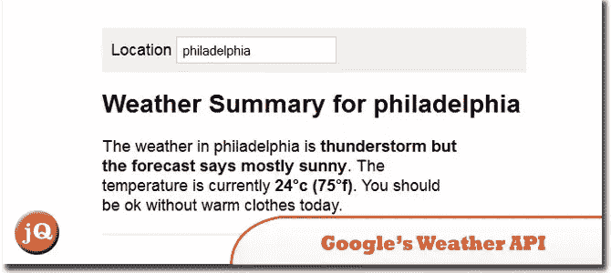
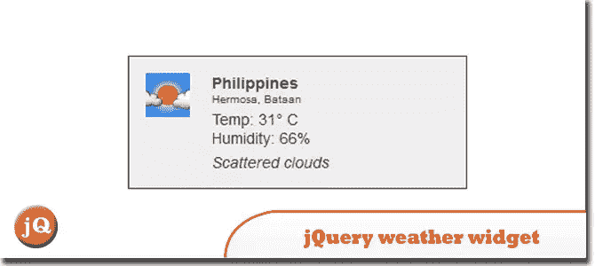
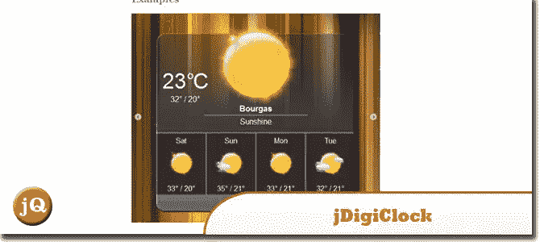
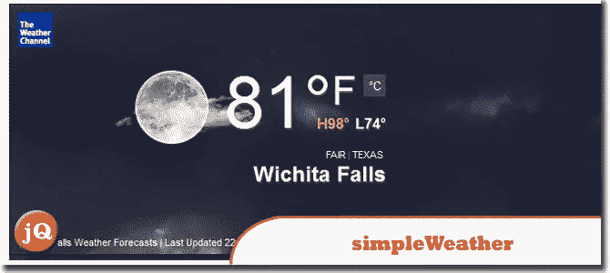
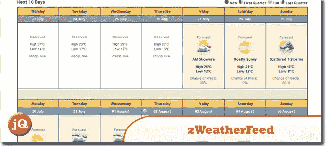

# 使用 jQuery 的 10 个非常棒的天气小部件

> 原文：<https://www.sitepoint.com/weather-widgets-jquery/>

今天，我们分享了我们认为非常好的 jQuery 天气插件。我们可以很容易地为我们网站的访问者提供任何地方的天气信息。这些插件使用谷歌和雅虎等气象信息提供商的 API。

**相关帖子:**

*   [**jQuery Twitter Widget**](http://www.jquery4u.com/twitter/)

## 1.weather slider–jQuery 动画天气小部件

这是一个漂亮的天气滑块部件，有动画天气效果和 48 种天气类型。
 
[来源](http://codecanyon.net/item/weatherslider-jquery-animated-weather-widget/1058937) [演示](http://codecanyon.net/item/weatherslider-jquery-animated-weather-widget/full_screen_preview/1058937)

## 2.我的谷歌天气插件

这个插件增加了世界上任何一个城市的天气。
功能:
>完全可定制的天气小工具
>使用谷歌提供的天气信息
>在全球大多数城市可用
>跨浏览器(在 IE7+ / FF / chrome / Safari / opera 中工作)
 
[源+演示](http://www.kfsoft.info/mygoogleweather/demo.php)

## 3 使用 jQuery、YQL 和 Weather.com 创建一个天气小部件

创建一个简单的小部件来显示天气数据。我们的目标是创建一个类似于谷歌显示天气数据的小部件。
 
[来源](http://jobyj.in/api/create-a-weather-widget-using-jquery-yql-and-weather-com/) [演示](http://jobyj.in/demos/2011/12/weather-widget/)

## 4.使用谷歌的天气 API

这个应用程序获取一组 Google weather API 提要，并根据输出做出一些简单的决定。
 
[来源](http://papermashup.com/using-googles-weather-api/) [演示](http://papermashup.com/demos/google-weather-api/?location=Bristol)

## 5.jQuery 地理定位和 Yahoo 的 API 来构建一个简单的天气 webapp

我们将使用 HTML5 地理定位 API 为用户呈现个性化的天气预报。使用 jQuery，我们将向 Yahoo 的两个流行 API 发出 AJAX 请求，以获得额外的地理信息和天气预报。
 
[来源](http://tutorialzine.com/2012/05/weather-forecast-geolocation-jquery/) [演示](http://demo.tutorialzine.com/2012/05/weather-forecast-geolocation-jquery/)

## 6.jQuery 天气小部件

这个小部件是纯 JavaScript，不需要后端/服务器，所以你可以把它放在你的博客或任何你喜欢的地方。这个小部件使用 JSON 进行两个主要调用，检索用户的地理位置，然后检索该位置的当地天气。
 
[源+演示](http://www.myphpetc.com/2009/11/jquery-weather-widget.html)

## 7.带天气的 jQuery 数字时钟

jDigiClock 是一个 jQuery 插件，其灵感来自独特的 HTC Hero Clock 小部件。
 
[源+演示](http://www.radoslavdimov.com/jquery-plugins/jquery-plugin-digiclock/)

## 8.简单天气:如何用 jQuery 显示天气

一个简单的 jQuery 插件，显示任何地点的天气信息。这些数据来自公共的雅虎！通过 YQL API 提供天气信息。
 
[源+演示](http://monkeecreate.github.com/jquery.simpleWeather/)

## 9.用 jQuery 和 YQL 给你的站点添加天气信息

jQuery 和 YQL(Yahoo 提供的免费 web 服务)可以用来轻松地为您的站点添加自定义的天气显示。在这篇文章中，我将从头到尾指导你完成这个过程。
 
[来源](http://www.onextrapixel.com/2011/08/22/adding-weather-to-your-site-with-jquery-and-yql/) [演示](http://www.onextrapixel.com/examples/jquery-yql-weather/)

## 10.zWeatherFeed 雅虎！jQuery 的天气插件

这个插件将使用 Yahoo！读取一个位置的当前天气。天气。它生成带有内置 CSS 类的结构化 HTML 来进行样式化。简单易用。
 
[来源](http://www.zazar.net/developers/jquery/zweatherfeed/) [演示](http://www.zazar.net/developers/jquery/zweatherfeed/example.html)

## 分享这篇文章