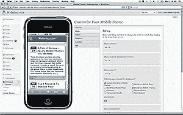
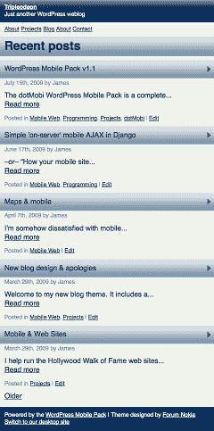
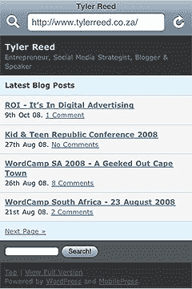

# 3 个最好的 WordPress 插件，让你的网站移动友好

> 原文：<https://www.sitepoint.com/wordpress-mobile-plugins/>

移动网络正呈指数级增长。如果你的网站现在不支持手机和平板电脑，你可以保证在未来几年它会变得越来越重要。

但是如果你拥有 WordPress 上运行的 1300 万个网站中的一个呢？我最近需要一个插件:

1.  在 WordPress 3.1 上工作
2.  无需注册即可使用
3.  可以安装在开发服务器上
4.  提供移动设备检测和自定义主题
5.  不是一个简单地将用户转到在线移动服务的系统。

令人惊讶的是，很少有插件符合这个标准。幸运的是，我发现了 3 个好的选择，可以帮助你移动你的网站。

## 1. [WP 移动探测器](http://wordpress.org/extend/plugins/wp-mobile-detector/)

来自 Websitez.com 的 WP Mobile Detector 提供了一种简单的方法，只需点击几下鼠标，就可以让你的网站适应手机。与其他针对少数流行小工具的插件不同，WP Mobile Detector 支持 5000 多种联网手机、智能手机、平板电脑和小屏幕设备。其他功能同样令人印象深刻:

*   包括 9 个移动主题
*   针对目标设备自动格式化内容并调整图像大小
*   支持 WordPress 小部件
*   可以创建多语言网站
*   该插件记录访问统计数据，以帮助您识别基本和高级手机的流量。

WP 移动探测器的[免费版本可从 WordPress.org](http://wordpress.org/extend/plugins/wp-mobile-detector/)[获得](http://wordpress.org/extend/plugins/wp-mobile-detector/)。Websitez.com[的](http://websitez.com/wordpress-mobile/)提供了一个具有实时交互式主题编辑器的专业版。价格从 49.95 美元起。

## 2. [WordPress Mobile Pack](http://wordpress.org/extend/plugins/wordpress-mobile-pack/)

WordPress Mobile Pack 是一个全面的插件，可以对你的移动网站进行精细的控制。最受欢迎的设备可以通过用户代理或域映射来识别。虽然有四种不同的配色方案，但还是提供了一个优雅的主题。

WordPress Mobile Pack 是一个很棒的插件，尽管我怀疑有些人可能会被分布在几个页面上的大量选项所淹没。有时，我还发现在使用管理面板时，它会将我切换到移动视图。

免费的 [WordPress 移动包](http://wordpress.org/extend/plugins/wordpress-mobile-pack/)可以从 WordPress.org[获得](http://wordpress.org/extend/plugins/wordpress-mobile-pack/)。

## 3. [MobilePress](http://wordpress.org/extend/plugins/mobilepress/)

最后，我们有 MobilePress。尽管 WordPress.org 报告说它可以兼容 2.8.6 版本，但我在 3.1 版本中安装和运行它没有任何问题

MobilePress 是这里最简单的插件，提供的选项很少。然而，这是最容易使用和测试的方法之一，因为你可以强迫你的站点进入移动视图，而不是使用真正的移动设备或域映射。

提供了两个移动主题，虽然我看不出它们之间有什么不同？幸运的是，对于想要创建自己的替代方案的开发人员来说，它提供了帮助。

MobilePress 是由一家为手机提供广告解决方案的公司开发的。您不需要使用该功能，但如果您需要，它是可用的。

免费的 [MobilePress 插件](http://wordpress.org/extend/plugins/mobilepress/)可从 WordPress.org 的[获得。](http://wordpress.org/extend/plugins/mobilepress/)

## 分享这篇文章