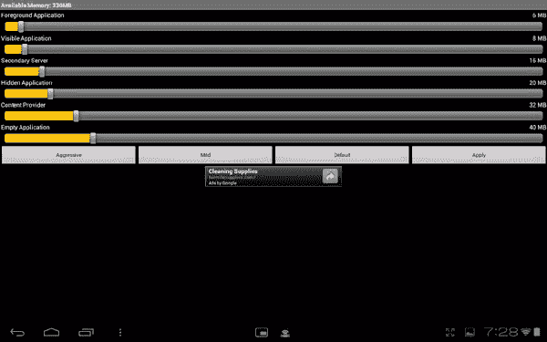
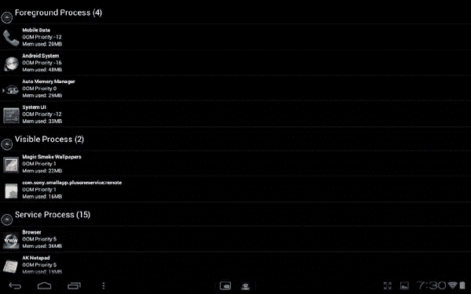
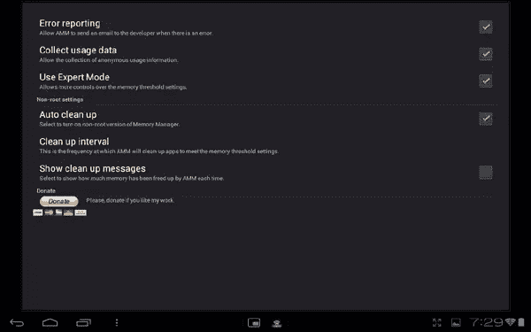
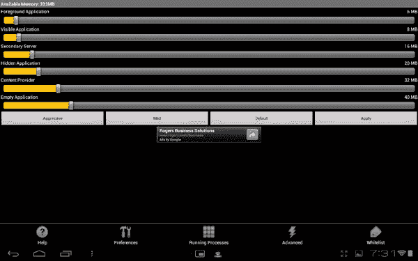

# 自动内存管理器:安卓智能任务黑仔

> 原文：<https://www.sitepoint.com/auto-memory-manager-the-smart-task-killer-for-android/>

尽管我们看到越来越多的处理器朝着更快、更多内核的方向发展，但智能手机和平板电脑仍然受到它们内部 RAM 数量的限制。你的 Android 智能手机可能感觉迟钝的最大原因之一不是因为处理器没有履行它的义务；这可能是因为你只是运行内存不足。这是因为谷歌 Android 平台习惯于让进程在后台运行，即使它们不活跃，它们也会占用一些宝贵的内存。基本原理是，当你返回到以前打开的应用程序时，它和你离开它时是一样的，这使得用户体验更加无缝。但是，这可能会以整体性能下降为代价。

解决这个问题的一个方法是一个叫做[自动记忆管理器](https://play.google.com/store/apps/details?id=com.lim.android.automemman&feature=nav_result#?t=W251bGwsMSwyLDNd)的应用程序。广告支持版本可以从谷歌 Play 商店免费下载，或者你可以支付 1.49 美元购买付费版本，去掉广告。这里的想法相对简单，但却非常有效。它是一个自动任务管理器。

### 终止后台进程

是的，Android 4.0 冰淇淋三明治自带了一个内置的任务管理器，比以前版本的谷歌移动操作系统容易使用得多，但它仍然没有达到标准。问题是，您仍然需要手动“杀死”休眠任务，以便您可以为活动任务释放内存。

使用自动记忆管理器，这个过程是自动的。它会监控当前使用了多少内存，当可用内存低于用户定义的阈值时，应用程序将自动进入并开始优先关闭后台应用程序和进程。最终结果是，你得到了更多的内存，因此，你的愤怒的小鸟空间的会话不太可能在你身上崩溃。

### 六种类型的应用和流程

自动内存管理器不会为某些应用程序或应用程序类型预留固定数量的内存，而是会查看可用内存的特定阈值。这些阈值是为六种不同类型的应用程序和进程设置的，当达到阈值时就会关闭这些应用程序。

1.  **前台应用**:这些是你当前在屏幕上看到的应用，包括系统和手机。
2.  **可见应用**:可见的应用，但由于透明度或其他因素不在最前面。活壁纸就属于这一类。
3.  **辅助服务器**:这些是在后台运行的应用，比如 GUI 定制(TouchWiz，Sense UI)和启动器(Home)。
4.  **隐藏应用**:在后台运行且不可见的应用，比如你的 Twitter 客户端。
5.  **内容提供商**:为其他人提供内容的处理器，如 Contacts 内容提供商。
6.  **空应用**:处于休眠状态且当前不做任何工作的应用。这些可以随时安全关闭。

在我用来评测这个应用程序的索尼平板电脑 S 的情况下，我正式拥有 1GB 的 RAM，其中约 740MB 可供用户使用。如果我将空应用程序的阈值设置为 100MB，这意味着当可用内存低于 100MB 时，自动内存管理器将开始关闭属于该类别的应用程序和进程，同时保留其他五个类别(假设它们的阈值更低)。

从顶部的第一个截图可以看出，六个类别中的每一个都有自己的滑块。这样，您可以根据自己的需要调整设置。或者，底部有三个快速设置:积极(设置相对较高的阈值)、温和(设置相对较低的阈值)和默认。你想在多大程度上调整你的设置由你自己决定，但是记住完成后点击“应用”。

进入自动内存管理器的设置，你可以选择查看你正在运行的进程。这些可以正常列出，按应用生命周期分组(上面显示的六个类别)，按 OOM 分组(稍后会详细介绍)和服务。通过这种方式，你可以在任何给定的时间看到哪些应用程序使用了最多的内存。

### 更多设置和选项

OOM 分组是指内存不足。您可以设置每个应用程序、进程和服务的相对优先级。最高优先级为-16，最低优先级为+15。这样，即使自动记忆管理器根据六个类别自动关闭应用程序和进程，它也可以在您希望保持打开的类别和您希望它首先关闭的类别中划分优先级。

你也可以进入设置进行更多的调整。例如，您可以选择加入或退出错误报告和匿名使用数据收集，以及调整自动内存管理器关闭的时间间隔。这从每分钟到每小时不等。自然，让它每分钟进行一次“清理”可能会对你的电池寿命产生不利影响，但这意味着你的设备应该一直以最佳状态运行。

### 无缝性能提升

很难说使用自动内存管理器后，你的 Android 设备会有多快或多快，但是假设一切都按照预期的方式工作，你真的没有什么损失。该应用程序清理不太重要的进程和应用程序，以便您当前的应用程序可以更流畅地运行，减少崩溃。对我来说听起来不错。

前往[谷歌 Play 商店](https://play.google.com/store/apps/details?id=com.lim.android.automemman&feature=nav_result#?t=W251bGwsMSwyLDNd)寻找疯狂松鼠的自动记忆管理器。它不像手动任务杀手那样需要亲自动手，但肯定要聪明得多。

## 分享这篇文章