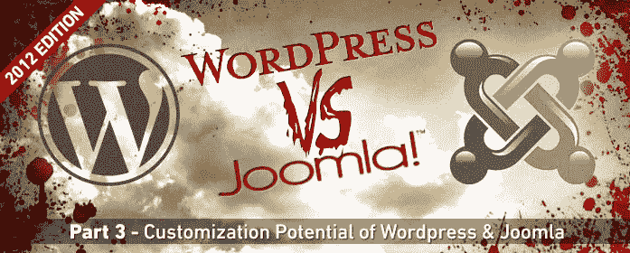
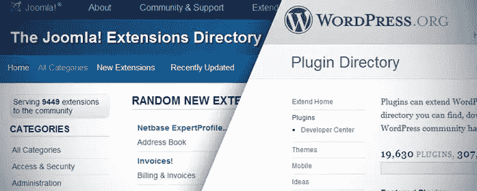

# 插件、扩展和定制

> 原文：<https://www.sitepoint.com/wordpress-v-joomla-plugins-extensions-and-customization/>

欢迎来到互联网上最全面的 WordPress v Joomla 分析的第 3 部分！在这篇文章中，我们将讨论这两个流行的内容管理系统之间的一个重要的比较领域:Joomla 和 WordPress 网站的定制。

## WordPress 和 Joomla 扩展的本质

当我想到 Joomla 和 WordPress 扩展时，每一个都有明显不同的含义。

### WordPress 扩展

我对 WordPress 的感觉是，他们的绝大多数插件都是在暗示你在运营一个博客/内容网站。我的意思是插件的创建只是为了调整 WordPress 的原生功能和优化你的内容。这可以是 SEO 插件、内容聚合、社交媒体整合等形式。它们都是为了给你的内容增加价值，而不是革新你的网站。

### **Joomla 扩展**

另一方面，Joomla 似乎提供了完全不同性质的扩展。许多组件的编写是为了给你的网站增加大量的功能，而不仅仅是调整某些功能。例如，您可以使用一个组件将 Joomla 网站变成一个完整的电子商务商店，或者添加一个在线预订系统。

不要误解我的意思，有一些扩展可以为 WordPress 增加强大的功能。同样，Joomla 也有一些扩展，只是对内容做了一些调整。然而，我觉得每一个的扩展都倾向于符合上面的概括。

 **## **扩展结构**

WordPress 和 Joomla 在扩展方面有明显不同的结构。

WordPress (over)通过将其所有扩展归入插件的广义术语下，简化了一切。插件可以是任何东西，从后端调整到完整的前端功能。简单的样式调整、SEO 优化扩展、网站地图、联系人表单、新的小部件类型甚至完整的电子商务功能都将被称为插件。

然而，Joomla 根据其提供的功能将其扩展分为不同的类别。

*   插件:插件倾向于为 Joomla 增加简单的功能，通常会以某种方式影响前端输出。这可能是一个排版调整，在文章中添加一个谷歌地图，或者甚至在正文中创建一个支持 Ajax 的联系人表单。
*   模块:模块基本上是 WordPress 小部件的 Joomla 等价物。它们用于在主要内容区域周围添加内容。例如，这可以用于添加“最近的帖子”模块或“社交分享”模块。
*   **组件**:组件本身几乎就是系统。它们是用来扩展 Joomla 的核心功能的，一个组件通常会包含自己的模块和/或插件。一个例子是 Joomla 最知名的电子商务组件 [Virtuemart](http://virtuemart.net/) 。Virtuemart 基本上是一个在 Joomla 框架内运行的完整系统。有些模块和插件只适用于 Virtuemart。

有了 WordPress，我觉得你的选择会稍微受到限制，因为正如我上面提到的，如果你创建一个 WordPress 网站，你几乎被期望创建一个博客/内容驱动的网站。

对于 Joomla，我可以说你的选择几乎是无穷无尽的，除了如果你想开一个博客。在我看来，博客是 Joomla 的一个主要弱点，如果我的网站的主要目的是写博客，我可能会转向 WordPress。话虽如此，如果你确实想给 Joomla 添加伟大的博客功能，请查看 [Easyblog](http://stackideas.com/easyblog.html) ，这是我唯一感觉到的为 Joomla 严重忽视的领域添加了足够的博客功能。

## **易于安装**

这并不是一个主要因素，因为这两个系统都使得安装带有后端上传功能的扩展变得非常容易。

不过 WordPress 赢了，因为它允许你直接从 WordPress 站点的后端搜索和下载插件。使用 Joomla，您需要从 Joomla 扩展目录下载扩展，保存它们，然后使用 Joomla 的扩展管理器上传并安装它们。

WordPress 的插件目录集成在这里绝对是一个方便的时间节省器。

## **不同语言**

我必须承认，我对不同的语言没有太多的经验，因为我建立的绝大多数网站都是英文的。我确实知道在这个部门有 WordPress 和 Joomla 可用的选项。

WordPress 有许多不同的语言版本，使用 Joomla 你可以安装一个语言包。

至于一个网站上的多种语言，你将不得不寻找扩展来为你做到这一点。WordPress 有一些插件允许语言切换和多语言页面。Joomla 最受欢迎的语言组件是 Joomfish，但是他们目前只有最新版本 Joomla 的 alpha 版本，所以如果你想尝试多语言，你可能需要去别处看看。

**编辑:** Joomla！显然原生支持 2.5+版本的多语言网站。这就解释了 Joomfish 只适用于以前的版本。读变更日志的时候完全漏掉了那一条！

## **结论**

当在 Joomla 和 WordPress 之间做出选择时，调查扩展的前景通常是我的第一个选择。确定你的网站需要什么功能，并找出哪个 CMS 提供了更好的扩展来执行这些功能。

一旦你理解了 Joomla 的扩展结构，它会比 WordPress 的全包插件目录更加直观。对于内容驱动的网站/博客，我更喜欢使用 WordPress，对于其他任何东西，我更喜欢使用 Joomla。

这取决于个人偏好和扩展的可用性。如果你为你的网站的主要功能找到了完美的扩展，并且它只适用于一个 CMS，那么我会说你的选择实际上是为你做的。所有较小的东西通常都可以在任一 CMS 上工作。

在下一篇文章中，我们将讨论 SEO——WordPress 和 Joomla 的各种插件、功能和局限性。请务必下周再来查看！

## 分享这篇文章**