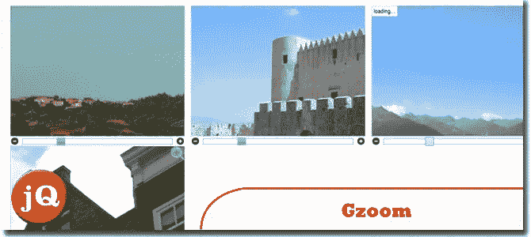
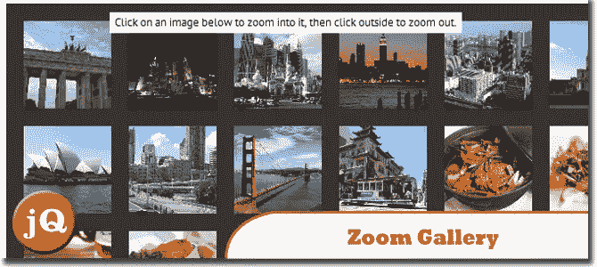

# 5 个 jQuery 网页缩放插件

> 原文：<https://www.sitepoint.com/5-jquery-web-page-zoom-plugins/>

对于那些一直想为你的网站创造一个真正独特和引人注目的效果的人来说，这是给你的！jQuery Web 页面缩放插件列表包括一个动画，当你点击它时，它会放大页面的特定部分，你会发现这非常有用。

**12/12/13 更新:**加 6。祖莫朗，7 岁。CloudZoom。

**相关帖子:**

*   [**8+ jQuery 360 度图像显示插件**](http://www.jquery4u.com/plugins/jquery-360-degrees-image-display-plugins/)
*   [**10 jQuery Flash 状菜单**](http://www.jquery4u.com/menus/10-jquery-flash-menus/)

## 1.Zoomooz.js

用于使网页元素缩放的 jQuery 插件。它可以让 Prezi 看起来像幻灯片，也可以放大图像或其他细节。
 
[源](http://janne.aukia.com/zoomooz/) [演示](http://janne.aukia.com/zoomooz/examples/isometric/index.html)

## 2.jQuery Gzoom 外挂程式

特点:点击加号和减号进行缩放。拖动滑块进行缩放。使用鼠标滚轮悬停图像进行缩放。移动鼠标悬停在图像上会改变平移。单击图像以灯箱样式显示。jQuery。UI 框架风格。
 
[源+演示](http://lab.gianiaz.com/jquery/gzoom/)

## 3.缩放图库

用 jQuery 创建一个令人敬畏的缩放网页。
 
[来源](http://designshack.net/?p=20521) [演示](http://designshack.net/tutorialexamples/jQueryZoom/jQueryZoom.html)

## 4.轻松缩放图像

这个插件可以用几个选项和简单的 CSS 定义来定制。就 CSS 而言，你需要做的就是定义新创建的图像缩放元素的大小、位置和外观。
 
[来源](http://cssglobe.com/post/9711/jquery-plugin-easy-image-zoom) [演示](http://cssglobe.com/lab/easyzoom/easyzoom.html)

## 5.AJAX-缩放

一个强大的图像缩放和平移插件，具有 360°旋转选项，基于 jQuery (JavaScript)和 PHP 的 jQuery 图像库选项。
 
[来源](http://www.ajax-zoom.com) [演示](http://www.ajax-zoom.com/examples/example23.php)

## 6.祖莫朗。

是一个嵌入式库，允许用户放大(几乎)现有页面上的任何元素。没有设置，任意造型。
 
[源+演示](http://yyx990803.github.io/zoomerang/)

## 7.云缩放

Cloud Zoom 是一个流行的飞出式 jQuery 图像缩放插件，在许多知名零售网站上使用。
 
[源+演示](http://www.starplugins.com/cloudzoom)

## 分享这篇文章