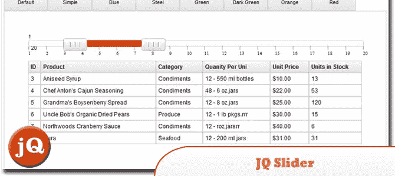
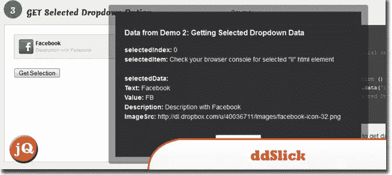
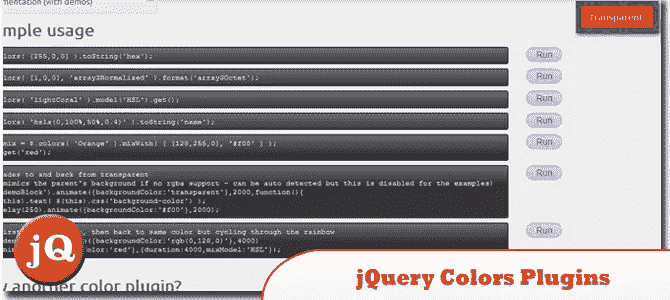
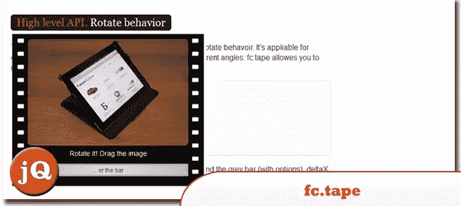
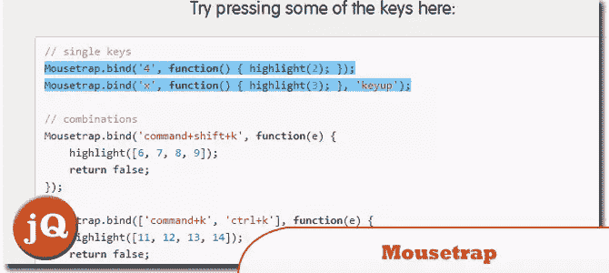
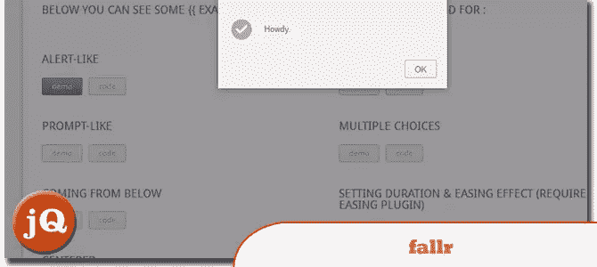
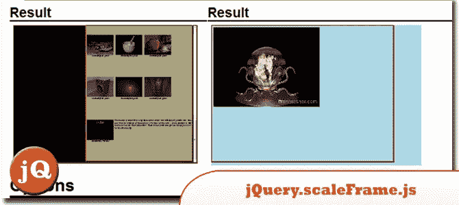
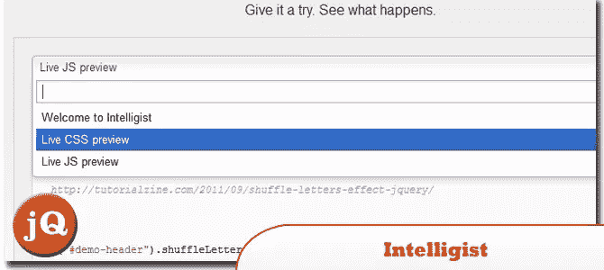

# 9 个随机的好 jQuery 插件

> 原文：<https://www.sitepoint.com/9-randomly-good-jquery-plugins/>

给你，一个很好的集合**随机好的 jQuery 插件**你可能以前没见过！在列表中，您会发现一个数据滑块，它提供了易于使用的用户数据选择和过滤工具，以及一个方便的插件，允许您共享一个或多个 gist，这使得它非常适合在页面中演示 JavaScript 和 CSS。好东西！尽情享受吧！

**相关帖子:**

*   [**10 个新随机 jQuery 插件**](http://www.jquery4u.com/plugins/10-random-jquery-plugins-2/)
*   [**10 个随机好的 jQuery 插件**](http://www.jquery4u.com/plugins/10-randomly-good-jquery-plugins/)

## 1.多节点范围和数据滑块:JQ 滑块

是一个多节点范围和数据滑块，允许提供易于使用的用户数据选择和过滤工具。
 
[来源](http://www.egrappler.com/free-multi-node-range-data-slider-jqslider/) [演示](http://www.egrappler.com/jqslider/demo.htm)

## 2.ddSlick

一个免费的轻量级 jQuery 插件，允许你创建一个带有图片和描述的自定义下拉菜单。
 
[来源](http://designwithpc.com/Plugins/ddSlick) [演示](http://designwithpc.com/Plugins/ddSlick#demo)

## 3.jQuery 颜色插件

jQuery.colors 通过一个简单的、可链接的颜色对象帮助开发人员管理颜色。它有一个模块化的设计，允许你去掉你不需要的东西，或者根据你的想法扩展它。
 
[源+演示](http://enideo.com/code/jquery-colors-plugin/)

## 4.百分比加载器

一个 jQuery 插件，用于以比普遍存在的水平进度条/文本计数器更醒目的方式显示进度小部件。
 
[源+演示](http://widgets.better2web.com/loader/)

## 5.fc.tape

精灵动画的 jQuery 小部件。
 
[源+演示](http://source.futurecolors.ru/fc.tape/)

## 6.捕鼠器

是一个独立的库，没有外部依赖性。它的大小约为 1.6kb，压缩后约为 3kb。
 
[源+演示](http://craig.is/killing/mice)

## 7.法尔

别致而优雅的莫代尔盒子。好用的 jQuery 插件
 
[源码+演示](http://www.fallr.net/)。

## 8.jQuery.scaleFrame.js

一种使带有 CSS scale()转换的 IFRAME 标签在布局中表现的方法。
 
[源+演示](http://brynmosher.com/jQuery.scaleFrame.js/)

## 9.智能学家

一个在你的网站上分享 GitHub gists 的便捷插件。它允许您共享一个或多个 gists，甚至执行代码，这使得它非常适合在页面中演示 JavaScript 和 CSS。
 
[源+演示](http://srobbin.com/jquery-plugins/intelligist/)

## 分享这篇文章